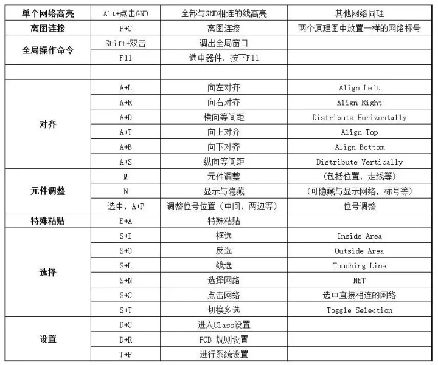
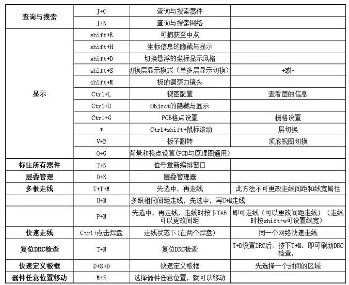
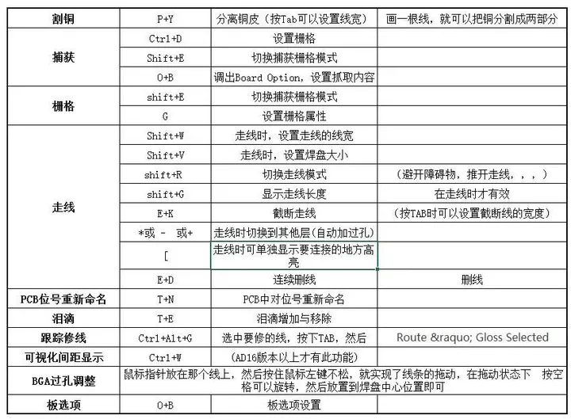
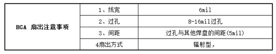
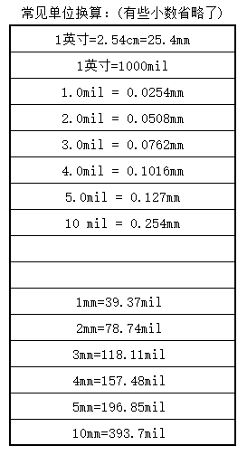

# AD常用快捷键

## 一、总汇

- 原理图快捷键

- 特殊粘贴:EY

- 右对齐:AR

- 左对齐:AL

- 上对齐:AT

- 下对齐:AB

- 对齐方式:AA

- 放大缩小:CTRL+鼠标滑轮

- 左右移动:鼠标右键

- 调节栅栏:G

  

- PCB快捷键

- 设置栅格:GG

- 单位切换:Q

- 3D图:3

- 2D图:2

- 旋转3D图:V+B

- 跳转到中心点:CTRL+END

- 定位中心:E,F,C

- 选择移动:M

- 板形状:DSD

- 换层:shift+s

- 电源线线宽:15-60mil

- 设置旋转器件的角度:TP

- 复位错误:TM

- 调方格为点:CTRL+G然后点Dots

- 丝印位置的调整:任意选择一个器件然后CTRL+A，点击A,P选择定位

- 覆铜:PG

- 过孔大小:0.4mm-0.6mm

- 走线状态，+tab，改变线宽；

- 2d线状态，+shift+tab ，切换倒角方式；

- crtl+左键 ：高亮选中网络；

- 左下角双击，层管理，显示或隐藏某一层；

- 旋转：Space；

- X轴镜像：X；

- Y轴镜像：Y；

- 板层管理：L；

- 栅格设置：G；

- 单位进制切换：Q；

- 对齐-水平：A，D；

- 对齐-垂直：A，I，I，Enter；

- 对齐-顶部：A，T；

- 对齐-底部：A，B；

- 对齐-左侧：A，L；

- 对齐-右侧：A，R；

- 设计-类设置：D，C;

- 设计-板层管理：D，K；

- 设计-规则：D，R；

- 设计-规则向导：D，W；

- 设计-拷贝ROOM格式：D，M，C；

- 设计-放置ROOM：D，M，R；

- 设计-根据选择对象定义板子形状：D，S，D；

- 设计-编辑网络：D，N，N；

  

- 编辑-删除：E，D；

- 编辑-切断轨迹：E，K；

- 编辑-设定原点：E，O，S；

- 编辑-复位原点：E，O，R；

  

- 移动-移动：M，M；

- 移动-拖拽：M，D；

- 移动-器件：M，C；

- 移动-打断走线：M，B；

- 移动-器件翻转板层：M，I；

  

- 网络-显示网络：N，S，N；

- 网络-显示器件：N，S，O；

- 网络-显示全部：N，S，A；

- 网络-隐藏网络：N，H，N；

- 网络-隐藏器件：N，H，O；

- 网络-隐藏全部：N，H，A；

  

- 放置-坐标：P，O；

- 放置-焊盘：P，P；

- 放置-字符：P，S；

- 放置-过孔：P，V； 走线快速添加过孔：ctrl+shift+滚轮；

- 放置-多边形：P，R；

- 放置-填充：P，F；

- 放置-敷铜：P，G；

- 放置-线性尺寸：P，D，L；

- 放置-走线：P，T；

- 放置-差分对布线：P，I；

- 放置-多根布线：P，M，Enter；

  

- 选择-全选：S，A；

- 选择-线选：S，L；

- 选择-区域（内部）：S，I；

- 选择-区域（外部）：S，O；

- 选择网络：S,P;

  

- 工具-交叉探测对象：T，C；(+Ctrl:跳转到目标文件)

- 工具-泪滴选项：T，E；

- 工具-设计规则检查：T，D；

- 工具-复位错误标志：T，M；

- 工具-从选择元素创建板剪切：T，V，B

- 工具-网络等长调节：T，R；

  

## 二、PCB

- PCB铺铜：P+G
- 焊盘：P+P
- 过孔：P+V
- 尺寸：P+D
- 字符串：P+S
- 滴泪：P+E
- PCB图画线： P+T
- 其他图层走线：P+L

## 三、原理图

- 网络标签：P+N
- 原理图绘线：P+W
- 字符串：P+T
- 指示标志：P+V
- 电源端口：P+O
- 原理图绘制直线：P+D+L

## 四、原理图库

- 放置矩形：P+R
- 放置管脚：P+P
- 阵列粘贴：P+Y
- 放置线：P+L

## 五、PCB库

- 放置焊盘：P+P
- 放置字符串：P+S

**BGA 扇出注意事项：**

**常见的单位换算：**

## 参考：

[最全AD快捷键_ad原理图快捷键命令大全-CSDN博客](https://blog.csdn.net/qq_45893260/article/details/115119180)

[Altium Designer （AD）常用快捷键总结_ad快捷键-CSDN博客](https://blog.csdn.net/chenhuanqiangnihao/article/details/133028462)
