# PCB常见知识及工艺解析

## 一、相关PCB术语的概念

### 1.PCB 

印制电路板 PCB （Printed circuit boards），又称印刷电路板，是电子元器件电气连接的提供者。就是一块没有电子元器件的空电路板。

印制电路板按照线路板层数可分为单面板、双面板、四层板、六层板以及其他多层线路板。

**单面板：**

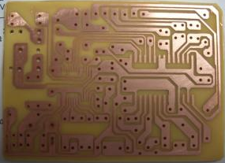

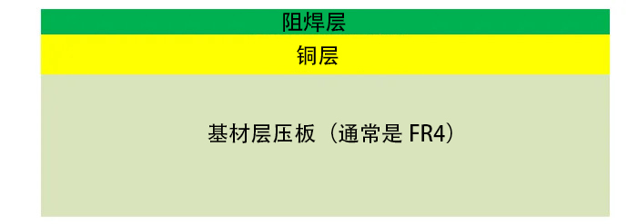

**双面板：**

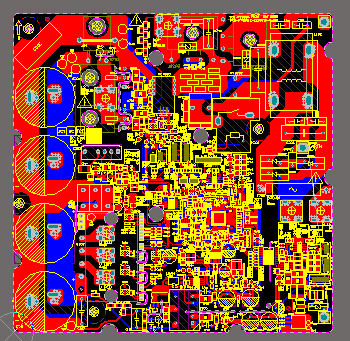

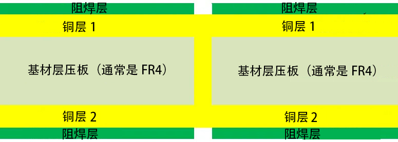

### 2.PCBA

装配印刷电路板 PCBA（Printed circuit boards Assembly），也就是说 PCBA 是经过 PCB 空板 **SMT 上件**，再经过 **DIP 插件**、**烧录程序后**（分离线和在线烧录，有些简单的纯硬件板甚至不用烧录程序），完成了整个制程后所得的产物。

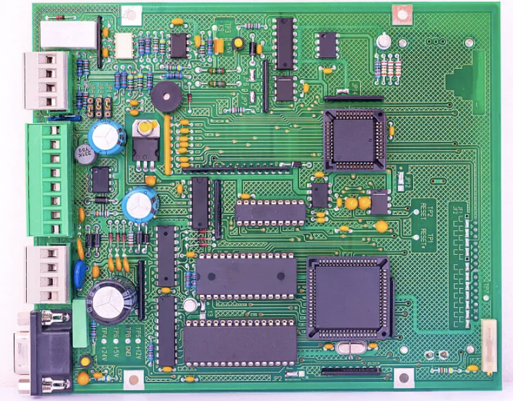

### 3.ICT 

自动在线测试仪 ICT （In—Circuit—Tester），测试探针接触PCB layout出来的测试点来检测PCBA的线路开路、短路、所有零件的焊接情况，即测电压和电流的。

可分为开路测试、短路测试、电阻测试、电容测试、二极管测试、三极管测试、场效应管测试、IC管脚测试等，以及其它通用和特殊元器件的漏装、错装、参数值偏差、焊点连焊、线路板开短路等故障，并将故障是哪个组件或开短路位于哪个点准确告诉用户（工程师）。

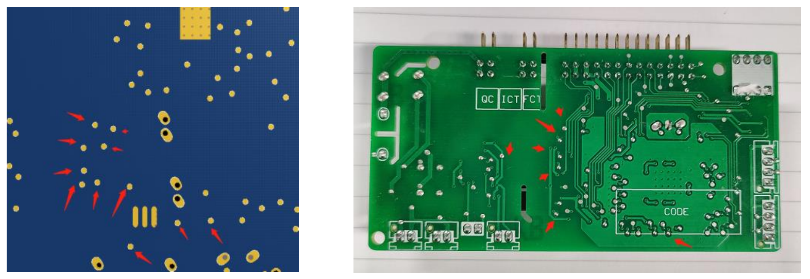

### 4.FCT 

一般专指PCBA的功能测试 FCT （Functional Circuit Test），即测功能是否正常的，一般使用专门的测试工装进行测试。

它指的是对测试目标板(UUT：Unit Under Test)提供模拟的运行环境（激励和负载），使其工作于各种设计状态，从而获取到各个状态的参数来验证UUT的功能好坏的测试方法。简单地说，就是对UUT加载合适的激励，测量输出端响应是否合乎要求。

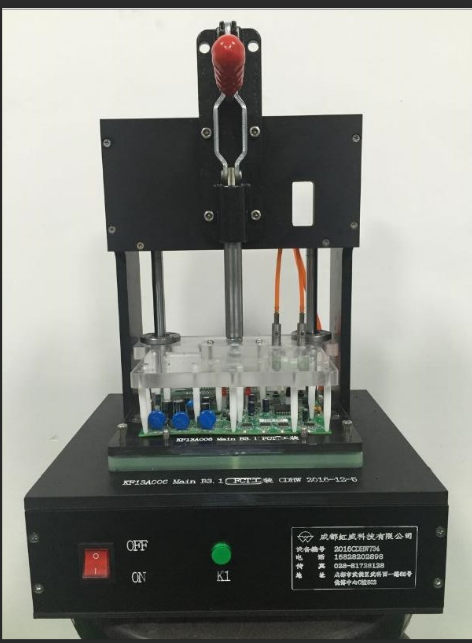

### 5.QC 

质量控制 QC （Quality Control）。其实就是质量管理人员对刚做好的产品做了一次总的测试和质量评估。

它指的是对测试目标板(UUT：Unit Under Test)提供模拟的运行环境（激励和负载），使其工作于各种设计状态，从而获取到各个状态的参数来验证UUT的功能好坏的测试方法。简单地说，就是对UUT加载合适的激励，测量输出端响应是否合乎要求。

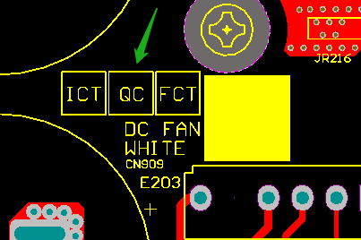

### 6.SI 

信号完整性 SI （Signal Integrity）。即产品内部信号，能不能正常的传输数据和与外部器件进行通讯。

它指的是信号在信号线上的质量，即信号在电路中以正确的时序和电压作出响应的能力。如果电路中信号能够以要求的时序、持续时间和电压幅度到达接收器，则可确定该电路具有较好的信号完整性。反之，当信号不能正常响应时，就出现了信号完整性问题。

### 7.PI 

电源完整性 PI（Power Integrity）。是确认电源来源及目的端的电压及电流是否符合需求，电源完整性在现今的电子产品中相当重要。

有几个有关电源完整性的层面：芯片层面、芯片封装层面、电路板层面及系统层面。在电路板层面的电源完整性要达到

以下三个需求：

1.使芯片引脚的电压涟波比规格要小一些（例如电压和1V之间的误差小于+/-50 mV）

2.控制接地反弹（也称为同步切换噪声SSN、同步切换输出SSO）

3.降低电磁干扰（EMI）并且维持电磁兼容性（EMC）：电源分布网络（PDN）是电路板上最大型的导体，因此也是最容易发射及接收噪声的天线。

### 8.EMC

电磁兼容性 EMC（Electro-Magnetic Compatibility）。就像人得病后，EMI是自身病毒对别人攻击的力度和范围，EMS是我对别人所带病毒攻击的抗性。EMC要求的是你干扰不到我，我干扰不到你。井水不犯河水，和谐共处。

它是指设备或系统在其电磁环境中符合要求运行并不对其环境中的任何设备产生无法忍受的电磁干扰的能力。

因此，EMC包括两个方面的要求：

- 一方面是指设备在正常运行过程中对所在环境产生的电磁干扰不能超过一定的限值（EMI）；

- 另一方面是指器具对所在环境中存在的电磁干扰具有一定程度的抗扰度，即电磁敏感性（EMS）。

## 二、PCB板的生产工艺及供应商的制程能力

### 1.板层、板厚、单板以及拼版尺寸的介绍

#### 1.1板层

- 单层板，也叫单面板，只能单面布线，只有一面是焊接面。例如，小型开关电源大都是单层板。

- 双层板，两层可以是焊接面，可以双面布线，这种PCB用得最广（公司用得最多）。

- 四层通孔板，没有盲、埋孔，相对有盲埋孔四层板成本要低。中间两层是双面覆铜板，也叫Core，首先制作Layer2和Layer3，然后上下各压一层，最后打通孔。

- 四层盲埋孔板，先制作中间两层，然后上下各压一层，激光镭射过孔，最后打通孔。（四层盲埋孔板一般情况比较少用）

- 多层板，器件密度较大，网络数量较多或特殊布线需求才考虑用多层板。

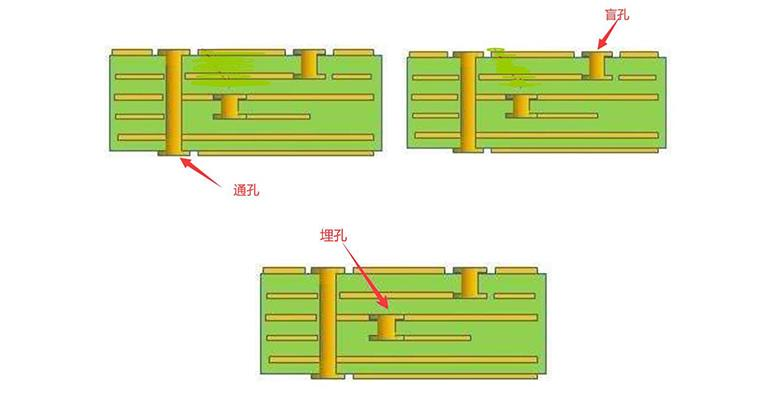

#### 1.2 板厚

- PCB厚度标准和厚度公差

​	常规板厚1.6mm（±0.15mm）;

​	偶尔用2.0mm，公差为±板厚10%

​	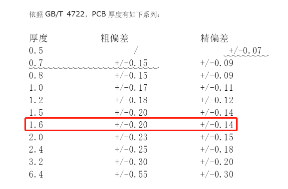

- 叠层构造

  - 双面板示例：

    外层铜皮为1OZ,1.6mm成品双面板内层基材(Core)厚度一般为1.46mm;

    外层铜皮为2OZ,1.6mm成品双面板内层基材(Core)厚度一般为1.53mm

  - 四层板示例：Core与Prepreg，以及铜箔组合构成板厚（**如图所示**）

    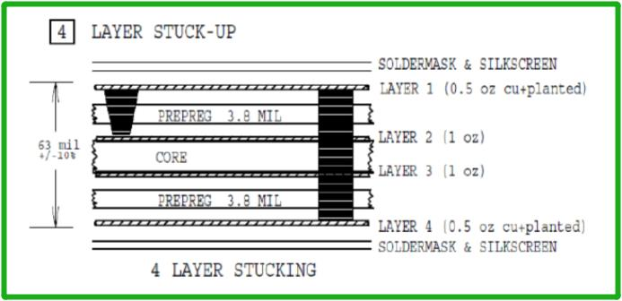

  - PP与Core的区别
  
    - 前者材质半固态，类似于纸板，后者材质坚硬，类似于铜板；
    - 前者类似于粘合剂+绝缘体，后者是基础材料，功能不一样；
    - PP能够卷曲而Core无法弯曲

#### 1.3 单板及拼版尺寸

- 单板尺寸较大时，按单板尺寸生产和加工（350*300）；

- 单板尺寸较小时，按拼版尺寸生产和加工；

​	一般原则：当PCB 单元板的尺寸<50mm x 50mm 时，必须做拼板；

​	当拼板需要做V-CUT 时，拼板的PCB 板厚应小于3.5mm；

​	最佳：平行传送边方向的V-CUT 线数量≤3（对于细长的单板可以例外）

- 不规则形状的而没拼板的PCB 单板，且使制成板加工有难度的PCB，应在过板方向两侧加工艺边，工艺边最小宽度为3mm。

- 若PCB 上有大面积开孔的地方，在设计时要先将孔补全，以避免焊接时造成漫锡和板变形，补全部分和原有的PCB 部分要以邮票孔方式连接，在波峰焊后将之去掉

- 总结：根据单板尺寸、单板形状以及器件数量等因素综合考虑拼版方式，使生产加工方便的同时达到成本最低化。

  PCB 的板角应为R 型倒角，为方便单板加工，不拼板的单板板角应为R 型倒角，对于有工艺边和拼板的单板，工艺边应为R 型倒角，一般圆角直径为Φ6，小板可适当调整。有特殊要求按结构图表示方法明确标出R 大小，以便厂家加工。

### 2.板材类型、CTI值、Tg值的介绍

#### 2.1板材

- 按板的增强材料不同，可划分为：纸基、**玻璃纤维布基**、复合基(CEM系列)、积层多层板基和特殊材料基(陶瓷、金属芯基等)五大类。

- 按阻燃特性的等级划分可以分为阻燃型（94V—0 /V-1 /V-2 ）和不阻燃型94-HB 两类。

  如：

  94HB：普通纸板，不防火（最低档的材料，模冲孔，不能做电源板）

  94V0：阻燃纸板（模冲孔）

- 按胶黏剂不同可以分为酚醛树脂、环氧树脂和聚酯树脂等

  如：

  FR-4 :玻璃纤维布基CCL环氧树脂板

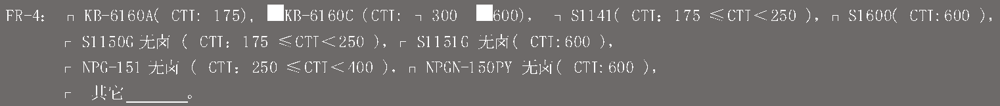

#### 2.2 CTI值

CTI（Comparative Tracking Index）相比电痕化指数（相对耐漏电起痕指数）

含义：材料表面能经受住50滴电解液而没有行成漏电起痕的最高电压值，以V表示。

CTI等级数字越小，耐漏电性越高。

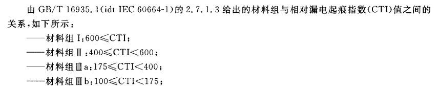

#### 2.3 Tg值

电路板必须耐燃，在一定温度下不能燃烧，只能软化。这时的温度点就叫做玻璃态转化温度(Tg点)。

通常我们基板是固态的，当基板由固态融化为橡胶态流质的时候，有一个临界温度点，这温度点就叫TG点，即熔点。

TG一般划分为3个等级，一般TG、中TG 、高TG

- 一般TG值一般在130、140

- 中TG 值一般是150

- 高TG值一般在170以上。

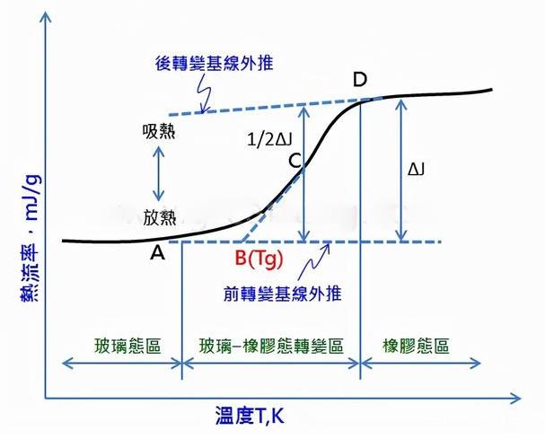

TG点越高表示板材在压合的时候温度要求越高，压出来的板子也会比较硬和脆，在一定程度上会影响后工序机械钻孔的质量以及使用时电性特性。

PCB线路板的温度问题与原材料、锡膏、表面零件的承受温度有关，通常PCB线路板最高可耐温300度，5-10秒；过无铅波峰焊时大概温度是260，过有铅大约是240度。

### 3.完成铜厚的介绍

铜箔作为pcb的导电体，容易粘合于绝缘层，腐蚀后形成电路图样。

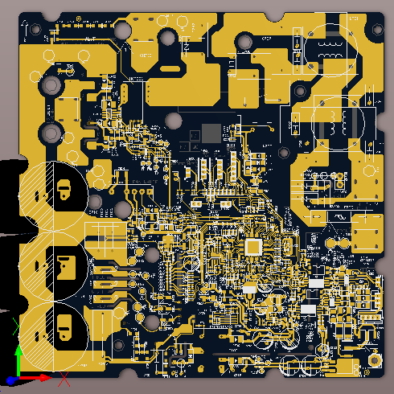

- 铜箔的厚度用oz(盎(àng)司)表示，1oz=0.035mm

- 国际pcb铜箔常用厚度有：17.5um、35um、50um、70um。当然一些比较特殊的电路板会用到3OZ、4OZ、5OZ...8OZ等，根据产品需求选择适合的铜厚。

- Pcb板铜厚的使用主要取决于PCB的用途和信号的电流大小，70%的线路板使用的是35um（0.035mm）的铜箔厚度。

- Pcb板用途不同，所使用的铜厚也有所不同。像一般的消费类及通讯类产品，使用的是0.5oz、1oz、2oz；对于大多的大电流，如高压产品、电源板等产品，一般都是使用3oz以上属厚铜产品

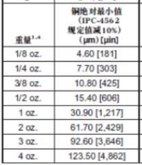

### 4.阻焊油、丝印的介绍

#### 4.1 阻焊油

- 阻焊油的介绍

  绿油，指的是PCB上涂覆在铜箔上面的油墨，这层油墨可以覆盖除了焊盘等以外的导体，可以在使用过程中避免焊接短路、延长PCB使用寿命等作用；一般叫阻焊或者防焊。

  颜色有绿色、黑色、红色、蓝色、黄色、白色、亚光颜色等等，大部分PCB使用**绿色阻焊油墨，也就是通常叫的绿油**。

- PCB板中阻焊油的作用

  - 阻焊，达到对外绝缘的目的；
  - 保护不需要裸露在外的线路；
  -  美化外观。

#### 4.2 丝印

丝印层为文字层，属于PCB中的最上面一层，一般用于注释用。这是为了方便电路的安装和维修等，在印刷板的上下两表面印刷上所需要的标志图案和文字代号等的专用层。（**丝印一般默认用白色**）

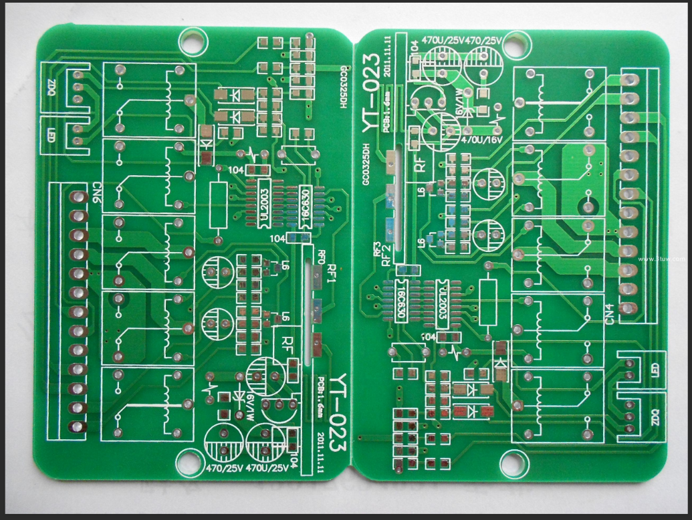

## 三、PCBA的生产工艺

### 1.各个机械层的用途

机械层一共有16层，统一规范每层的用途（各公司可能要求不同，仅供参考）。

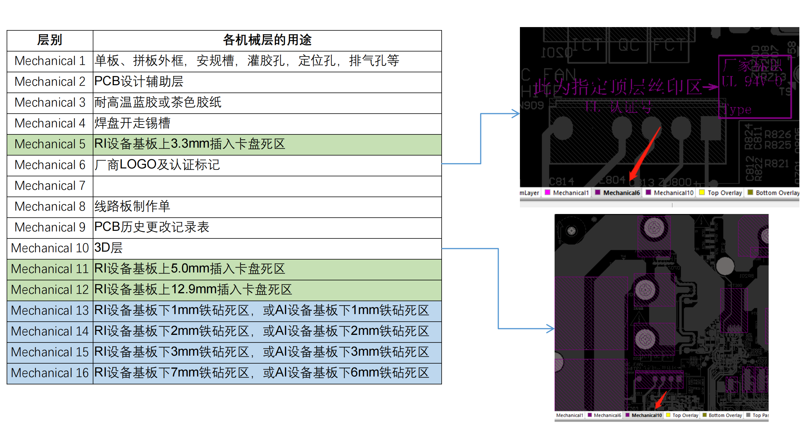

### 2.PCBA的焊接工艺

一般元器件有几种焊接方式：回流焊、波峰焊和手工焊接。

#### 2.1回流焊

回流焊是一种零部件的焊接面涂覆焊料后组装在一起，加热至焊料熔融，再使焊接区冷却的焊接方式。这种方式主要用于焊接**贴片料**。

优势：温度易于控制，焊接过程中还能避免氧化，制造成本也更容易控制。

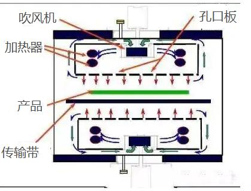

**回流焊机：**

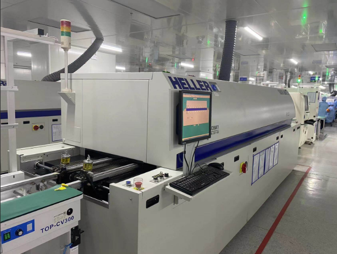

- 红胶工艺：红胶是一种聚稀化合物，主要成份为基料（即主体高份子材料）、填料、固化剂、其它助剂等。在生产中，利用红胶的目的就是使零件牢固地粘贴于PCB表面，防止其掉落。因此贴片胶是属于纯消耗非必需的工艺过程产物，现在随着PCA设计与工艺的不断改进，通孔回流焊、双面回流焊都已实现，用到贴片胶的PCA贴装工艺呈越来越少的趋势。一般是**双面贴片或者有大件物料**的时候使用，使用的时是**先用红胶钢网印上的红胶（印元器件中间的绿油上），然后再用锡膏钢网印上锡膏（印焊盘）**，也就是说要单独做钢网。

#### 2.2波峰焊

波峰焊是让插件板的焊接面直接与高温液态锡接触达到焊接目的，其高温液态锡保持一个斜面，并由特殊装置使液态锡形成一道道类似波浪的现象，所以叫“波峰焊”。这种方式主要用于焊接**插件料**。（波峰焊机外观跟上面的回流焊机类似，但是内部功能是不一样的，如下图所示）

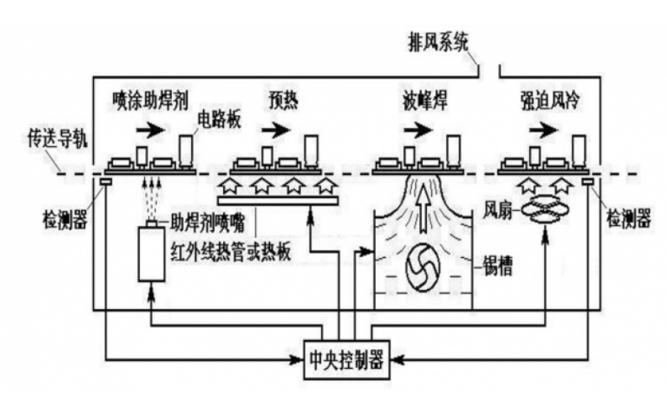

#### 2.3 手工焊接

顾名思义，手动利用烙铁头加热焊接材料，通过焊接材料的原子或分子的相互扩散作用，使两种金属间（器件脚和PCB上的焊盘）形成一种永久的牢固结合。

如果是焊接贴片的物料和一些多引脚的物料，单纯焊接还好，如果是换物料，那就遭老罪了。

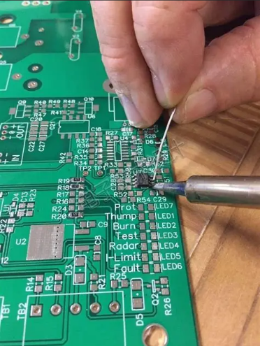

### 3.生产工艺需求对元器件的布局限制

生产工艺需求对元器件的布局限制，生产过程中会存在一些问题，而这些工艺方面的问题在无法自行解决的情况下，需要设计者去配合解决。

#### 3.1三防漆的喷涂

问题：

- 1.PCBA贴装好元器件后，为了保护线路板及其相关设备免受环境的侵蚀，还需要机器喷涂三防漆。但三防漆有绝缘作用，处理不当对端子也进行绝缘。

- 2.贴片放置在高大器件之间，喷头无法伸进去喷漆。

方法：

- 1.贴片器件离开端子、拨码开关等器件原则上5mm以上，最少不低于3mm。

- 2.贴片器件应尽可能远离高大器件，如大的电解电容，功率电感等。

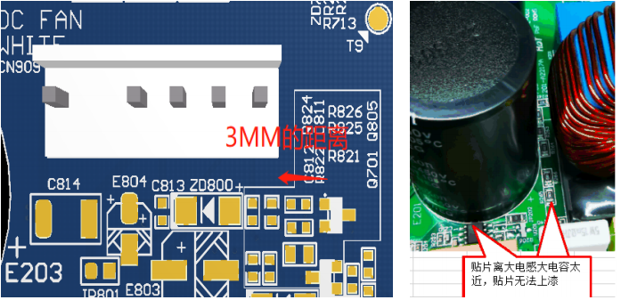

#### 3.2 PCBA的运输周转

问题：

PCBA在运输周转过程中，会存在操作不当，使PCBA较靠板边的器件容易受到损坏。

方法：

贴片元器件远离板边放置，电容保证5mm以上，其他器件实在放不下保证3mm以上。

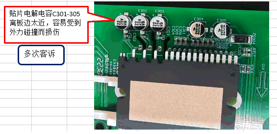

#### 3.3 元器件的机器贴装

问题：

无论是贴片元器件还是插件元器件在焊接前都需要经过放置材料的过程，分机器放料和手工放料。手工放料存在**效率低下**和**放错位号**的风险，进而能机器放都选择用机器放料。机器放料存在死区，会碰坏周边元器件。

方法：

元器件避开死区放置。

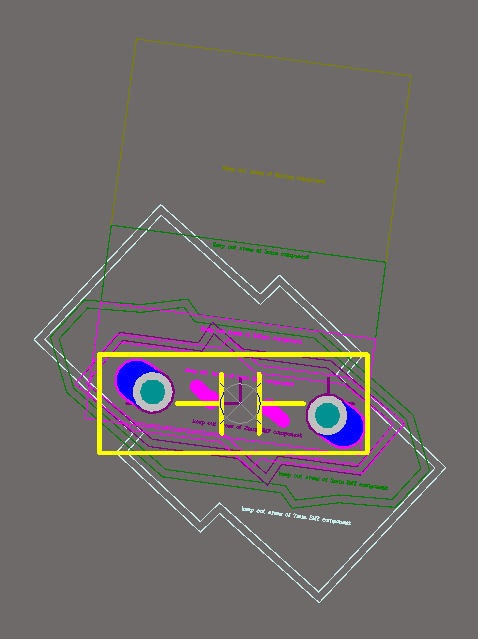

#### 3.4 机器贴装引申知识

AI：卧式插件机插

RI： 立式插件机插

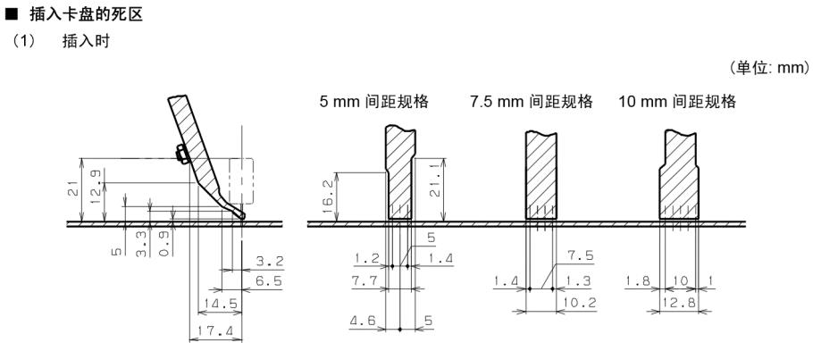

##### 顶层（TOP）RI插入卡盘死区

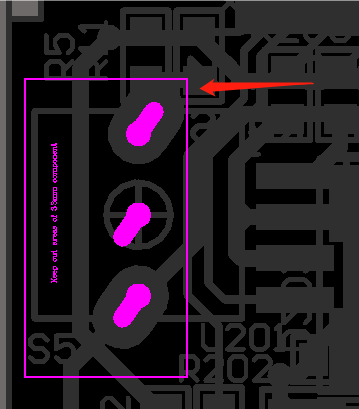

机械5层 当插装面SMD/AI器件高度为（0~3.3mm），layout时应将其放置在上图（上层，顶层）方框区域以外。

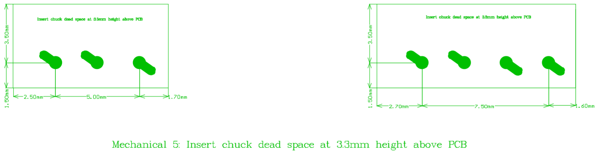

机械11层 当插装面SMD/AI器件高度为（3.3~5.0mm），layout时应将其放置在上图（上层，顶层）方框区域以外。

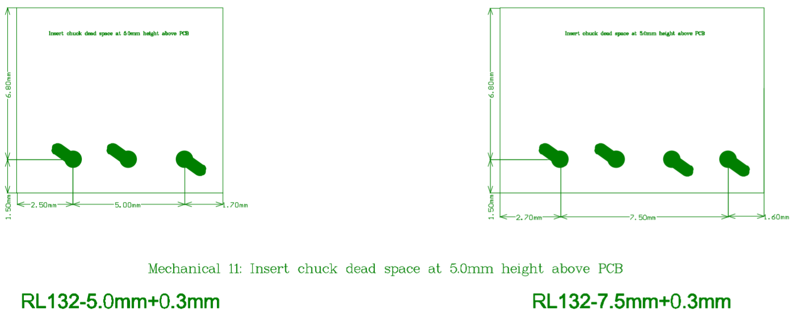

机械12层 当插装面SMD/AI器件高度为（5.0~12.9mm），layout时应将其放置在上图（上层，顶层）方框区域以外。

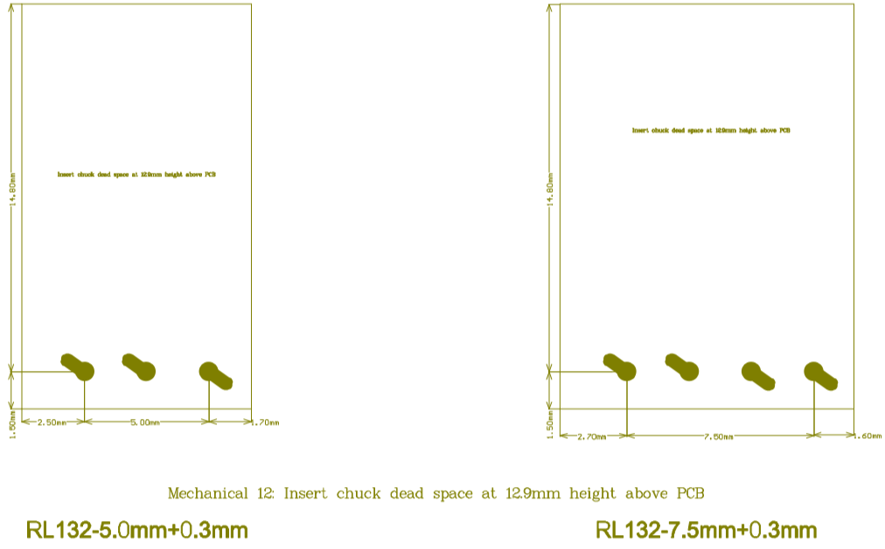

##### 底层（BOTTOM）RI插入卡盘死区

 机械13层 当基板下贴片器件高度为(0mm~1.0mm)，layout时应将其放置在下图（下层，底层）外框区域以外。

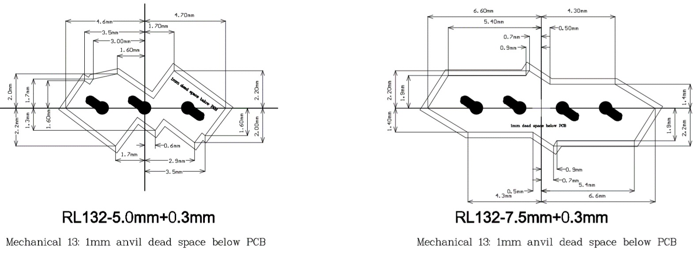

机械14层 当基板下贴片器件高度为（1.0mm~2.0mm)，layout时应将其放置在下图（下层，底层）外框区域以外。

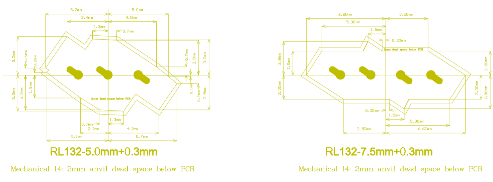

 机械15层 当基板下贴片器件高度为（2.0mm~3.0mm)，layout时应将其放置在下图（下层，底层）外框区域以外。

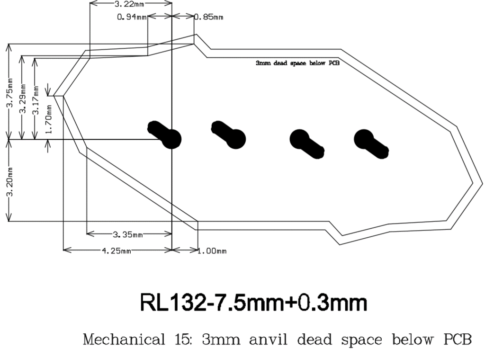

机械16层 当基板下贴片器件高度为（3mm~7.0mm），layout时应将其放置在下图（下层，底层）外框区域以外。

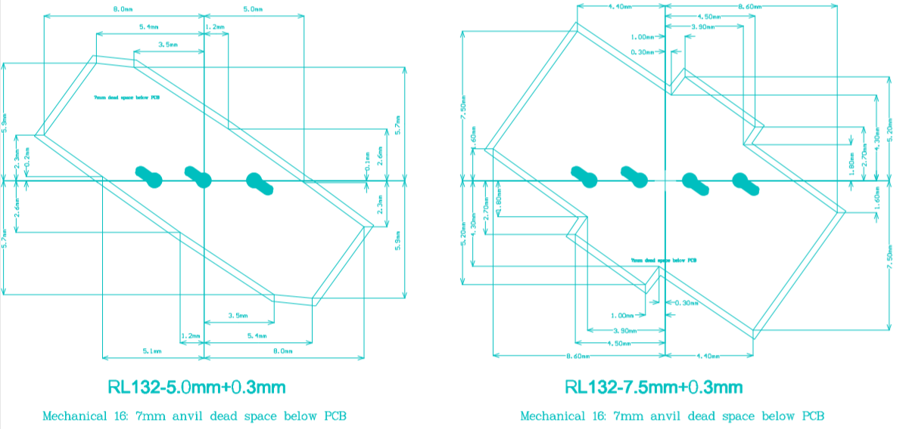

## 四、PCB设计

### 1.电路基础知识

### 2.元器件以及封装的制作

- 元器件的制作流程

​	a.建立原理图库

​	b.新建元器件

​	c.查看器件规格书

​	d.按规格书中器件的管脚顺序、管脚信息进行编辑

​	e.器件规范标识（通俗易懂可看出是什么器件）

- 封装的制作流程

​	a.建立封装库

​	b.新建元器件

​	c.查看器件规格书

​	d.与规格书器件俯视图一致的管脚位置以及顺序进行编辑

​	e.与实际器件相符的本体外围丝印

​	f.管脚1进行单独标识

- 在器件库中双击元器件把封装加载进去

### 3.层用途以及定义

- 顶层：
  - TopLayer：顶层布线层
  - TopPaste： 顶层钢网层
  - TopSolder：顶层油墨开窗层
  - TopOverlay：顶层丝印层

- 底层
  - BottomLayer：底层布线层
  - BottomPaste：底层钢网层
  - BottomSolder：底层油墨开窗层
  - BottomOverlay：底层丝印层

- 机械层（机械层各公司可能要求不同，仅供参考）

  - Mechanical1：单板、拼板外框，安规槽，灌胶孔，定位孔，排气孔等

    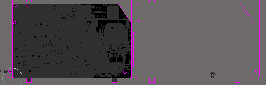

  - Mechanical6：厂商LOGO及认证标记

    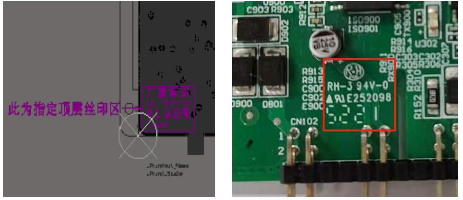

**钢网层：**

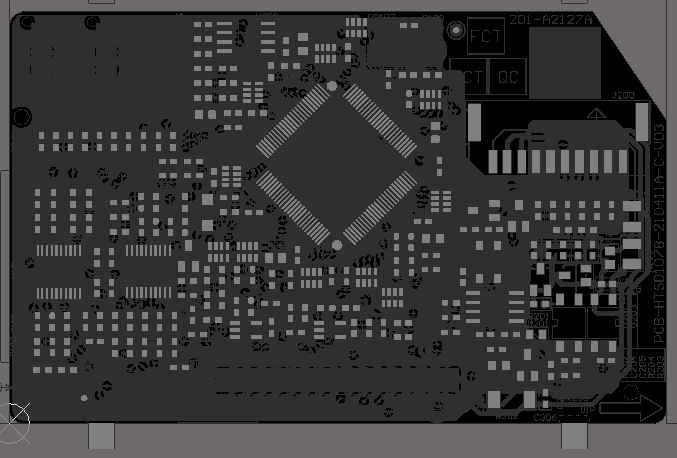

### 4.封装匹配网络表导入PCB文件

4.1 原理图绘制好后，将PCB封装加载到原理图上的元器件中，注意器件的脚位要与封装实际的PIN脚一一对应。

4.2 检查一下原理图是否有出错，报错的设置：Project>Project Options...

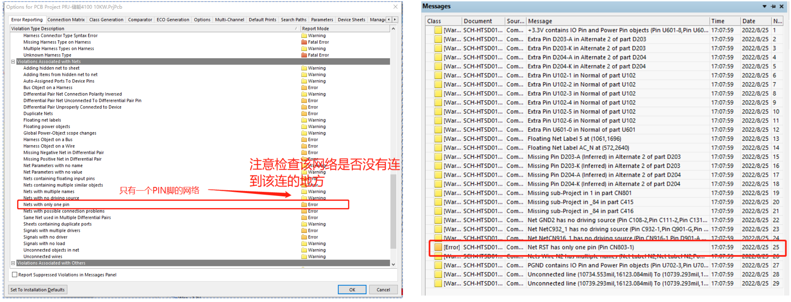

4.3 PCB和原理图进行网络匹配，将封装导入PCB 。

4.3.1 Project>Component Links...

4.3.2 Design>Import Changes From XXX.PrjPcb

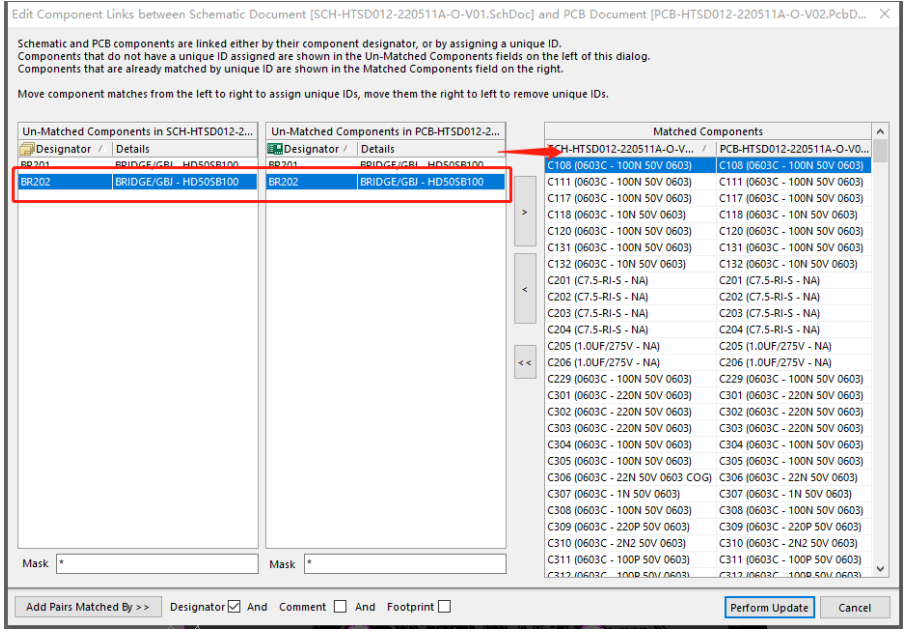

### 5.安规、载流等参考依据

#### **5.1 线路的安全距离**

- 安全距离类型

  - 空气间隙

  - 爬电距离

-  决定安全距离的因素
  - 爬电介质
  - 设备类型和使用的环境
  - 电压的高低

- 安规参考标准
  - 家用IEC 60335-1:2004(GB 4706.1-2005)
  - 工业IEC 60664-1:2007(GB/T16935.1-2008)

- 过压类别（决定电气间隙）

​	根据特定电路中产生的预期瞬态过电压和以限制过电压而采用的方法为基础而确定的分类。 

 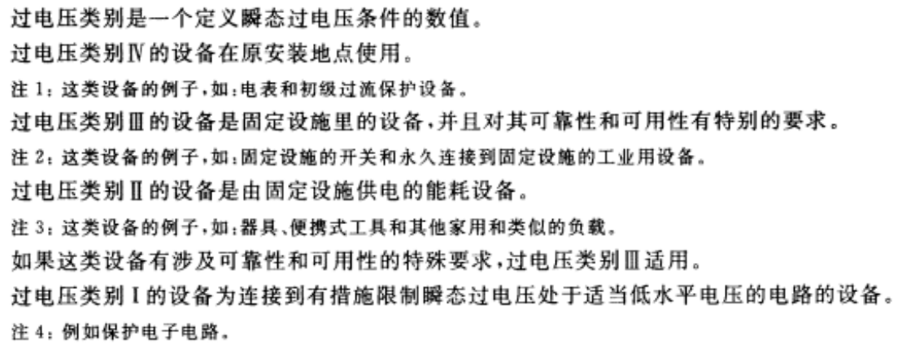

- 污染等级（决定爬电距离）

  用来确定电气间隙或爬电距离的微观环境污染等级。

  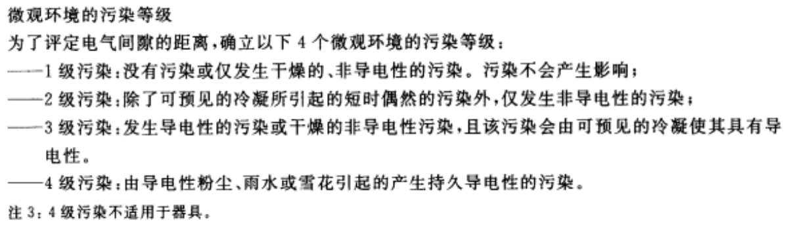

- 相对漏电起痕指数（CTI）

- 材料组别

  将绝缘材料按CIT值划分为4组：

  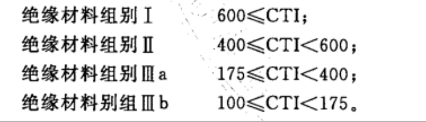

- 如何查表找出适用安全距离？

  - 确定爬电介质：**1.空气（空气间隙）2.PCB板（爬电距离）**

  - 设备类型 
  - 使用的环境
  - 工作电压
  - 额定电压 
  - 额定脉冲电压是多少 
  - 爬电距离选择PCB板材的材料组别

##### 例子1

TEST1：家用空调外机板，单相220V输入，输入端L与N之间的电气间隙和爬电距离是多少？

解：使用家用标准

（1）

a 电气间隙

b 过压类别2

c 额定电压：220V

d 查表得额定脉冲电压：2500V

故最小电气间隙为：1.5mm

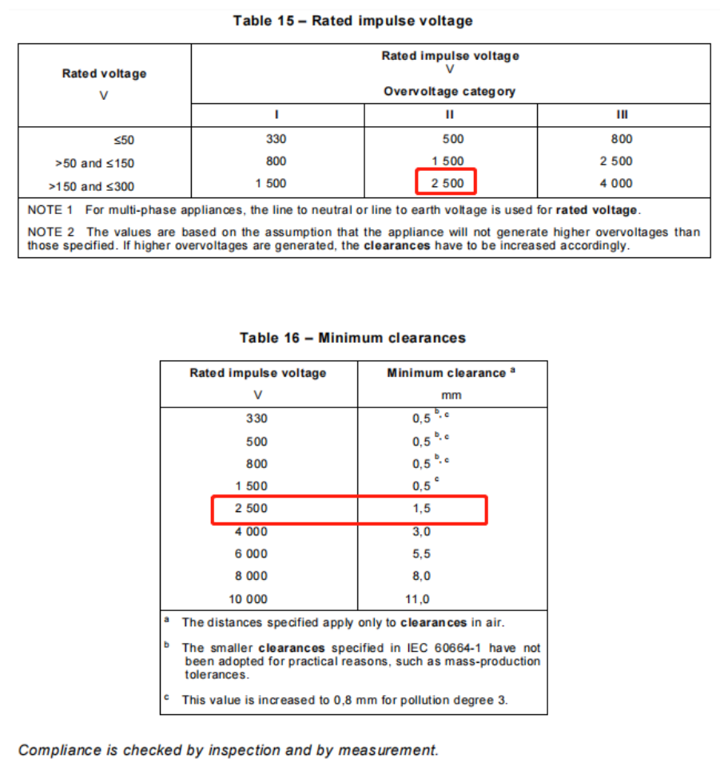

TEST1：家用空调外机板，单相220V输入，输入端L与N之间的电气间隙和爬电距离是多少？

解：使用家用标准

（2）

a 爬电距离

b 污染等级3

c 额定电压：220V

d 与工程师协商用CTI600材料

故最小爬电距离为：3.2mm

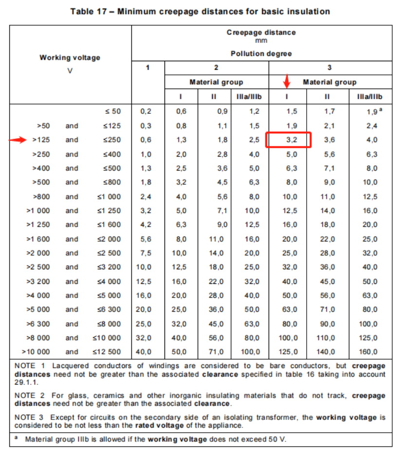

##### 例子2

TEST2：海拔4000米，储能项目，三相380V兼容480V输入，输入端相与相之间的电器间隙和爬电距离是多少？

解：使用低压系统标准

（1）

a 电气间隙

b 过压类别3

c 额定电压：277V

d 查表得额定脉冲电压：4000V

故最小电气间隙为：3mm

**以上答案对了吗？**

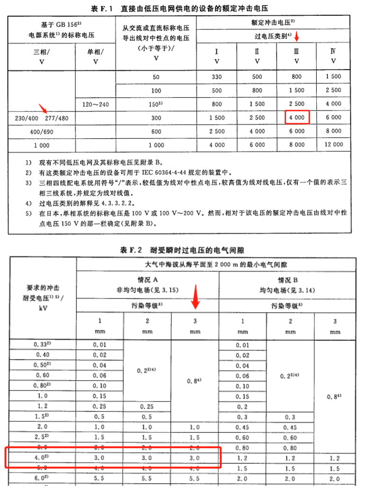

TEST2：**海拔4000米**，储能项目，三相380V兼容480V输入，输入端相与相之间的电器间隙和爬电距离是多少？

解：使用低压系统标准

注：对于均匀电场，根据帕邢定律，空气中电气间隙的击穿电压正比于电极间距离和大气压的乘积。因此在接近海平面记录的经验数据是按海拔2000米与海平面之间的大气压差异进行修整。对于非均匀电场也采用同样的修整。

对应的最小电气间隙为：3mm

海拔修正系数为：1.29

故最小电气间隙为：3.87mm

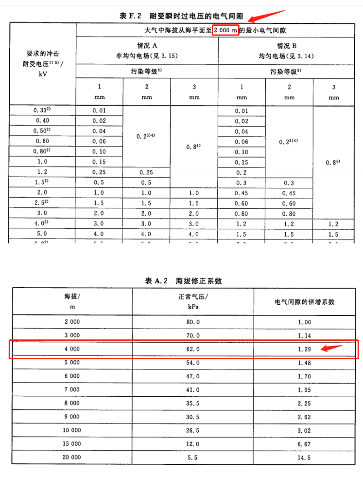

TEST2：**海拔4000米**，储能项目，三相380V兼容480V输入，输入端相与相之间的电器间隙和爬电距离是多少？

解：使用**低压系统标准**

（2）

a 爬电距离

b 污染等级3

c 正常工作时相与相间电压：480V（Max）

d 与工程师协商用CTI600材料

故最小爬电距离为：6.3mm

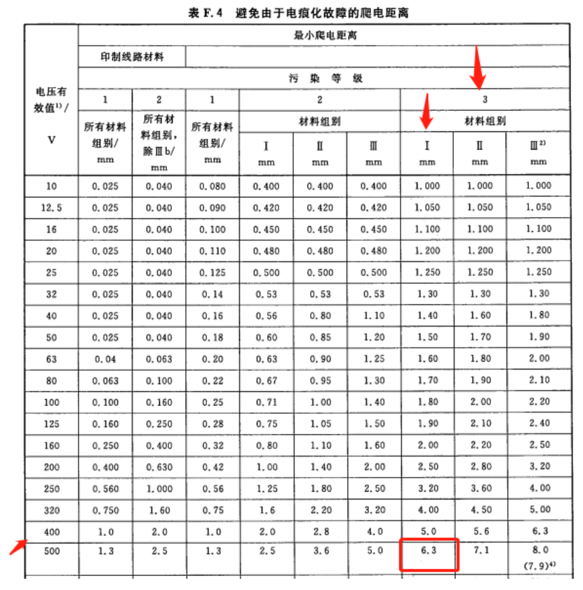

#### **5.2 导线的载流能力**

##### 影响PCB铜箔载流的因素

​	PCB板上导线的载流能力与以下因素

​	有关：线宽**W**、铜箔的厚度**T**以及容许温升△t。线宽与铜箔的厚度构成截面积**A**。

##### 载流能力参考标准

​	IPC-2221

​	IPC-2221A

​	IPC-2152

​	IPC-2221B

​	关系图（原始图表）

​	图A:对于外层导线，电流与截面积的关系；

​	图B：导线宽度和截面积的关系；

​	图C：对于内层导线，电流与截面积的关系；

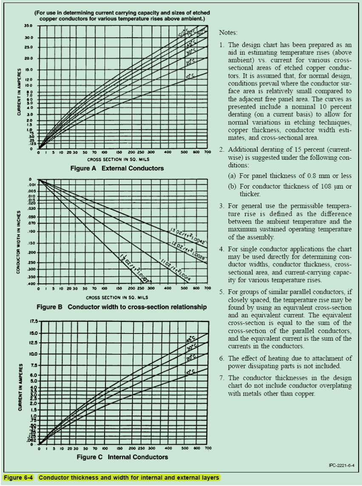

##### 用什么计算器，计算载流比较符合设计？

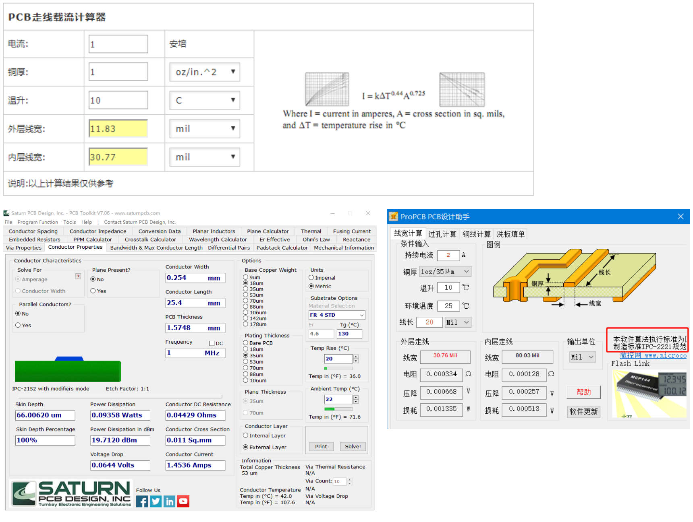

### 6.布局布线、工艺调整

#### 6.1 布局设计

1、电路板尺寸和图纸要求加工尺寸是否相符合。

2、电路走向是否与原理图要求的一致，回路面积是否可以做到相对小。

3、器件之间是否已经预留足够的安规距离和走线空间。

4、元器件的布局是否均衡、排列整齐、是否已经全部布完。

5、各个层面有无冲突。如元器件、外框、需要丝印的层面是否合理。

6、常用到的元器件是否方便使用。如开关、插座、须经常更换的元器件等。

7、热敏元器件与发热元器件距离是否合理。

8、散热性是否良好。

9、线路的干扰问题是否需要考虑。

#### 6.2 布线设计

1、按先电源到小信号的布线顺序。

2、根据电流的大小确定走线的宽细和过孔的数量。

3、小的分立器件走线须对称，间距比较密的SMT焊盘引线应从焊盘外部连接，不允许在焊盘中间直接连接。

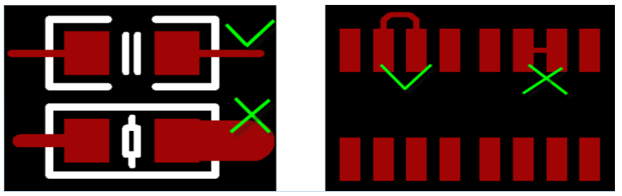

4、环路最小规则，即信号线与其回路构成的环面积要尽可能小，环面积越小，对外的辐射越少，接收外界的干扰也越小。

5、走线不允许出现STUB。

6、防止信号线在不同层间形成自环。在多层板设计中容易发生此类问题，自环将引起辐射干扰。

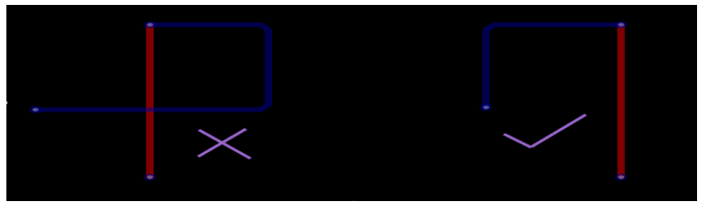

7、PCB设计中应避免产生锐角和直角，产生不必要的辐射，同时PCB生产工艺性能也不好。

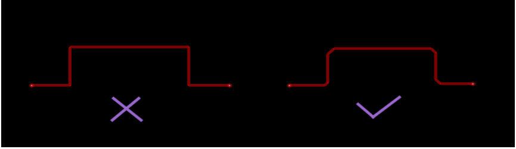

#### 6.3 工艺调整

1、位号丝印的放置。

2、重要标识的丝印的放置。

3、ICT和FCT测试点的放置。

4、Remark点的放置。

5、厂家信息位置标识。

6、过炉方向标识

7、必要时放置高压标识或客户指定的其他标识

### 7.DRC检查规则

#### 7.1 检查的习惯

电路板 设计是一个非常复杂的过程，因为多层板上有数千个连接和电气元件。无论你多么小心或熟练，在使用如此多的组件时，你的设计无疑会出现一些错误。这些错误可能包括错位的别针、错位的签证等。通常，您会在生产阶段发现到这些错误，迫使您进行需要时间和成本高昂的更正。

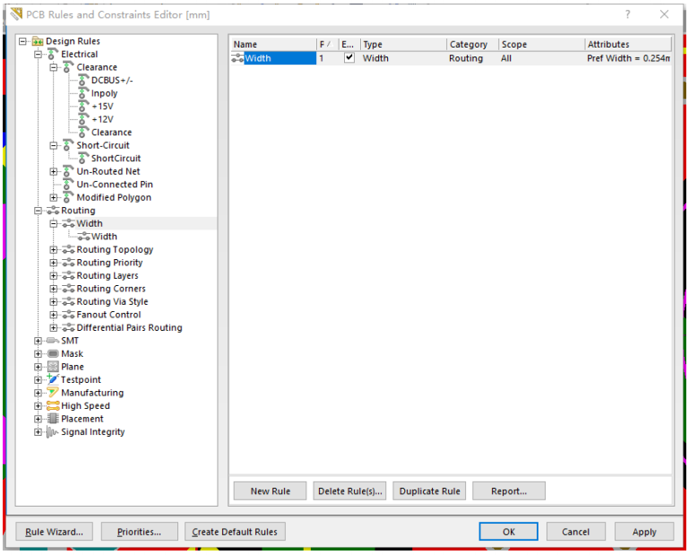

#### 7.2 规则设置

7.2.1 Electrical

7.2.1.1 Clearance（不同网络之间的间距）

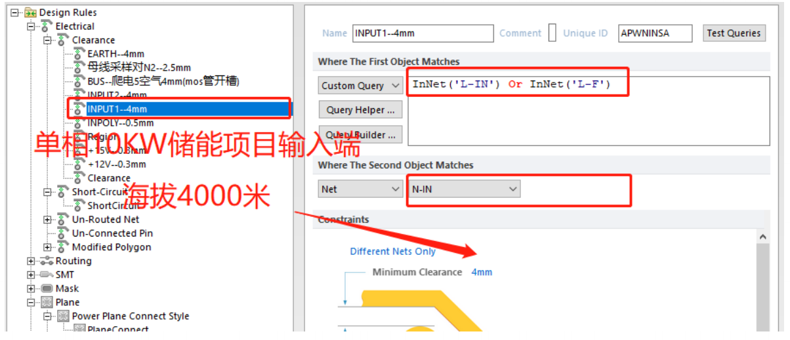

7.2.1.2 ShortCircuit（短路设置）

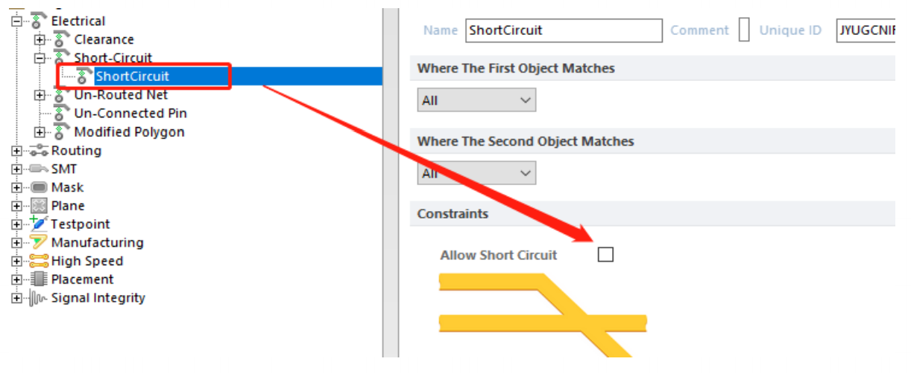

7.2.2 Routing（线路）

Width（线宽设置）

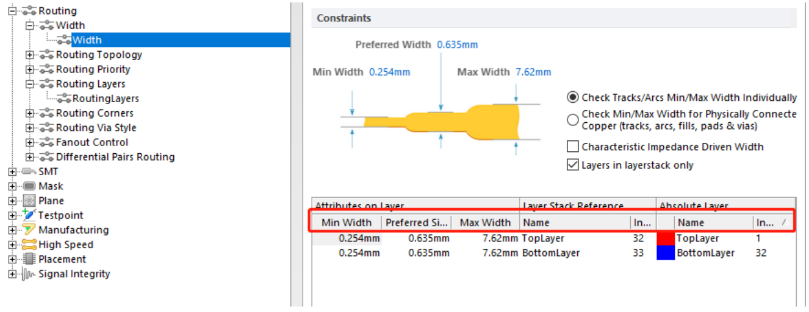

7.2.3 Plane

Polyon Connect Style(铜箔连接类型设置)

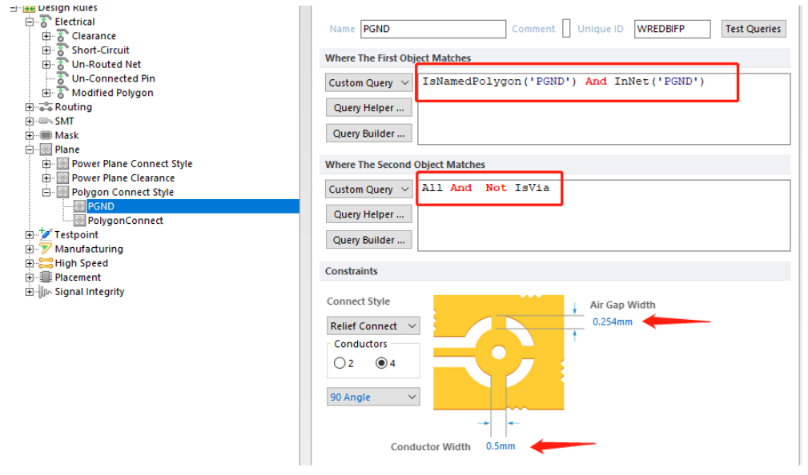

7.2.4 Manufacturing

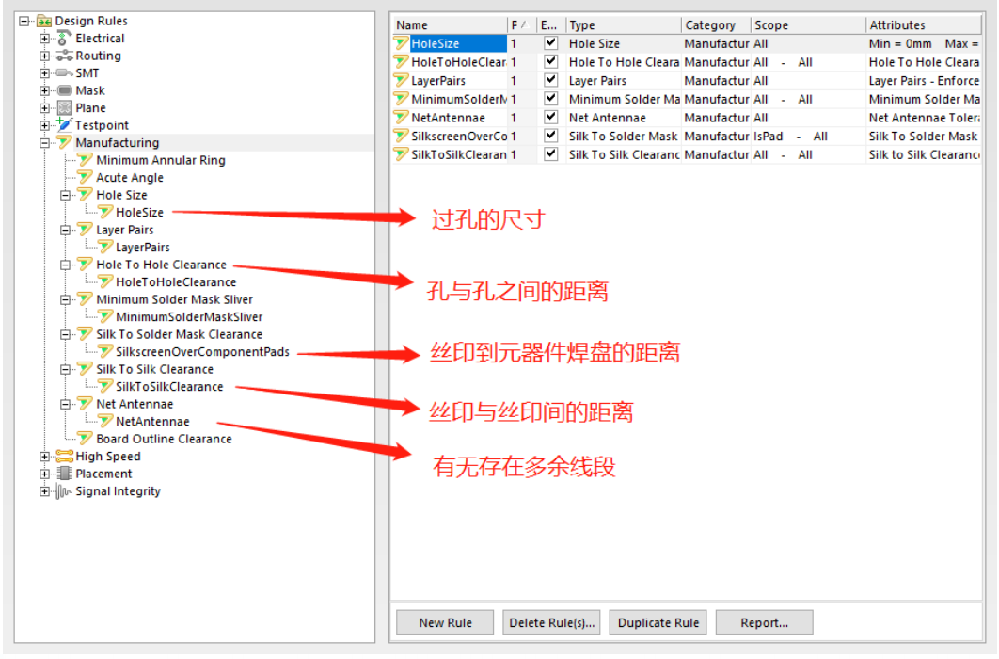

### 8.提供3D简视图

PCB画好评审后，一般情况下就可以打样了。

但是因为我们的PCBA并不是最终的成品供终端使用的，还有外壳等其他

组件要跟PCBA进行组装，那就会存在干涉等相关问题。

1.客户需求存档备案

2.客户需要PCBA的3D图来进行结构设计

3.对通用的结构选用进行评估

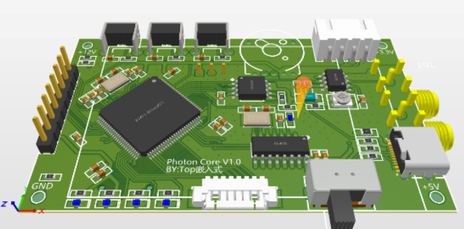

