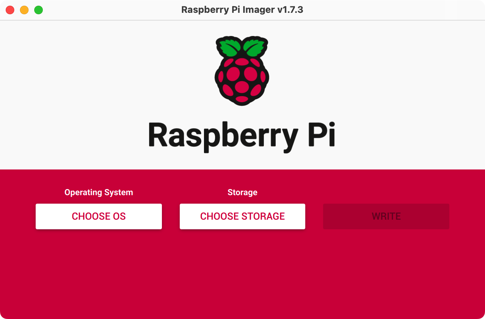
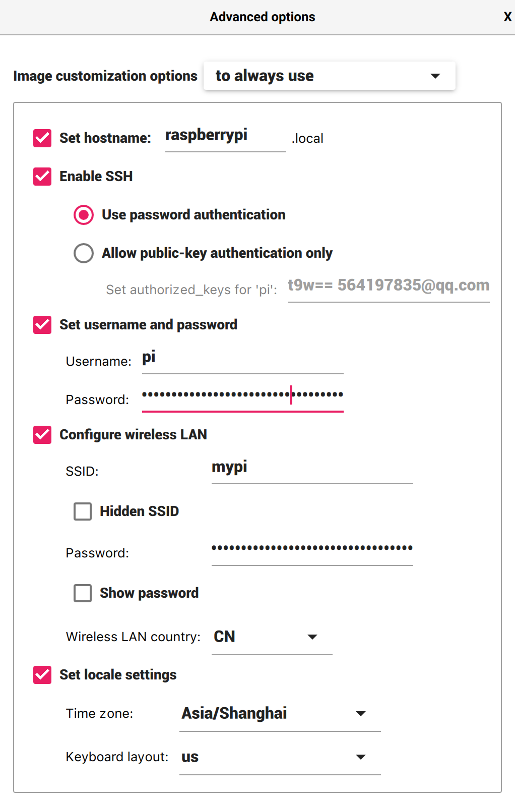

# 树莓派入门指南

> 无显示器、无网线、纯命令行版

所需工具：一台能上网的电脑、一个SD卡、一个读卡器

## 下载镜像

这里我们直接使用官方的镜像，打开 <https://www.raspberrypi.com/software/operating-systems/>，可以看到官方的镜像名称为 `Raspberry Pi OS`。我们不需要有桌面的版本，选择命令行版本 `Raspberry Pi OS Lite`，点击右侧 `Download` 即可。

下载完成之后在下载文件夹中有 `2022-09-22-raspios-bullseye-armhf-lite.img.xz`。

## 烧写准备

将SD插入读卡器，将读卡器插入电脑。

## 烧写镜像

在 <https://www.raspberrypi.com/software/> 找到 `Install Raspberry Pi OS using Raspberry Pi Imager`，这是官方所给的烧写工具。根据自己的系统选择下载。我这里 macOS 下载到的文件为 `imager_1.7.3.dmg`，下载好后双击安装打开即可。

打开之后的界面如下：




- Operating System 这里点击 CHOOSE OS，滑到最下方的 Use custom (Select a custom .img from your computer)，点击选择刚刚下载的官方镜像 `2022-09-22-raspios-bullseye-armhf-lite.img.xz`。
- Storage 这里点击 CHOOSE STORAGE，选择插入电脑的存储卡。

右下角齿轮图标，点击打开：




- `Set hostname` 这里可以打开，这样我们之后用域名直接访问树莓派就行，比较方便
- `Enable SSH` 这里打开，用 ssh 可以登录到树莓派
- `Set username and password` ssh 登陆的账号和密码
- `Configure wireless LAN` 这里是说，树莓派之后连接的 Wi-Fi 名称和密码。填写你希望树莓派连接的 Wi-Fi 路由器的名称和密码。

将存储卡弹出拔出。

## 使用电脑无线连接树莓派

首先需要有一个 Wi-Fi 路由器。我这里因为没有，所以用手机来充当。

关闭手机 Wi-Fi 开关，打开手机热点。名称和密码使用刚刚设置的名称和密码。

将存储卡插入树莓派，插电启动。树莓派会自动连接到这个 Wi-Fi 热点。

电脑也连接到手机的 Wi-Fi 热点。之后打开终端，用

```
ssh pi@raspberrypi.local
```

出现的选项敲 yes 回车；输入的密码为官方镜像工具中设置密码。然后就可以连接到树莓派了。
