# 51单片机


## 临时想法记录

!!! Abstract "总体摘要"
    1、制作单片机**IO口功能表**，**外设资源表**，未来IO使用**分配情况表**。  
    2、编程可以先写**注解大纲**，然后编写程序，要有**模块化、状态切换**的编程思维。  
    3、芯片的**IO口有限**，编写程序要看引脚是否有和其他功能的**引脚冲突**，会不会产生**干扰**。  
    4、程序**边写边测试验证**，如果一次性写完程序之后再测试，如果有问题，排除问题时的检查难度就高了。       


!!! Abstract "编程知识"

    1、变量：  
    定义局部变量只能在**函数最前面**（看编译器和语言，keil + C 只能在函数最前面）。  
    程序如果定义了**变量是整形**的，那么就算在计算中得到了有**小数**，程序也会把`点.`后面的**小数去掉**，保持整数。  
    全局变量的默认值是0，整个模块程序都能使用。局部变量的默认值未必是0，有可能是其他值，所以一般都赋初始值，而且只能是函数内使用，该函数使用完就释放了。  除非使用的是**静态变量就不会立马被释放**。    
    静态变量static放在函数内是局部变量只能本函数使用，而且初始值是0，放在全局变量就其他全部函数都可以使用。使用静态变量是为了退出函数的时候不丢失。  
    **数组的数据类型**决定了使用内存的**基本单位字节**，如char的数组里面每一个参数都是**8位，占用1个字节**。   
    
    2、中断：  
    **中断已经调用的函数，不能在主函数也调用**，因为可能会导致bug，原函数数据可能会被**破坏**。  
    程序最好按**非阻塞式**进行编写，如**数码管的扫描、按键的消抖**，使用循环来进行滤除按键抖动的话，按键按下后如果不松手程序就会**卡死**在这一段，无法进行下一步，可以使用定时器进行定时扫描代替。如果某一段程序必须要写成阻塞式的话，可以使用**freeRTOS实时操作**系统进行多线程控制解决，当然得**芯片支持**才行。  
    
    3、头文件：  
    需要**外部调用的变量或者函数**可以**在头文件定义**。  
    头文件`<REGX52.H>`,尖括号`<>`里代表是**安装目录下寻找**这个头文件，我们自己写的一般用英文的双引号`""`包含，如`"Delay.h"`这样软件就会在**项目文件或者自定义地址寻找**。  
    
    4、位操作：  
    位的左移 << 和右移 >> 有限制，限制在16位以下才正确，如51单片机里32位的unsigned long，超过16位错误。可以使用数组或者多定义变量进行另一种方式解决（待验证），  也可能是要写成unsigned long int 才行（假设，待验证）  
    循环左移函数`_crol_`  ，循环右移函数`_cror_`是在当前8位进行循环位移（类似于蛇吃自己的尾巴，首尾相连）。左移符 << 和右移符 >> 是整体位移，移到下一个高8位或者低8位，甚至移出当前8位。  
    `P2=~(0x01<<LEDNum)`如果程序有模棱两可的情况可以用括号括起来，避免出现错误。左移和右移必须使用1位进行位移，因为如果多位值给1，位移会把值都给推到下一个8位，不会移回当前的8位，如0111 1111右移之后变成0011 1111了不是我们想要的单个循环的位移。  
    52单片机的寄存器分为**可位寻址寄存器**和**不可位寻址寄存器**，可位寻址的是8位寄存器里的其中1个位分开赋值而不是整个寄存器，如P2和P2_0，P2是整个寄存器本身只能8位一起赋值，单片机无法对所有位进行编码，故每8个寄存器中，只有一个是可以位寻址的。可以位寻址可以单独赋值0和1，不可位寻址只能整体赋值0xFF。  
    P^0这些位可以0和1进行赋值，而P2端只能使用十六进制8位一起赋值，如0xFE，如果需要对单个位单独进行修改需要使用按位与`&=`和按位或`|=`配合进行操作。  
   
    5、通讯：  
    通讯方式就是按照通讯协议给予对应电路的IO口特定的高低电平，或串行 或并行 或两者结合、信号收发时间判断的等方式进行传输数据，就是要注意根据时序进行使能控制而已。  
    芯片的引脚可以弄一个表格，记录引脚功能和使用情况。  
    芯片的通讯其实就是根据他的要求的时序和时间要求，调节IO口的高低电平进行启动、关闭、数据收发的。
    芯片或者一些功能模块，要看是数据的发送和接收，是**低位先行**还是**高位先行**，决定了数据发送顺序，  
    如：0xFE换算成二进制就是1111 1110。
    
    - 高位先行就是从0xFE最左边，开始发送1-1-1-1-1-1-1-0  
    - 低位先行就是从0xFE最右边，开始发送0-1-1-1-1-1-1-1

    6、其他：  
    ASCII码的'0' = 0x30;  
    **继承之前的程序**也要注意定时器之类的定义和之前的使用情况是否有冲突。  
    `\_nop\_(); `表示空循环一个机器指令的时间，晶振12MHz中表示1us，11.0592MHz表示1.085us，6MHz中表示2us，24MHz中表示0.5us。  使用`\_nop\_()`需包含**intrins.h**头文件。    

    
!!! Abstract "硬件知识"
    加限流电阻是为了保护单片机，所以电阻的放置位置迁就单片机，就放在电源之后和它的IO口之前，其他的LED之类的直接接电源也没事，坏了可以换。   
    程序储存有**RAM和ROM（Flash）**，RAM是**临时程序储存**相当于**内存条**，内存比较小。**Flash**是**掉电不丢失的数据存储器**，而且存储内存较大。数组之类的默认都是存储RAM里的，所以一些不需要改动的程序可以存储到Flash里面，使用**关键字code**就可以把数组存储进去。但有个缺点是定义放在Flash里的数组程序就不能修改了，**只读**。栗子参考**LED点阵显示动画变脸**项目。  
    原理图的芯片引脚标识，有横线在字母上面的，一般代表是低电平有效，如74HC595芯片的OE端，就是给低电平才使能的。  
    单片机一般**内部**或者**外部**，有接**上拉电阻**或者**下拉电阻**进行端口初始化。一般默认都是接上拉电阻保持高电平，使用**低电平强驱动**的方案，**弱上拉，强下拉**。弱上拉说的是高电平驱动能力相较于低电平来说较弱，给一个低电平端口电压就直接被拉低为0了，而且如果采用高电平的驱动方案因为是单片机进行供电，可能导致**驱动功率不足**的情况，所以IO口可以输出也可以输入，甚至IO之间可以短接通过IO口给低电平进行检测端口的使用情况，矩阵按键的扫描就是利用这种的情况。  
    51单片机P0口本来是开漏输出的，但是普中开发板外加了上拉电组和电源变成了弱上拉。而P1，P2，P3口是本来就是弱上拉的。  
    
    1.bit就是位，也叫比特位，是计算机表示数据最小的单位  
    2.byte就是字节  
    3.1byte=8bit，一字节=8位。  
 


!!! Abstract "疑难杂症"
    keil无法跳转函数所在定义和声明，可能是软件小bug，点击全部保存，关掉软件，重新打开项目就可以了。  
    字符串数值最后默认加`\0`?


 

!!! Abstract "位赋值"
    如果给1个位bit进行赋值，满足一个条件，就是非0即1，if语句也是类似的判断表达式，非0即1，如下
    ```
    shit SER = P3^4;   
    SER=Byte&(0x80>>i)
    
    if(Key();)
    ```


!!! Abstract "防止重定义"
    以下语句是即是防止重定义的
    
    ```
    #ifndef __DELAY_H__		//如果没有定义`__DELAY_H__`，直接执行下面的语句
    
    #define __DELAY_H__		//` 定义`__DELAY_H__`
    
    #endif					//结束if语句，一般配合#ifndef使用。
    ```

!!! Abstract "定义参与编译"
    以下语句的作用是，如果定义了`__DELAY_H__`里面的abc才生效，参与编译
    
    ```
    #ifdef __DELAY_H__
    
    abc
    
    #endif
    ```


!!! Abstract "外部调用"
    外部想调用变量、数组、函数必须在头文件定义前面加extern，数组、函数和默认是有的不写出来也行，但是变量想调用必须要有。数组的内容可以不写到头文件，参考如下：
    
    ```c
    extern unsigned char DS1302_Time[];
    
    void DS1302_Init(void);
    void DS1302_WriteByte(unsigned char Command,Data);
    unsigned char DS1302_ReadByte(unsigned char Command);
    void DS1302_SetTime(void);
    void DS1302_ReadTime(void);
    ```


!!! Abstract "时序"
    **时序**    

    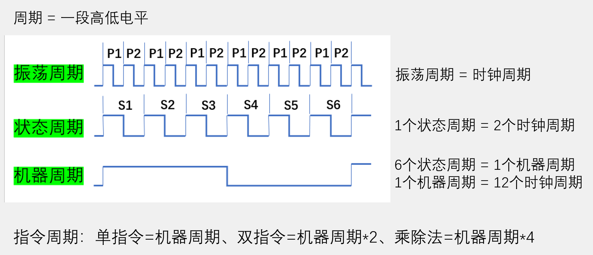
    
    周期 = 一段高低电平的时间，相当于LED的一次瞬间点亮和瞬间熄灭。
    
    一个脉冲的时间 = 时钟周期，也就是1/12微秒。
    
    机器周期=6个状态周期=12个时钟周期
    
    频率即速度，速度快了用的时间就少了，1s ÷ 1000000Hz = 0.000001s  ，速度慢了每秒只有500Hz，那就是2ms一个Hz。1s ÷ 500Hz = 0.002s ，这个频率是对于1秒来说的。
    
    1、时钟周期：单片机的基本时间单位，若时钟的晶体的振荡频率为fosc，则时钟周期Tosc=1/fosc。  
    
    2、机器周期：CPU完成一个基本操作所需的时间称为机器周期，  AT89C51单片机每12个时钟周期为1个机器周期。  
    通常，一条指令的执行要分为好几个基本操作，每个基本操作耗时一个机器周期。  
    
    3、指令周期：指令周期是执行一条指令所需的时间。  
    
    单片机的指令按字节可分为单字节(1个机器周期)、双字节(2个机器周期)、三字节指令(3个机器周期)，乘法、除法指令需要(4个机器周期)，因此执行一条指令的时间也不相同。  
    
    时钟周期==1/fosc，机器周期=12\*时钟周期，指令周期=1~4机器周期。当使用12M晶振，执行单字节指令的时间 t=12\*(1/fosc)=12*(1/12M)=1us  
    
    12Mhz程序进入一个函数需要的时间是4us，11.0592Mhz进入一个函数需要的时间是5us   
    
    程序编写需注意其他功能芯片的时序要求，52单片机运行一次机械周期是1us，小于1us的直接写变化就行了。功能时序需要的时间大于1us的要看下是不是多个范围的时序，如果不是的话要加个延时函数在后面。如XPT2046时序其他时序都是ns级别的，只有获取数据tACQ最小值1.5us大于机械周期就要看看时序图，免得获取失败。它的时序图区间有三个低高电平周期单片机最少要6us，在这6us后才到下一区间，tACQ只要1.5us，早就获取到数据了，所以是满足要求的，不用加延时。
    
    计算延时时间先确定想要延时的时间，和晶振的时钟频率和机械频率，52单片机1个机械周期等于12个时钟周期。  
    
    
    
    ```
    频率和周期互为倒数，
    
    1除以频率 等于1个周期的时间 : 1 ÷ 12000000Hz = 8.3333333333333333333333333333333e-8s
    
    1除以1个周期的时间 等于频率：1 ÷ 8.3333333333333333333333333333333e-8s = 12,000,000Hz
    ```


!!! Abstract "定时器"
    定时器时间计算：
    
    - 12Mhz:
        - 公式法
            - 1秒的时钟频率：12Mhz = 12,000,000hz
            - 1个时钟周期 = 1s/12Mhz = 8.3333333333333333333333333333333e-8 约等于 83.33ns
            - 一般情况52单片机，12个时钟周期等于1个机械周期： 83.33ns * 12 = 0.000001s = 1us
        - 先分频法
            - 12,000,000 ÷ 12 = 1,000,000hz =1Mhz (1秒内的机械频率)
            - 所以在1秒这个时间里，1个机械周期等于：1s ÷ 1,000,000hz   = 0.000001s = 1us
    
    - 11.0592Mhz:  
        - 公式法
            - 1秒的时钟频率：11.0592Mhz = 11,059,200hz
            - 1个时钟周期 = 1s/12Mhz = 9.0422453703703703703703703703704e-8 约等于 90.04ns
            - 一般情况52单片机，12个时钟周期等于1个机械周期： 90.04ns \* 12 约等于 1.085us
        - 先分频法
            - 11,059,200 ÷ 12 = 921,600hz = 0.9216Mhz (1秒内的机械频率)
            - 所以在1秒这个时间里，1个机械周期等于多少秒：1s ÷ 921,600hz   约等于 0.000001085s 约等于 1.085us  

    ​如果11.0592Mhz的晶振想计时13.5ms ，毫秒换算成微秒：13.5ms = 13500us  
    ​目标定时时间 13500us 除以对应的机械周期时间 1.085us 等于延时所需的机械周期个数：13500us ÷ 1.085us 约等于 12,442 （机械周期个数）  


!!! Abstract "周期和频率"
    频率：1s / 1ms = 1000Hz  
    周期：1s / 262hz = 3816.794us  
    频率：1s / 3816.794us = 262hz  


## 软件

软件安装教程和安装包参考：[Keil C51与STC-ISP安装](https://blog.csdn.net/weixin_45518253/article/details/109709579){target="_blank"}  

### 程序编辑软件Keil5  

Keil C51是美国Keil Software公司(ARM公司之一)出品的51系列兼容单片机C语言软件开发系统。

{width="100"} 

Keil5 C51和Keil5 MDK的区别：  
两者都是Keil系列软件，但前者是用来开发51单片机的，后者是用来开发ARM系列，比如STM32的。


### 烧录软件STC-ISP  

STC-ISP 是一款单片机下载**编程烧录软件**，是针对STC系列单片机而设计的。

{width="100"}  


## 单片机介绍

- 单片机，英文Micro Controller Unit，简称MCU

- 内部集成了CPU、RAM、ROM、定时器、中断系统、通讯接口等一系列电脑的常用硬件功能

- 单片机的任务是信息采集（依靠传感器）、处理（依靠CPU）和硬件设备（例如电机，LED等）的控制

- 单片机跟计算机相比，单片机算是一个袖珍版计算机，一个芯片就能构成完整的计算机系统。但在性能上，与计算机相差甚远，但单片机成本低、体积小、结构简单，在生活和工业控制领域大有所用

- 同时，学习使用单片机是了解计算机原理与结构的最佳选择

- 单片机的使用领域已十分广泛，如智能仪表、实时工控、通讯设备、导航系统、家用电器等。各种产品一旦用上了单片机，就能起到使产品升级换代的功效，常在产品名称前冠以形容词——“智能型”，如智能型洗衣机等


### STC89C52单片机

- 所属系列：51单片机系列

- 公司：STC公司

- 位数：8位

- RAM：512字节

- ROM：8K字节（Flash）

- 工作频率：2023年版的新实验板晶振原理图，使用的是11.0592MHz（旧版开发板使用12MHz）

- 程序烧录需选择型号：STC89C52RC/LE52RC

  

  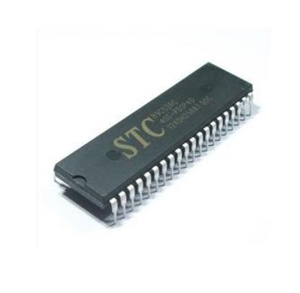
  
  

### 单片机内部拆解

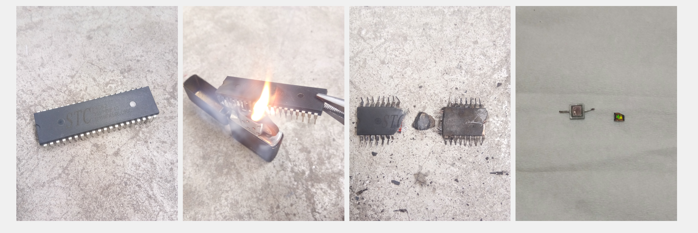


### 单片机内部结构图

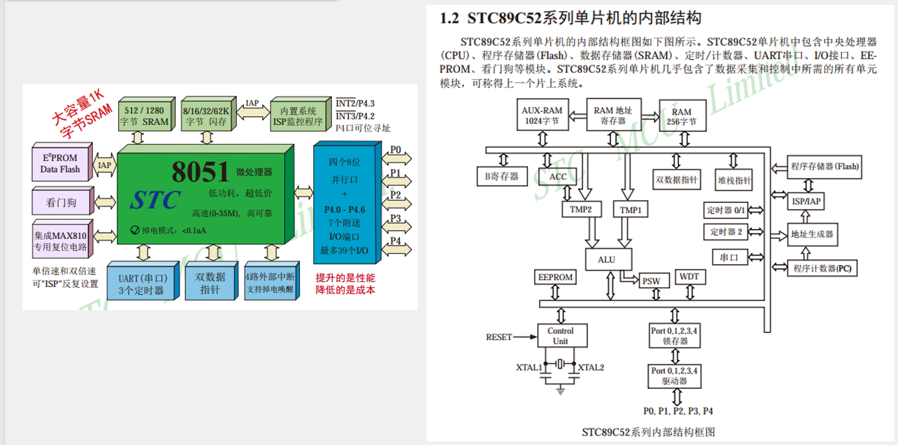


### 单片机和最小系统

外接**复位电路，晶振电路，电源电路**。

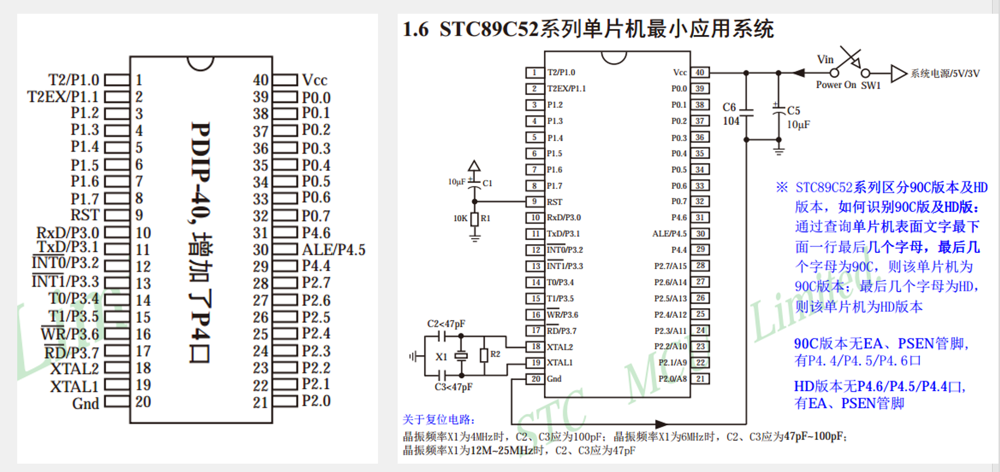


### 命名规则

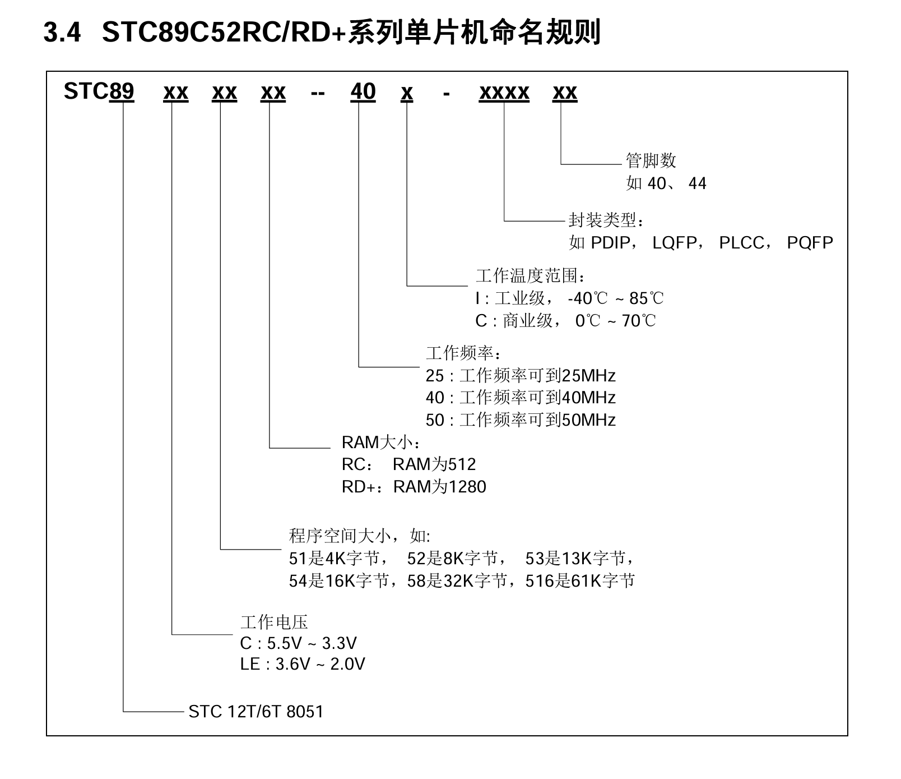


### 开发板

普中科技51单片机开发板STC89C52学习板实验套件

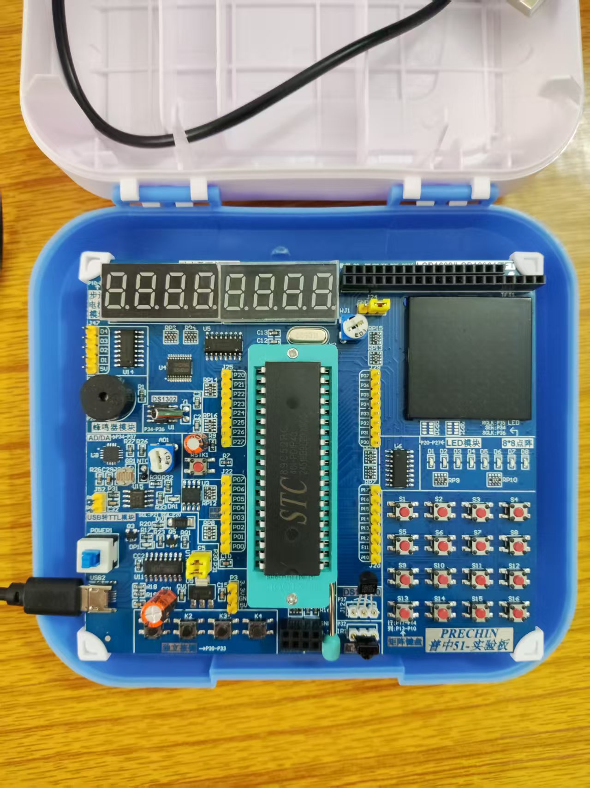{width="500"}


## 程序

### 兼容C51单片机的C语言

#### C51数据类型  


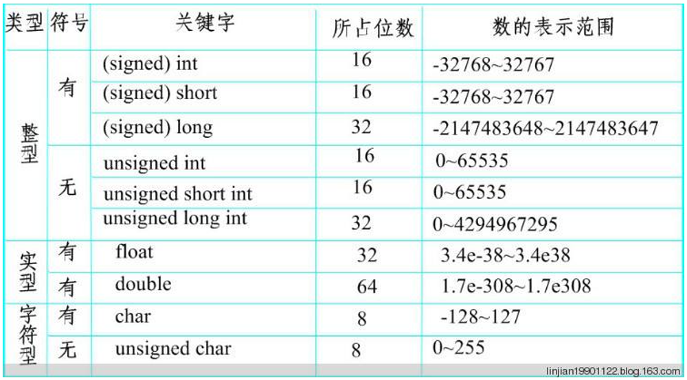

8位bit，为1个Byte字节。51单片机int占用内存16位是2个字节，和Windows系统的4个字节不一样，而在STM32中int是32位也是4个字节（其他待查查询）

要有**节约内存**的观念，能使用**占用位数、字节小**的就使用。

数据类型前有**unsigned**修饰的代表**无符号**

**浮点型float和双倍浮点型double**是单片机里仅有的两个**可以有小数**的数据类型。


#### C51数据运算符  


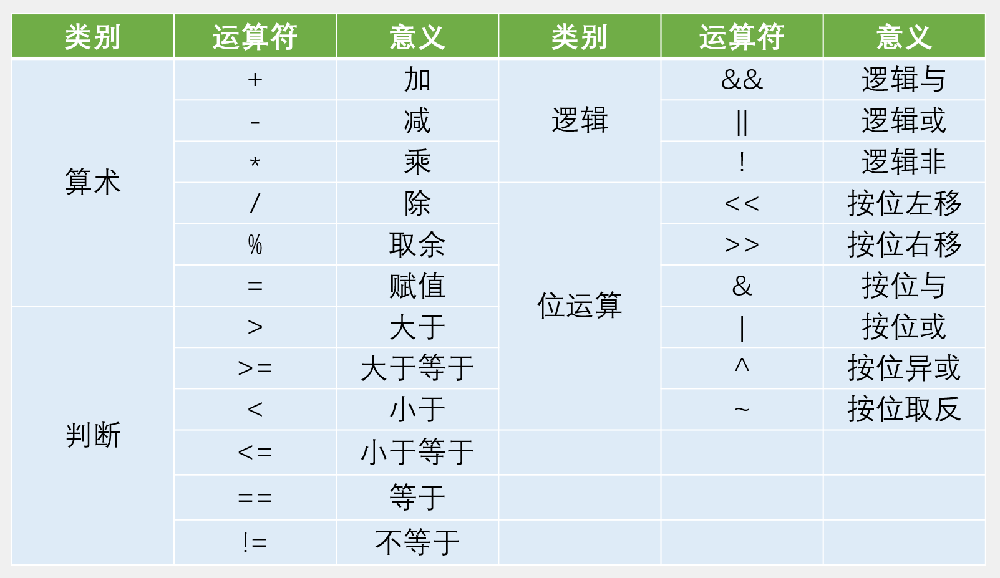

**较特殊运算符：**

- **逻辑非：** `！`取反是逻辑取反，0和1。

- **按位取反：** `~`是8位按位进行取反，如 十六进制0xFE 换算二进制1111 1110，十进制是 254，按位取反就变成0x01换算二进制0000 0001 十进制就只有 1了。

- **按位异或：** `^`是8位二进制里，相同为0，不同为1  
    栗子如下：    
    1010 1010 = 0xAA  
    1111 0000 = 0xF0  
​	按上述值异或，上下一位位对比，1和1相同得0，0和0相同得0，0和1不同得1，最后的值是0101 1010 = 0x5A


#### C51基本C语言语句  


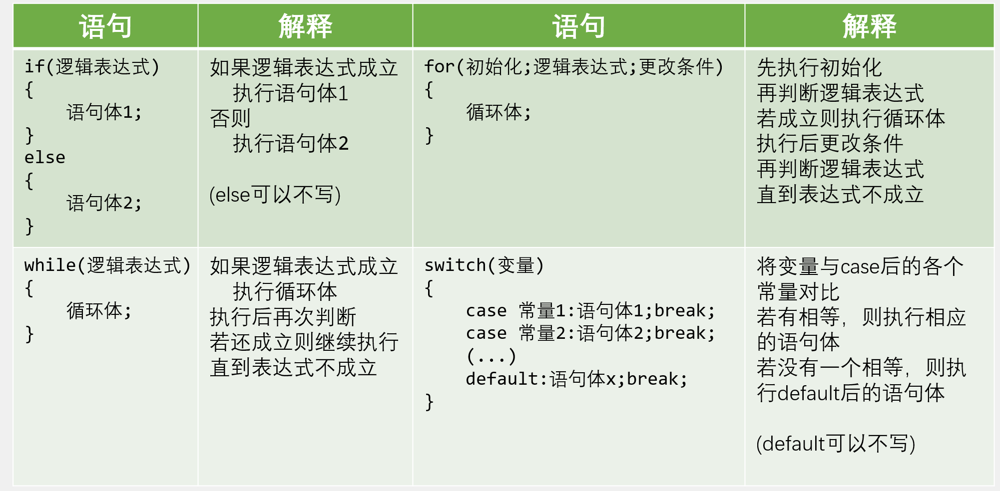


#### C51数组  

数组：把相同类型的一系列数据统一编制到某一个组别中，可以通过数组名+索引号简单快捷的操作大量数据，数组里面的**第一个数值是第0位**。而且都有对应地址，因为数组里面的数据太多复制一份传递占用内存太多，避免这种情况程序设计的人就设置传递的是地址，所以传递数组的函数形参（实参）可以写成**指针形式**，其他函数调用数组可以改变内部的值。


```c
int x[3]; //定义一组变量（3个）

int x[]={1,2,3}; //定义一组变量并初始化


x[0]  //引用数组的第0个变量

x[1]  //引用数组的第1个变量

x[2] //引用数组的第2个变量

引用x[3]时，数组越界，读出的数值不确定，应避免这种操作
```


#### C51字符、字符串

- 字符：根据一定规则建立的数字到字符的映射（ASCII码表）  
    例如：0x21=’!’，0x41=’A’，0x00=’\0’	
    定义方法：char x=‘A’;  
    （等效于char x=0x41;）


- 字符数组：存储字符变量的一个数组  
​	 定义方法：char y[]={'A', 'B', 'C'};   
​	 （等效于char y[]={0x41,0x42,0x43}; ）


- 字符串：在字符数组后加一个字符串结束标志，本质上是字符数组  
    定义方法：char z[]=”ABC”;   
    （等效于char z[]={'A', 'B', 'C', '\0'};）


#### C51子函数

**子函数**：将完成某一种功能的程序代码单独抽取出来形成一个模块，在其它函数中可随时调用此模块，以达到**代码的复用和优化程序结构**的目的。

子函数里面主要需注意三个：

1. 函数名要见名知意，如：`LCD1602_Init();`，一眼就能看出是LCD1602的初始化函数了。
2. 有没有返回值？没有的话子函数的最左边写void，有的话写上返回值的类型，如unsigned char，并且配合return返回值，由其他函数定义变量接收。
3. 有没有形参？（地址传递为实参，实参是子函数调用可改变原定义变量参数的意思），有几个形参？（实参）。

```c
void Function(unsigned char x, y)
{
 

}

返回值 函数名（形参）
{
 	函数体
	return 返回值;
}
```


#### C51的sfr、sbit

- **sfr（special function register）：特殊功能寄存器声明**

 	例：`sfr P0 = 0x80;`  
    声明P0口寄存器，物理地址为0x80

- **sbit（special bit）：特殊位声明**

    例：`sbit P0_1 = 0x81; ` 或  `sbit P0_1 = P0^1;`    
    声明P0寄存器的第1位

**可位寻址/不可位寻址**：在单片机系统中，操作任意寄存器或者某一位的数据时，必须给出其物理地址，又因为一个寄存器里有8位，所以位的数量是寄存器数量的8倍，单片机无法对所有位进行编码，故每8个寄存器中，只有一个是可以位寻址的。对不可位寻址的寄存器，若要只操作其中一位而不影响其它位时，可用“&=”、“|=”、“^=”的方法进行位操作。


#### C语言预编译

C语言的预编译以#开头，作用是在真正的编译开始之前，对代码做一些处理（预编译）


| **预编译**          | **意义**                      |
| ------------------- | ----------------------------- |
| #include <REGX52.H> | 把REGX52.H文件的内容搬到此处  |
| #define PI 3.14     | 定义PI，将PI替换为3.14        |
| #define ABC         | 定义ABC                       |
| #ifndef __XX_H__    | 如果没有定义__XX_H__          |
| #endif              | 与#ifndef,#if匹配，组成“括号” |

- 此外还有#ifdef，#if，#else，#elif，#undef等。


### 进制转换


| **十进制** | **二进制** | **十六进制** |      | **十进制** | **二进制** | **十六进制** |
| ---------- | ---------- | ------------ | ---- | ---------- | ---------- | ------------ |
| 0          | 0000       | 0            |      | 8          | 1000       | 8            |
| 1          | 0001       | 1            |      | 9          | 1001       | 9            |
| 2          | 0010       | 2            |      | 10         | 1010       | A            |
| 3          | 0011       | 3            |      | 11         | 1011       | B            |
| 4          | 0100       | 4            |      | 12         | 1100       | C            |
| 5          | 0101       | 5            |      | 13         | 1101       | D            |
| 6          | 0110       | 6            |      | 14         | 1110       | E            |
| 7          | 0111       | 7            |      | 15         | 1111       | F            |


### 程序模块化

- 传统方式编程：所有的函数均放在main.c里，若使用的模块比较多，则一个文件内会有很多的代码，不利于代码的组织和管理，而且很影响编程者的思路

- 模块化编程：把各个模块的代码放在不同的.c文件里，在.h文件里提供外部可调用函数的声明，其它.c文件想使用其中的代码时，只需要#include "XXX.h"文件即可。使用模块化编程可极大的提高代码的可阅读性、可维护性、可移植性等

  

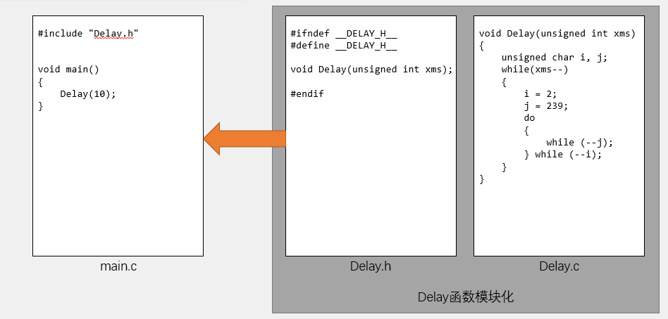


**模块化编程注意事项：**

- .c文件：函数、变量、结构体、数组的定义

- .h文件：可被外部调用的函数、变量、结构体、数组的声明

- 任何自定义的变量、函数在调用前必须有定义或声明（同一个.c）

- 使用到的自定义函数的.c文件必须添加到工程参与编译

- 使用到的.h文件必须要放在编译器可寻找到的地方
  - 安装目录是使用尖括号`<>`包含，工程文件夹根目录。
  - 自定义和是使用双引号`""`包含，否则软件默认在安装目录寻找是找不到的会报错。


## 按键

### 轻触按键

相当于是一种**电子开关**，按下时开关接通，松开时开关断开，实现原理是通过**轻触按键内部的金属弹片受力弹动来实现接通和断开**


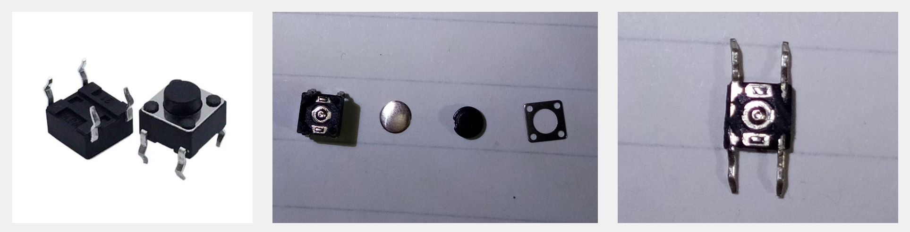


### 按键消抖

对于机械开关，当机械触点断开、闭合时，由于机械触点的弹性作用，一个开关在闭合时不会马上稳定地接通，在断开时也不会一下子断开，所以在开关闭合及断开的瞬间会伴随一连串的抖动。

而解决这个抖动的办法一般有两个，延时和定时器扫描：

- 就是使用延时函数和while循环函数配合，进行延时消抖，但缺点是和程序耦合性太大，按下按键后运行到循环时程序会卡在这个地方，导致MCU整个暂停，无法运行其他程序，松手后跳出死循环才能进行下一步。

- 使用定时器进行定时扫描，定时器定时检测按键端口状态。因为单片机一般默认是高电平，按下按键就是低电平，不松手就一直保持低电平。

  每20ms扫描一次，直到识别到一个**低电平和20ms后的高电平**，这个状态就是按键按下后松手的那一瞬间，这样的话就算按键有抖动也不怕了。

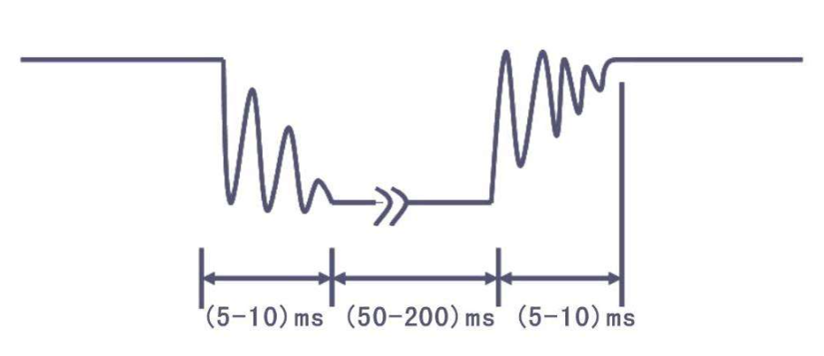


### 按键代码

#### 独立按键代码（阻塞式）

配合Delay函数使用，按下按键延时20ms，按下时循环保持，松手后再延时20ms，返回按键值。

```c
#include <REGX52.H>
#include "Delay.h"

/**
  * @brief  获取独立按键键码
  * @param  无
  * @retval 按下按键的键码，范围：0~4，无按键按下时返回值为0
  */
unsigned char Key(void)
{
    unsigned char KeyNumber=0;

    if(P3_1 == 0){Delay(20);while(P3_1 == 0);Delay(20);KeyNumber = 1;}
    if(P3_0 == 0){Delay(20);while(P3_0 == 0);Delay(20);KeyNumber = 2;}
    if(P3_2 == 0){Delay(20);while(P3_2 == 0);Delay(20);KeyNumber = 3;}
    if(P3_3 == 0){Delay(20);while(P3_3 == 0);Delay(20);KeyNumber = 4;}

    return KeyNumber;
 }

```


#### 独立按键代码（非阻塞式）

需配合定时器中断函数，计次循环运行Key_Loop函数，达到循环扫描按键的目的。

Key_KeyNumber是全局变量，内存放在全局区，程序结束前（断电）不会被系统（单片机）释放，所以一旦赋值给了它，不主动清零，或者赋其他值，之前的值就一直存在，随时被Key()函数调用都可以。

`static`，定义的是静态变量，内存也是放在全局区，程序也是结束前不会释放变量，因为是局部函数定义的，所以只能本函数使用。

```c
#include <REGX52.H>
#include "Delay.h"

unsigned char Key_KeyNumber;

/**
  * @brief  获取按键键码
  * @param  无
  * @retval 按下按键的键码，范围：0,1~4,0表示无按键按下
  */
unsigned char Key(void)
{
	unsigned char Temp=0;
	Temp=Key_KeyNumber;
	Key_KeyNumber=0;
	return Temp;
}

/**
  * @brief  获取当前按键的状态，无消抖及松手检测
  * @param  无
  * @retval 按下按键的键码，范围：0~4，0无按键按下时返回值为0
  */
unsigned char Key_GetState()
{
	unsigned char KeyNumber=0;
	
	if(P3_1==0){KeyNumber=1;}
	if(P3_0==0){KeyNumber=2;}
	if(P3_2==0){KeyNumber=3;}
	if(P3_3==0){KeyNumber=4;}
	
	return KeyNumber;
}

/**
  * @brief  按键驱动函数，在中断中调用
  * @param  无
  * @retval 无
  */
void Key_Loop(void)
{
	static unsigned char NowState,LastState;
	LastState=NowState;				//按键状态更新
	NowState=Key_GetState();		//获取当前按键状态
	//如果上个时间点按键按下，这个时间点未按下，则是松手瞬间，以此避免消抖和松手检测
	if(LastState==1 && NowState==0)
	{
		Key_KeyNumber=1;	
	}
	if(LastState==2 && NowState==0)
	{
		Key_KeyNumber=2;	
	}
	if(LastState==3 && NowState==0)
	{
		Key_KeyNumber=3;	
	}
	if(LastState==4 && NowState==0)
	{
		Key_KeyNumber=4;	
	}
}

void Timer0_Routine() interrupt 1
{
	static unsigned int T0Count1;
	TL0 = 0x66;		//设置定时初值
	TH0 = 0xFC;		//设置定时初值
	T0Count1++;
	if(T0Count1>=20)
	{
		T0Count1=0; 
		Key_Loop();   //20ms调用一次按键驱动函数
	}
}

```


## 数码管

### 数码管简介

LED数码管：数码管是一种简单、廉价的显示器，是由多个发光二极管封装在一起组成“8”字型的器件

- 驱动方式

    - 单片机直接扫描：硬件设备简单，但会耗费大量的单片机CPU时间

    - 专用驱动芯片：内部自带显存、扫描电路，单片机只需告诉它显示什么即可


数码管动态显示需进行**延时清零**达到**消影**的效果，因为单片机运行太快，函数里段选和位选的数据来不及匹配，就串到和下一位进行组合。出现奇葩的数值。


#### 一位数码管

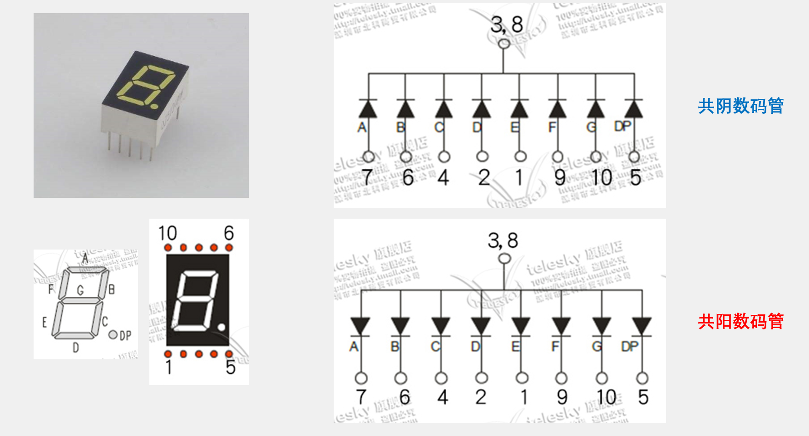

#### 四位数码管

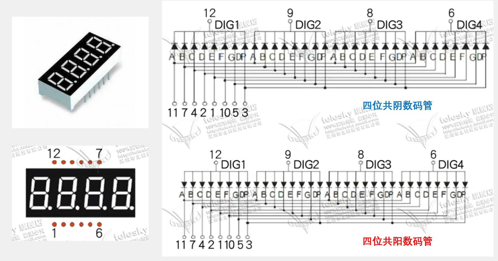


**共阴极数码管段码表：**

我使用的是**共阴极数码管**，所以只写了共阴极的。但是要注意看原理图，**每个人做的原理图定义使用的引脚不同**，要根据**实际情况定义**。

| 0    | 1    | 2    | 3    | 4    | 5    | 6    | 7    | 8    | 9    | A    | B    | C    | D    | E    | F    | 空   |
| ---- | ---- | ---- | ---- | ---- | ---- | ---- | ---- | ---- | ---- | ---- | ---- | ---- | ---- | ---- | ---- | ---- |
| 0x3F | 0x06 | 0x5B | 0x4F | 0x66 | 0x6D | 0x7D | 0x07 | 0x7F | 0x6F | 0x77 | 0x7C | 0x39 | 0x5E | 0x79 | 0x71 | 0x00 |


### 数码管电路


#### 74HC138译码器


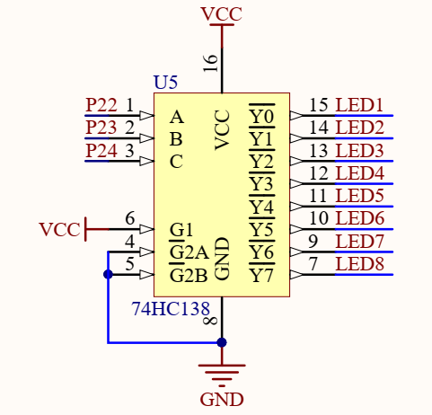

- **使能端**：G1给高电平，G2A和G2B给低电平。  

- **选择端**：从高位C开始，低位A结束，C=4 ，B=2 ， A=1，按数值给高电平表示Y0-Y7选中某一端输入。  
  
- **输出端**：Y0-Y7上面有一横，代表低电平输出，一次只能选择一位输出。  

如：  
CBA全给高电平，4+2+1=7，选择Y7输出低电平。  
C和B给高电平，A给低电平，就是4+2=6，选中Y6输出低电平。  


#### 74HC245缓冲、驱动、收发器

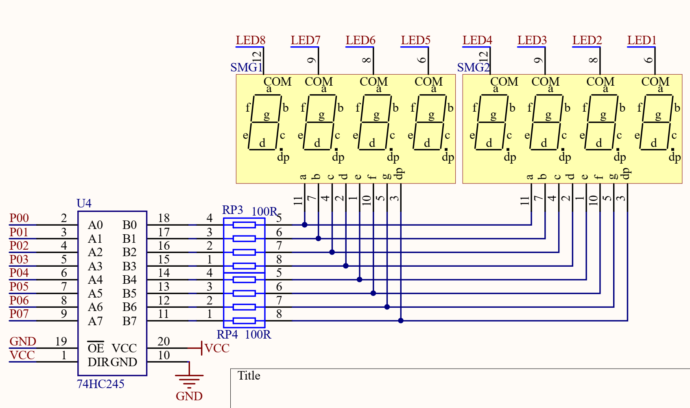

DIR：输入输出方向控制端，给**高电平**，A输入B输出。给**低电平**，B输入A输出。

OE：输出使能总控制端，低电平有效

B0~B7：8 位数据并行输出/输入端  

A0~A7：8 位数据并行输入/输出端  


##### 74HC245真值表

| INPUT  | INPUT   | OUTPUT/INPUT | OUTPUT/INPUT |
| ------ | ------- | ------------ | ------------ |
| **OE** | **DIR** | **An**       | **Bn**       |
| H      | X       | Z            | Z            |
| L      | L       | A=B          | Input        |
| L      | H       | input        | B=A          |


### 数码管代码

#### 数码管模块代码（阻塞式）

共阴管，Location选择位置1-8的数码管的其中一个，Number显示什么数  

```c
#include <REGX52.H>
#include "Delay.h"

//数码管段码表，显示0-9
unsigned char NixieTable[] = {0x3F,0x06,0x5B,0x4F,0x66,0x6D,0x7D,0x07,0x7F,0x6F};

//数码管显示子函数，共阴管，Location选择位置1-8的数码管的其中一个，Number显示什么数
void Nixie(unsigned char Location,Number)
{
	switch(Location)		  //位码输出
	{
		case 1: P2_4 = 1; P2_3 = 1; P2_2 = 1;break;
		case 2: P2_4 = 1; P2_3 = 1; P2_2 = 0;break;
		case 3: P2_4 = 1; P2_3 = 0; P2_2 = 1;break;
		case 4: P2_4 = 1; P2_3 = 0; P2_2 = 0;break;
		case 5: P2_4 = 0; P2_3 = 1; P2_2 = 1;break;
		case 6: P2_4 = 0; P2_3 = 1; P2_2 = 0;break;
		case 7: P2_4 = 0; P2_3 = 0; P2_2 = 1;break;
		case 8: P2_4 = 0; P2_3 = 0; P2_2 = 0;break;
	}
	P0 = NixieTable[Number];  //段码输出
	Delay(1);				  //显示一段时间
	P0 = 0x00;				  //段码清0，消影
}
```


#### 数码管模块代码（非阻塞）

```c
#include <REGX52.H>
#include "Delay.h"

//数码管显示缓存区
unsigned char Nixie_Buf[9]={0,10,10,10,10,10,10,10,10};

//数码管段码表，显示0-9、不亮、一横
unsigned char NixieTable[] = {0x3F,0x06,0x5B,0x4F,0x66,0x6D,0x7D,0x07,0x7F,0x6F,0x00,0x40};

/**
  * @brief  设置显示缓存区
  * @param  Location 要设置的位置，范围：1~8
  * @param  Number 要设置的数字，范围：段码表索引范围
  * @retval 无
  */
void Nixie_SetBuf(unsigned char Location,Number)
{
	Nixie_Buf[Location]=Number;				//设置数码管
}

/**
  * @brief  数码管扫描显示
  * @param  Location 要显示的位置，范围：1~8
  * @param  Number 要显示的数字，范围：段码表索引范围
  * @retval 无
  */
void Nixie_Scan(unsigned char Location,Number)
{
	P0=0x00;				  //段码清0，消影
	switch(Location)		  //位码输出
	{
		case 1: P2_4 = 1; P2_3 = 1; P2_2 = 1;break;
		case 2: P2_4 = 1; P2_3 = 1; P2_2 = 0;break;
		case 3: P2_4 = 1; P2_3 = 0; P2_2 = 1;break;
		case 4: P2_4 = 1; P2_3 = 0; P2_2 = 0;break;
		case 5: P2_4 = 0; P2_3 = 1; P2_2 = 1;break;
		case 6: P2_4 = 0; P2_3 = 1; P2_2 = 0;break;
		case 7: P2_4 = 0; P2_3 = 0; P2_2 = 1;break;
		case 8: P2_4 = 0; P2_3 = 0; P2_2 = 0;break;
	}
	P0 = NixieTable[Number];  //段码输出
}

/**
  * @brief  数码管驱动函数，在中断中调用
  * @param  无
  * @retval 无
  */
void Nixie_Loop(void)
{
	static unsigned char i=1;
	Nixie_Scan(i,Nixie_Buf[i]);     //循环调用函数扫描数码管1-8位，外部调用Nixie_SetBuf()函数修改数组值，数码管按从左到右循环显示修改的值
	i++;							//i，位++
	if(i>=9){i=1;}					//如果i大于或者等于9位，i等于第一位
}

void Timer0_Routine() interrupt 1
{
	static unsigned int T0Count2;
	TL0 = 0x66;		//设置定时初值
	TH0 = 0xFC;		//设置定时初值

	T0Count2++;
	if(T0Count2>=2)
	{
		T0Count2=0;
		Nixie_Loop(); //2ms调用一次数码管驱动函数
	}
}
```


## 矩形键盘

在键盘中按键数量较多时，为了减少I/O口的占用，通常将按键排列成矩阵形式

采用逐行或逐列的“扫描”，就可以读出任何位置按键的状态  


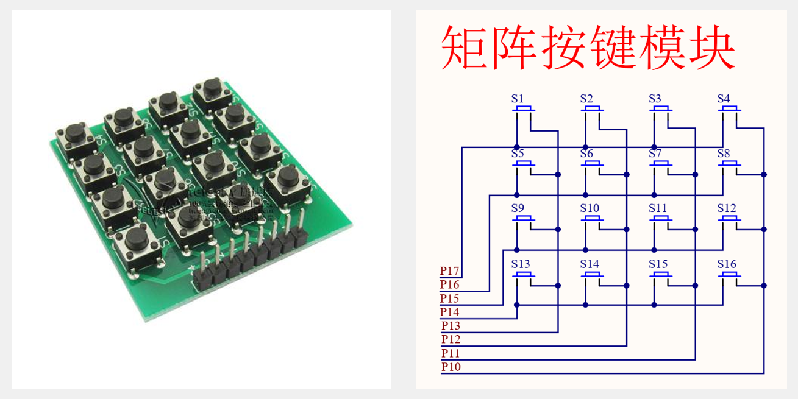


### 扫描的概念

- 数码管扫描（输出扫描）  
    原理：显示第1位→显示第2位→显示第3位→……，然后快速循环这个过程，最终实现所有数码管同时显示的效果

- 矩阵键盘扫描（输入扫描）  
    原理：读取第1行(列)→读取第2行(列) →读取第3行(列) → ……，然后快速循环这个过程，最终实现所有按键同时检测的效果

以上两种扫描方式的共性：节省I/O口。

程序使用的扫描方式每次只能返回一个按键值，如果同时按下多个按键，后松手并且按照程序执行原则从左到右，从上到下，最接近调用的函数结束的按键就是被返回的值。


### 矩形键盘模块代码

```c
#include <REGX52.H>
#include "Delay.h"

/**
  * @brief  矩阵键盘读取按键键码
  * @param  无
  * @retval KeyNumber 按下按键的键码值
			如果按键按下不放，程序会停留在此函数，松手的一瞬间，返回按键键码，没有按键按下时，返回0
			程序使用的扫描方式每次只能返回一个按键值，如果同时按下多个按键，后松手并且按照程序执行原则从左到右，从上到下，
			最接近调用的函数结束的按键就是被返回的值。
  */
unsigned char MatrixKey()
{
	unsigned char KeyNumber = 0;
		
	P1   = 0xFF;
	P1_3 = 0;
	if(P1_7 == 0){Delay(20);while(P1_7 == 0);Delay(20);KeyNumber=1;}
	if(P1_6 == 0){Delay(20);while(P1_6 == 0);Delay(20);KeyNumber=5;}
	if(P1_5 == 0){Delay(20);while(P1_5 == 0);Delay(20);KeyNumber=9;}
	if(P1_4 == 0){Delay(20);while(P1_4 == 0);Delay(20);KeyNumber=13;}
	
	P1   = 0xFF;
	P1_2 = 0;
	if(P1_7 == 0){Delay(20);while(P1_7 == 0);Delay(20);KeyNumber=2;}
	if(P1_6 == 0){Delay(20);while(P1_6 == 0);Delay(20);KeyNumber=6;}
	if(P1_5 == 0){Delay(20);while(P1_5 == 0);Delay(20);KeyNumber=10;}
	if(P1_4 == 0){Delay(20);while(P1_4 == 0);Delay(20);KeyNumber=14;}
	
	P1   = 0xFF;
	P1_1 = 0;
	if(P1_7 == 0){Delay(20);while(P1_7 == 0);Delay(20);KeyNumber=3;}
	if(P1_6 == 0){Delay(20);while(P1_6 == 0);Delay(20);KeyNumber=7;}
	if(P1_5 == 0){Delay(20);while(P1_5 == 0);Delay(20);KeyNumber=11;}
	if(P1_4 == 0){Delay(20);while(P1_4 == 0);Delay(20);KeyNumber=15;}
	
	P1   = 0xFF;
	P1_0 = 0;
	if(P1_7 == 0){Delay(20);while(P1_7 == 0);Delay(20);KeyNumber=4;}
	if(P1_6 == 0){Delay(20);while(P1_6 == 0);Delay(20);KeyNumber=8;}
	if(P1_5 == 0){Delay(20);while(P1_5 == 0);Delay(20);KeyNumber=12;}
	if(P1_4 == 0){Delay(20);while(P1_4 == 0);Delay(20);KeyNumber=16;}
	
	return KeyNumber;
}
```


## 定时器

### 定时器介绍

51单片机的定时器属于单片机的内部资源，其电路的连接和运转均在单片机内部完成，51单片机的定时器固定溢出值（终点），而且只能向上计数一种模式，而STM32的定时器有多种计数模式。


### 定时器作用

- 用于计时系统，可实现软件计时，或者使程序每隔一固定时间完成一项操作。
- 替代长时间的Delay，提高CPU的运行效率和处理速度。
- 定时器在单片机内部就像一个小闹钟一样，根据时钟的输出信号，每隔“一秒”，计数单元的数值就增加1，当计数单元数值增加到“设定的闹钟提醒时间”时，如果**不定义初始值**的话，像**16位定时器**模式计数值就是0~65535，**8位**的话就是0-255，计数单元就会向中断系统发出中断申请，产生“响铃提醒”，使程序跳转到中断服务函数中执行。
- 时钟 --> 计数单元 -->中断系统  
    - 时钟：提供计数单元的时钟脉冲。  
    - 计数单元：时钟计数。  
    - 中断系统：产生中断，执行定时任务。  


### STC89C52RC定时器资源   

定时器个数：3个（T0、T1、T2），T0和T1与传统的51单片机兼容，T2是此型号单片机增加的资源   

> 注意：  
    定时器的资源和单片机的型号是关联在一起的，不同的型号可能会有不同的定时器个数和操作方式，但一般来说，T0和T1的操作方式是所有51单片机所共有的。    
​	定时器的计时中断不归主函数管，但可以和主函数或者其他函数配置成不会耦合在一起运行的扫描程序。定时器只要开启并设置了可以中断，就一直在产生中断。  
​   

### 定时器工作模式

#### STC89C52的T0和T1均有四种工作模式

 - 模式0：13位定时器/计数器  （砍掉了高14~16位，计数到8192溢出）

 - 模式1：16位定时器/计数器（常用，计数到65535溢出）  

 - 模式2：8位自动重装模式  （TL0溢出，TH0定义的目标计时值就写入TL0，相当于一直自动初始化计数值）

 - 模式3：两个8位计数器  （两个计数到255溢出，可分开配合不同程序）


#### 工作模式1框图  

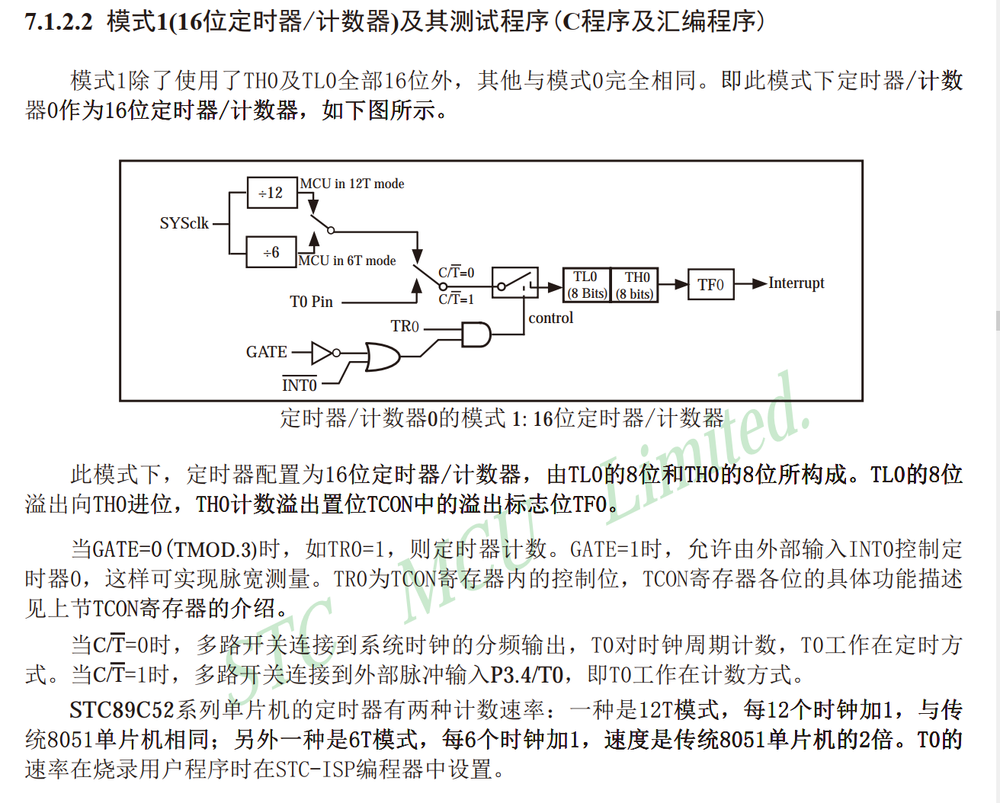

可位寻址赋值0或1控制，不可位寻址赋值十六进制。默认不可位寻址。

- SYSclk系统时钟：即晶振周期，本开发板上的晶振为11.0592MHz
- 12分频和6分频：
    - 12分频计数一次是1us。
    - 6分频计数一次是0.5us，比12分频快一半，因为**STC89C52RC这款芯片没有AUXR定时器时钟模式选择寄存器**，所以**无法设置为6分频**。

- C/T 计数器和定时器模式选择：1是往下拨，计数器，0是定时器。
- TR0 定时器/计数器使能端：1是使能，0是不使能。但因为是与门，还得看另一端的配置，另一端是0那这个是1也没有用。可位寻址。
- GATE：GATE默认是0取反输出1，经过或门输出默认是1，这个时候由TR0单独控制定时器。如果给1取反为0，经过或们就要就是0，需要INT0是高电平才能输出1，那么控制权就给到INT0和TR0两个一起控制。
- INT0：外部中断打开定时器端口：因为是或门输出，要根据GATE判断是否使用，GATE给1被取反为0的时候，INT0才能决定输出。就算输出1也还要看TR0的配置一起控制定时器。
- TL0和TH0：定时器/计数器的溢出值，TL0是低4位，TH0是高4位。

- TF0：中断标志位，可位寻址


#### 工作模式寄存器TMOD：

高四位是配置定时器1的，低四位是配置定时器0的。

- TMOD寄存器不可位寻址，要使用&=和|=才能进行8位单独控制一位的操作。

- C/T 计数器和定时器模式选择：1是计数器，0是定时器。
- M1和M0：定时器/计数器模式选择。
    - 模式0：M1=0，M0=0，13位定时器/计数器  （砍掉了高14~16位，计数到8192溢出）
    - 模式1：M1=0，M0=1，16位定时器/计数器（常用，计数到65535溢出）  
    - 模式2：M1=1，M0=0，8位自动重装模式  （TL0溢出，TH0定义的目标计时值就写入TL0，相当于一直自动初始化计数值）
    - 模式3：M1=1，M0=1，两个8位计数器  （两个计数到255溢出，可分开配合不同程序）

{width="500"} 


### 中断系统 

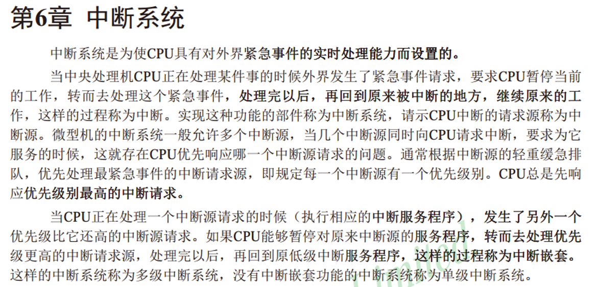


#### 中断程序流程

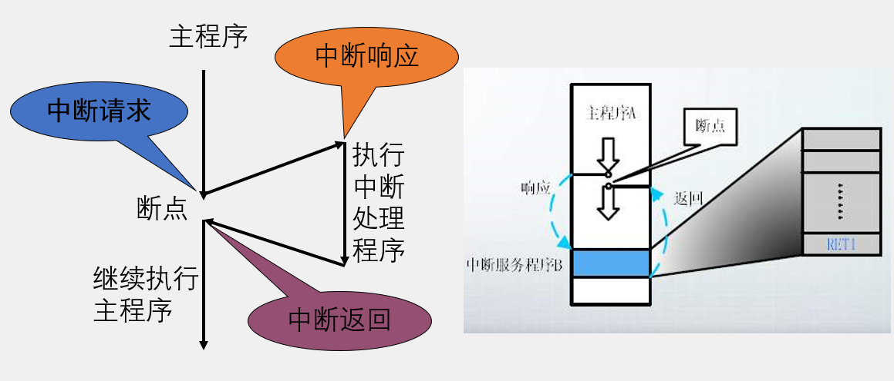


#### STC89C52RC中断资源

中断源个数：8个（外部中断0、定时器0中断、外部中断1、定时器1中断、串口中断、定时器2中断、外部中断2、外部中断3）

中断优先级个数：4个

中断号：

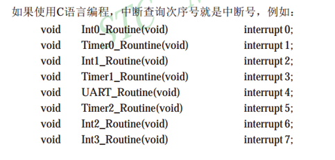

**中断的函数名**其实是可以改的，重要的是那个**小尾巴** `interrupt 0;` 到 `interrupt 7;` 这个需放在子函数名的右边，跟着哪个函数，哪个函数就是中断函数。

> 注意：中断的资源和单片机的型号是关联在一起的，不同的型号可能会有不同的中断资源，例如中断源个数不同、中断优先级个数不同等等。


#### 定时器和中断系统


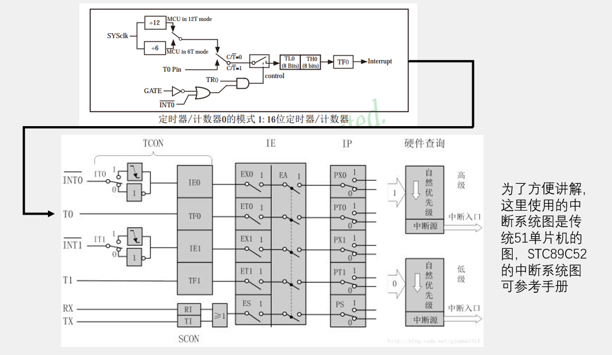


### 定时器和中断相关寄存器

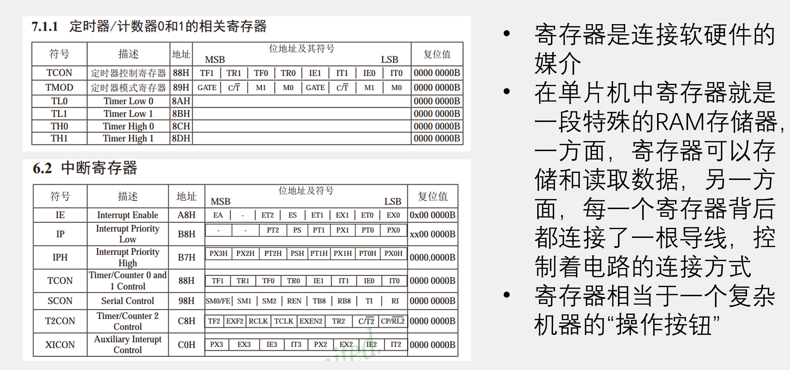

**TL0/TL1和TH0/TH1初始值（不可位寻址）计算：**

普中开发板（实验板版本）这个晶振是每秒11.0592Mhz。

定时器要定时1ms = 1000us，定时器计数一次的机械周期是1.085us。

1000us/1.085us = 922（计时次数），64613到65535的溢出的时间计次922次就可以了。

定时器初始值是十六进制，但是分开为两个8位的寄存器进行设置了，所以要取出高8位和低8位分别赋值。

TH0 = 64614/256（限定256以上，能除到的就是高8位的值）

TL0 = 64614%256（限定256以下，无法取余的数就是低8位的值）

十进制的64614，**高8位**和**低8位**加起来就等于十六进制的0xFC66

这个初始值第一次中断之后就没用了，需要在中断函数里重新赋值，才能再次从这个定义的时间内启动计数或者计时。否则定时器从0开始计时，而且因为是十六位的范围0~65535。


### 定时器模块代码


```c
#include <REGX52.H>

/**
  * @brief  定时器0初始化，1毫秒@11.0592MHz
  * @param  无
  * @retval 无
  */
void Timer0_Init(void)
{
    TMOD &= 0xF0;		//设置定时器模式
    TMOD |= 0x01;		//设置定时器模式
    TL0 = 0x66;		//设置定时初值
    TH0 = 0xFC;		//设置定时初值
    TF0 = 0;		//清除TF0标志
    TR0 = 1;		//定时器0开始计时
    ET0 = 1;		//单位控制端使能
    EA  = 1;		//总控开关使能
    PT0 = 0;		//中断优先级0，最低
}

/*定时器中断函数模板，定时1ms中断一次
void Timer0_Routine() interrupt 1
{
	static unsigned int T0Count;
	TL0 = 0x66;		//设置定时初值
	TH0 = 0xFC;		//设置定时初值
	T0Count++;
	if(T0Count>=1000)
	{
		T0Count=0;
	}
}
*/
```


## 串口

### 串口介绍

串口是一种应用十分广泛的通讯接口，串口成本低、容易使用、通信线路简单，可实现两个设备的互相通信。

单片机的串口可以使单片机与单片机、单片机与电脑、单片机与各式各样的模块互相通信，极大的扩展了单片机的应用范围，增强了单片机系统的硬件实力。

51单片机内部自带UART（Universal Asynchronous Receiver Transmitter，通用异步收发器），可实现单片机的串口通信。


#### 数据显示模式

HEX模式/十六进制模式/二进制模式：以原始数据的形式显示

文本模式/字符模式：以原始数据编码后的形式显示


#### 硬件电路

简单双向串口通信有两根通信线（发送端TXD和接收端RXD）

TXD与RXD要交叉连接

当只需单向的数据传输时，可以直接一根通信线

当电平标准不一致时，需要加电平转换芯片

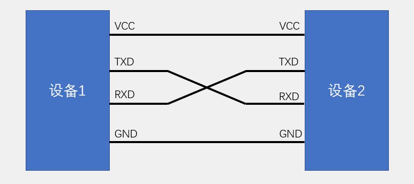


### 电平标准

电平标准是数据1和数据0的表达方式，是传输线缆中人为规定的电压与数据的对应关系，串口常用的电平标准有如下三种：

- TTL电平：+5V表示1，0V表示0

- RS232电平：-3~-15V表示1，+3~+15V表示0

- RS485电平：两线压差+2~+6V表示1，-2~-6V表示0（差分信号）


### 通信协议

#### 常见通信接口比较

| **名称** | **引脚定义**         | **通信方式** | **特点**       |
| -------- | -------------------- | ------------ | -------------- |
| UART     | TXD、RXD             | 全双工、异步 | 点对点通信     |
| I²C      | SCL、SDA             | 半双工、同步 | 可挂载多个设备 |
| SPI      | SCLK、MOSI、MISO、CS | 全双工、同步 | 可挂载多个设备 |
| 1-Wire   | DQ                   | 半双工、异步 | 可挂载多个设备 |

此外还有：CAN、USB等


#### 相关术语

- 数据传输  
​   全双工：通信双方可以在同一时刻互相传输数据  
​   半双工：通信双方可以互相传输数据，但必须分时复用一根数据线（不能同时收发）  
​	单工：通信只能有一方发送到另一方，不能反向传输（红外传输和接收）  

- 通讯方式  
​	异步：通信双方各自约定通信速率  
​	同步：通信双方靠一根时钟线来约定通信速率  

总线：连接各个设备的数据传输线路（类似于一条马路，把路边各住户连接起来，使住户可以相互交流）  


### 51单片机的UART

STC89C52有1个UART

STC89C52的UART有四种工作模式：

-  模式0：同步移位寄存器
-  模式1：8位UART，波特率可变（常用）
-  模式2：9位UART，波特率固定
-  模式3：9位UART，波特率可变


#### 串口参数及时序图

波特率：串口通信的速率（发送和接收各数据位的间隔时间）

检验位：用于数据验证

停止位：用于数据帧间隔

发送数据是**低位先行**。

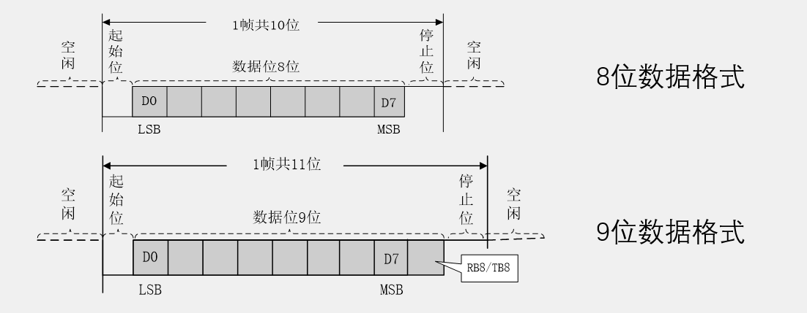


#### 串口和中断

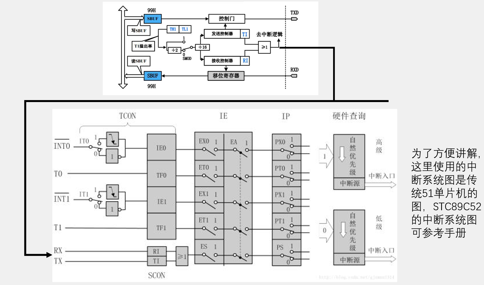

#### 波特率计算

- 12Mhz晶振：
    - 计算波特率4800

        - 在定时器1是8位重载和时钟12分频的模式下，定时器计数一次是1us
        
            因为是8位重装，所以定时器最高计数到256，也就是256us就会溢出。

        - 因为时钟频率快，想对标4800波特率误差太大，选择波特率倍数（SMOD）加倍也就是上图T1溢出率右边走1，不除2分频的线路。通过软件计算得出十六进制0xF3，也就是十进制的243是定时器1的初始值和重装值，溢出值是256，256-243=13次也就是13us就溢出了。

        - 溢出率：1/13us ≈ 0.07692Mhz（1 ÷ 0.000013 = 76,923.076923076923076923076923077）

        - 波特率：0.07692/16 ≈ 0.00480769Mhz （76,923.076923076923076923076923077 ÷ 16 = 4,807.6923076923076923076923076923 HZ）

        - 单位转为hz：0.00480769Mhz * 1Mhz = 4807.69Hz

        - 误差：7.69/4800=0.0016*100=0.16%

- 11.0592Mhz晶振：
    - 计算波特率4800

        - 在定时器1是8位重载和时钟12分频的模式下，定时器计数一次是1.085us

            因为是8位重装，所以定时器最高计数到256，也就是277.76us就会溢出。

        - 因为时钟频率和12Mhz相比较慢，想对标4800波特率误差较小，选择波特率倍数（SMOD）不加倍也就是上图T1溢出率右边走除2分频的线路。通过软件计算得出十六进制0xFA，也就是十进制的250是定时器1的初始值和重装值，溢出值是256，256-250=6次也就是6.51us就溢出了。

        - 溢出率：1/6.51us=0.1536Mhz

        - 波特率：0.1536/2/16=0.00480030Mhz

        - 单位转为hz：0.00480030Mhz*1Mhz=4,800.30Hz

        - 误差：0.3/4800=0.0000625*100=0.00625%


#### 串口相关寄存器


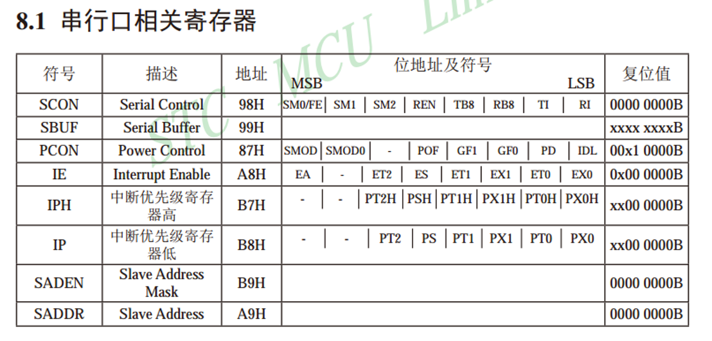

SBUF：串口数据缓存寄存器，物理上是两个独立的寄存器，但占用相同的地址。写操作时，写入的是发送寄存器，读操作时，读出的是接收寄存器，REN是接收使能。

PCON：SMOD是波特率加倍，如果是12Mhz的晶振，不加倍时间变慢误差就大了，11.0592Mhz的好一些。


#### 数据显示模式

HEX模式/十六进制模式/二进制模式：以原始数据的形式显示

文本模式/字符模式：以原始数据编码后的形式显示

ASCII码：

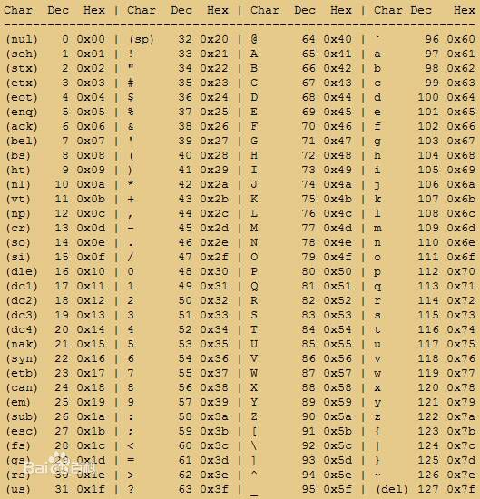


### 串口通讯模块代码  

SBUF里面都已经做好了低位先行的发送和接收，所以无论是发送还是接收都是正常的十六进制数，不用我们配置具体位数据的收发。

```c
#include <REGX52.H>

/**
  * @brief  串口初始化，4800bps@11.0592MHz
  * @param  无
  * @retval 无
  */
void UART_Init(void)
{
    PCON &= 0x7F;		//波特率不倍速
    SCON = 0x50;		//8位数据,可变波特率
    TMOD &= 0x0F;		//清除定时器1模式位
    TMOD |= 0x20;		//设定定时器1为8位自动重装方式
    TL1 = 0xFA;		//设定定时初值
    TH1 = 0xFA;		//设定定时器重装值
    ET1 = 0;		//禁止定时器1中断
    TR1 = 1;		//启动定时器1
    ES = 1;			//ES:串行口中断允许位，ES=1，允许串行口中断，ES=0，禁止串行口中断
    EA = 1;			//EA:CPU中断总控制位
}

/**
  * @brief  串口发送一个字节数据
  * @param  Byte 要发送的一个字节数据
  * @retval 无
   */
void UART_SendByte(unsigned char Byte)
{
    SBUF=Byte;
    while(TI==0); //防止数据没有发送完，发送完了发送控制器会把TI标志置1
    TI=0;		  //跳出循环后，代表发送完成，马上置0。
}

/*串口中断函数模板,把接收的值赋值给P2控制LED查看，把收到的值在发送回去，RI接收标志清零
void UART_Routine(void) interrupt 4
{
	if(RI == 1)
	{
		P2 = SBUF;
		UART_SendByte(SBUF);
		RI = 0;
	}
}
*/
```


## LED点阵屏

### LED点阵屏介绍

- LED点阵屏由若干个独立的LED组成，LED以矩阵的形式排列，以灯珠亮灭来显示文字、图片、视频等。LED点阵屏广泛应用于各种公共场合，如汽车报站器、广告屏以及公告牌等

- LED点阵屏分类  
​	 按颜色：单色、双色、全彩  
​	 按像素：8\*8、16\*16等（大规模的LED点阵通常由很多个小点阵拼接而成）  


#### 显示原理

LED点阵屏的结构类似于数码管，只不过是数码管把每一列的像素以“8”字型排列而已

LED点阵屏与数码管一样，有共阴和共阳两种接法，不同的接法对应的电路结构不同

LED点阵屏需要进行逐行或逐列扫描，才能使所有LED同时显示

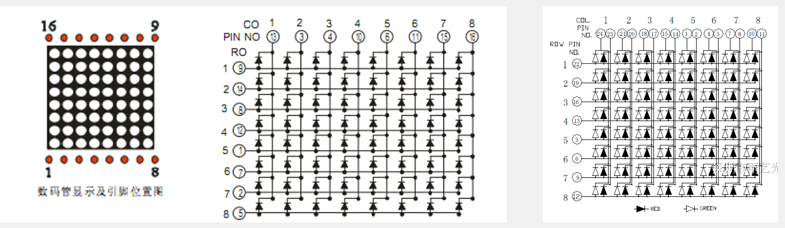


#### LED点阵屏原理图

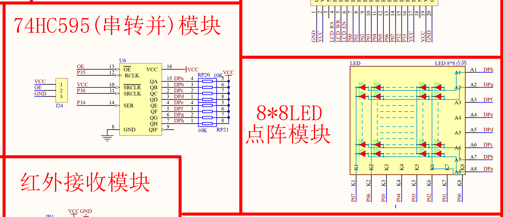

- 端口介绍：
    - OE：使能端，低电平有效。开发板的`J24`是三脚的**插针**，使用**跳线帽进行高低电平的切换**。
    - RCLK：上升沿锁存端：给一个上升沿，把当前临时数据储存寄存器的值，按位一起推送到并行输出寄存器。
    - SRCLR：串行数据清零端，低电平有效。一般默认给高电平，就是不清零。
    - SRCLK：上升沿移位端，给一个上升沿，将SER当前电平状态移到临时数据储存寄存器的下一位。
    - SER：串行信号输入端：设置当前位的电平并被读取，从最高的第8位开始，配合SRCLK位进行移位，一直到设置完第1位。如果没有其他数据需要进行传输该位闲置。

​	

### 74HC595串行输入并行输出芯片

74HC595是串行输入并行输出的移位寄存器，**输入数据高位先行(个人认为低位先行也可以，关键看原理图怎么接线)**，可用3根线输入串行数据，8根线输出并行数据，多片级联后，可输出16位、24位、32位等，常用于IO口扩展。  

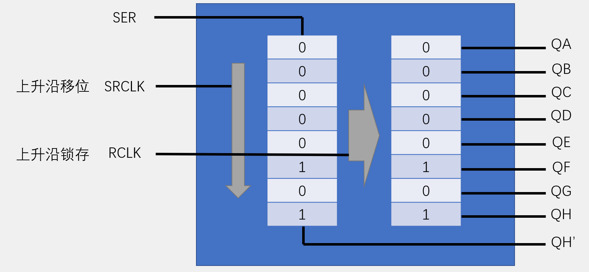


#### 开发板引脚对应关系

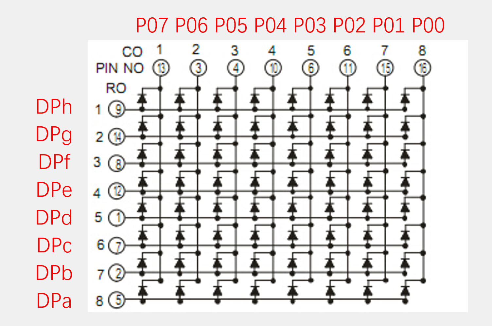

P0~7是位选（列），DPa~DPh是段选（行）


#### LED点阵模块代码  

```c
#include <REGX52.H>
#include "Delay.h"

sbit RCK = P3^5;	//RCLK	
sbit SCK = P3^6;	//SRCLK
sbit SER = P3^4;	//SER

#define MATRIX_LED_PORT		P0

/**
   * @brief  点阵屏初始化
   * @param  无
   * @retval 无
   */
void MatrixLED_Init(void)
{
	SCK = 0;
	RCK = 0;
}
	

/**
  * @brief  74HC595写入一个字节
  * @param  Byte 要写入的字节
  * @retval 无
  */
void _74HC595_WriteByte(unsigned char Byte)
{
	unsigned char i;
	for(i=0; i<8; i++)
	{
		SER = Byte&(0x80>>i);
		SCK = 1;
		SCK = 0;
	}
	RCK = 1;
	RCK = 0;
}

/**
  * @brief  LED点阵屏显示一列数据
  * @param  Column 要选择的列，范围：0~7，0在最左边
  * @param  Data 选择列显示的数据，高位在上，1为亮，0为灭
  * @retval 无
  */
void MatrixLED_ShowColumn(unsigned char Column,Data)
{
	_74HC595_WriteByte(Data);
	MATRIX_LED_PORT = ~(0x80>>Column);
	Delay(1);
	MATRIX_LED_PORT = 0xFF;
}
```


## DS1302实时时钟


### DS1302介绍

DS1302是由美国DALLAS公司推出的具有涓细电流充电能力的低功耗实时时钟芯片。它可以对年、月、日、周、时、分、秒进行计时，且具有闰年补偿等多种功能

RTC(Real Time Clock)：实时时钟，是一种集成电路，通常称为时钟芯片

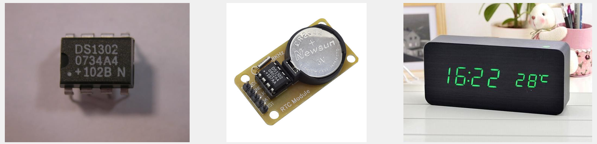


#### 引脚定义和应用电路

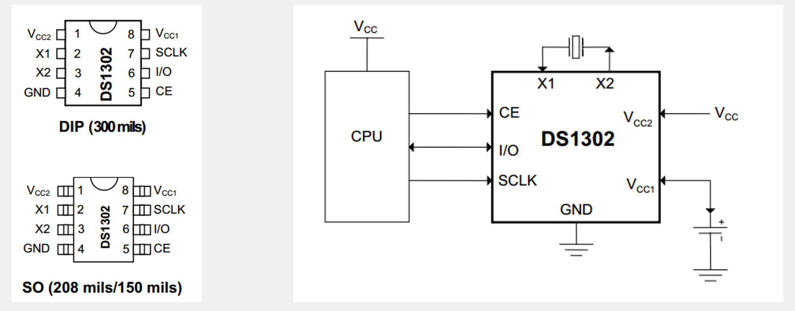

| **引脚名** | **作用**      | **引脚名** | **作用**      |
| ---------- | ------------- | ---------- | ------------- |
| VCC2       | 主电源        | CE         | 芯片使能      |
| VCC1       | 备用电池      | IO         | 数据输入/输出 |
| GND        | 电源地        | SCLK       | 串行时钟      |
| X1、X2     | 32.768KHz晶振 |            |               |


#### DS1302内部结构图

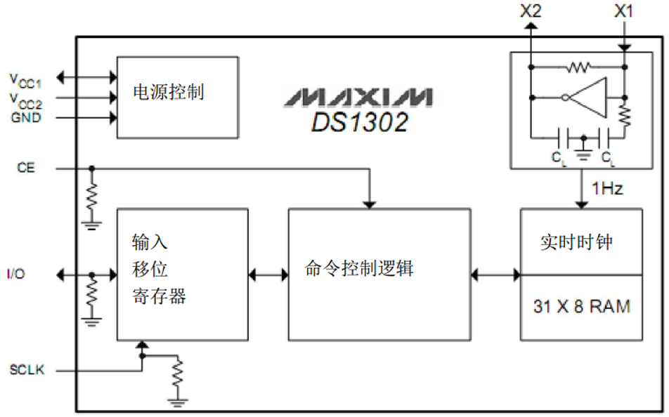


### 寄存器定义

要转换成BCD码，高四位相当于16进制数，除10取出大于10的高四位的值，乘上16就得到对应的BCD码了。低四位比较简单，直接取余10，就得到了比10低的值。

Seconds秒，Minutes分，Hour小时，Date天，Month月，Day星期，Year年。

READ读取命令，往下看去从0x81~0x8F

WRITE写入命令，往下看去从0x80~0x8E

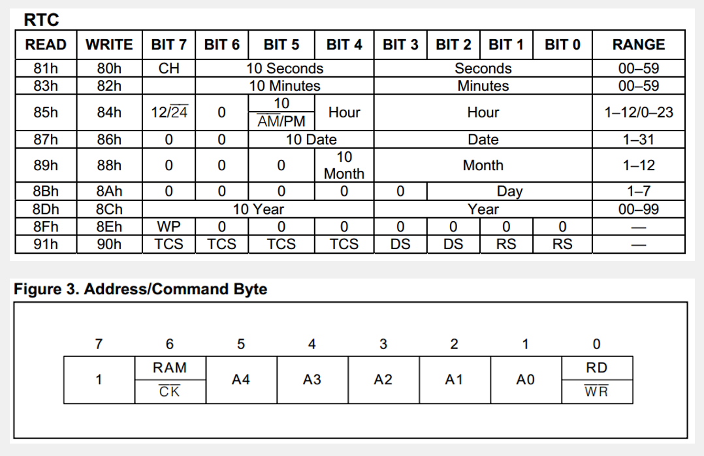

CH：如果设置为1时钟停止，一般设置为0，时钟计时

WP：写保护，开启后无法写入命令控制时钟数值。配合指令地址0x8E，开启是最高位 **置1**也就是写入0x80，关闭是最高位 **置0**也就是写入0x00。


### 时序定义

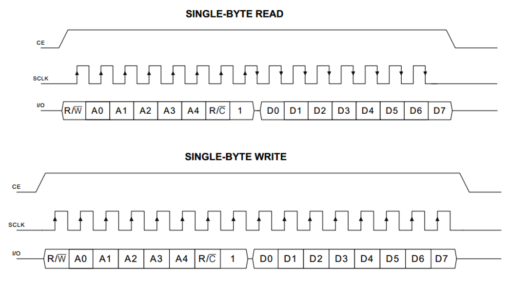

数据是**低位先行**，上升沿和下降沿触发，而且低位先行的话好像首先就是读取还是写入的选择位，但也还是要输入一个8位的命令后才执行。

只有READ（读取）的下降沿也就是右边D0~D7那部分**时序的数据**是DS1302操控IO提供的，其他全是由单片机进行控制，而且读取时序是15个周期，写入时序是16个，比写入少1个周期。**单片机写入**的命令和数据都是**上升沿触发**，只有**DS1302时钟芯片向单片机传输**数据的是**下降沿触发**。

**SCLK时序一直是由主机控制**。


**BCD码：**

BCD码（Binary Coded Decimal‎），用4位二进制数来表示1位十进制数

例：0001 0011表示13，1000 0101表示85，0001 1010不合法


在十六进制中的体现：0x13表示13，0x85表示85，0x1A不合法

BCD码转十进制：DEC=BCD/16*10+BCD%16; （2位BCD）

十进制转BCD码：BCD=DEC/10*16+DEC%10; （2位BCD）

取出十进制的十位乘16，取余16得出比16小的无法取余的个位，然后相加

栗子如下：

```
十进制59转BCD

59/10*16 + 59%10 = 80 + 9 = 89
					   89 = 0x59(BCD码，相当于16进制)
   						  = 0101 1001
```

**瞎搞**：上面的公式只能取两位的十进制，碰到三位或者以上的呢？当然这个芯片没有三位的BCD值，这个只是玩玩，如想十进制188转BCD码，也就显示188。

公式就变成这样了  BCD=DEC/100\*256 + DEC/10%10\*16 + DEC%10;    为什么要乘256呢？因为十六进制数是8位二进制进行显示的，最高位是128，而那个要转换的1呢，是更高位十六进制的最低位，更高位是前1低位数的乘2，即二的八次方：2^8 = 256。0x188 = 0000 0001 1000 1000 = 392，其他更高的数值以此类推。

BCD= 188/100\*256 + 188/10%10\*16 + 188%10 = 256 + 128 + 8 = 392

DEC= 392/256*100 + 392/16%16\*10 + 392%16 = 100 + 80 + 8 = 188


### DS1302实时时钟模块代码  

DS1302使用的是芯片厂家自己设计的时序，不是通用的。

```c
#include <REGX52.H>

//引脚定义
sbit DS1302_SCLK=P3^6;
sbit DS1302_IO=P3^4;
sbit DS1302_CE=P3^5;

//寄存器写入地址/指令定义
#define DS1302_SECOND		0x80
#define DS1302_MINUTE		0x82
#define DS1302_HOUR			0x84
#define DS1302_DATE			0x86
#define DS1302_MONTH		0x88
#define DS1302_DAY			0x8A
#define DS1302_YEAR			0x8C
#define DS1302_WP			0x8E

//时间数组，索引0~6分别为年、月、日、时、分、秒、星期,十进制，转BCD码
unsigned char DS1302_Time[]={19,11,16,12,59,55,6};

/**
  * @brief  DS1302初始化
  * @param  无
  * @retval 无
  */
void DS1302_Init(void)
{
	DS1302_CE=0;
	DS1302_SCLK=0;
}

/**
  * @brief  DS1302写一个字节
  * @param  Command 命令字/地址
  * @param  Data 要写入的数据
  * @retval 无
  */
void DS1302_WriteByte(unsigned char Command,Data)
{
	unsigned char i;
	DS1302_CE=1;
	for(i=0; i<8; i++)
	{
		DS1302_IO = Command&(0x01<<i);
		DS1302_SCLK=1;
		DS1302_SCLK=0;
	}
	for(i=0; i<8; i++)
	{
		DS1302_IO = Data&(0x01<<i);
		DS1302_SCLK=1;
		DS1302_SCLK=0;
	}
	DS1302_CE=0;
}

/**
  * @brief  DS1302读一个字节
  * @param  Command 命令字/地址
  * @retval 读出的数据
  */
unsigned char DS1302_ReadByte(unsigned char Command)
{
	unsigned char i,Data=0x00;
	Command |= 0x01;
	DS1302_CE=1;
	for(i=0; i<8; i++)
	{
		DS1302_IO = Command&(0x01<<i);
		DS1302_SCLK=0;
		DS1302_SCLK=1;
	}
	for(i=0; i<8; i++)
	{
		DS1302_SCLK=1;
		DS1302_SCLK=0;
		if(DS1302_IO){Data |= (0x01<<i);}
	}
	DS1302_CE=0;
	DS1302_IO=0;	//读取后将IO设置为0，否则读出的数据会出错
	return Data;
}

/**
  * @brief  DS1302设置时间，调用之后，DS1302_Time数组的数字会被设置到DS1302中
  * @param  无
  * @retval 无
  */
void DS1302_SetTime(void)
{
	DS1302_WriteByte(DS1302_WP,0x00);
	DS1302_WriteByte(DS1302_YEAR,DS1302_Time[0]/10*16+DS1302_Time[0]%10);
	DS1302_WriteByte(DS1302_MONTH,DS1302_Time[1]/10*16+DS1302_Time[1]%10);
	DS1302_WriteByte(DS1302_DATE,DS1302_Time[2]/10*16+DS1302_Time[2]%10);
	DS1302_WriteByte(DS1302_HOUR,DS1302_Time[3]/10*16+DS1302_Time[3]%10);
	DS1302_WriteByte(DS1302_MINUTE,DS1302_Time[4]/10*16+DS1302_Time[4]%10);
	DS1302_WriteByte(DS1302_SECOND,DS1302_Time[5]/10*16+DS1302_Time[5]%10);
	DS1302_WriteByte(DS1302_DAY,DS1302_Time[6]/10*16+DS1302_Time[6]%10);
	DS1302_WriteByte(DS1302_WP,0x80);
}

/**
  * @brief  DS1302读取时间，调用之后，DS1302中的数据会被读取到DS1302_Time数组中
  * @param  无
  * @retval 无
  */
void DS1302_ReadTime(void)
{
	unsigned char Temp;
	Temp = DS1302_ReadByte(DS1302_YEAR);
	DS1302_Time[0] =  Temp/16*10+Temp%16;
	Temp = DS1302_ReadByte(DS1302_MONTH);
	DS1302_Time[1] =  Temp/16*10+Temp%16;	
	Temp = DS1302_ReadByte(DS1302_DATE);
	DS1302_Time[2] =  Temp/16*10+Temp%16;	
	Temp = DS1302_ReadByte(DS1302_HOUR);
	DS1302_Time[3] =  Temp/16*10+Temp%16;	
	Temp = DS1302_ReadByte(DS1302_MINUTE);
	DS1302_Time[4] =  Temp/16*10+Temp%16;	
	Temp = DS1302_ReadByte(DS1302_SECOND);
	DS1302_Time[5] =  Temp/16*10+Temp%16;	
	Temp = DS1302_ReadByte(DS1302_DAY);
	DS1302_Time[6] =  Temp/16*10+Temp%16;		
}
```


## 蜂鸣器

### 蜂鸣器介绍

蜂鸣器是一种将电信号转换为声音信号的器件，常用来产生设备的按键音、报警音等提示信号

蜂鸣器按驱动方式可分为有源蜂鸣器和无源蜂鸣器

- 有源蜂鸣器：内部自带振荡源，将正负极接上直流电压即可持续发声，频率固定

- 无源蜂鸣器：内部不带振荡源，需要控制器提供振荡脉冲才可发声，调整提供振荡脉冲的频率，可发出不同频率的声音

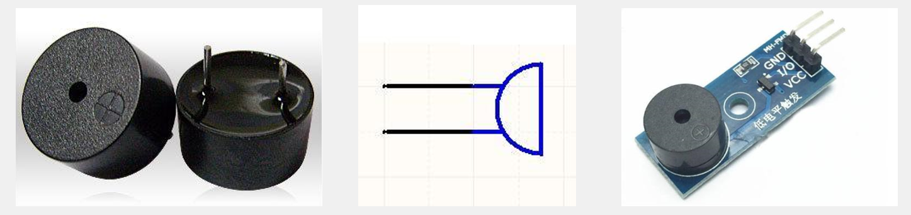


#### 驱动电路

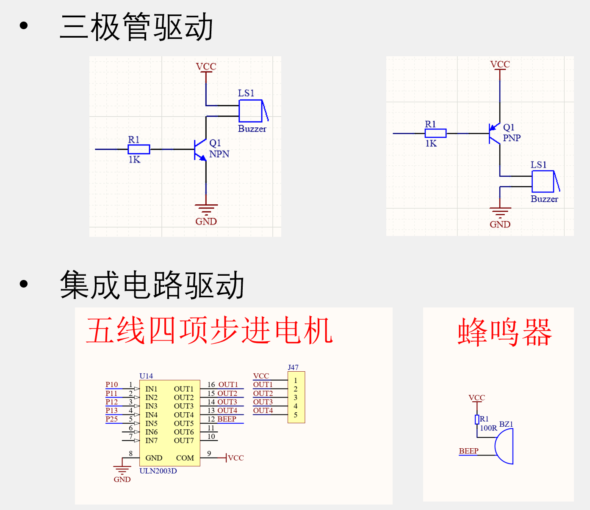

**无源蜂鸣器不能一直导通**，蜂鸣器里面就是线圈，电能转换为机械能**发热**太厉害了，**容易损坏**。

开发板电路，因为上电之后IO口默认是高电平，经过取反输出0给蜂鸣器，蜂鸣器导通，所以一上电蜂鸣器就会响，如果没有修改电平，是一直导通着的，电路设计不太合理，如果不是有限流电阻，蜂鸣器早烧了。


### ULN2003

逻辑门是非门，输出是取反的。如1B输入1，1C输出0。2B输入0，2C输出1。

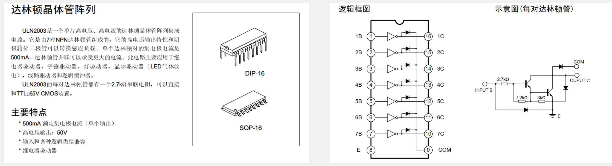


### 键盘与音符对照

音名：#升音，b降音，黑键代表的是相临两个音的半音。如中央c和d，黑键即是**c的升半音**，也是**d的降半音**。较为特殊的是白键里的e和f，两个音中间没有半音。

简谱：以中央C（中音）为基准，右边数字1~7上面加点的代表升音，左边数字1~7下面加点的代表降音。

唱名：一组有`do，re，mi，fa，sol，la，si`共7个音（不加半音的情况下），就是1~7。如果加上黑键的半音就是12个音。

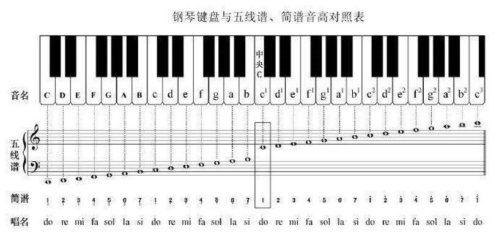


### C调的音符和频率

每一组低音12个音里的某一个音符，和下一组中音里的相同位的音符频率相差两倍，也就是乘2（中音和高音也是乘2）。中音是262*2=524（高音是523/*2 = 1046 ），因为这些下面的频率隐去了小数，所以看不出误差。

每个音符和下一位相差2的12分之1倍，也即2^(1/12)

262*1.0594630943592952645618252949463（2^0.08333333333333333333333333333333）= 277.57933072213535931519822727593


IO口翻转两次才是一次周期，如果3816us是一次周期，要翻转的话频率是他的2倍，最后要的是他的1/2，也就是3816除以2，等于1908us。

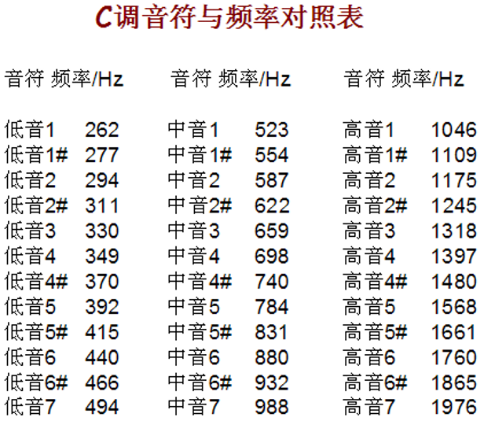


### 简谱

#### 小星星

左上角的是C大调，四分音符

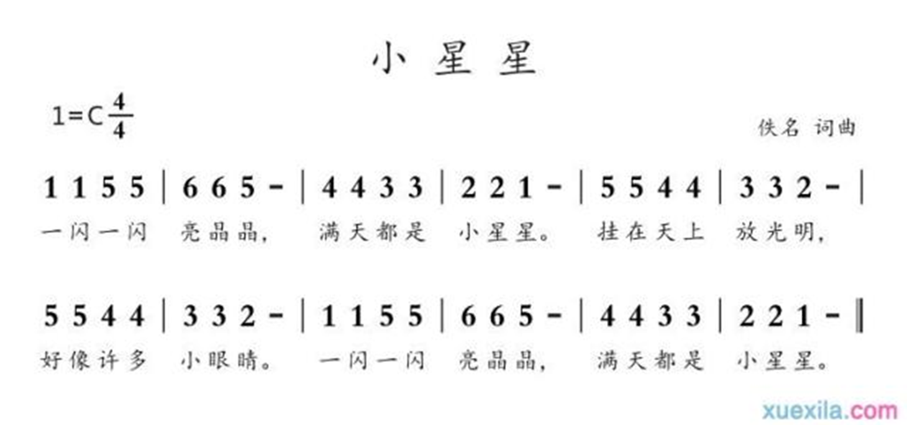

#### 天空之城

左上角的D代表是D调，中央C可能是其他的位置，可能要移音，四分音符

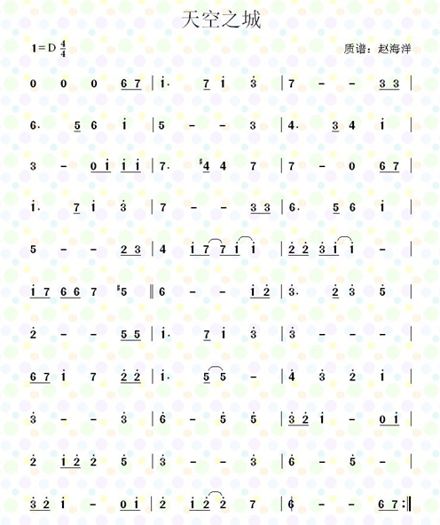


### 蜂鸣器天空之城代码模块

```c
#include <REGX52.H>
#include "Delay.h"
#include "Timer0.h"

//蜂鸣器端口定义
sbit Buzzer=P2^5;

//播放速度，值为四分音符的时长(ms)
#define SPEED	500

//音符与索引对应表，P：休止符，L：低音，M：中音，H：高音，下划线：升半音符号#
#define P	0
#define L1	1
#define L1_	2
#define L2	3
#define L2_	4
#define L3	5
#define L4	6
#define L4_	7
#define L5	8
#define L5_	9
#define L6	10
#define L6_	11
#define L7	12
#define M1	13
#define M1_	14
#define M2	15
#define M2_	16
#define M3	17
#define M4	18
#define M4_	19
#define M5	20
#define M5_	21
#define M6	22
#define M6_	23
#define M7	24
#define H1	25
#define H1_	26
#define H2	27
#define H2_	28
#define H3	29
#define H4	30
#define H4_	31
#define H5	32
#define H5_	33
#define H6	34
#define H6_	35
#define H7	36

//索引与频率对照表
unsigned int FreqTable[]={
	0,
	63777,63872,63969,64054,64140,64216,64291,64360,64426,64489,64547,64603,
	64655,64704,64751,64795,64837,64876,64913,64948,64981,65012,65042,65070,
	65095,65120,65144,65166,65186,65206,65225,65242,65259,65274,65289,65303,
};

//乐谱
unsigned char code Music[]={
	//音符,时值,
	
	//1
	P,	4,
	P,	4,
	P,	4,
	M6,	2,
	M7,	2,
	
	H1,	4+2,
	M7,	2,
	H1,	4,
	H3,	4,
	
	M7,	4+4+4,
	M3,	2,
	M3,	2,
	
	//2
	M6,	4+2,
	M5,	2,
	M6, 4,
	H1,	4,
	
	M5,	4+4+4,
	M3,	4,
	
	M4,	4+2,
	M3,	2,
	M4,	4,
	H1,	4,
	
	//3
	M3,	4+4,
	P,	2,
	H1,	2,
	H1,	2,
	H1,	2,
	
	M7,	4+2,
	M4_,2,
	M4_,4,
	M7,	4,
	
	M7,	8,
	P,	4,
	M6,	2,
	M7,	2,
	
	//4
	H1,	4+2,
	M7,	2,
	H1,	4,
	H3,	4,
	
	M7,	4+4+4,
	M3,	2,
	M3,	2,
	
	M6,	4+2,
	M5,	2,
	M6, 4,
	H1,	4,
	
	//5
	M5,	4+4+4,
	M2,	2,
	M3,	2,
	
	M4,	4,
	H1,	2,
	M7,	2+2,
	H1,	2+4,
	
	H2,	2,
	H2,	2,
	H3,	2,
	H1,	2+4+4,
	
	//6
	H1,	2,
	M7,	2,
	M6,	2,
	M6,	2,
	M7,	4,
	M5_,4,
	
	
	M6,	4+4+4,
	H1,	2,
	H2,	2,
	
	H3,	4+2,
	H2,	2,
	H3,	4,
	H5,	4,
	
	//7
	H2,	4+4+4,
	M5,	2,
	M5,	2,
	
	H1,	4+2,
	M7,	2,
	H1,	4,
	H3,	4,
	
	H3,	4+4+4+4,
	
	//8
	M6,	2,
	M7,	2,
	H1,	4,
	M7,	4,
	H2,	2,
	H2,	2,
	
	H1,	4+2,
	M5,	2+4+4,
	
	H4,	4,
	H3,	4,
	H3,	4,
	H1,	4,
	
	//9
	H3,	4+4+4,
	H3,	4,
	
	H6,	4+4,
	H5,	4,
	H5,	4,
	
	H3,	2,
	H2,	2,
	H1,	4+4,
	P,	2,
	H1,	2,
	
	//10
	H2,	4,
	H1,	2,
	H2,	2,
	H2,	4,
	H5,	4,
	
	H3,	4+4+4,
	H3,	4,
	
	H6,	4+4,
	H5,	4+4,
	
	//11
	H3,	2,
	H2,	2,
	H1,	4+4,
	P,	2,
	H1,	2,
	
	H2,	4,
	H1,	2,
	H2,	2+4,
	M7,	4,
	
	M6,	4+4+4,
	P,	4,
	
	0xFF	//终止标志
};

unsigned char FreqSelect,MusicSelect;

void main()
{
	Timer0_Init();
	while(1)
	{
		if(Music[MusicSelect]!=0xFF)	//如果不是停止标志位
		{
			FreqSelect=Music[MusicSelect];  //选择音符对应的频率
			MusicSelect++;
			Delay(SPEED/4*Music[MusicSelect]);	//选择音符对应的时值
			MusicSelect++;
			TR0=0;
			Delay(5);	//音符间短暂停顿
			TR0=1;
		}
		else   //如果是停止标志位
		{
			TR0=0;
			while(1);
		}
	}
}


void Timer0_Routine() interrupt 1
{	
	if(FreqTable[FreqSelect])	//如果不是休止符
	{
		/*取对应频率值的重装值到定时器*/
		TL0 = FreqTable[FreqSelect]%256;		//设置定时初值
		TH0 = FreqTable[FreqSelect]/256;		//设置定时初值
		Buzzer=!Buzzer;   //翻转蜂鸣器IO口,无法确定频率翻转最后的是高电平还是低电平，不响的原因难道是太快了，人耳听不见？
	}
}
```


## 存储器AT24C02(I2C)


### 存储器介绍

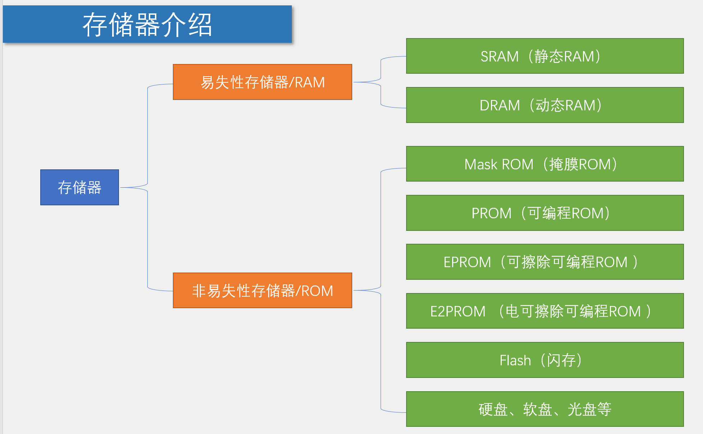


#### 存储器简化模板

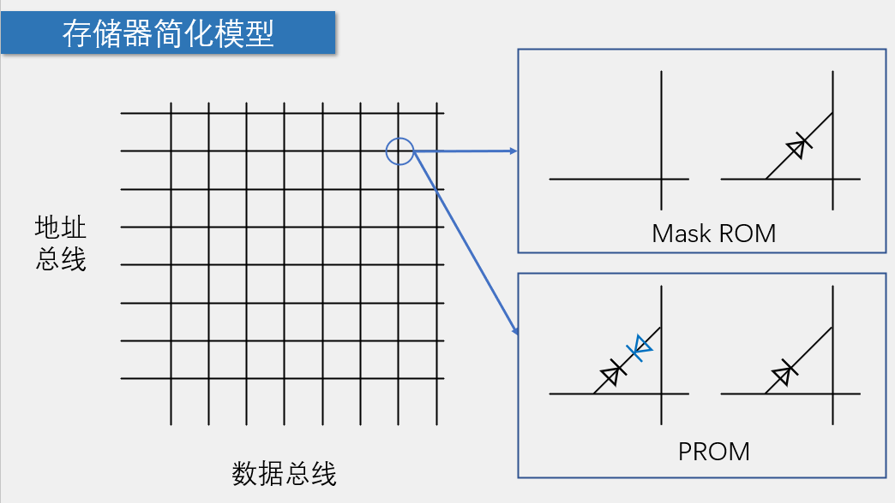


### AT24C02介绍

AT24C02是一种可以实现掉电不丢失的存储器，可用于保存单片机运行时想要永久保存的数据信息。

- 存储介质：E2PROM

- 通讯接口：I2C总线

- 容量：256字节（不知道第一组的从机地址和第二组数据地址位选择的是否占用了字节，待确定）

- 最高时钟频率 SCL：1000kHz = 1MHz（这个周期就是1us，因为51单片机的机械周期是1us，拉高1us，拉低1us，加起来1个周期就是2us = 500kHz，只有这个频率的一半，所以频率是足够的，甚至不用写延时函数，特殊情况例外）

写周期最少5ms，所以要有延时，不然写入数据还没写完，就进行读取是读不到的。

普中开发板使用的是第二种芯片和电路。

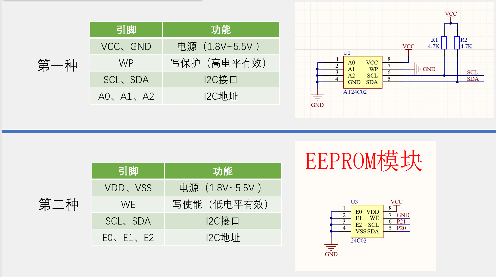


#### 内部结构框图

因为没有找到开发板芯片对应的规格书，所以使用第一种WP写使能的内部框图参考，功能是一样的。

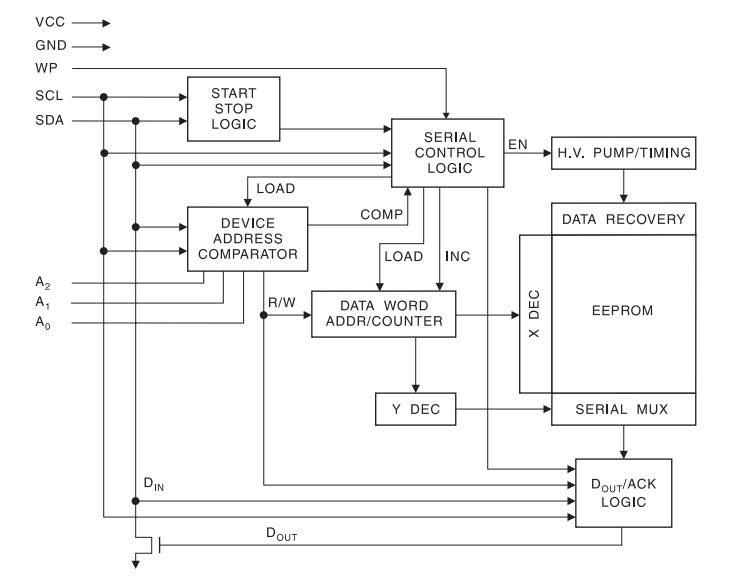


### I2C通讯


#### I2C总线介绍

I2C总线（Inter IC BUS）是由Philips公司开发的一种通用数据总线

两根通信线：SCL（Serial Clock）、SDA（Serial Data）

同步、半双工，带数据应答

通用的I2C总线，可以使各种设备的通信标准统一，对于厂家来说，使用成熟的方案可以缩短芯片设计周期、提高稳定性，对于应用者来说，使用通用的通信协议可以避免学习各种各样的自定义协议，降低了学习和应用的难度。

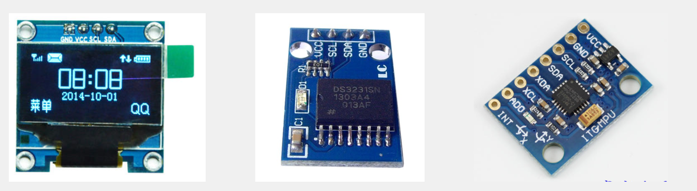


#### I2C电路规范

- SCL时钟线，只能由主机控制。
- SDA数据传输线，主机和从机都可以控制。

**所有I2C设备的SCL连在一起，SDA连在一起**

设备的SCL和SDA均要配置成**开漏输出模式**。

SCL和SDA各添加一个上拉电阻，阻值一般为4.7KΩ左右，也就是两条线都默认弱上拉高电平（弹簧在上面吊着，没人动它）。

开漏输出和上拉电阻的共同作用实现了“线与”的功能，此设计主要是为了解决多机通信互相干扰的问题。

因为可以连接多台从机，为了避免**多个从机同时传输导致数据冲突**，所以主机每次传输给从机的**第一个字节数据都是从机地址**，这个地址所有**从机都能收到，然后和自身定义的地址进行对比**，对得上的从机就会把**SDA线置低电压0**（弹簧被拉下）。

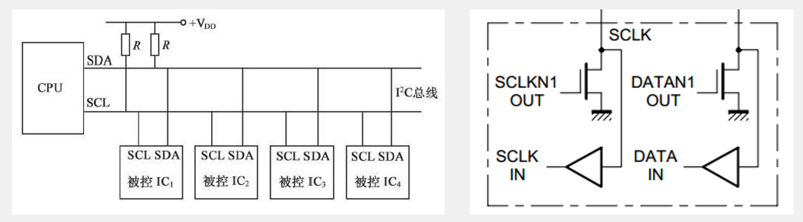


#### 时序

- **发送、接收数据都是高位在前。**


##### I2C启动和停止

起始条件：SCL高电平期间，SDA从高电平切换到低电平

终止条件：SCL高电平期间，SDA从低电平切换到高电平

当按照启动条件满足后变为低电平（弹簧被你或者从机拉下来了），就代表主机和从机建立了沟通通道，中间可以传输数据，终止条件满足后给高电平1之后再松手（弹簧自动弹回去了，这个时候就是空闲状态）。

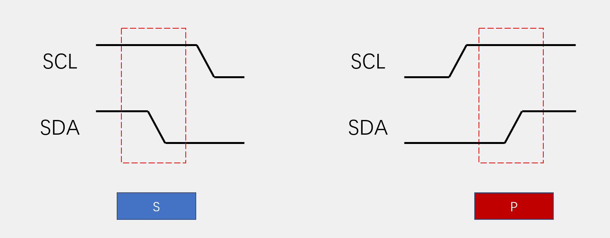

##### I2C发送一个字节

发送一个字节：SCL低电平期间，主机将数据位依次放到SDA线上（**高位在前**），然后拉高SCL，从机将在SCL高电平期间读取数据位，所以SCL高电平期间SDA不允许有数据变化，依次循环上述过程8次，即可发送一个字节

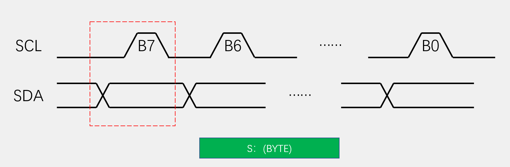

##### I2C接收一个字节

接收一个字节：SCL低电平期间，从机将数据位依次放到SDA线上（**高位在前**），然后拉高SCL，主机将在SCL高电平期间读取数据位，所以SCL高电平期间SDA不允许有数据变化，依次循环上述过程8次，即可接收一个字节（主机在接收之前，需要释放SDA，因为接收之前的发送地址是由主机在控制SDA线，如果不放手就是占着茅坑不拉屎，从机无法取得SDA线的控制权）

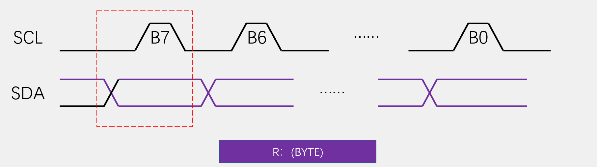

##### I2C发送和接收应答

发送应答：在接收完一个字节之后，主机在下一个时钟发送一位数据，数据0表示应答，数据1表示非应答

接收应答：在发送完一个字节之后，主机在下一个时钟接收一位数据，判断从机是否应答，数据0表示应答，数据1表示非应答（主机在接收之前，需要释放SDA，因为接收之前的发送地址是由主机在控制SDA线，如果不放手就是占着茅坑不拉屎，从机无法取得SDA线的控制权）

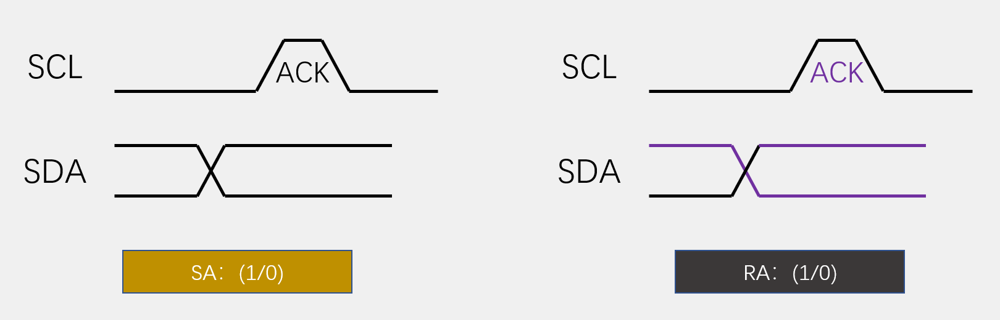


##### 发送一帧数据

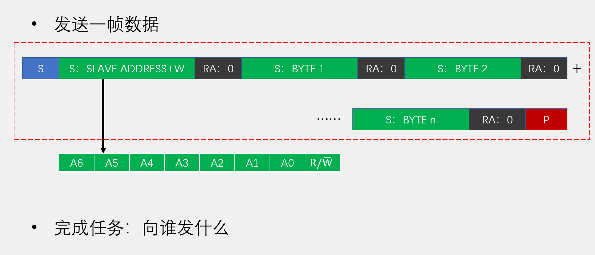

##### 接收一帧数据

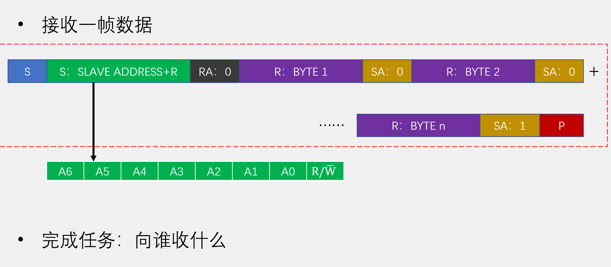

##### 先发送再接收数据帧（复合格式）

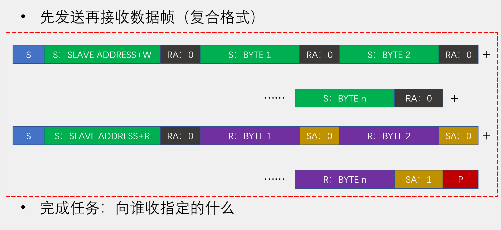


#### I2C模块代码

```c
#include <REGX52.H>

sbit I2C_SCL=P2^1;
sbit I2C_SDA=P2^0;

/**
  * @brief  I2C开始
  * @param  无
  * @retval 无
  */
void I2C_Start(void)
{
	I2C_SDA = 1;
	I2C_SCL = 1;
	I2C_SDA = 0;
	I2C_SCL = 0;
}

/**
  * @brief  I2C停止
  * @param  无
  * @retval 无
  */
void I2C_Stop(void)
{
	I2C_SDA = 0;
	I2C_SCL = 1;
	I2C_SDA = 1;
}

/**
  * @brief  I2C发送一个字节
  * @param  Byte 要发送的字节,高位先行
  * @retval 无
  */
void I2C_SendByte(unsigned char Byte)
{
	unsigned char i;
	for(i=0; i<8; i++)
	{
		I2C_SDA=Byte&(0x80>>i);
		I2C_SCL=1;
		I2C_SCL=0;
	}
}

/**
  * @brief  I2C接收一个字节
  * @param  无
  * @retval 接收到的一个字节数据
  */
unsigned char I2C_ReceiveByte(void)
{
	unsigned char i,Byte=0x00;
	I2C_SDA=1;
	for(i=0; i<8; i++)
	{
		I2C_SCL=1;
		if(I2C_SDA){Byte|=(0x80>>i);}
		I2C_SCL=0;
	}
	return Byte;
}

/**
  * @brief  I2C发送应答，用于接收数据后。这个是从机发送数据给主机之后，我主机给从机的应答
  * @param  AckBit 应答位，0为应答，1为非应答
  * @retval 无
  */
void I2C_SendAck(unsigned char AckBit)
{
	I2C_SDA=AckBit;
	I2C_SCL=1;
	I2C_SCL=0;
}

/**
  * @brief  I2C接收应答位,用于发送数据后。这个是主机发送数据之后，从机给我主机的应答
  * @param  无
  * @retval 接收到的应答位，0为应答，1为非应答
  */
unsigned char I2C_ReceiveAck(void)
{
	unsigned char AckBit;
	I2C_SDA=1;
	I2C_SCL=1;
	AckBit = I2C_SDA;
	I2C_SCL=0;
	
	return AckBit;
}

```


### AT24C02数据帧

AT24C02的固定地址为1010，可配置地址本开发板上为000

所以SLAVE ADDRESS+W是写入，十六进制为0xA0，SLAVE ADDRESS+R是读取，十六进制为0xA1

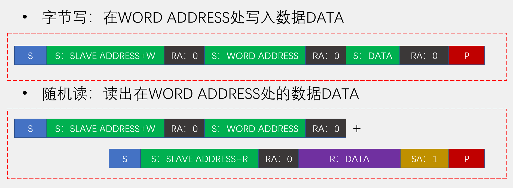


这里起始条件和停止条件都只标了一格，实际是需要两格。也就是两个数据信息。当他是简写好了。

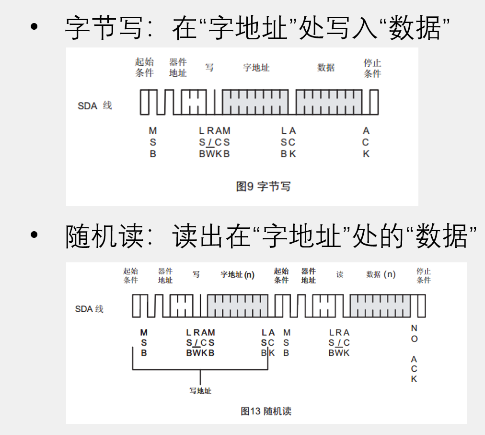


### AT24C02模块代码

```c


#include <REGX52.H>
#include "I2C.h"

#define AT24C02_ADDRESS		0xA0

/**
  * @brief  AT24C02写入一个字节
  * @param  WordAddress 要写入字节的地址
  * @param  Data 要写入的数据
  * @retval 无
  */
void AT24C02_WriteByte(unsigned char WordAddress,Data)
{
	I2C_Start();
	I2C_SendByte(AT24C02_ADDRESS);
	I2C_ReceiveAck();
	I2C_SendByte(WordAddress);
	I2C_ReceiveAck();
	I2C_SendByte(Data);
	I2C_ReceiveAck();
	I2C_Stop();
}

/**
  * @brief  AT24C02读取一个字节
  * @param  WordAddress 要读出字节的地址
  * @retval 读出的数据
  */
unsigned char AT24C02_ReadByte(unsigned char WordAddress)
{
	unsigned char Data;
	I2C_Start();
	I2C_SendByte(AT24C02_ADDRESS);
	I2C_ReceiveAck();
	I2C_SendByte(WordAddress);
	I2C_ReceiveAck();
	
	I2C_Start();
	I2C_SendByte(AT24C02_ADDRESS|0x01);  //选中设备，最低位置1，切换为读取状态
	I2C_ReceiveAck();
	Data = I2C_ReceiveByte();
	I2C_SendAck(1);
	I2C_Stop();
	
	return Data;
}
```


## DS18B20(单总线)

### DS18B20介绍

DS18B20是一种常见的数字温度传感器，其控制命令和数据都是以数字信号的方式输入输出，相比较于模拟温度传感器，具有功能强大、硬件简单、易扩展、抗干扰性强等特点

测温范围：-55°C 到 +125°C

通信接口：1-Wire（单总线）

其它特征：可形成总线结构、内置温度报警功能、可寄生供电

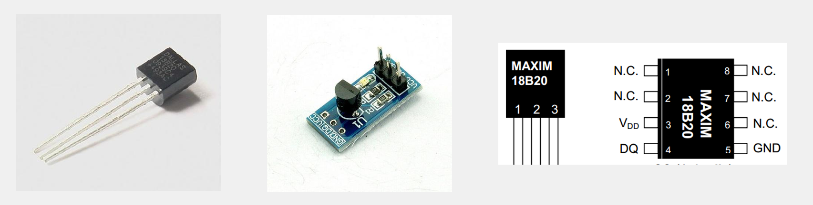


#### 引脚及电路

| **引脚** | **功能**            |
| -------- | ------------------- |
| VDD      | 电源（3.0V ~ 5.5V） |
| GND      | 电源地              |
| DQ       | 单总线接口          |

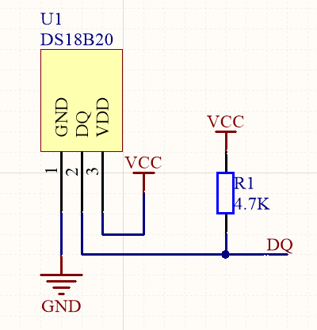


#### 内部结构框图

64-BIT ROM：作为器件地址，用于总线通信的寻址

SCRATCHPAD（暂存器）：用于总线的数据交互

EEPROM：用于保存温度触发阈值和配置参数

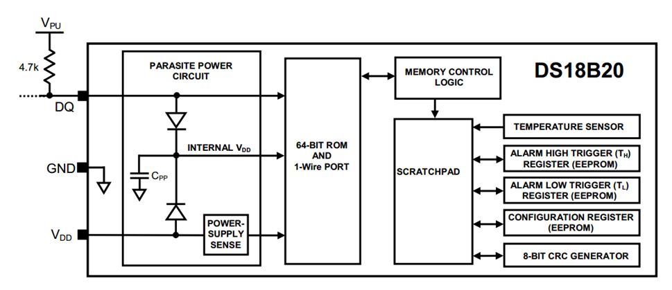


#### 存储器结构

第1个字节是低位温度，第2个字节是高位温度，按顺序接收。

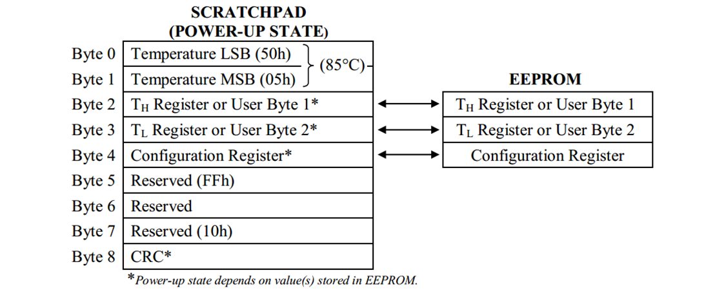

温度分辨率最高12位需要750ms，所以温度转换最好加上延时。


#### 温度存储格式

0次方在LS的第4位，相当于左移了4位，实际温度要除以16。右边BIT3~BIT0的是小数部分，2的负一次方是0.5，右边的几位一直除以2就行了，如2的负2次方=0.25。

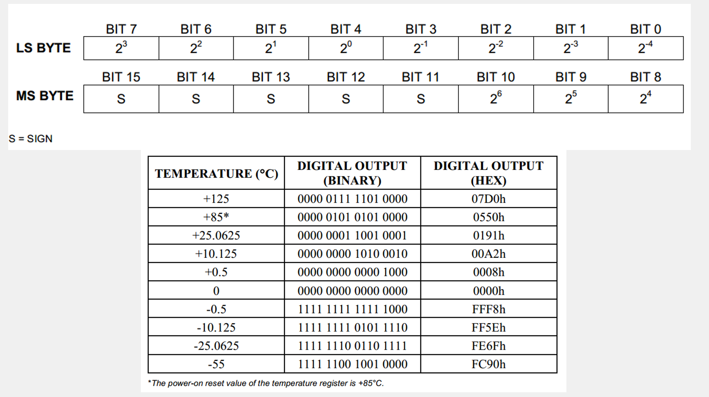


### 单总线介绍

单总线（1-Wire BUS）是由Dallas公司开发的一种通用数据总线

一根通信线：DQ

异步、半双工

数据发送和接收：**低位先行**

单总线只需要一根通信线即可实现数据的双向传输，当采用寄生供电时，还可以省去设备的VDD线路，此时，供电加通信只需要DQ和GND两根线

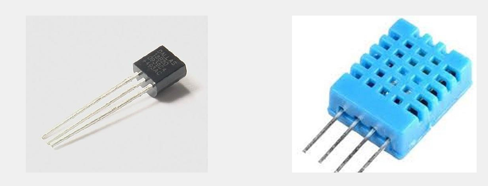

#### 单总线电路规范

设备的DQ均要配置成开漏输出模式

DQ添加一个上拉电阻，阻值一般为4.7KΩ左右

若此总线的从机采取寄生供电，则主机还应配一个强上拉输出电路

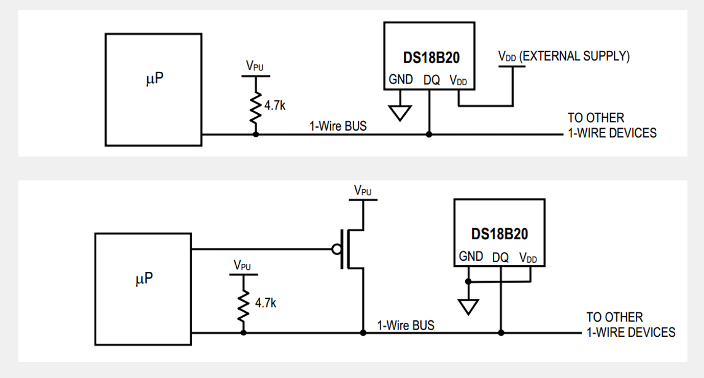


#### 单总线时序结构


##### 初始化

主机将总线拉低至少480us，然后释放总线，等待15~60us后，存在的从机会拉低总线60~240us以响应主机，之后从机将释放总线

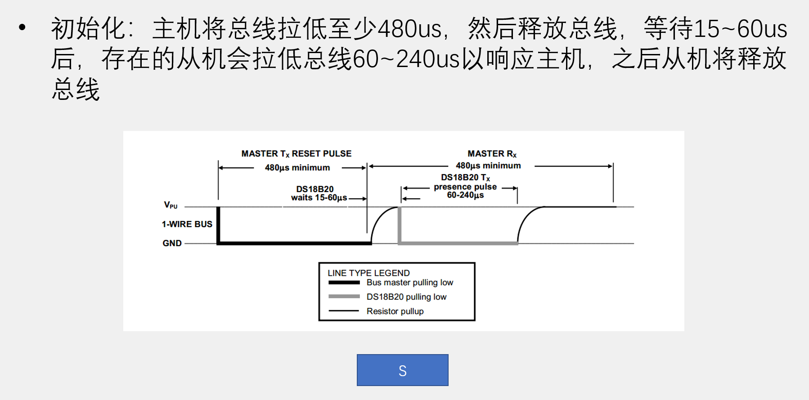


##### 发送一位

主机将总线拉低60~120us，然后释放总线，表示发送0；主机将总线拉低1~15us，然后释放总线，表示发送1。从机将在总线拉低30us后（典型值）读取电平，整个时间片应大于60us

这里其实卡住10us这个时间线就可以了

- 发送0的话，先拉低电压为0，10us~15us后**继续拉低**，也就是把端口**置0**
- 发送1的话，也是先拉低电压为0，在第一个**15us之前**，10us这个时间给端口**置1**。

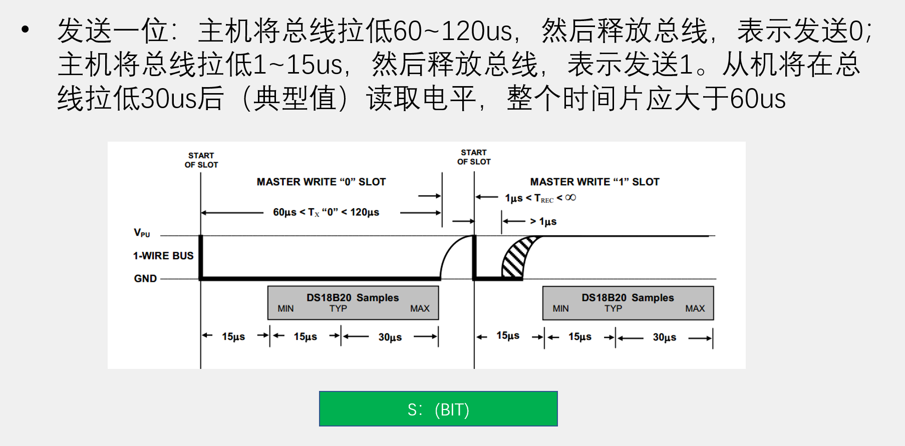


##### 接收一位  

主机将总线拉低1~15us，然后释放总线，并在拉低后15us内读取总线电平（尽量贴近15us的末尾），读取为低电平则为接收0，读取为高电平则为接收1 （因为主机释放了之后从机和主机都没有拉低，所以默认是高电平），整个时间片应大于60us

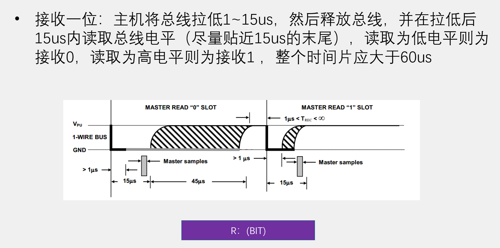


##### 发送和接收一个字节  

**发送一个字节**：连续调用8次发送一位的时序，依次发送一个字节的8位（**低位在前**）

**接收一个字节**：连续调用8次接收一位的时序，依次接收一个字节的8位（**低位在前**）

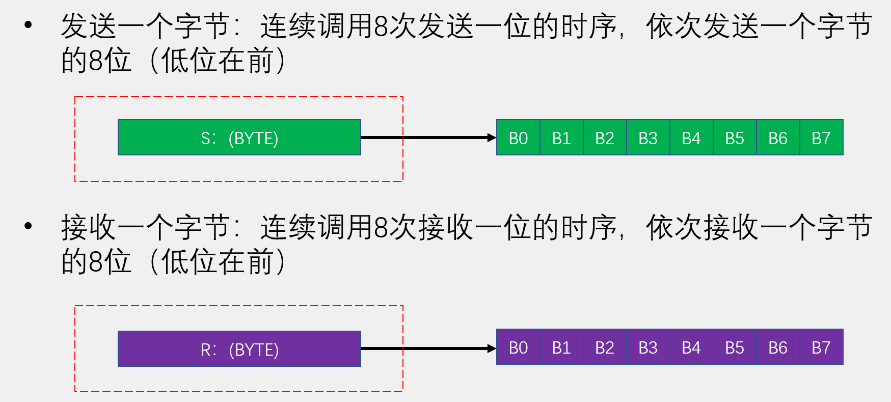


#### 单总线模块代码

```c
#include <REGX52.H>

//引脚定义
sbit OneWire_DQ=P3^7;

/**
  * @brief  单总线初始化
  * @param  无
  * @retval 从机响应位，0为响应，1为未响应
  */
unsigned char OneWire_Init(void)
{
	unsigned char i;
	unsigned char AckBit;
	OneWire_DQ=1;
	OneWire_DQ=0;
	i = 227;while (--i);	//Delay 500us
	OneWire_DQ=1;
	i = 29;while (--i);		//Delay 70us
	AckBit=OneWire_DQ;
	i = 227;while (--i);	//Delay 500us
	
	return AckBit;
}

/**
  * @brief  单总线发送一位
  * @param  Bit 要发送的位
  * @retval 无
  */
void OneWire_SendBit(unsigned char Bit)
{
	unsigned char i;
	OneWire_DQ=0;
	i = 4;while (--i);			//Delay 10us
	OneWire_DQ=Bit;				//卡着10us这段时间发送了，甚至节省了if语句。
	i = 22;while (--i);			//Delay 50us
	OneWire_DQ=1;
}

/**
  * @brief  单总线接收一位
  * @param  无
  * @retval 读取的位
  */
unsigned char OneWire_ReceiveBit(void)
{
	unsigned char i;
	unsigned char Bit;
	OneWire_DQ=0;
	i = 2;while (--i);
	OneWire_DQ=1;		//给1放开总线,给从机控制端口
	i = 2;while (--i);
	Bit = OneWire_DQ;
	i = 22;while (--i);
	
	return Bit;
}

/**
  * @brief  单总线发送一个字节
  * @param  Byte 要发送的字节
  * @retval 无
  */
void OneWire_SendByte(unsigned char Byte)
{
	unsigned char i;
	for(i=0; i<8; i++)
	{
		OneWire_SendBit(Byte&(0x01<<i));
	}
}


/**
  * @brief  单总线接收一个字节
  * @param  无
  * @retval 接收的一个字节
  */
unsigned char OneWire_ReceiveByte(void)
{
	unsigned char i;
	unsigned char Byte=0x00;
	for(i=0; i<8; i++)
	{
		if(OneWire_ReceiveBit()){Byte|=(0x01<<i);}
	}
	return Byte;
}


```


### DS18B20操作流程

初始化：从机复位，主机判断从机是否响应

ROM操作：ROM指令+本指令需要的读写操作

功能操作：功能指令+本指令需要的读写操作


| **ROM指令**        | **功能指令**            |
| ------------------ | ----------------------- |
| SEARCH ROM [F0h]   | CONVERT T [44h]         |
| READ ROM [33h]     | WRITE SCRATCHPAD [4Eh]  |
| MATCH ROM [55h]    | READ SCRATCHPAD [BEh]   |
| SKIP ROM [CCh]     | COPY SCRATCHPAD [48h]   |
| ALARM SEARCH [ECh] | RECALL E2 [B8h]         |
|                    | READ POWER SUPPLY [B4h] |


### DS18B20数据帧

温度变换：初始化→跳过ROM →开始温度变换

温度读取：初始化→跳过ROM →读暂存器→连续的读操作

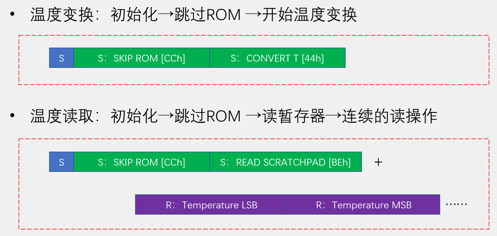


### DS18B20模块程序代码

```c
#include <REGX52.H>
#include "OneWire.h"

//DS18B20指令
#define DS18B20_SKIP_ROM   			0xCC
#define DS18B20_CONVERT_T  			0x44
#define DS18B20_READ_SCRATCHPAD		0xBE


/**
  * @brief  DS18B20开始温度变换
  * @param  无
  * @retval 无
  */
void DS18B20_ConvertT(void)
{
	OneWire_Init();
	OneWire_SendByte(DS18B20_SKIP_ROM);    //跳过ROM
	OneWire_SendByte(DS18B20_CONVERT_T);   //开始温度变化
}

/**
  * @brief  DS18B20读取温度
  * @param  无
  * @retval 温度数值
  */
float DS18B20_ReadT(void)
{
	unsigned char TLSB,TMSB;
	int Temp;
	float T;
	OneWire_Init();
	OneWire_SendByte(DS18B20_SKIP_ROM);        //跳过ROM
	OneWire_SendByte(DS18B20_READ_SCRATCHPAD); //读暂存器
	TLSB=OneWire_ReceiveByte();     //第1个字节是低位温度，按顺序接收。
	TMSB=OneWire_ReceiveByte();		//第2个字节是高位温度，
	Temp=(TMSB<<8)|TLSB;
	T=Temp/16.0;
	
	return T;
}
```


## LCD1602液晶显示屏


### LCD1602介绍

LCD1602（Liquid Crystal Display）液晶显示屏是一种字符型液晶显示模块，可以显示ASCII码的标准字符和其它的一些内置特殊字符，还可以有8个自定义字符

显示容量：16×2个字符，每个字符为5*7点阵

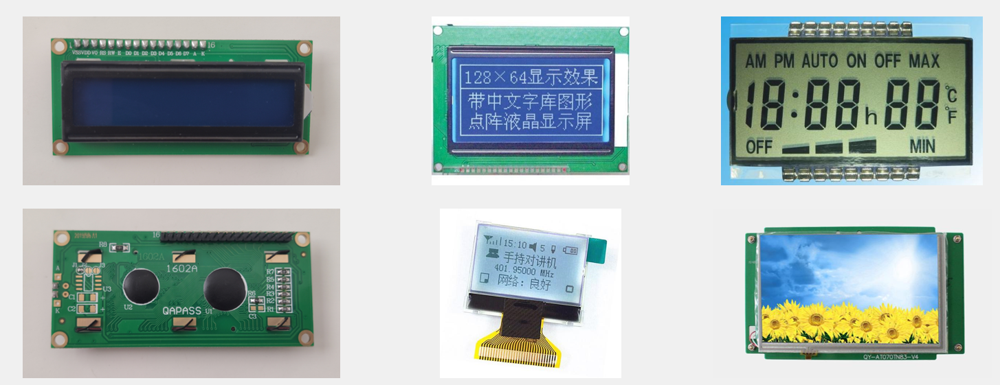

- 初始化：

 	发送指令0x38 //八位数据接口，两行显示，5*7点阵
 	发送指令0x0C //显示开，光标关，闪烁关
 	发送指令0x06 //数据读写操作后，光标自动加一，画面不动
 	发送指令0x01 //清屏


- 显示字符：

 	发送指令0x80|AC //设置光标位置
 	发送数据 //发送要显示的字符数据
 	发送数据 //发送要显示的字符数据
 	……


#### 内部结构框图

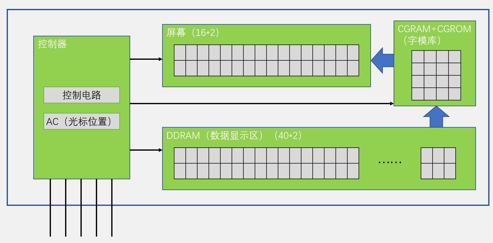


#### 存储器结构  

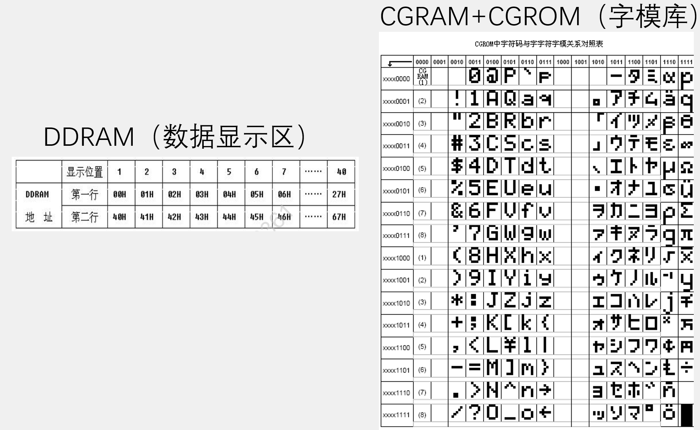


#### 引脚及应用电路

| **引脚** | **功能**                          |
| -------- | --------------------------------- |
| VSS      | 地                                |
| VDD      | 电源正极（4.5~5.5V）              |
| VO       | 对比度调节电压                    |
| RS       | 数据/指令选择，1为数据，0为指令   |
| RW       | 读/写选择，1为读，0为写           |
| E        | 使能，1为数据有效，下降沿执行命令 |
| D0~D7    | 数据输入/输出                     |
| A        | 背光灯电源正极                    |
| K        | 背光灯电源负极                    |


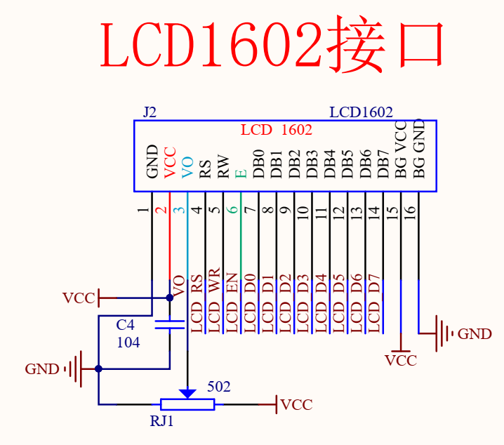

**注意：**电路板是P0端的IO口接上DB0~DB7的，而且是**低对低P^0 = DB0**，**高对高P^7 = BD7**，以此类推，记得查看原理图接线避免反过来了，防止导致数据输入错误。


### LCD1602指令集  


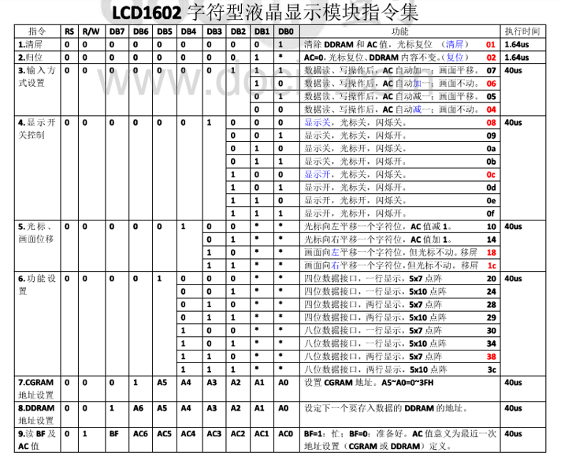


### LCD1602读、写时序及时间参数

**时序**：

- RS： 数据/指令选择，1为数据，0为指令  
- R/W : 读/写选择，1为读，0为写 
- E:  使能，1为数据有效，下降沿执行命令  
- DB0~DB7: 数据输入/输出   

执行顺序：RS --> RW --> DB0~DB7 --> E

因为程序是设置引脚IO口先配置了电平才用E使能接收和关闭，而且程序函数每发送数据/指令一次就重新配置端口，所以执行了一次之后，后面的时序不用管也行。


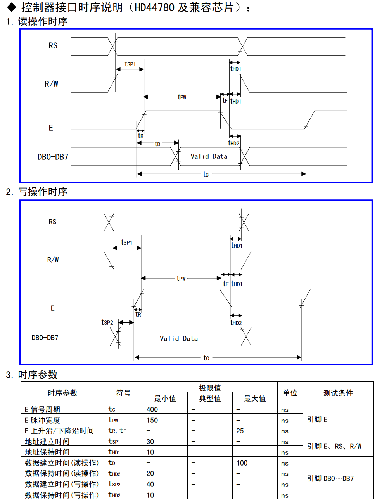

时间都是ns级别的，但是实际写入可能由于**指令的执行时间**有影响和冲突速度跟不上导致**写入失败**，在程序E端使能和失能后面跟个的本函数私有的延时1ms就可以解决。（要用私有的延时函数是如果以后更换更高速的单片机上出现字符位置不对，偏移了，也好修改）


使用LCD1602液晶屏作为调试窗口，提供类似printf函数的功能，可实时观察单片机内部数据的变换情况，便于调试和演示。

提供的LCD1602代码属于模块化的代码，使用者只需要知道所提供函数的作用和使用方法就可以很容易的使用LCD1602。

| **函数**                       | **作用**             |
| ------------------------------ | -------------------- |
| LCD_Init();                    | 初始化               |
| LCD_ShowChar(1,1,'A');         | 显示一个字符         |
| LCD_ShowString(1,3,"Hello");   | 显示字符串           |
| LCD_ShowNum(1,9,123,3);        | 显示十进制数字       |
| LCD_ShowSignedNum(1,13,-66,2); | 显示有符号十进制数字 |
| LCD_ShowHexNum(2,1,0xA8,2);    | 显示十六进制数字     |
| LCD_ShowBinNum(2,4,0xAA,8);    | 显示二进制数字       |


### LCD1602驱动模块代码

```c
#include <REGX52.H>
#include <intrins.h>

//引脚配置：
sbit LCD_RS=P2^6;
sbit LCD_RW=P2^5;
sbit LCD_EN=P2^7;

#define LCD_DataPort P0

//函数定义：
/**
  * @brief  LCD1602延时函数，11.0592MHz调用可延时1ms
  * @param  无
  * @retval 无
  */
void LCD_Delay()		//@11.0592MHz
{
	unsigned char i, j;

	_nop_();
	i = 2;
	j = 199;
	do
	{
		while (--j);
	} while (--i);
}


/**
  * @brief  LCD1602写命令
  * @param  Command 要写入的命令
  * @retval 无
  */
void LCD_WriteCommand(unsigned char Command)
{
	LCD_RS=0;
	LCD_RW=0;
	LCD_DataPort=Command;
	LCD_EN=1;
	LCD_Delay();
	LCD_EN=0;
	LCD_Delay();
}

/**
  * @brief  LCD1602写数据
  * @param  Data 要写入的数据
  * @retval 无
  */
void LCD_WriteData(unsigned char Data)
{
	LCD_RS=1;
	LCD_RW=0;
	LCD_DataPort=Data;
	LCD_EN=1;
	LCD_Delay();
	LCD_EN=0;
	LCD_Delay();
}

/**
  * @brief  LCD1602设置光标位置
  * @param  Line 行位置，范围：1~2
  * @param  Column 列位置，范围：1~16
  * @retval 无
  */
void LCD_SetCursor(unsigned char Line,unsigned char Column)
{
	if(Line==1)
	{
		LCD_WriteCommand(0x80|(Column-1));
	}
	else if(Line==2)
	{
		LCD_WriteCommand(0x80|(Column-1+0x40));
	}
}

/**
  * @brief  LCD1602初始化函数
  * @param  无
  * @retval 无
  */
void LCD_Init()
{
	LCD_WriteCommand(0x38);//八位数据接口，两行显示，5*7点阵
	LCD_WriteCommand(0x0c);//显示开，光标关，闪烁关
	LCD_WriteCommand(0x06);//数据读写操作后，光标自动加一，画面不动
	LCD_WriteCommand(0x01);//光标复位，清屏
}

/**
  * @brief  在LCD1602指定位置上显示一个字符
  * @param  Line 行位置，范围：1~2
  * @param  Column 列位置，范围：1~16
  * @param  Char 要显示的字符
  * @retval 无
  */
void LCD_ShowChar(unsigned char Line,unsigned char Column,char Char)
{
	LCD_SetCursor(Line,Column);
	LCD_WriteData(Char);
}

/**
  * @brief  在LCD1602指定位置开始显示所给字符串
  * @param  Line 起始行位置，范围：1~2
  * @param  Column 起始列位置，范围：1~16
  * @param  String 要显示的字符串
  * @retval 无
  */
void LCD_ShowString(unsigned char Line,unsigned char Column,char *String)
{
	unsigned char i;
	LCD_SetCursor(Line,Column);
	for(i=0;String[i]!='\0';i++)
	{
		LCD_WriteData(String[i]);
	}
}

/**
  * @brief  返回值=X的Y次方
  */
int LCD_Pow(int X,int Y)
{
	unsigned char i;
	int Result=1;
	for(i=0;i<Y;i++)
	{
		Result*=X;
	}
	return Result;
}

/**
  * @brief  在LCD1602指定位置开始显示所给数字
  * @param  Line 起始行位置，范围：1~2
  * @param  Column 起始列位置，范围：1~16
  * @param  Number 要显示的数字，范围：0~65535
  * @param  Length 要显示数字的长度，范围：1~5
  * @retval 无
  */
void LCD_ShowNum(unsigned char Line,unsigned char Column,unsigned int Number,unsigned char Length)
{
	unsigned char i;
	LCD_SetCursor(Line,Column);
	for(i=Length;i>0;i--)
	{
		LCD_WriteData(Number/LCD_Pow(10,i-1)%10+'0');
	}
}

/**
  * @brief  在LCD1602指定位置开始以有符号十进制显示所给数字
  * @param  Line 起始行位置，范围：1~2
  * @param  Column 起始列位置，范围：1~16
  * @param  Number 要显示的数字，范围：-32768~32767
  * @param  Length 要显示数字的长度，范围：1~5
  * @retval 无
  */
void LCD_ShowSignedNum(unsigned char Line,unsigned char Column,int Number,unsigned char Length)
{
	unsigned char i;
	unsigned int Number1;
	LCD_SetCursor(Line,Column);
	if(Number>=0)
	{
		LCD_WriteData('+');
		Number1=Number;
	}
	else
	{
		LCD_WriteData('-');
		Number1=-Number;    //负的-32768，加上-负号，负负得正变成了正的32768？
	}
	for(i=Length;i>0;i--)
	{
		LCD_WriteData(Number1/LCD_Pow(10,i-1)%10+'0');
	}
}

/**
  * @brief  在LCD1602指定位置开始以十六进制显示所给数字
  * @param  Line 起始行位置，范围：1~2
  * @param  Column 起始列位置，范围：1~16
  * @param  Number 要显示的数字，范围：0~0xFFFF
  * @param  Length 要显示数字的长度，范围：1~4
  * @retval 无
  */
void LCD_ShowHexNum(unsigned char Line,unsigned char Column,unsigned int Number,unsigned char Length)
{
	unsigned char i,SingleNumber;
	LCD_SetCursor(Line,Column);
	for(i=Length;i>0;i--)
	{
		SingleNumber=Number/LCD_Pow(16,i-1)%16;
		if(SingleNumber<10)
		{
			LCD_WriteData(SingleNumber+'0');
		}
		else
		{
			LCD_WriteData(SingleNumber-10+'A');   //因为值大于10，A+10偏移了10位变成了k，所以减去10.
		}
	}
}

/**
  * @brief  在LCD1602指定位置开始以二进制显示所给数字
  * @param  Line 起始行位置，范围：1~2
  * @param  Column 起始列位置，范围：1~16
  * @param  Number 要显示的数字，范围：0~1111 1111 1111 1111
  * @param  Length 要显示数字的长度，范围：1~16
  * @retval 无
  */
void LCD_ShowBinNum(unsigned char Line,unsigned char Column,unsigned int Number,unsigned char Length)
{
	unsigned char i;
	LCD_SetCursor(Line,Column);
	for(i=Length;i>0;i--)
	{
		LCD_WriteData(Number/LCD_Pow(2,i-1)%2+'0');  //十六进制转二进制。
	}
}

```


## 直流电机驱动(PWM)

直流电机是一种将电能转换为机械能的装置。一般的直流电机有两个电极，当电极正接时，电机正转，当电极反接时，电机反转

直流电机主要由永磁体（定子）、线圈（转子）和换向器组成

除直流电机外，常见的电机还有步进电机、舵机、无刷电机、空心杯电机等

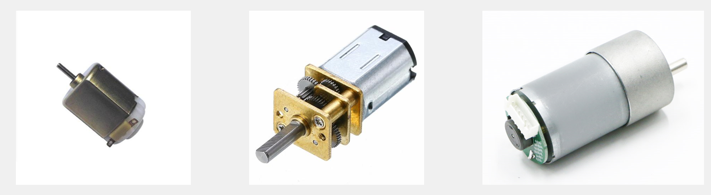


### 电机驱动电路

ULN2003D：是高电平输入，低电平输出。

三极管驱动：加上那个二极管是为了让电流回流释放电压，避免电机等惯性器件因突然停止造成的反作用力产生过大电流损坏器件。

H桥驱动：通过调换的正负级输入方向，从而改变旋转方向，改变的其实就是第一个得电的磁极，因为它在不同位置和角度，从而改变了推动永磁体的转动方向。

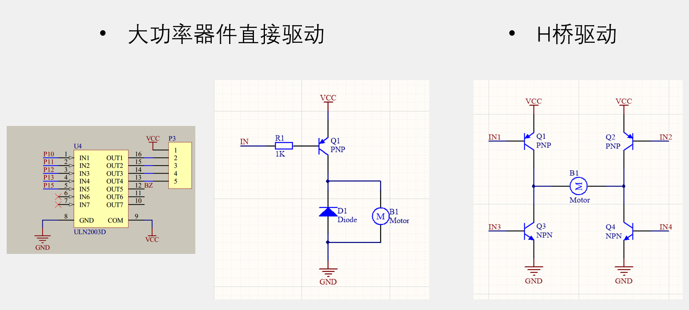


### PWM

PWM（Pulse Width Modulation）即脉冲宽度调制，在具有惯性的系统中，可以通过对一系列脉冲的宽度进行调制，来等效地获得所需要的模拟参量，常应用于电机控速、开关电源等领域。

PWM重要参数：

频率单位是Hz，TS是周期单位是秒，TON是高电平时间占比

 频率 = 1 / TS      占空比 = TON / TS      精度 = 占空比变化步距（范围100，每次都+1那精度就是百分之一）

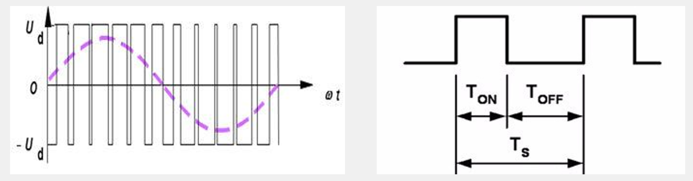


#### 产生PWM方法

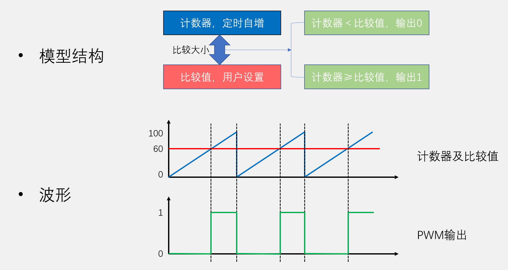


### 直流电机驱动模块代码

配合按键返回值设置速度（占空比），进行电机转速控制。

```c
#include <REGX52.H>
#include "Delay.h"
#include "Key.h"
#include "Nixie.h"
#include "Timer0.h"

sbit Motor=P1^0;

unsigned char Counter,Compare;	//计数值和比较值，用于输出PWM
unsigned char KeyNum,Speed;

void main()
{
	Timer0_Init();
	while(1)
	{
		KeyNum=Key();
		if(KeyNum==1)
		{
			Speed++;
			Speed%=4;
			if(Speed==0){Compare=0;}	//设置比较值，改变PWM占空比
			if(Speed==1){Compare=50;}
			if(Speed==2){Compare=70;}
			if(Speed==3){Compare=100;}
		}
		Nixie(1,Speed);
	}
}

void Timer0_Routine() interrupt 1
{
	TL0 = 0xA4;		//设置定时初值
	TH0 = 0xFF;		//设置定时初值
	Counter++;
	Counter%=100;	//计数值变化范围限制在0~99
	if(Counter<Compare)	//计数值小于比较值
	{
		Motor=1;
	}
	else
	{
		Motor=0;
	}
}
```


## AD/DA

### AD/DA介绍

AD（Analog to Digital）：模拟-数字转换，将模拟信号转换为计算机可操作的数字信号

DA（Digital to Analog）：数字-模拟转换，将计算机输出的数字信号转换为模拟信号

AD/DA转换打开了计算机与模拟信号的大门，极大的提高了计算机系统的应用范围，也为模拟信号数字化处理提供了可能。

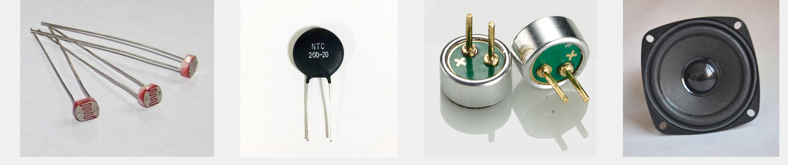


#### 硬件电路模型

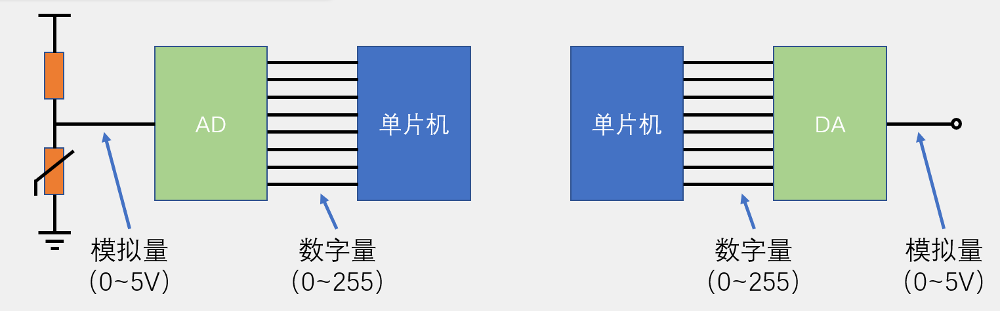

AD转换通常有多个输入通道，用多路选择开关连接至AD转换器，以实现AD多路复用的目的，提高硬件利用率。

AD/DA与单片机数据传送可使用并口（速度快、原理简单），也可使用串口（接线少、使用方便）。

可将AD/DA模块直接集成在单片机内，这样直接写入/读出寄存器就可进行AD/DA转换，单片机的IO口可直接复用为AD/DA的通道。

AD可以有多个输入，但是DA数字信号转模拟信号是却**只能有一个输出**，因为模拟信号需要**稳定和精确**。


#### 硬件电路

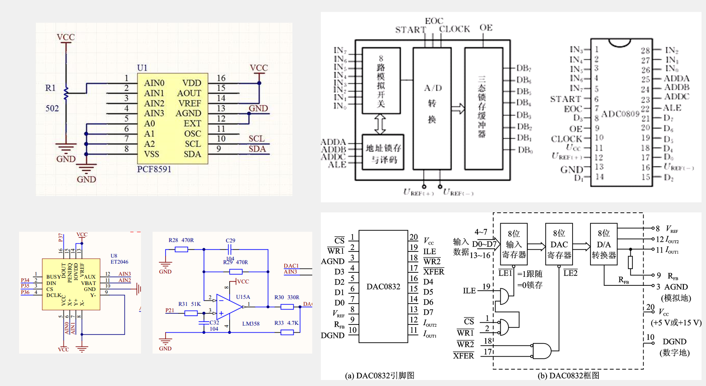


### 运算放大器

运算放大器（简称“运放”）是具有很高放大倍数的放大电路单元。内部集成了差分放大器、电压放大器、功率放大器三级放大电路，是一个性能完备、功能强大的通用放大电路单元，由于其应用十分广泛，现已作为基本的电路元件出现在电路图中。

运算放大器可构成的电路有：电压比较器、反相放大器、同相放大器、电压跟随器、加法器、积分器、微分器等。

运算放大器电路的分析方法：虚短、虚断（负反馈条件下）。

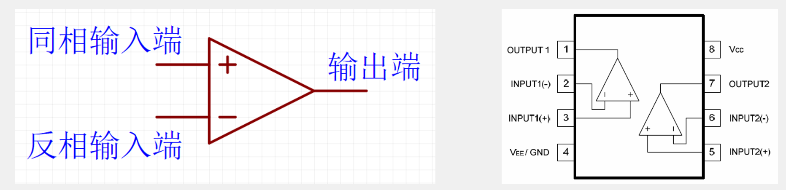


#### 运放电路

如果因为运放电路的负端- 接了来自输出的反馈（负反馈），会有虚短（+端和-端相当于短接连在了一起，电压相同）、虚断的特性。如果没有接负反馈就是电压比较器的功能。

Vin+是同相输入端，Vin-是反相输入端

**电压比较和反向放大器**：

- **电压比较器**，输出由Vin+和Vin-对比后得出，其实就是比那一端谁大。**带负-号的代表了低电平GND，带正号+的代表了高电平VCC**。理论上来说这个输出是无穷大的，但是由于电源电压的限制，所以最高只能是VCC，最低只能是GND。  
    - 输出高电平：**Vin+端的电压 大于 Vin-端的电压** 就行了，Vin+ > Vin-
    - 输出低电平：反过来，**Vin-端的电压 大于Vin-端的电压** 就行了，Vin- > Vin+

- **反向放大器**，Vin-从输出端OUT处接通了线进行反馈，就是负反馈，经过两相持续比较后形成稳态误差，满足虚短和虚断。调整R2和R1的电阻比例进行放大倍数调整。下面这个电路 R2是2k 和 R1是1k 比例是2  ：1，所以是两倍。如果是20k比1k， 20  ：1，那就是20倍。  

    - 一开始Vin+接了GND是0V，假如Vin-输入一个电压如**0,1V**，进入电压比较器进行比较。Vin-端比Vin+端电压大，根据电压比较器的特性直接输出最低电压，然后又经过电阻R2的那条线路反馈回去，抑制输入的0.1V，把Vin-的电压0.1V拉低到比Vin+的电压GND小也就是0V以下，这时候Vin-的电压比Vin+的电压小，进行电压比较后直接输出最高电压，这个输出电压又去抑制Vin-端那个比0小的值。  
        如此反复负反馈运行一段时间后，高低电平翻转，持续电压的比较形成了稳态误差，两端电压一样了这样才是虚短，而Vin+是接地的所以稳态误差最终值只能是0V。  
    这时候IN输入电流和输出电流OUT相等，输入阻抗太大电流不会流入也不会流出Vin-端，相当于虚断。电流方向只能通过电阻R1往R2流，再流到输出，它们的**电流I**是相等的，电阻R2产生一个压降，由电流方向知道 左边是正极+，右边是负极- 。  
    输出电压OUT等于虚短的0V减去R2的电压差：`0- 0.1V/R1*R2 `  
    R1和R2电流相等，0.1V除以1K就得出了电流。除法分数乘整数，其实就是增加被除数（被分的东西）即分子，所以Vin位置可以互换。0减去后面的值就变成了负的。所以公式被拉出来后变成了下面的`Vout = - R2/R1*Vin`。输出等于 负的R2除R1 乘Vin

    - 输出的是负电压，而且如果想输出低于0V的电压，如-12V，那么就需外接端电压，电压范围是+12V到-12V。


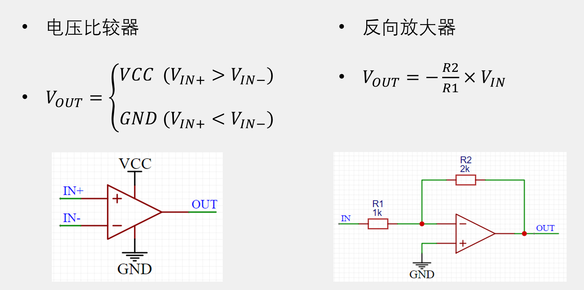


**同向放大和电压跟随器**：

- **同向放大器**，跟反向放大器类似，但输出的是正电压。
- **电压跟随器**，有负反馈，根据虚短，虚断分析。正-端输入的电压直接短接到负-端去了，而且没有其他的输入，所以输出等于输入。这样接是因为运放里面有功率放大器，可以提升输出的驱动能力。

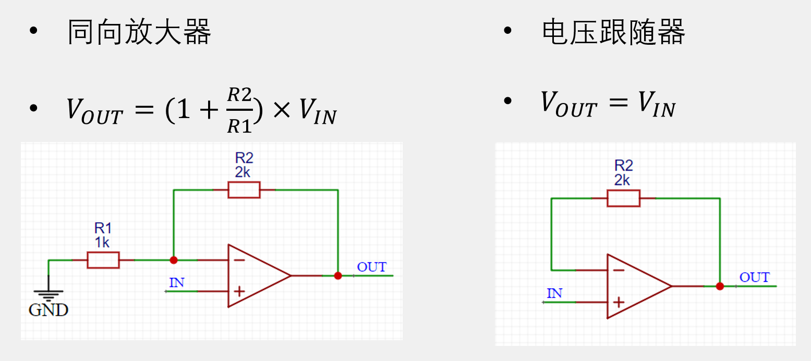


### DA原理

#### T型电阻网络DA转换器：

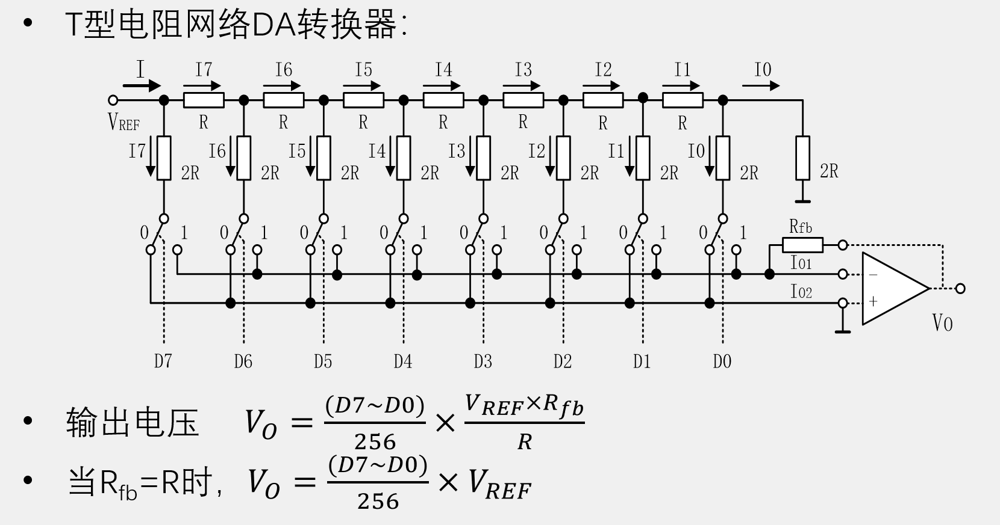


#### PWM型DA转换器

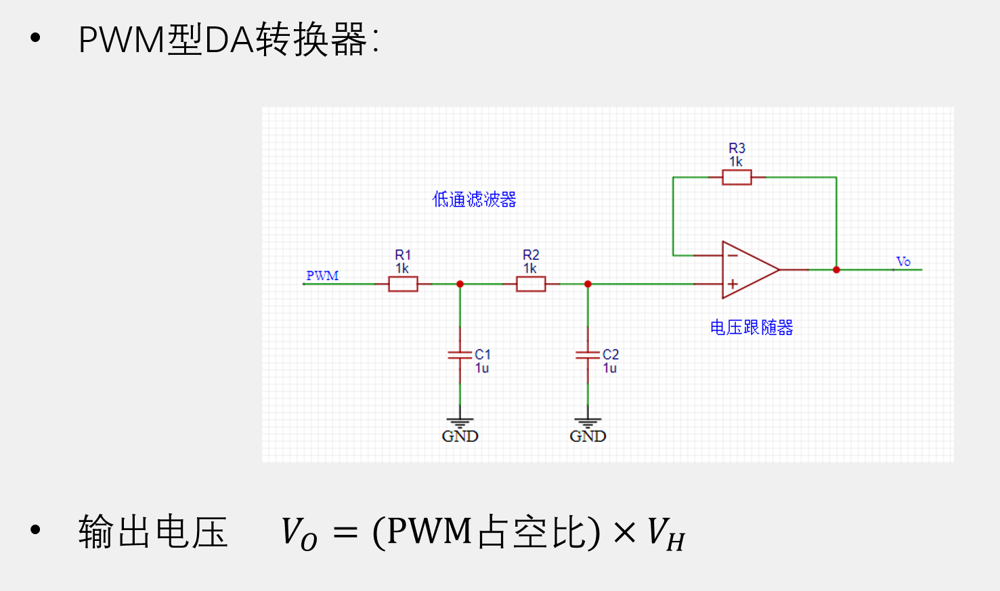


### AD原理

逐次逼近型AD转换器：

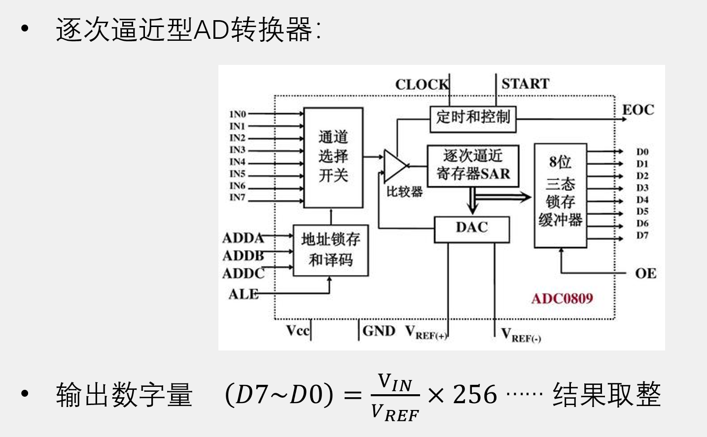


### AD/DA性能指标

分辨率：指AD/DA数字量的精细程度，通常用位数表示。例如，对于5V电源系统来说，8位的AD可将5V等分为256份，即数字量变化最小一个单位时，模拟量变化5V/256=0.01953125V，所以，8位AD的电压分辨率为0.01953125V，AD/DA的位数越高，分辨率就越高。

转换速度：表示AD/DA的最大采样/建立频率，通常用转换频率或者转换时间来表示，对于采样/输出高速信号，应注意AD/DA的转换速度


### XPT2046 触摸屏控制器


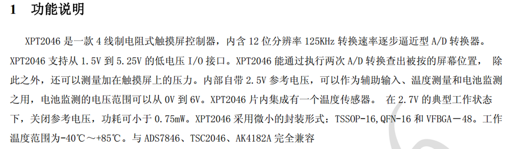


#### 引脚定义

| QFN引脚号 | TSSOP引脚号 | VFBGA引脚号 | 名称   | 说明                                                         |
| --------- | ----------- | ----------- | ------ | ------------------------------------------------------------ |
| 1         | 13          | A5          | BUSY   | 忙时信号线。当C— —S为高电平时为高阻状态                      |
| 2         | 14          | A4          | DIN    | 串行数据输入端。当C— —S为低电平时，数据在DCLK上升沿锁存进来  |
| 3         | 15          | A3          | CS     | 片选信号。控制转换时序和使能串行输入输出寄存器，高电平时ADC掉电 |
| 4         | 16          | A2          | DCLK   | 外部时钟信号输入                                             |
| 5         | 1           | B1和C1      | VCC    | 电源输入端                                                   |
| 6         | 2           | D1          | XP     | XP位置输入端                                                 |
| 7         | 3           | E1          | YP     | YP位置输入端                                                 |
| 8         | 4           | G2          | XN     | XN位置输入端                                                 |
| 9         | 5           | G3          | YN     | YN位置输入端                                                 |
| 10        | 6           | G4和G5      | GND    | 接地                                                         |
| 11        | 7           | G6          | VBAT   | 电池监视输入端                                               |
| 12        | 8           | E7          | AUX    | ADC辅助输入通道                                              |
| 13        | 9           | D7          | VREF   | 参考电压输入/输出                                            |
| 14        | 10          | C7          | IOVDD  | 数字电源输入端                                               |
| 15        | 11          | B7          | PENIRQ | 笔接触中断引脚                                               |
| 16        | 12          | A6          | DOUT   | 串行数据输出端。数据在DCLK的下降沿移出，当C——S高电平时为高阻状态 |


#### XPT2046时序

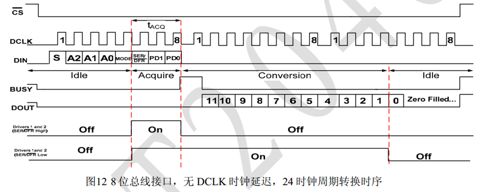


### 代码

#### AD模数切换的XPT2046模块代码

```c
#include <REGX52.H>
#include <INTRINS.H>

//引脚定义
sbit XPT2046_DIN=P3^4;
sbit XPT2046_CS=P3^5;
sbit XPT2046_DCLK=P3^6;
sbit XPT2046_DOUT=P3^7;

/**
  * @brief  XPT2046读取AD值
  * @param  Command 命令字，范围：头文件内定义的宏，结尾的数字表示转换的位数
  * @retval AD转换后的数字量，范围：8位为0~255，12位为0~4095
  */
unsigned int XPT2046_ReadAD(unsigned char Command)
{
	unsigned char i;
	unsigned int Data=0;
	XPT2046_DCLK=0;
	XPT2046_CS=0;
	for(i=0;i<8;i++)
	{
		XPT2046_DIN=Command&(0x80>>i);
		XPT2046_DCLK=1;
		XPT2046_DCLK=0;
	}
	for(i=0;i<16;i++)
	{
		XPT2046_DCLK=1;
		XPT2046_DCLK=0;
		if(XPT2046_DOUT){Data|=(0x8000>>i);}
	}
	XPT2046_CS=1;
	
	return Data>>8;
}
```


#### DA数模转换（相当于PWM）

```c
#include <REGX52.H>
#include "Delay.h"
#include "Timer0.h"

sbit DA=P2^1;

unsigned char Counter,Compare;  //计数值和比较值，用于输出PWM
unsigned char i;

void main()
{
	Timer0_Init();
	while(1)
	{
		for(i=0; i<100; i++)
		{
			Compare=i;			//设置比较值，改变PWM占空比
			Delay(10);
		}
		for(i=100; i>0; i--)
		{
			Compare=i;			//设置比较值，改变PWM占空比
			Delay(10);
		}
	}
}

void Timer0_Routine() interrupt 1
{
	TL0 = 0x9C;		//设置定时初值
	TH0 = 0xFF;		//设置定时初值
	Counter++;
	Counter%=100;	//计数值变化范围限制在0~99
	if(Counter<Compare)	//计数值小于比较值
	{
		DA=1;		//输出1
	}
	else				//计数值大于比较值
	{
		DA=0;		//输出0
	}
}

```


## 红外遥控（外部中断）

- 红外遥控是利用红外光进行通信的设备，由红外LED将调制后的信号发出，由专用的红外接收头进行解调输出  
- 通信方式：  
    - 单工（只能发送或者接收其中一个，所以要一个红外LED发送信号，一个红外接收头接收信号）  
    - 异步（没有用同一根时钟线进行连接，所以发送和接收端都要约定好使用一个统一的频率）  
- 通信协议标准：NEC标准  
- 红外LED波长：940nm（人眼不可见，手机摄像头可见）  


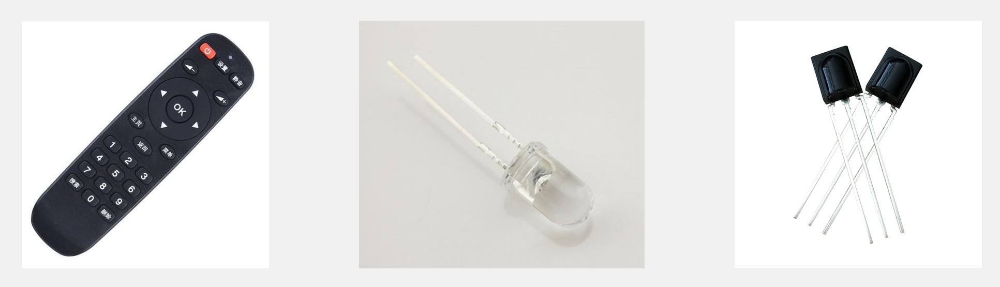


### 硬件电路

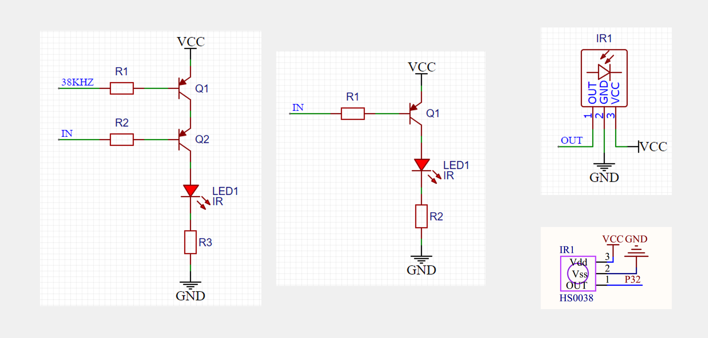


### 基本发送与接收

- 空闲状态： 红外LED不亮，接收头输出高电平
- 发送低电平： 红外LED以38KHz频率闪烁发光，接收头输出低电平
- 发送高电平： 红外LED不亮，接收头输出高电平

其实就是高电压的时候LED灯不亮，所有的信号都是从下降沿和低电平开始的。在低电平期间以38kHz的频率闪着亮，高电平期间又不亮了。

38KHz频率的信号由红外发送端和接收头的底层模块配合进行调制，滤掉了。所以程序里我们不用太关注这个频率，只要知道底层通讯是有这个过程的就行。

发送端里的信号就包含了一整段NEC协议，我们只需要判断下降沿和下一个信号下降沿的时间间隔，确定是发送、重发还是数据内容阶段，或者其他的那个状态。


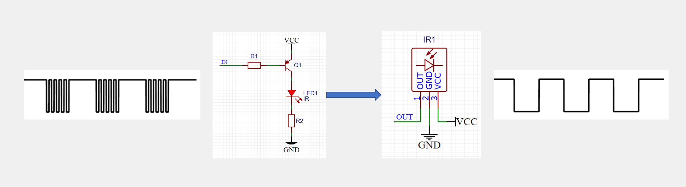


### NEC编码

#### 红外NEC协议  

**启动信号**的计时时间：先低电平9ms + 高电平4.5ms

**传输值0**的计时时间：先低电平560us + 高电平560us

**传输值1**的计时时间：先低电平560us + 高电平1690us

**重复信号**的计时时间：先低电平9ms + 高电平2.25ms

Data就是要传输的数据，**低位先行**，一次发送四个数据。真正有用的是第一个和第三个数据，第二和第四的是用来给有用的第一和第三数据进行对比验证是否正确的，用if语句把第一位数据和第二位数据的取反进行判断验证，第三个和第四个类似。

- 地址码 -> 地址码的取反 -> 命令码 -> 命令码的取反

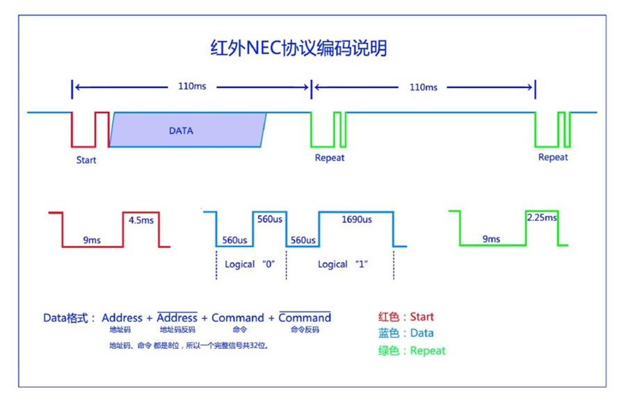


#### NEC波形

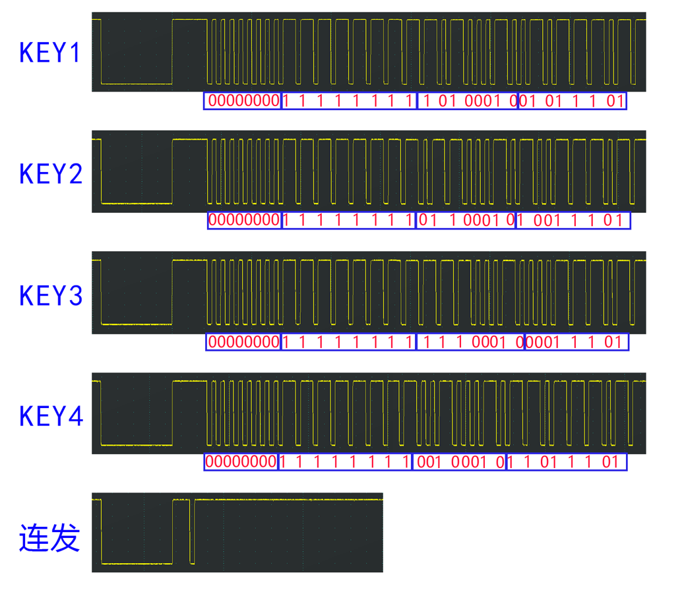

#### NEC红外接收模块代码

设置中断为下降沿启动计时。捕获到下降沿开始计时，并且状态值+1，下次下降沿触发中断后把计时的值给到接收值的变量。

```c
#include <REGX52.H>
#include "Timer0.h"
#include "Int0.h"

unsigned int IR_Time;			//定时时间
unsigned char IR_State;			//状态选择,空闲状态是0、接收Start信号或Repeat信号是1、数值接收状态是2

unsigned char IR_Data[4];		//32位的数值，分成4个8位的十六进制数的数组接收，4*8=32
unsigned char IR_pData;			//位值地址记录

unsigned char IR_DataFlag;		//接收标志
unsigned char IR_RepeatFlag;	//连发标志
unsigned char IR_Address;		//最终地址
unsigned char IR_Command;		//最终数值

/**
   * @brief  红外遥控初始化
   * @param	 无
   * @retval 无
   */
void IR_Init(void)
{
	Timer0_Init();
	Int0_Init();
}

/**
   * @brief  红外遥控获取收到数据帧标志位
   * @param	 无
   * @retval 是否收到数据帧，1为收到，0为未收到
   */
unsigned char IR_GetDataFlag(void)
{
	if(IR_DataFlag)
	{
		IR_DataFlag = 0;
		return 1;
	}
	return 0;
}

/**
  * @brief  红外遥控获取收到连发帧标志位
  * @param  无
  * @retval 是否收到连发帧，1为收到，0为未收到
  */
unsigned char IR_GetRepeatFlag(void)
{
	if(IR_RepeatFlag)
	{
		IR_RepeatFlag = 0;
		return 1;
	}
	return 0;
}

/**
  * @brief  红外遥控获取收到的地址数据
  * @param  无
  * @retval 收到的地址数据
  */
unsigned char IR_GetAddress(void)
{
	return IR_Address;
}

/**
  * @brief  红外遥控获取收到的命令数据
  * @param  无
  * @retval 收到的命令数据
  */
unsigned char IR_GetCommand(void)
{
	return IR_Command;
}

void Int0_Routine(void)	interrupt 0
{
	//状态0,空闲状态
	if(IR_State == 0)
	{
		Timer0_SetCounter(0);
		Timer0_Run(1);
		IR_State = 1;
	}
	
	//状态1,接收Start信号或Repeat信号
	else if(IR_State == 1)
	{
		IR_Time = Timer0_GetCounter();
		Timer0_SetCounter(0);
		if(IR_Time > (12442-500) && IR_Time < (12442+500))
		{			
			IR_State = 2;
		}
		else if(IR_Time > (10368-500) && IR_Time < (10368+500))
		{
			IR_RepeatFlag = 1;
			Timer0_Run(0);
			IR_State = 0;
		}
		else
		{
			IR_State = 1;
		}
	}
	
	//状态2，数值接收
	else if(IR_State == 2)
	{
		IR_Time = Timer0_GetCounter();
		Timer0_SetCounter(0);
		if(IR_Time > (1032-500) && IR_Time < (1032+500))
		{			
			IR_Data[IR_pData/8] &= ~(0x01<<IR_pData%8);
			IR_pData++;
		}
		else if(IR_Time > (2074-500) | IR_Time < (2074+500))		
		{
			IR_Data[IR_pData/8] |= (0x01<<IR_pData%8);
			IR_pData++;
		}
		else
		{
			IR_pData = 0;
			IR_State = 1;
		}
		if(IR_pData >= 32)
		{
			IR_pData = 0;
			if((IR_Data[0] == ~IR_Data[1]) && (IR_Data[2] == ~IR_Data[3]))
			{
				IR_Address = IR_Data[0];
				IR_Command = IR_Data[2];
				IR_DataFlag = 1;
			}
			Timer0_Run(0);
			IR_State = 0;
		}
	}
}
```


### 遥控器键码

键码使用十六进制对对应的二进制位进行传输。左上角第一个是0x45。

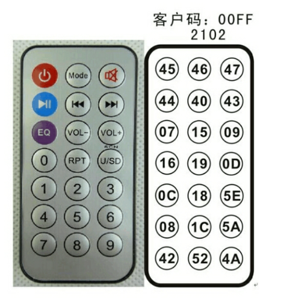


#### 按键键码代码模块

```c
#ifndef __IR_H__
#define	__IR_H__

#define IR_POWER		0x45
#define IR_MODE			0x46
#define IR_MUTE			0x47
#define IR_START_STOP	0x44
#define IR_PREVIOUS		0x40
#define IR_NEXT			0x43
#define IR_EQ			0x07
#define IR_VOL_MINUS	0x15
#define IR_VOL_ADD		0x09
#define IR_0			0x16
#define IR_RPT			0x19
#define IR_USD			0x0D
#define IR_1			0x0C
#define IR_2			0x18
#define IR_3			0x5E
#define IR_4			0x08
#define IR_5			0x1C
#define IR_6			0x5A
#define IR_7			0x42
#define IR_8			0x52
#define IR_9			0x4A

void IR_Init(void);
unsigned char IR_GetDataFlag(void);
unsigned char IR_GetRepeatFlag(void);
unsigned char IR_GetAddress(void);
unsigned char IR_GetCommand(void);

#endif
```


### 外部中断

- STC89C52有4个外部中断（但STC89C52只引出了2个，所以当是只有2个中断也行）


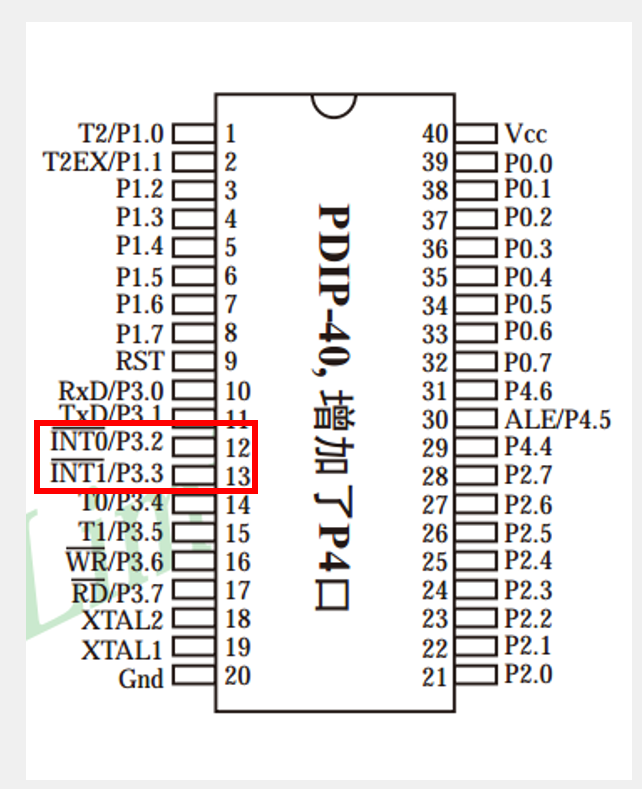


- STC89C52的外部中断有两种触发方式：**下降沿触发**和**低电平触发**。  
    - 下降沿触发：就是1次从高电平到低电平的边沿触发一次。（相当于按键按下就松开，但是一直按不会触发）  
    - 低电平触发：是如果定义的IO口，保持低电平的话就一直触发。（相当于按键按下就松开只执行一次，但是一直按着会持续执行）  


#### 中断号


#### 外部中断寄存器

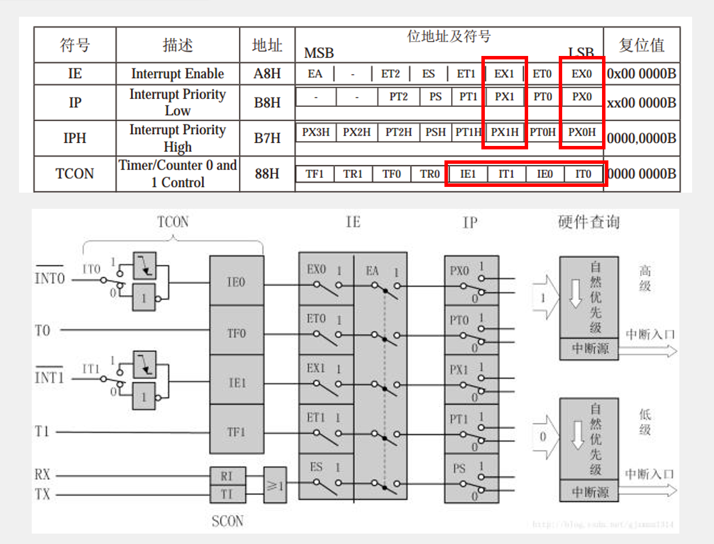


#### 外部中断模块代码

```c
#include <REGX52.H>

/**
   * @brief  外部中断0初始化
   * @param	 无
   * @retval 无
   */
void Int0_Init(void)
{
	IT0 = 1;	//1下降沿触发，0是低电平触发
	IE0 = 0;    //中断标志位，0是清除
	EX0 = 1;	//外部中断0中断允许位。EX0=1,允许中断; EX0=0,禁止中断
	EA  = 1;	//CPU的总中断允许控制位，EA=1，CPU开放中断，EA=0，CPU屏蔽所有的中断申请。
	PX0 = 1;	//中断优先级控制寄存器低(可位寻址)
}

/*外部中断0中断函数模板，哪里使用放哪里
void Int0_Routine(void)	interrupt 0
{
	
}
*/
```


## 参考

[江协科技 51单片机入门视频教程](https://www.bilibili.com/video/BV1Mb411e7re/?spm_id_from=333.1387.homepage.video_card.click&vd_source=17c79bc8f684676ab0d3d5f6cb10134a){target="_blank"}  

[江协科技 软件安装包、开发板资料、课件及程序源码下载链接](https://jiangxiekeji.com/download.html){target="_blank"}  