# STM32


## 临时想法

第一遍学习预览，第二遍学习完一个单元就开始思考和总结图片记忆（并且根据艾宾浩斯遗忘曲线规划时间复习各个单元）。第三次总复习。


- define

  宏定义，给所有变量、常量、字符数、函数起别名

  使用stm32f10x_conf.h库，需要宏定义`USE_STDPERIPH_DRIVER`

- extern

  如果函数想使用其他函数的变量，可以在程序里使用extern 声明那个变量，之后编译器会自己去寻找。如：`extern uint16_t Num;`，参考定时器中断项目（江协科技）  

- volatile

  如果开了编译器代码优化，它会判断一些代码是否有必要存在，因为代码执行是要时间的，如果被编译器认定为不必要代码，就会可能被隐性地优化删除掉，volatile就是告诉编译器不用优化修改某个变量，保持原值，防止出现隐性的代码数据被修改。而且使用volatile可以让变量被内核运算保存时不使用内部寄存器保存，而是保存到内存里。
  
- static

  静态变量
  
  - 在函数内定义声明的静态变量（局部静态变量）会在函数第一次被调用时初始化，并且只会被初始化一次。之后每次调用函数时，静态变量的值会保持上一次调用结束时的值。
  - 在函数外定义声明的静态变量（全局静态变量），只能在本个.c程序调用，其他的.c文件无法调用，就是只能自己用的意思。其他和局部静态变量一样。

在C语言中，结构体内的成员变量赋值时，前加一个点（*.*）用于**指定初始化**。这种方式可以让你在**初始化结构体时，不必按照结构体定义的顺序进行赋值**。例如以下代码的变量s3里的成员数据，就不是按照结构体的顺序去的，而是一个个点名出来赋值。

```c
#include <stdio.h>

struct student {
int year;
int ID;
};

int main(void) {
struct student s1 = {2017, 1111};
struct student s2 = {2222, 2018};
struct student s3 = {.ID = 3233,.year = 2029};

printf("s1.ID = %d \n", s1.ID);
printf("s1.year = %d \n\n", s1.year);
printf("s2.ID = %d \n", s2.ID);
printf("s2.year = %d \n\n", s2.year);
printf("s3.ID = %d \n", s3.ID);
printf("s3.year = %d \n\n", s3.year);

return 0;
}
```


寄存器一般就分为三类：寄存器其实都只是存储数据，只是每个位连接的功能模块不同，每个位都对应一部分逻辑功能。

- 1、控制类：像模式寄存器，控制寄存器，配置寄存器、功能选择使能寄存器，这些就是控制功能是否执行和具体怎么执行的
- 2、状态类：状态寄存器、中断标志寄存器之类的查看功能状态的
- 3、数据类：数据存储、地址、预分配器寄存器、计数器寄存器，这些是写入数据进行数据操作。


字(Word)： 32位长的数据或指令（4个字节）

半字(Half Word)： 16位长的数据或指令（2个字节）

字节(Byte)： 8位长的数据或指令（地址0x80000001，里的1代表1个字节）

理论上来说，0x400是1024个字节，每4个字节1个寄存器，1024 ÷ 4 = 256个寄存器，即如果以0x400为外设寄存器的界限，一个I2c可有256个32位的寄存器，实际上用不到那么多，就用了9个（STM32F103C8T6），还有很大余量留给其他型号的芯片。

内存里0x80000000，每加1代表的是1个字节。如：0x80000001，这个地址存储的就是一个字节（8位）。

每一个地址0x00000001，可以存1个字节（8位），而STM32的寄存器一般1个是4个字节（32位）。

- 像STM32的DMA寄存器，隔了5个寄存器1个通道。偏移地址： 0x08 + 20 x (通道编号 – 1)，
  十六进制的地址0x08加上十进制20（十六进制0x14），就是加20个字节的地址（总字节数 除以 单个寄存器字节数，20 ÷ 4 = 5，）隔了5个寄存器的地址，就是下一个通道的起始地址0x08 + 0x14 =  0x1C。


**MSB（最高有效位）** MSB是二进制数中最左边的一位，代表数值中权重最高的位。它对数值的影响最大。例如，在二进制数*1001*（十进制为9）中，最左边的*1*是MSB。如果MSB发生错误（例如从1变为0），数值会从9变为1，误差为8。

**LSB（最低有效位）** LSB是二进制数中最右边的一位，代表数值中权重最低的位。它对数值的影响最小。例如，在同样的二进制数*1001*中，最右边的*1*是LSB。如果LSB发生错误（例如从1变为0），数值会从9变为8，误差为1。


难道结构体里的成员变量定义的时候地址是自增的吗？

标准库的**外设控制就是使用宏定义了指向外设基地址的指针进行操作**，把这个基地址强转换为结构体的指针地址，然后使用地址调用的时候因为**结构体的变量地址按字节大小顺序分配**，这样赋值给结构体的变量就相当于直接配置外设寄存器了。如果有保留的寄存器就也定义一个变量RESERVED占位（stm32f10x文件可见外设基地址和结构体）。

想定义为16位的寄存器，如果高八位也想保留，但只用到低八位的那就也要定义保留变量占位，并且还要再定义16占位变量，凑够32位的，保证结构体内的下一个寄存器的地址是32位后的。

Flash可能是外挂的芯片可以进行烧写时读取，而且可以不擦除就写入新的数据覆盖，虽然也是遵循只1能改0，不能0改1的规则（擦除可后为1就可改了），而芯片内部的Flash不行，因为内部的Flash烧写的同时读取闪存的话CPU会暂停并报警告标志，不擦除直接覆写数据也会报警告标志。

程序大小Program Size:  Code=2492 ，RO-data=1788， RW-data=4 ，ZI-data=1636  ，编译后双击Target 1 可以查看.map文件，可以查看详细编译信息。

- Code+RO-data+RW-data是闪存占用大小
- RW-data+ZI-data是占用RAM大小

软件通讯端口比较灵活，因为是软件模拟通讯，所以IO端口空闲就可以使用，而硬件通讯协议一般要有硬件设备支持才行，如果IO口没有复用迁移功能的话端口就是固定的（无法重映像到其他引脚）。**同步时钟**的话**软件模拟**也比较简单（有共同的时钟线控制），**异步时序**要**计算波特率和传输速度**之类对时间要求比较的严格和麻烦，那就用**硬件外设比较好**。

所谓软件触发就是软件通过设置寄存器的中的某位触发事件或中断。硬件触发是定好条件后对应的硬件外设主动触发事件或中断，如定时器定时中断。  

8进制是以0开头，所以C语言里不能随便在一个数前加0，所以51单片机的那个密码锁案例，以零开头的话就无法判断是否正确了。

PWM只能用于惯性系统，非惯性系统还是得用DAC（数模转换）。

芯片如果是存储类的就是用兼容的通讯协议把数据写入对应的地址进行内容存储，然后根据需要选择对应的地址读取数据。而功能类的芯片是已经定好了地址对应的功能，写寄存器开启、关闭和配置特点的功能，读寄存器一般是读取固定寄存器功能的对应的数据，像MPU6050就是读取的加速度值和角速度（要先设置部分功能寄存器，比如开启电源、量程之类的）。

程序的协议层 被 驱动层继承，主要关注怎么读取寄存器，配置寄存器，读取数据，最后怎么用这些数据完成想要的功能。

如果想用printf，要在Target勾选Use MicroLIB。

串口传输汉字，要在项目栏的C/C++的Misc Controls里写上`--no-multibyte-chars`参数，文字编码格式一般可以选UTF-8和GB2312其中一种，GB2312不用加参数。

TIM_TimeBaseInit函数末尾，手动产生了更新事件，所以上电就产生了中断标志位，进入了一次中断，为了让中断计数更准确，可以在初始化的时候加上TIM_ClearFlag清除初始化的标志位。（标准库写法）

某个函数调用的结构体函数的变量成员如果没有全部赋初始值，程序很可能出现一些奇怪的问题，这时候可以调用对应的StructInit函数赋默认的初始值。

库函数是兼容F1系列的，其他系列的可能要找下，然后进行对比。

每一个程序模块（.c和.h文件）最下面都要有一行空行，否则程序报错。

int16_t 超出32768的值，在系统里高位就是符号位，这个带符号位的负数值，就算给到可以容纳超出32768的int32_t ，因为它更高位已经置了符号位，所以结果还是负数

芯片或者单片机的int有符号整形，负数都是以补码形式储存的


单从时钟频率看的话

频率就是速度，周期就是时间。

晶振的理解:
9M晶振就是1秒可以振动9\*10^6次，所以每一次振动的时间为1 ÷（9\*10^6）秒。

要计算1ms，就是振动9\*10^3次，就是振动9000次。

要计算1us，就振动9*10^0次，就是振动9次。

这样一来，对于常用的STM32F103C8T6芯片的72MHz时钟，就能照葫芦画瓢知道定时时间（时钟是可以升降频的）
72MHz = 72\*10^6Hz，即晶振振动 72\*10^6 次就计时1s。
72\*10^3，即晶振振动72\*10^3 = 72000次就定时1ms。
72\*10^0，即晶振振动72\*10^0 = 72次就定时1us。


根号就是求出一个数，是由那两个相同的数相乘而得的一个值，例：根号9，就是由两个3相乘而得，最后的值就是3。


因为使能端口时调用的标准库函数帮我们进行了`&=`和`|=`的操作，所以我们操作这个端口不会影响其他端口或者功能

光敏电阻被光照阻值减小。

驱动代码要模块化，逻辑执行的才放到主函数。

keil代码提示快捷键，Ctrl+Alt+空格

内核的外设不需要开启时钟，如NVIC。而RCC管的是内核外的硬件外设时钟。

中断之后的标志位一定要清除，否则程序会一直中断，导致程序卡死

如果使用while进行程序的超时等待，状态对应的对象判断一定要选对，不然可能卡死在while的判断程序了


GPIO引脚上拉和下拉如果不知道怎么选可以看下外设的GPIO配置，这个是外设引脚的配置推荐，然后根据外部设备的默认电压是高电平还是低电平，如果是高电平就上拉，低电平就下拉，跟外部保持一致，防止电平打架。像I2C通讯就是引脚要默认必须是开漏输出模式，要求引脚默认是高电平。不确定电压状态或者外部驱动电压很小的这种可以选择浮空输入，防止电平干扰。

外设的GPIO配置 手册里推荐的TIM2定时器要浮空输入，但浮空输入电平很容易乱跳，所以选用上拉输入也可以。除非外部信号的功率很小，上拉电阻会影响到，这个时候是必须要配置为浮空输入了。

外部功能要看数据手册里的引脚定义，复用功能和重定义功能，有些引脚是定好了功能的，如PA0就是配置了外部时钟模式2的TIM2_CH1_ETR引脚输入的，好像无法修改。

只使用内部时钟测试中断的话没有用到引脚，所以没有设置GPIO。


## 00-程序

**C语言数据类型**：

范围，如果是从最高值加到溢出就从最小的开始加，如果从最小的自减超出了就反过来，从最大的开始。

如char的范围，自增超过127直接变为-128，继续往上加。自减小于-128就直接变为最高的127继续减。其他以此类推。

从宏观去看就是

| **关键字**         | **位数** | **表示范围**             | stdint关键字 | ST关键字 |
| ------------------ | -------- | ------------------------ | ------------ | -------- |
| char               | 8        | -128 ~ 127               | int8_t       | s8       |
| unsigned char      | 8        | 0 ~ 255                  | uint8_t      | u8       |
| short              | 16       | -32768 ~ 32767           | int16_t      | s16      |
| unsigned short     | 16       | 0 ~ 65535                | uint16_t     | u16      |
| int                | 32       | -2147483648 ~ 2147483647 | int32_t      | s32      |
| unsigned int       | 32       | 0 ~ 4294967295           | uint32_t     | u32      |
| long               | 32       | -2147483648 ~ 2147483647 |              |          |
| unsigned long      | 32       | 0 ~ 4294967295           |              |          |
| long long          | 64       | -(2^64)/2 ~ (2^64)/2-1   | int64_t      |          |
| unsigned long long | 64       | 0 ~ (2^64)-1             | uint64_t     |          |
| float              | 32       | -3.4e38 ~ 3.4e38         |              |          |
| double             | 64       | -1.7e308 ~ 1.7e308       |              |          |


**C语言宏定义**：

```c
关键字：#define

用途：用一个字符串代替一个数字，便于理解，防止出错；提取程序中经常出现的参数，便于快速修改（注：案例只是其中一种定义，还可以定义函数和变量等其他东西，不限于变量和数字）

定义宏定义：

#define ABC 12345

引用宏定义：

int a = ABC; //等效于int a = 12345;
```


**C语言typedef**：

```c
关键字：typedef

用途：将一个比较长的变量类型名换个名字，便于使用（也可以是结构体和枚举等整数，数据类的）

定义typedef：

 	typedef unsigned char uint8_t;

引用typedef：

	uint8_t a; //等效于unsigned char a;
```


**C语言结构体**：

```c
关键字：struct
用途：数据打包，不同类型变量的集合
结构体变量名地址和第一个变量的地址是一样的，跟数组类似

    
定义结构体变量：
	struct S{char x; int y; float z;} StructName;
因为结构体变量类型较长，所以通常用typedef更改变量类型名，这样本该是变量的StructName就不是变量了，而是变成了一个代表结构体的代号，直接用StructName新定义变量。
	typedef struct S{char x; int y; float z;} StructName;
    
使用结构体变量StructName引用结构体成员（未使用typedef）：
	StructName.x = 'A';
	StructName.y = 66;
	StructName.z = 1.23;

或变量地址赋值给指针，通过指针引用成员（未使用typedef）：
    struct S *pStructName = &StructName
     pStructName->x = 'A';	//pStructName为结构体的地址	
	 pStructName->y = 66;
	 pStructName->z = 1.23;
```

注：结构体有子函数传参（实参和形参）和本页函数使用等，两种调用方法，在本页直接使用时只能是结构体变量加点，这样就已经直接修改了结构体数据了，相当于子函数的传输实参。


**C语言枚举**：

```c
关键字：enum
用途：定义一个取值受限制的整型变量，用于限制变量取值范围；宏定义的集合
定义枚举变量：
	enum{FALSE = 0, TRUE = 1} EnumName;
因为枚举变量类型较长，所以通常用typedef更改变量类型名，这样本该是变量的EnumName就不是变量了，而是变成了一个代表枚举的代号，直接用StructName新定义变量。
typedef enum{FALSE = 0, TRUE = 1} EnumName;
        
引用枚举成员（未使用typedef）：
	EnumName = FALSE;
	EnumName = TRUE;
```


## 01-综述


### **STM32简介**：

STM32是ST公司基于ARM Cortex-M内核开发的32位微控制器

STM32常应用在嵌入式领域，如智能车、无人机、机器人、无线通信、物联网、工业控制、娱乐电子产品等

STM32功能强大、性能优异、片上资源丰富、功耗低，是一款经典的嵌入式微控制器。

以下只是部分，一直在生产新型号，有很多新的型号未更新，所以具有时效性

- 高性能系列：F2、F4、F7、H7
- 通用系列：G0、G4、F0、F1、F3
- 低功耗系列：L0、L1、L4、L5、L4+、U5
- 无线系列：WL、WB

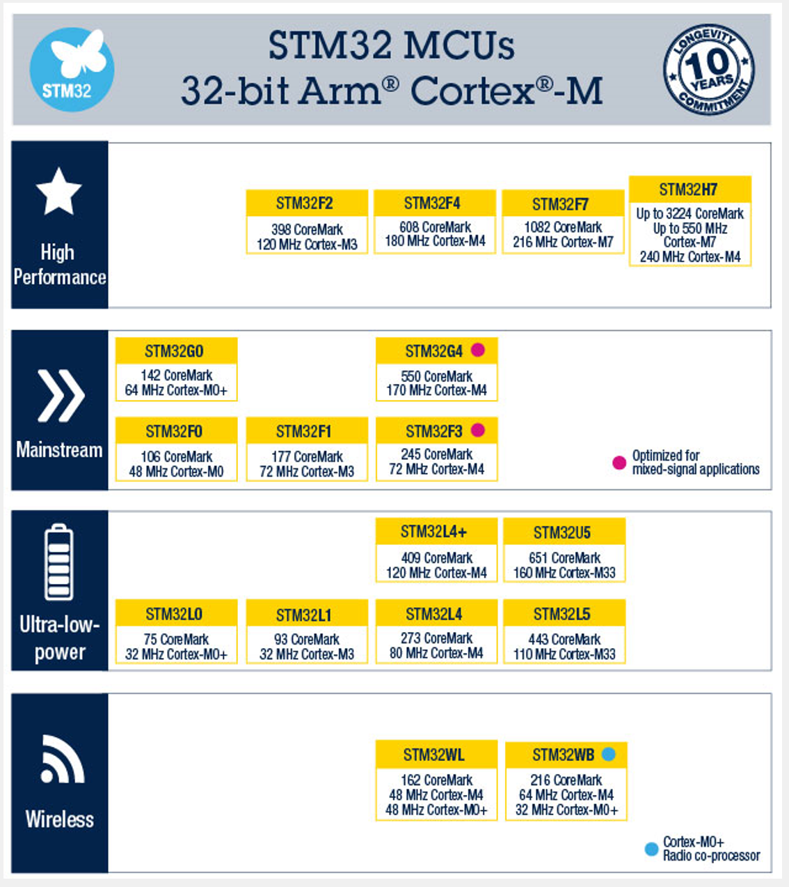

./image/


#### **ARM**：

ARM既指ARM公司，也指ARM处理器内核

ARM公司是全球领先的半导体知识产权（IP）提供商，全世界超过95%的智能手机和平板电脑都采用ARM架构

ARM公司设计ARM内核，半导体厂商完善内核周边电路并生产芯片


以下型号具有时效性

A系列适用高端应用，R系列和M系列适合嵌入式领域。

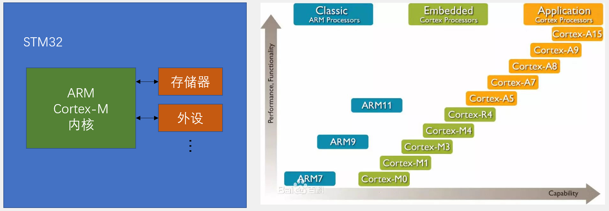


### **STM32F103C8T6**：

芯片基础信息看数据手册。

系列：主流系列STM32F1

内核：ARM Cortex-M3

主频：72MHz

RAM：20K（SRAM）

ROM：64K（Flash）

供电：2.0~3.6V（标准3.3V）

封装：LQFP48  

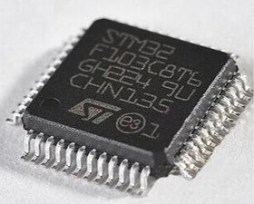


#### **命名规则**：

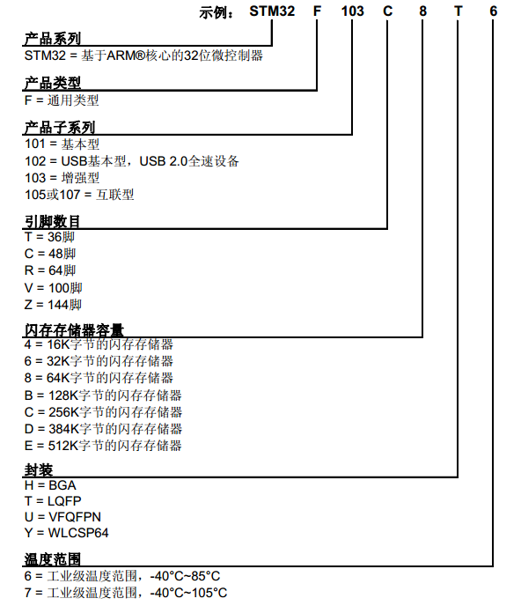


#### **系统结构**：

**Cortex-M3内核**引出的**三条总线**，**ICode指令总线，DCode数据总线，System系统总线**。

- ICode指令总线：主管Flash，加载**程序指令**。
- DCode数据总线：也是主管Flash，**加载数据，如变量、常量和调试参数**。
- System系统总线：连接着SRAM、FSMC，AHB总线外挂的所有外设，SDIO也是挂载在AHB上。

这些都是**通过一个多级的AHB总线构架相互连接**的，总线矩阵都是AHB总线。

AHB和APB的总线协议、速度、数据传输格式的差异，需要加两个桥架，完成数据的转换和缓存。

左下角的DMA是内核CPU的小助手，大量数据搬运的简单活让CPU干太浪费时间了。如外设ADC模数转换，可以配置成连续模式，比如1ms转换一次，转换的数据需要转运出来，否则数据被覆盖就会丢失。让CPU来干的话1ms就来转运一次费时费力，影响CPU正常工作，所以这种简单的数据搬运让DMA干就行了。

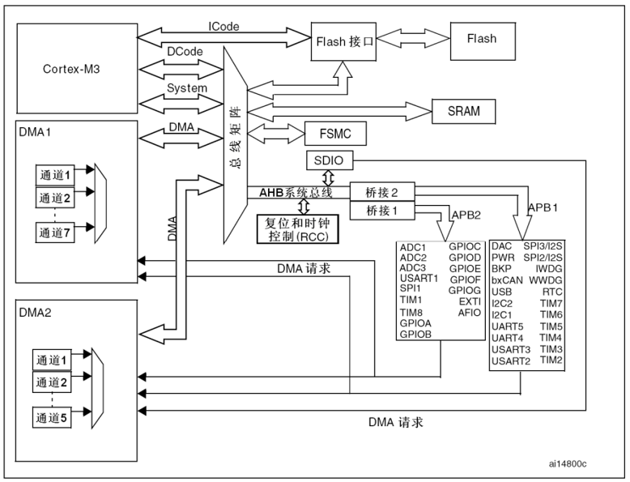


#### **片上资源/外设：**

片上资源（内核）：NVIC、SysTick

片上外设（外设）：除左上角两个的其他全部

**STM32F103C8T6没有**右下角的4个，**DAC、SDIO、FSMC、USB等外设资源**。

| **英文缩写** | **名称**           | **英文缩写** | **名称**           |
| ------------ | ------------------ | ------------ | ------------------ |
| NVIC         | 嵌套向量中断控制器 | CAN          | CAN通信            |
| SysTick      | 系统滴答定时器     | USB          | USB通信            |
| RCC          | 复位和时钟控制     | RTC          | 实时时钟           |
| GPIO         | 通用IO口           | CRC          | CRC校验            |
| AFIO         | 复用IO口           | PWR          | 电源控制           |
| EXTI         | 外部中断           | BKP          | 备份寄存器         |
| TIM          | 定时器             | IWDG         | 独立看门狗         |
| ADC          | 模数转换器         | WWDG         | 窗口看门狗         |
| DMA          | 直接内存访问       | DAC          | 数模转换器         |
| USART        | 同步/异步串口通信  | SDIO         | SD卡接口           |
| I2C          | I2C通信            | FSMC         | 可变静态存储控制器 |
| SPI          | SPI通信            | USB OTG      | USB主机接口        |


#### **引脚定义**：

新的芯片引脚可查看对应的型号**数据手册**。

填充色：红色电源相关，蓝色最小系统，绿色是IO口、功能口引脚。

类型：S电源，I输入、O输出、IO输入输出。

IO口电平：有FT的代表可以兼容（承受）5V的电压，没有就只能兼容（承受）3.3V的电压。

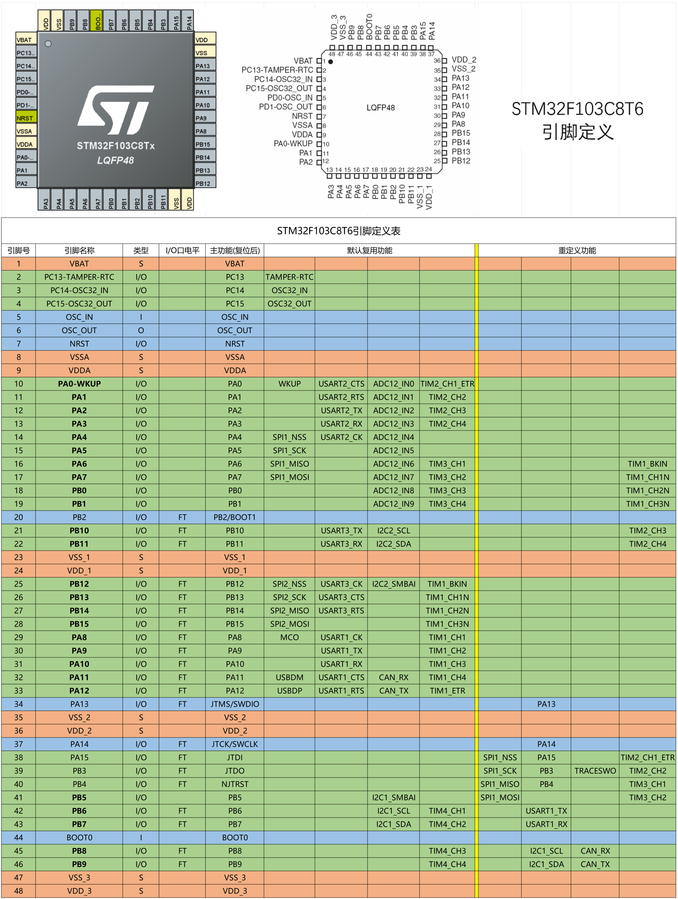


#### **启动配置**：  

主要看BOOT0引脚，如过它是低电平0，那其他两个是什么都没用，程序直接从主闪存开始。只有高电平1的时候BOOT1才能用上。

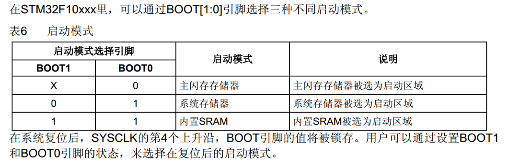

在从待机模式退出时， BOOT引脚的值将被被重新锁存；因此，在待机模式下BOOT引脚应保持为需要的启动配置。在启动延迟之后， CPU从地址0x0000 0000获取堆栈顶的地址，并从启动存储器0x0000 0004指示的地址开始执行代码。


因为固定的存储器映像，

代码区始终从地址0x0000 0000开始(通过ICode和DCode总线访问)，

而数据区(SRAM)始终从地址0x2000 0000开始(通过系统总线访问)。

 Cortex-M3的CPU始终从ICode总线获取复位向量，即启动仅适合于从代码区开始(典型地从Flash启动)。 

STM32F10xxx微控制器实现了一个特殊的机制，系统可以不仅仅从Flash存储器或系统存储器启动，还可以从内置SRAM启动。


根据选定的启动模式，主闪存存储器、系统存储器或SRAM可以按照以下方式访问：

- **从主闪存存储器启动**：主闪存存储器被映射到启动空间(0x0000 0000)，但仍然能够在它原有的地址(0x0800 0000)访问它，即闪存存储器的内容可以在两个地址区域访问， 0x0000 0000或0x0800 0000。

  **即主闪存启动地址有两个，0x0000 0000或0x0800 0000**。


- **从系统存储器启动**：系统存储器被映射到启动空间(0x0000 0000)，但仍然能够在它原有的地址(**互联型产品**原有地址为0x1FFF B000，**其它产品**原有地址为0x1FFF F000)访问它。

  **即系统存储器启动地址也有两个，0x0000 0000或0x1FFF F000**（没包含互联型产品）。


- **从内置SRAM启动**：**只能在0x2000 0000开始**的地址区访问SRAM。

> 注意： 当从内置SRAM启动，在应用程序的初始化代码中，必须使用NVIC的异常表和偏移寄存器，重新映射向量表至SRAM中。


### **最小系统**：

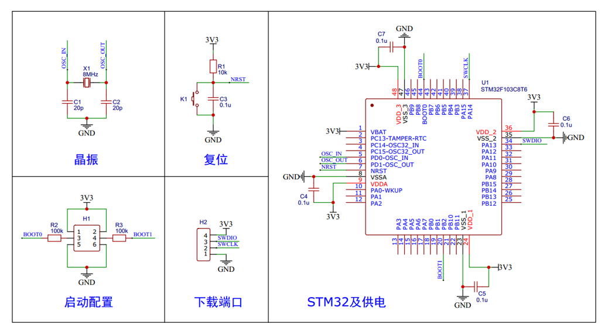


## 02-软件安装及新建工程


### 软件安装步骤：

- 安装Keil5 MDK

- 安装器件支持包（DFP，有离线安装和在线Pack Install，两种安装方式）

- 软件注册（就是破解，仅可用于学习，非商业）

- 安装ST-LINK驱动

- 安装USB转串口驱动


### 型号分类及缩写：

产品类型：F通用类

STM32F103C8T6是中容量产品，缩写MD，内存容量64k。

| **缩写** | **释义**           | **Flash容量** | **型号**          |
| -------- | ------------------ | ------------- | ----------------- |
| LD_VL    | 小容量产品超值系列 | 16~32K        | STM32F100         |
| MD_VL    | 中容量产品超值系列 | 64~128K       | STM32F100         |
| HD_VL    | 大容量产品超值系列 | 256~512K      | STM32F100         |
| LD       | 小容量产品         | 16~32K        | STM32F101/102/103 |
| MD       | 中容量产品         | 64~128K       | STM32F101/102/103 |
| HD       | 大容量产品         | 256~512K      | STM32F101/102/103 |
| XL       | 加大容量产品       | 大于512K      | STM32F101/102/103 |
| CL       | 互联型产品         | -             | STM32F105/107     |


### 新建工程步骤：

- 建立工程文件夹，Keil中新建工程，选择型号
- 工程文件夹里建立Start、Library、User等文件夹，复制固件库里面的文件到工程文件夹
- 工程里对应建立Start、Library、User等同名称的分组，然后将文件夹内的文件添加到工程分组里
- 工程选项，C/C++，Include Paths内声明所有包含头文件的文件夹路径（否则编译器会报，找不到文件）
- 工程选项，C/C++，Define内定义**USE_STDPERIPH_DRIVER**（因为stm32f10x.h文件最下面规定了包含库函数的使用条件就是define定义它）
- 工程选项，Debug，下拉列表选择对应调试器，Settings，Flash Download里勾选Reset and Run（复位并运行）


### 工程架构：

Startup_xx.s启动文件是用汇编写的

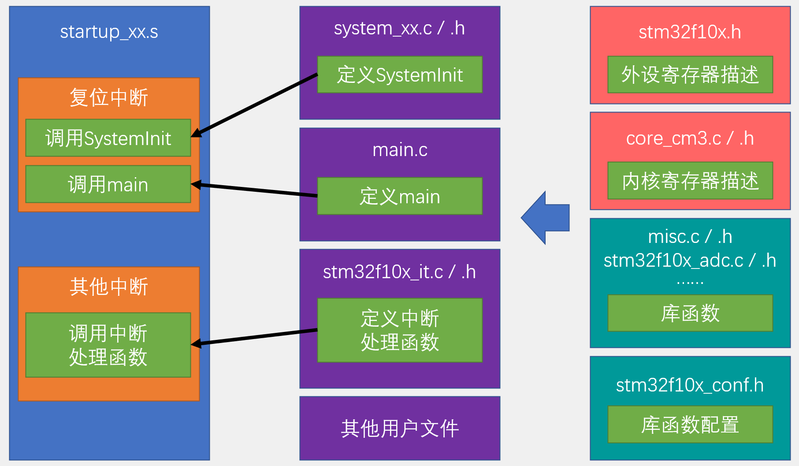


## 03-GPIO通用输入输出口

- GPIO
  - 不确定外设要配置什么模式的情况下 ，参考下手册里 外设的GPIO配置，而浮空输入因为干扰太大，看情况确定是否使用。


### **GPIO简介：**

GPIO（General Purpose Input Output）通用输入输出口

可配置为8种，输入、输出模式各4种。

引脚电平：0V~3.3V，部分引脚可容忍5V

输出模式下可控制端口输出高低电平，用以驱动LED、控制蜂鸣器、模拟通信协议输出时序等

输入模式下可读取端口的高低电平或电压，用于读取按键输入、外接模块电平信号输入、ADC电压采集、模拟通信协议接收数据等


### GPIO基本结构：  

GPIOx挂载在APB2总线。

一般每个GPIOx有16个引脚，编号是0到15。

STM32F103C8T6的IO口资源：

- GPIOA：PA0~15，16个。
- GPIOB：PB0~15，16个。
- GPIOC：PC13~15，3个。

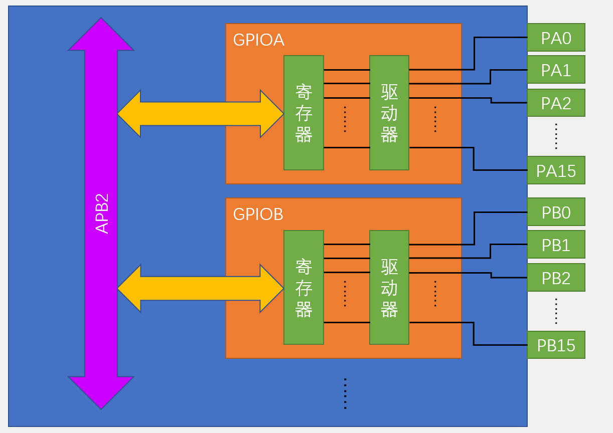


### GPIO结构：

输出控制器里面好像有反相器，所以可以把输出寄存器的值取反，mos管照常导通，这里大家不要纠结NMOS高电平导通，PMOS低电平导通这个问题。设计需求：**寄存器写1，PMOS必须导通，寄存器写0，NMOS必须导通，要实现这个目的，只需在输出控制那个地方加个反相器**就行了。

输入中间的那个**TTL肖特基触发器**其实是**施密特触发器**，属于**翻译错误**。施密特触发器的作用是，**高于设定的电压上限才为高，低与设定电压下限才为低**，在中间的电压有波动如果**没有达到两个最高或最低阈值就不会改变电平**，这样可以**防止**输入输出**电压频繁抖动**产生干扰信号导致**误触发**的影响。

因为输出数据寄存器同时控制16个端口，这个寄存器只能整体读写，所以如果想**单独操作一个端口而不影响其他端口**，那就有三种特殊方法：

- 读出寄存器：按位与 和 按位或，即C语言里的 &= 和 |= ，然后把更改的数据写回去。
- 位设置和位清除寄存器（库函数的方式）：
  - 位设置：在需要操作的位写1，其他不需要操作的写0，这样就会有电路自动将输出数据寄存器的对应位写1，其他写0的位保持不变。
  - 位清除：这个就跟位设置的写1效果相反，位清除写1是对某位进行清零，写0也是保持不变。
- 位带：读写STM32的位带区域，外设寄存器和SRAM都被映射到一个位段区里，这允许执行单一的位段的写和读操作，类似51单片机里的位寻址。（不常用，可查看手册的2.3.2 位段介绍和《Cortex™-M3技术参考手册》以了解更多有关位段的信息  ）  

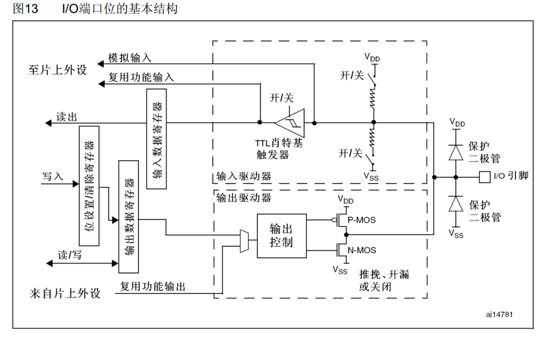


### GPIO模式：

通过配置GPIO的端口配置寄存器，端口可以配置成以下8种模式。

所谓复用，就是1个引脚对应有的一个或多个外设，然后把引脚交给外设控制（可以共用，但不能同时用，只能交给其中一个控制）。

| **模式名称** | **性质** | **特征**                                                     |
| ------------ | -------- | ------------------------------------------------------------ |
| 浮空输入     | 数字输入 | 可读取引脚电平，若引脚悬空，则电平不确定（易受干扰）         |
| 上拉输入     | 数字输入 | 可读取引脚电平，内部连接上拉电阻，悬空时默认高电平           |
| 下拉输入     | 数字输入 | 可读取引脚电平，内部连接下拉电阻，悬空时默认低电平           |
| 模拟输入     | 模拟输入 | GPIO无效，引脚直接接入内部ADC（ADC独享）                     |
| 开漏输出     | 数字输出 | 可输出引脚电平，高电平为高阻态，低电平接VSS（无高电压输出，只能低电平） |
| 推挽输出     | 数字输出 | 可输出引脚电平，高电平接VDD，低电平接VSS                     |
| 复用开漏输出 | 数字输出 | 由片上外设控制，高电平为高阻态，低电平接VSS（无高电压输出，只能低电平） |
| 复用推挽输出 | 数字输出 | 由片上外设控制，高电平接VDD，低电平接VSS                     |


#### 浮空/上拉/下拉输入：

输入状态，输出是断开的。因为输出只有一个端口，输入端有多个端口。所以输出的时候抽空**内部输入**一下也是没问题的。

- 浮空输入：上拉和下拉电阻的开关都断开，未知电平，这个状态极易受外部信号干扰。
- 上拉输入：上拉电阻VDD端的开关闭合，下拉电阻的断开。电路默认高电平，弱上拉。输入低电平会被立马被拉低变为低电平。
- 下拉输入：下拉电阻VSS端的开关闭合，上拉电阻的断开。电路默认低电平，弱下拉。输入高电平会被立马被拉高变为高电平。

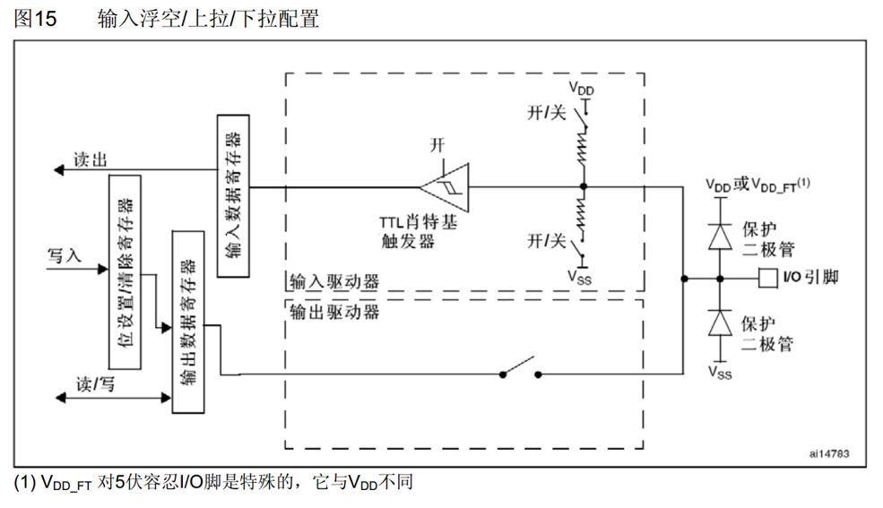


#### 模拟输入：

模拟输入状态，施密特触发器关了数字信号输入断开，输出也是是断开的，只能输入模拟信号，从引脚直接接到了片上外设，即ADC上。所以我们使用ADC的时候就把引脚配置为模拟输入，其他时候一般用不到模拟输入。

**8个模式中，只有模拟输入会关掉数字输入功能，其他7个模式都是开着的**。

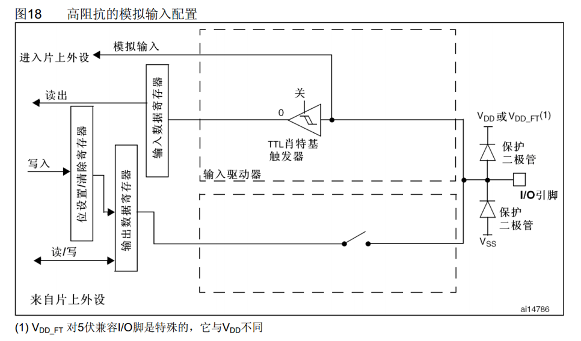


#### 开漏/推挽输出：

输出模式下，输入模式也有效，但是输入模式的输出却是断开的，这是因为一个端口只能有一个输出，但可以有多个输入。

开漏输出：只有低电平0能有效输出，导通后直接接地VSS，VDD端的P-MOS高阻态，相当于断开。

推挽输出：高电平和低电平均有效，输出控制端有**反相器**，把输出数据寄存器电压取反进行MOS控制。

- 输出数据寄存器输出1，P-MOS导通，输出高电平VDD。N-MOS截止断开。
- 输出数据寄存器输出0，N-MOS导通，输出低电平VSS。P-MOS截止断开。

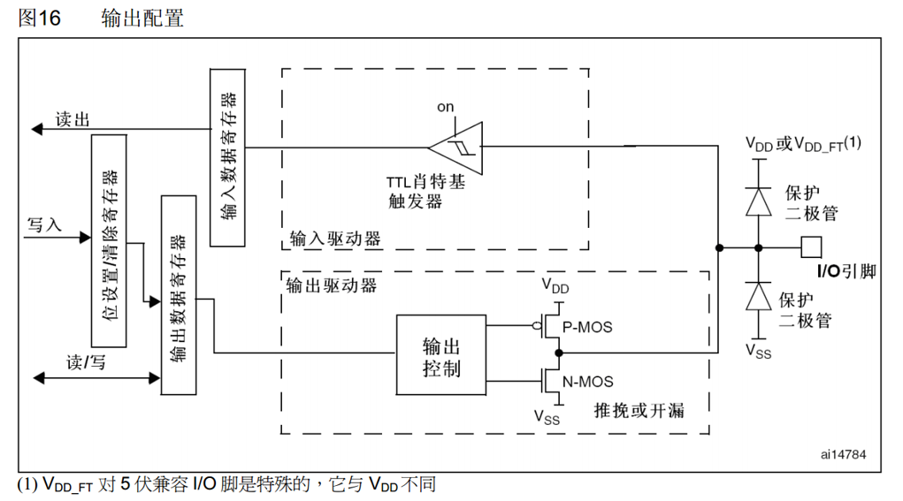


#### 复用开漏/推挽输出：

和上面的一样，但是电平由片上外设进行控制，即定时器、ADC、I2C之类的芯片硬件资源。

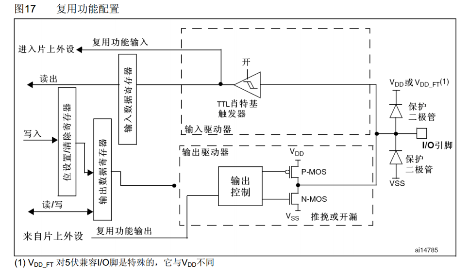


### IO口频率：


**面包板**：

有的面包板中间是断开的，需要跳线连接。

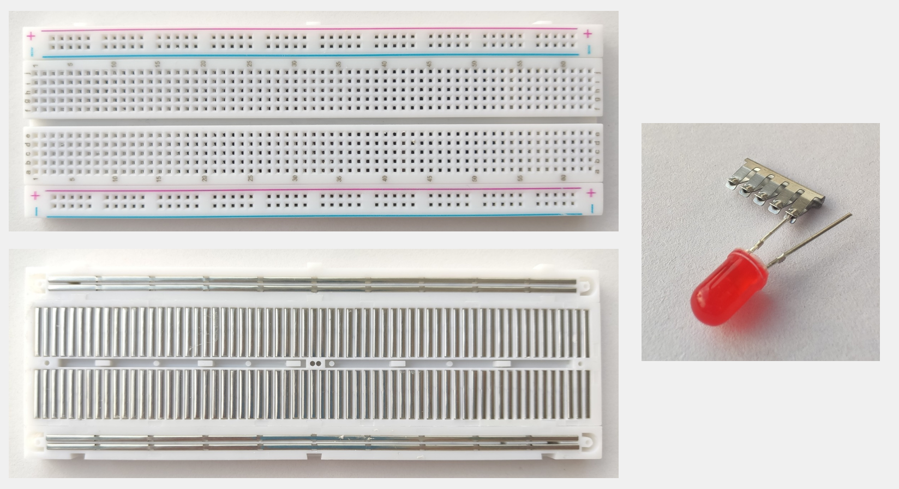


**按键简介**：

按键：常见的输入设备，按下导通，松手断开  

按键抖动：由于按键内部使用的是机械式弹簧片来进行通断的，所以在按下和松手的瞬间会伴随有一连串的抖动  

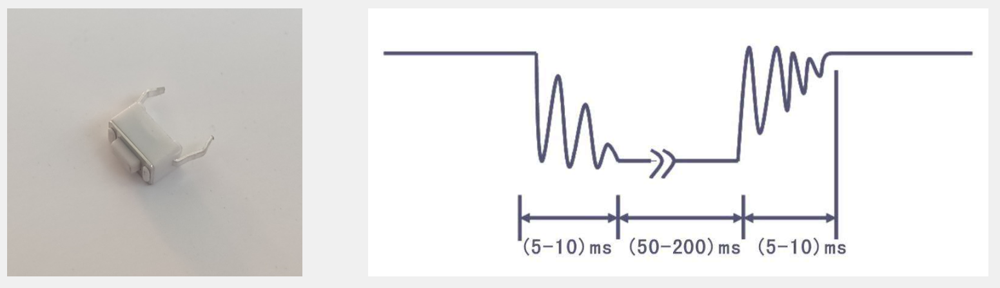


**LED和蜂鸣器简介**：  

LED：发光二极管，正向通电点亮，反向通电不亮  

有源蜂鸣器（STM32用的就是，就是下图有圆形有孔洞的那个）：内部自带振荡源，将正负极接上直流电压即可持续发声，频率固定  

无源蜂鸣器（51单片机用过）：内部不带振荡源，需要控制器提供振荡脉冲才可发声，调整提供振荡脉冲的频率，可发出不同频率的声音  

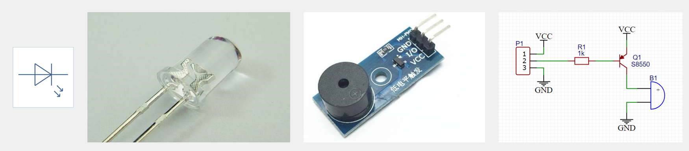


**LED和蜂鸣器硬件电路**：

上面的两个都是低电平点亮

下面的两个都是高电平点亮

左边的两个，限流电阻都是要接的，防止电流过大烧毁，也可以用来调节LED亮度，太亮了就可以增大阻值。

具体选择那个要看电平的驱动能力，推挽输出模式就高低电平都有驱动能力，所以两种接法都可以，但是单片机一般都使用第一种，即低电平驱动接法：高电平弱驱动，低电平强驱动，可以一定程度上可以避免高低电平打架。

功率稍微大一点，直接用IO口驱动会导致STM32负担过重，这时可以用三极管驱动电路来完成驱动任务。

- 右上角PNP管，给低电平导通。

- 右下角NPN管，给高电平导通。
- 左边基极，带箭头的发射极，剩下的是集电极。被驱动元件一般都放在集电极，因为三极管的通断，是需要在发射极和基极直接产生一定的开启电压，发大状态的时候驱动能力强。

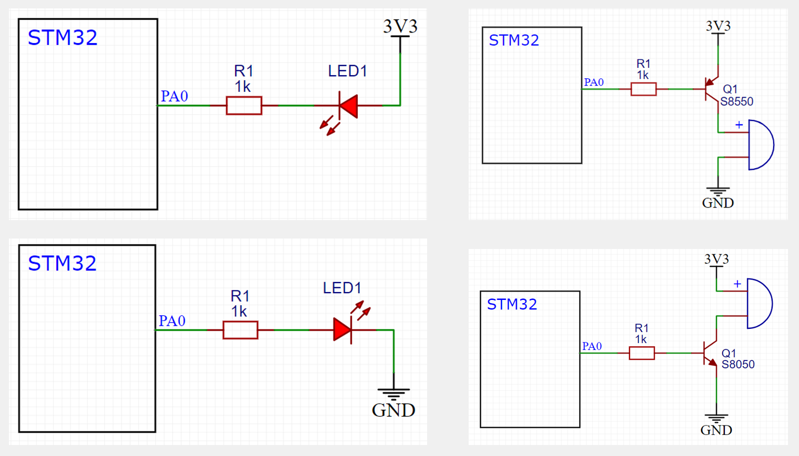


**传感器模块简介**：

传感器模块：传感器元件（光敏电阻/热敏电阻/红外接收管等）的电阻会随外界模拟量的变化而变化，通过与定值电阻分压即可得到模拟电压输出，再通过电压比较器进行0或1的二值化即可得到数字电压输出。

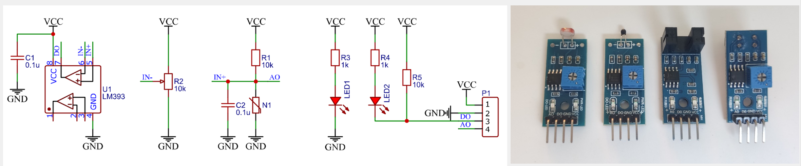


**传感器硬件电路**：

左上两个是弱上拉：默认高电平，k1按下直接为低电平0。

左下两个是弱下拉，默认低电平，k1按下直接为高电平1。

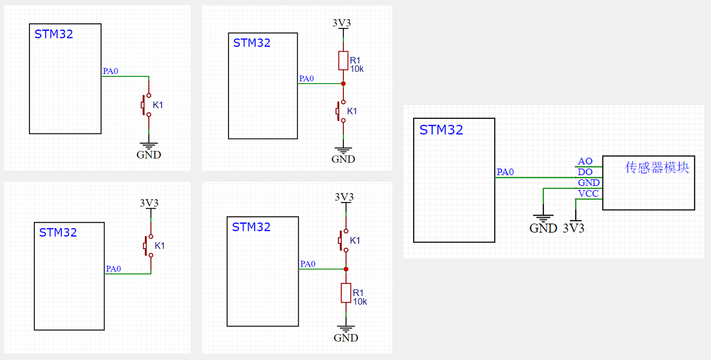


### GPIO寄存器：

- **端口配置低寄存器**(GPIOx_CRL) (x=A..E)  ：配置端口低位0~7的输入、输出模式和输出速度。

- **端口配置高寄存器**(GPIOx_CRH) (x=A..E)  ：配置端口高位8~15的输入、输出模式和输出速度。

- **端口输入数据寄存器**(GPIOx_IDR) (x=A..E)  ：IDRy[15:0]：端口输入数据(y = 0…15)，只读并只能以字(16位)的形式读出。读出的值为对应I/O口的状态。

- **端口输出数据寄存器**(GPIOx_ODR) (x=A..E)  ：ODRy[15:0]：端口输出数据(y = 0…15) ，可读可写并只能以字(16位)的形式操作。

  > 注：GPIOx_BSRR(x = A…E)，可以分别地对各个ODR位进行独立的设置/清除

- **端口位设置/清除寄存器**(GPIOx_BSRR) (x=A..E) （高位清除，低位置1） ：

  - **BRy清除端口x的位y (y = 0…15)**：写0无效，写1端口置0
  - **BSy设置端口x的位y (y = 0…15)**：写0无效，写1端口置1

  > 注：如果同时设置了BSy和BRy的对应位， BSy位起作用，就是**两个电平设置冲突，最后还是置高电平**。

- **端口位清除寄存器**(GPIOx_BRR) (x=A..E)  ：BRy清除端口x的位y (y = 0…15)，写0无效，写1端口置0，就是这个寄存器只能控制端口置0

- **端口配置锁定寄存器**(GPIOx_LCKR) (x=A..E)  ：

  - **LCKK锁键 Lock key**：该位为1代表端口配置锁键位被激活，下次**系统复位前GPIOx_LCKR寄存器被锁住**。

    锁键的写入序列（上锁）：写1 -> 写0 -> 写1 -> 读0 -> 读1

  - **LCKy端口x的锁位y(y = 0…15)** ：就是选择位配置为锁定状态，这些位可读可写但只能在LCKK位为0时写入。


**AFIO复用功能I/O和调试配置  **：

为了优化64脚或100脚封装的外设数目，可以把一些**复用功能重新映射到其他引脚上（相当于键盘的一些键有多个字符，按shift就可以选择另一个字符）**。设置复用重映射和调试I/O配置寄存器(AFIO_MAPR)实现引脚的重新映射。这时，**复用功能不再映射到它们的原始分配上（即失去原复用功能，只能做IO口了）**。  

可以复用重映射的引脚和外设有：

- OSC32_IN 或 OSC32_OUT 引脚作为 GPIO 端口 PC14 或 PC15
- OSC_IN 或 OSC_OUT 引脚作为 GPIO端口PD0 或 PD1  
- CAN1 、CAN2 的输入、输出引脚
- JTAG/SWD  
- ADC  
- 定时器  
- USART  
- I2C1  
- SPI1 和SPI3 
- 以太网  


### **AFIO寄存器**：

- **事件控制寄存器**(AFIO_EVCR)  :
  - **EVOE允许事件输出**：该位可由软件读写。当设置该位后， Cortex的EVENTOUT将连接到由PORT[2:0]和PIN[3:0]选定的I/O口。
  - **PORT[2:0]端口选择**：选择事件输出的端口，PA~PE。
  - **PIN[3:0]引脚选择(x=A…E)** ：选择事件输出的引脚，Px0~Px15。
- **复用重映射和调试I/O配置寄存器**(AFIO_MAPR)  ：寄存器映像和位定义  ，选择引脚解除原定外设的功能（只有部分可以设置解除），再根据定义选择功能映像到规定的引脚。
- **外部中断配置寄存器 1** (AFIO_EXTICR1)  ：选择EXTIx外部中断的输入源EXTI0~EXTI3，四个中断通道。
- **外部中断配置寄存器 2** (AFIO_EXTICR2)    ：选择EXTIx外部中断的输入源EXTI4~EXTI7，四个中断通道。
- **外部中断配置寄存器 3** (AFIO_EXTICR3)    ：选择EXTIx外部中断的输入源EXTI8~EXTI11，四个中断通道。
- **外部中断配置寄存器 4** (AFIO_EXTICR4)    ：选择EXTIx外部中断的输入源EXTI12~EXTI15，四个中断通道。


## 04-OLED调试工具

**调试方式**：

- 串口、usb调试：通过串口、usb通信，将调试信息发送到电脑端，电脑使用串口助手、上位机等软件显示调试信息

- 显示屏调试：直接将显示屏连接到单片机，将调试信息打印在显示屏上

- Keil调试模式：借助Keil软件的调试模式，可使用单步运行、设置断点、查看寄存器及变量等功能


**OLED简介**：

OLED（Organic Light Emitting Diode）：有机发光二极管

OLED显示屏：性能优异的新型显示屏，具有功耗低、相应速度快、宽视角、轻薄柔韧等特点

0.96寸OLED模块：小巧玲珑、占用接口少、简单易用，是电子设计中非常常见的显示屏模块

供电：3~5.5V，通信协议：I2C/SPI（4脚的I2C，7脚的SPI），分辨率：128*64

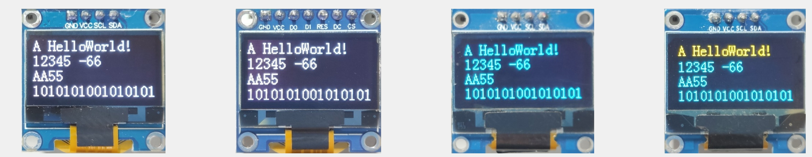


**硬件电路**：

4针脚是I2C通讯，7针脚是SPI通讯

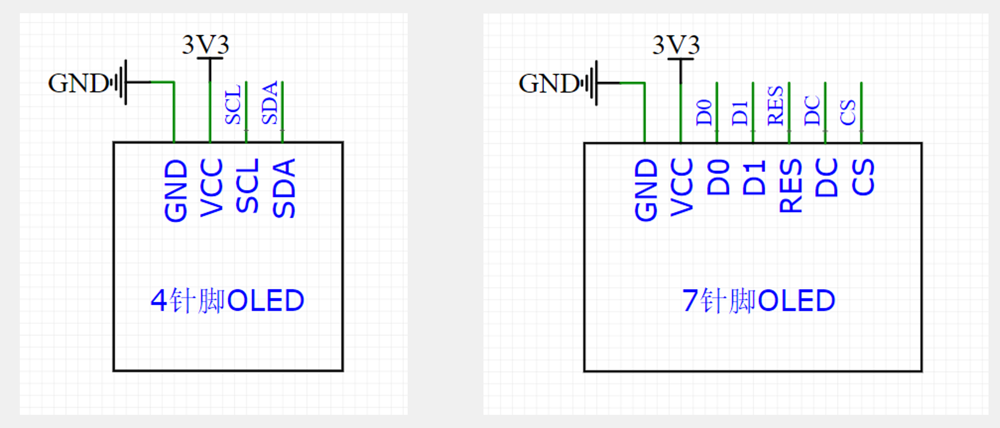


**OLED驱动函数**：

驱动代码和LCD1602类似

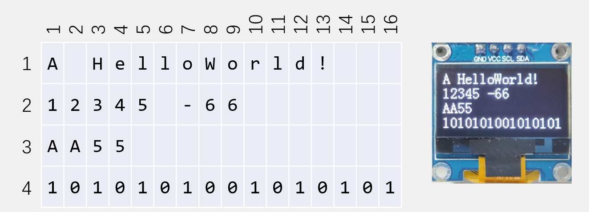

| **函数**                               | **作用**             |
| -------------------------------------- | -------------------- |
| OLED_Init();                           | 初始化               |
| OLED_Clear();                          | 清屏                 |
| OLED_ShowChar(1,  1, 'A');             | 显示一个字符         |
| OLED_ShowString(1,  3, "HelloWorld!"); | 显示字符串           |
| OLED_ShowNum(2,  1, 12345, 5);         | 显示十进制数字       |
| OLED_ShowSignedNum(2, 7, -66, 2);      | 显示有符号十进制数字 |
| OLED_ShowHexNum(3, 1, 0xAA55, 4);      | 显示十六进制数字     |
| OLED_ShowBinNum(4, 1, 0xAA55, 16);     | 显示二进制数字       |


 

## 05-EXTI外部中断

**中断系统**：

中断：在主程序运行过程中，出现了特定的中断触发条件（中断源），使得CPU暂停当前正在运行的程序，转而去处理中断程序，处理完成后又返回原来被暂停的位置继续运行  

中断优先级：当有多个中断源同时申请中断时，CPU会根据中断源的轻重缓急进行裁决，优先响应更加紧急的中断源  

中断嵌套：当一个中断程序正在运行时，又有新的更高优先级的中断源申请中断，CPU再次暂停当前中断程序，转而去处理新的中断程序，处理完成后依次进行返回  


**中断执行流程**：

主程序运行中，但是有中断信号过来，CPU直接跑去执行中断的程序。这时候如果有抢占优先级高的中断程序触发，又会直接跑到嵌套的第二个中断程序去执行，执行完成，返回第一个中断程序继续执行，完成后，才能回到主程序从断点继续执行。

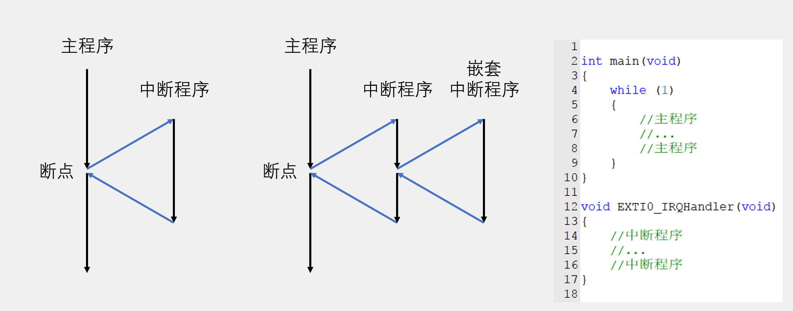


**STM32中断**：

68个可屏蔽中断通道，包含EXTI、TIM、ADC、USART、SPI、I2C、RTC等多个外设

使用NVIC统一管理中断，每个中断通道都拥有16个可编程的优先等级，可对优先级进行分组，进一步设置抢占优先级和响应优先级。

下图是中断向量表，阴影部分是内核中断，我们不用管。如果出现优先级冲突，程序不管先来后到，按照下表的顺序执行优先执行。stm32f10x.h的里typedef enum IRQn有定义。


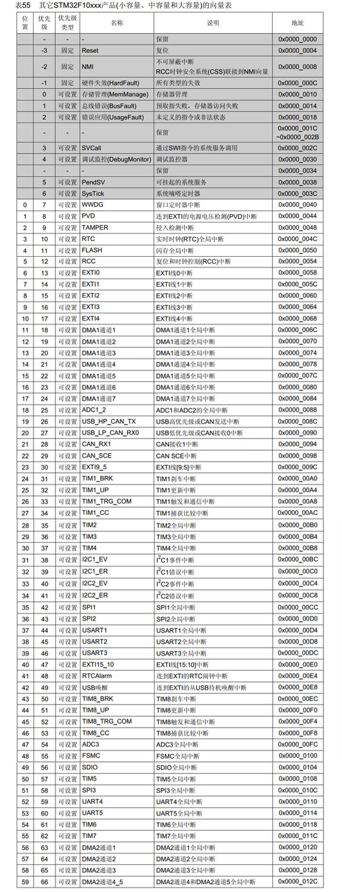


**NVIC基本结构**：

NVIC是内核里的，不需要我们开启时钟，设置寄存器功能就行。

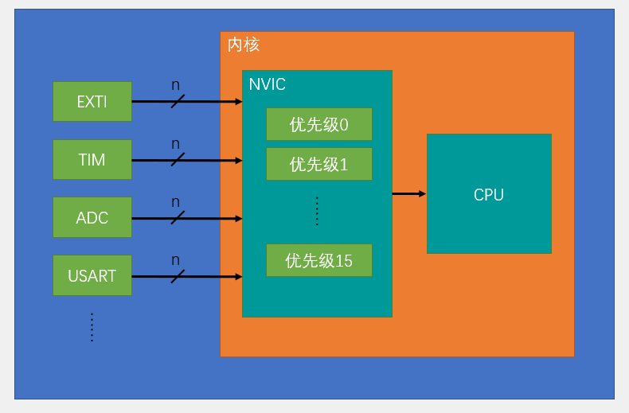


**NVIC优先级分组**：

优先级有两种，抢占优先级和响应优先级（子优先级），**值越低，优先级越高**

NVIC的中断优先级由优先级寄存器的4位（0~15）决定，这4位可以进行切分，分为高n位的抢占优先级和低4-n位的响应优先级（其实就是4bit位的二进制，进行地盘划分，然后各自进位）

- 分组0：抢占优先级就是二进制的0000（最高）其他啥都没分到（没有进步空间），响应优先级就是0000到1111的进位都给它吃独食占完了。
- 分组2：4位二进制数对半分，抢占优先级得到了2位可以进位为`00,01,10,11`。响应优先级也得2位可以进位为`00,01,10,11`。对应转换十进制都是0~3。主打一个平均。

只有**抢占优先级**可以嵌套，抢占优先级高的可以**中断嵌套**，中断同时到达的话抢占 和 抢占相比优先级相同的这时候要对比响应优先级，内核就会首先响应，响应优先级别更高的中断，优先级低的也得排队。

**响应优先级**高的可以**优先排队**，抢占优先级和响应优先级均相同的按向量表中断号顺序执行（已验证，是先来后到（×），还是按照中断号（√））

具体分配要看你是想要**可直接插入中断程序**的**中断嵌套**多，还是**可等待执行程序**的**响应中断**多。整个项目的程序优先级分组只能选一个，即选择了分组0，所有模块的抢占优先级只能取值0（默认最高），响应优先级优先级可以选择0~15。

| **分组方式** | **抢占优先级**  | **响应优先级**  |
| ------------ | --------------- | --------------- |
| 分组0        | 0位，取值为0    | 4位，取值为0~15 |
| 分组1        | 1位，取值为0~1  | 3位，取值为0~7  |
| 分组2        | 2位，取值为0~3  | 2位，取值为0~3  |
| 分组3        | 3位，取值为0~7  | 1位，取值为0~1  |
| 分组4        | 4位，取值为0~15 | 0位，取值为0    |


**EXTI简介**：

EXTI（Extern Interrupt）外部中断

EXTI可以监测指定GPIO口的电平信号，当其指定的GPIO口产生电平变化时，EXTI将立即向NVIC发出中断申请，经过NVIC裁决后即可中断CPU主程序，使CPU执行EXTI对应的中断程序

支持的触发方式：上升沿/下降沿/双边沿/软件触发

支持的GPIO口：所有GPIO口，**但相同编号的Pin不能同时触发中断**，即PA0和PB0不能同时配置为外部中断，因为同位号的引脚都挂载在同一个外部中断总线上，只有一个位可以分配使用。（具体看AFIO的外部中断通用I/O映像  ）

通道数：**16个GPIO_Pin**，外加**PVD输出、RTC闹钟、USB唤醒、以太网唤醒**等4个，共20个中断通道

触发响应方式：中断响应/事件响应

**EXTI不需要时钟**，不用RCC开启时钟，所以可以用于停止模式下的外部中断唤醒。

**不要在中断函数和主函数调用相同的函数或者操作同一个硬件**，尤其是硬件相关的函数，比如OLED显示。如果在主函数调用OLED和中断里也调用，那么在主函数执行中突然进中断了，那么显示的内容就转到其他地方显示了。这样中断结束后，回到主函数继续执行时，因为硬件显示内容被挪到其他位置了，后续显示的内容就会变成在其他的地方显示了。（数据被转接走了）所以中断函数可以只对标志位和变量做些临时储存操作，中断返回时在对这个变量进行显示和操作。


**EXTI基本结构**：

配置从左到右一直打通过去，就可以中断了，EXTI寄存器没有开启位，也不用我们配置时钟开启（可能和唤醒有关？待查证是因为什么）

GPIO在EXTI里只有16个AFIO选择的通道，加上PVD、RTC、USB、ETH等4个，就是一共20个中断通道。

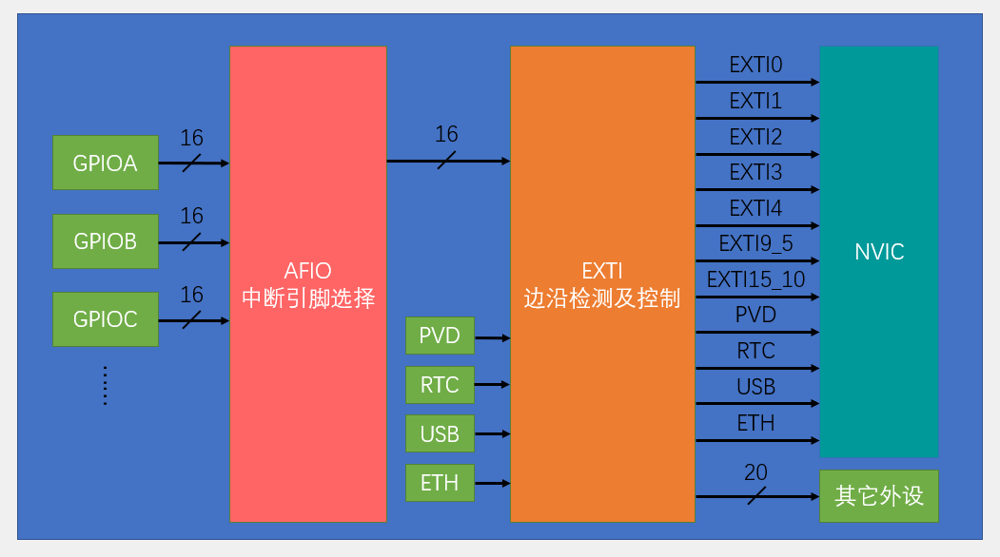


**AFIO复用IO口**：

AFIO主要用于**引脚复用功能的选择和重定义**

在STM32中，AFIO主要完成三个任务：**复用功能引脚重映射、外部中断引脚选择**、**控制事件是否输出**。

从下图就可以看出，为什么PA0和PB0等等端口号相同的不能用作中断了，因为在AFIO里它们是连在同一个数据选择器（梯形图）上的，上面的控制端寄存器选一个作为输出给到EXTIx。  


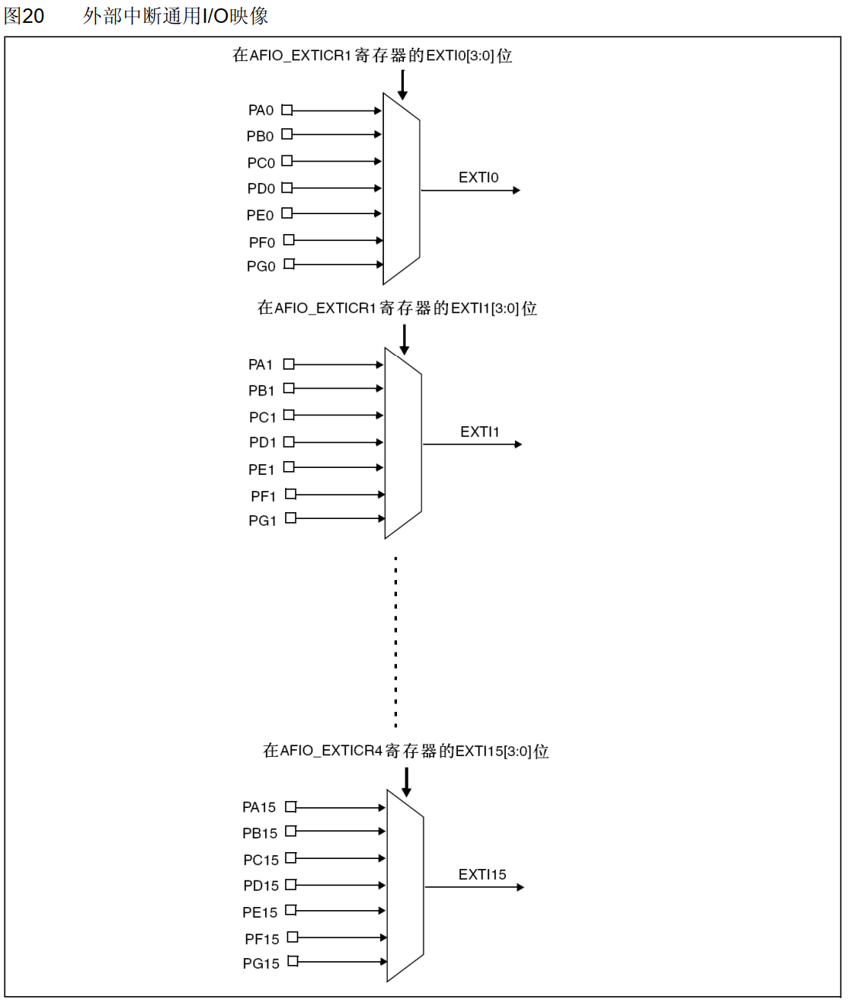


**EXTI框图**：

这个图从右下角的输入线看起，带/20的线指的是20个信号接口。

上升沿和下降沿寄存器负责检测硬件（引脚或外设）的输入信号

**输入线**代表的是**外部硬件触发**，**软件中断事件寄存器**代表的是**内部软件触发**，它们两个都经过**或门**，即两个任意一个有高电平信号并且中断或事件屏蔽使能了就可以触发。

**请求挂起寄存器**，当在外部中断线上发生了选择的边沿事件，该位被置’1’。相当于状态寄存器，可以读取状态。并且配合中断屏蔽寄存器通过**与门（相当于开关）**使能NVIC中断控制器。

**屏蔽寄存器**相当于使能寄存器，中断屏蔽寄存器**使能中断**，事件屏蔽寄存器**使能事件**。

脉冲发生器后面阶段是外设，给其他外设提供电平脉冲信号（就是一段高低电平），触发外设运行的。

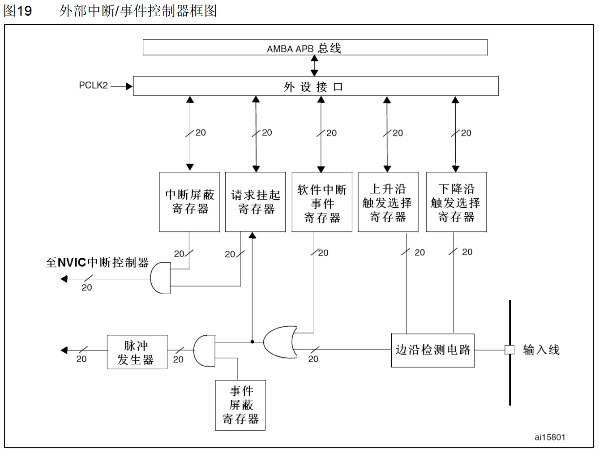


**旋转编码器简介**：

旋转编码器：用来测量位置、速度或旋转方向的装置，当其旋转轴旋转时，其输出端可以输出与旋转速度和方向对应的方波信号，读取方波信号的频率和相位信息即可得知旋转轴的速度和方向。

类型：机械触点式/霍尔传感器式/光栅式

像**编码器**这种外部的**突发**，转瞬即逝晚一些就**容易错过**，STM32只能**被动读取的信号和波形**，就需要用的外部中断。

而像按键这种对于单片机来说信号不是转瞬即逝的，并且不好处理信号抖动的问题的，就不建议使用外部中断，可以使用定时器或者其他方法配置。

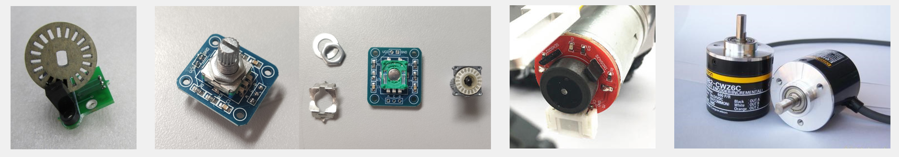


**编码器硬件电路**：

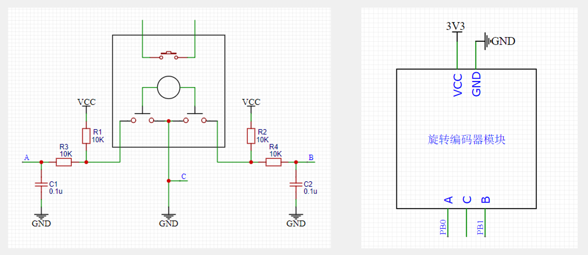


**EXTI寄存器**：

注：位19只适用于互联型产品，对于其它产品为保留位。

x代表位是个变量

- **屏蔽寄存器**

  - **中断**屏蔽寄存器(EXTI_IMR)  ：MR0~18，线MRx上的中断屏蔽，1是开放，0是屏蔽。

  - **事件**屏蔽寄存器(EXTI_EMR)  ：MR0~18，线MRx上的事件屏蔽，1是开放，0是屏蔽。

- **边沿触发寄存器**：外部唤醒线是边沿触发的，这些线上不能出现毛刺信号。 在写寄存器时，在外部中断线上的边沿信号不能被识别，挂起位不会被置位。在同一中断线上，可以同时设置上升沿和下降沿触发。即任一边沿都可触发中断。   

  - **上升沿**触发选择寄存器(EXTI_RTSR)  ：TR0~18，线TRx上的**上升沿**触发事件配置位，1是允许输入线x上的上升沿触发(中断和事件)，0是禁止。

  - **下降沿**触发选择寄存器(EXTI_FTSR)  ：TR0~18，线TRx上的**下升沿**触发事件配置位，1是允许输入线x上的下升沿触发(中断和事件)，0是禁止。

- **软件中断事件寄存器(EXTI_SWIER)**  ：

  SWIER0~18：线SWIERx上的软件中断

  当该位为’0’时，写’1’将设置EXTI_PR中相应的挂起位。

  如果在EXTI_IMR和EXTI_EMR中允许产生该中断，则此时将产生一个中断。

  > 注：通过清除EXTI_PR的对应位(写入’1’)，可以清除该位为’0’。

- **挂起寄存器(EXTI_PR)**  ：

  PR0~18挂起位 

  当在外部中断线PRx上发生了选择的边沿事件，该位被置’1’，1代表发生了选择的触发请求。
  
  在该位中写入’1’可以清除它，也可以通过改变边沿检测的极性清除。


## 06-TIM定时器

**TIM简介**：

TIM（Timer）定时器

定时器可以对输入的时钟进行计数，并在计数值达到设定值时触发中断

**16位计数器、预分频器、自动重装寄存器**（计数目标）的**时基单元**，在72MHz计数时钟下经过分频可以实现最大59.65s的定时。可以级联定时器，就是定时器的输出是另一个定时器的输入，结果就是59.65s\*65536*65536 = 8千年（待验证）

- 内部时钟主频72MHz，预分配器和自动重装寄存器都是16位的最高设置65536（因为是从0开始计数，所以写入0就是1，写入65535就是65536），主频 除以 最高分频和最高重装值，就是最小频率，1除以这个最小频率就是最大计数时间，即大概59.65秒才能有1Hz，定时器才溢出一次。
- 72MHz/65536/65536 = 0.01676380634307861328125Hz
- 1秒 ÷ 0.01676380634307861328125 = 59.652323555555555555555555555556秒

不仅具备基本的**定时中断功能**，而且还包含**内外时钟源选择、输入捕获、输出比较、编码器接口、主从触发模式**等多种功能  

根据复杂度和应用场景分为了**高级定时器、通用定时器、基本定时器**三种类型

**每个定时器都是完全独立的，没有互相共享任何资源**。它们可以**一起同步操作**，参考手册定时器篇   


**定时器类型**：

| **类型**   | **编号**               | **总线** | **功能**                                                     |
| ---------- | ---------------------- | -------- | ------------------------------------------------------------ |
| 高级定时器 | TIM1、TIM8             | APB2     | 拥有通用定时器全部功能，并额外具有重复计数器、死区生成、互补输出、刹车输入等功能 |
| 通用定时器 | TIM2、TIM3、TIM4、TIM5 | APB1     | 拥有基本定时器全部功能，并额外具有内外时钟源选择、输入捕获、输出比较、编码器接口、主从触发模式等功能 |
| 基本定时器 | TIM6、TIM7             | APB1     | 拥有定时中断、主模式触发DAC的功能                            |

- STM32F103C8T6定时器资源：TIM1、TIM2、TIM3、TIM4
- 这个芯片只有**1个高级定时器TIM1，3个通用定时器TIM2、TIM3、TIM4，没有基本定时器**，库函数中还有其他更多定时器的定义，但STM32F103C8T6这个型号是用不到的。所以**写程序的时候要看下是否有这个外设**。


**基本定时器**：

基本定时器只有一个时钟源就是内部时钟，可以直接通过TRGO去触发DAC（数模转换）。

基本定时器计数中断模式，只有**向上计数一种**。

预分频器的值给0不分频，但实际是1分频72MHz，给1是2分频72MHz / 2 = 36MHz，和实际的分频系数相差1（从0开始），所以要减1，更高的以此类推，最高是65536（65536-1或者直接写65535）。

计数器向上计数和自动重装载寄存器（目标值）进行比较。

**右下脚的UI箭头是更新中断和DMA，中断触发会前往NVIC。U箭头是更新事件，不会触发中断，但是可以触发其他电路的工作。**

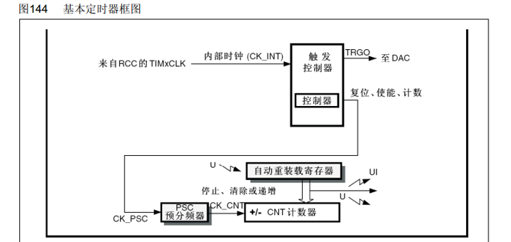


**通用定时器**：

计数器时钟可由下列时钟源提供：  

- 内部时钟(CK_INT)

- 外部时钟模式1：外部输入引脚ITRx、TIx、ETR三路。

- 外部时钟模式2：外部触发输入ETR

- 内部触发输入(ITRx)：使用一个定时器作为另一个定时器的预分频器。如可以配置一个定时器Timer1，作为另一个定时器Timer2的预分频器。

同一个定时器的输入捕获和输出比较功能，不能同时使用，因为它们的引脚 和 捕获/比较寄存器是共用的。其他的定时器不受影响（因为**每个定时器都是独立的**）。

输入捕获还可以把TIMx_CH1、 TIMx_CH2和TIMx_CH3引脚都经过异或（相同为0，不同为1）后连到TI1输入。

像**预分配器、自动重装寄存器、捕获和比较寄存器**等有阴影的器件都是带缓冲寄存器的，缓冲是指修改了分频或者重装值时，等到上一个事件结束后才更新值，没有缓冲的话更新了值后就直接变化，后续程序直接就按照更新后的值运行了，可以自己设置是否使用。

通用定时器和高级定时器，都有**向上计数、向下计数、中央对齐计数**，这三种计数中断模式。

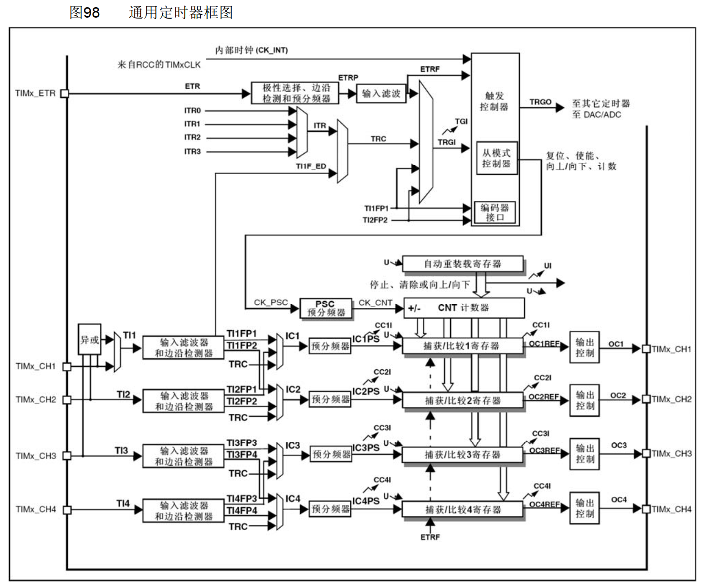


**高级定时器**：

相比通用定时器增加了最下面到右下角的一小部分电路。

**重复次数计数器**，对计数器的溢出次数进行计数（相当于再分频)，计数值是0~255，可以最高乘256倍。这个计数器是向下计数的，即定下目标值开始减，减到0触发更新事件或中断。

**DTG死区生成**寄存器，驱动三相无刷电机用的，**输出互补的PWM波**，控制桥式MOS管。防止开关切换瞬间，器件不理想导致的短暂直通，死区时长跳过这段时间。（**只有CH通道1-3有，CH通道4是没有的**）

**刹车输入**，**BKIN引脚出现刹车信号**，或者**内部时钟失效**等其中任意一个或多个产生了故障就会自动**立刻切断引脚的输出**，如果最后是电机的那就是立刻停止电机转动，防止意外。

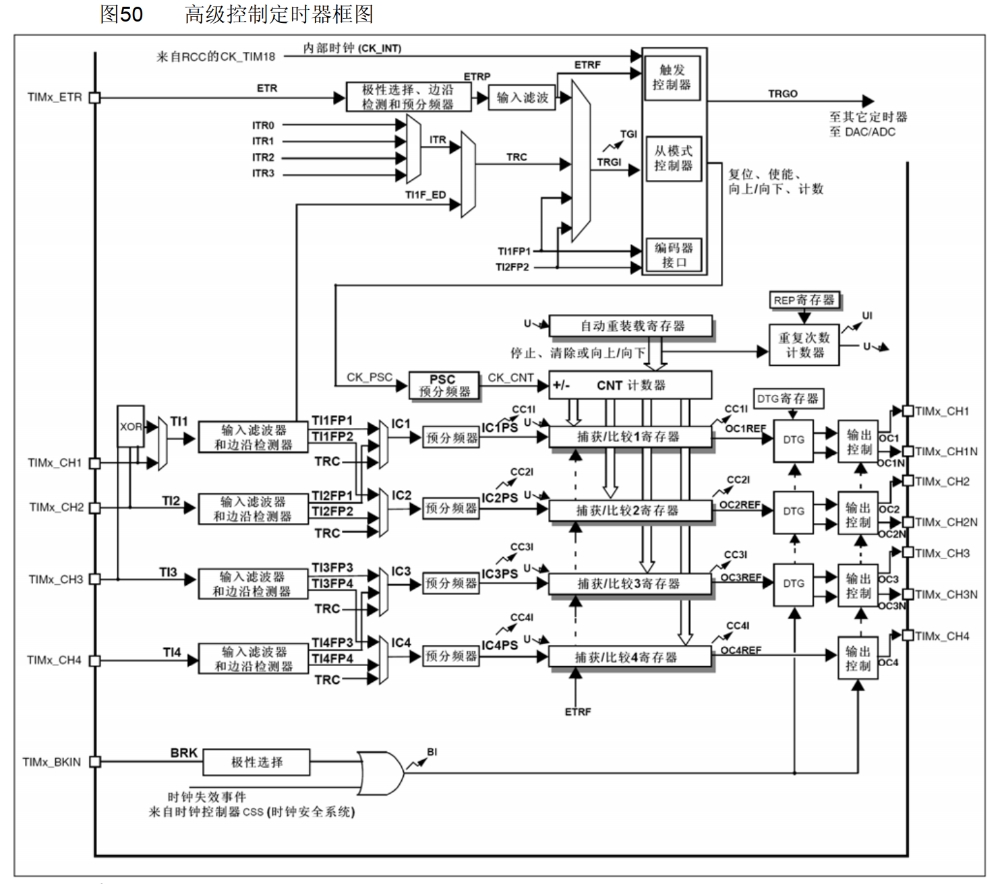


**定时中断基本结构**：

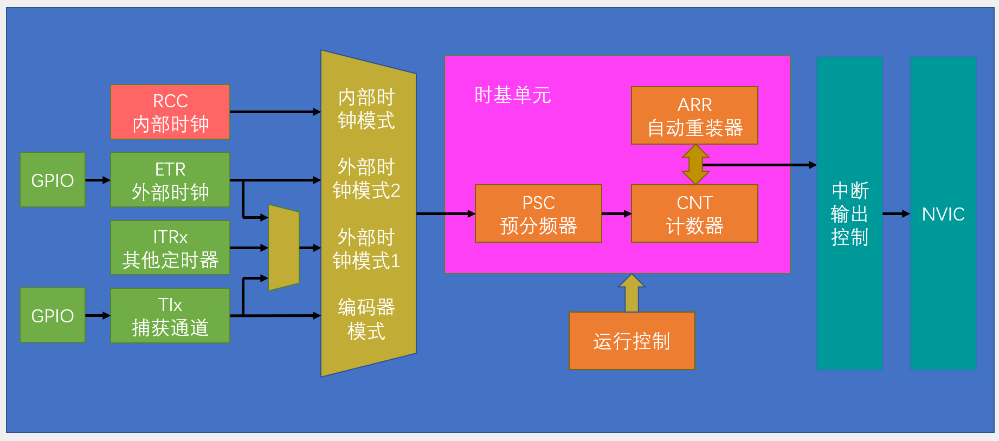


**预分频器时序**：

预分频器可以将计数器的时钟频率按1到65536之间的任意值分频。它是基于一个(在TIMx_PSC寄存器中的)16位寄存器控制的16位计数器。    

因为计数器是从0开始的，所以0也算一个数，导致写入寄存器的值默认是+1的。  

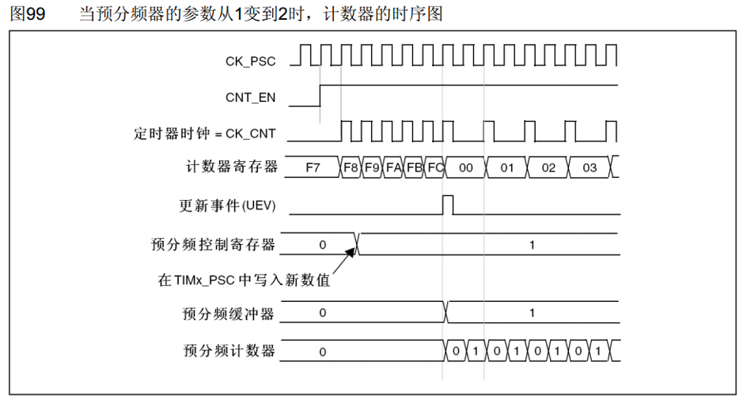

```
因为计数器是每来一个时钟频率计数值+1，所以想要得出计数频率，就是时钟频率 除以 分频系数。

计数器计数频率：CK_CNT = CK_PSC / (PSC + 1)

如：时钟频率是72MHz，而分频系数是72的话，计数频率就是1MHz，即每秒可以计数1000000次。
CK_CNT = 72MHz / (71 + 1) = 1MHz
```


**计数器时序**：

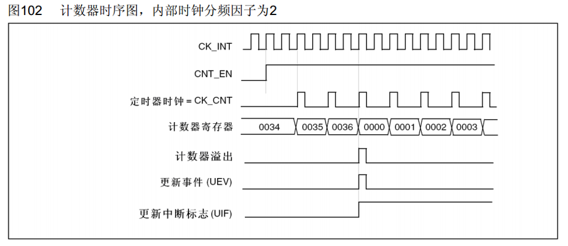

```
所谓溢出频率，就是以计数器频率，向上或许向下、中央对齐等计数方式，把数值加或者减跟到重装载寄存器值（目标值）后会溢出一次，这个溢出次数就看时钟频率是快还是慢，快的就可以溢出多次。

计数器溢出频率：CK_CNT_OV = CK_CNT / (ARR + 1)
					   = CK_PSC / (PSC + 1) / (ARR + 1)
					   
如：
（1）计数器频率是1MHz，重装载寄存器值是10000，结果就是100，即这个频率每秒可以溢出100次，触发100个的事件。
CK_CNT_OV = 1000000 / (9999 + 1) = 100Hz

（2）计数器频率是10000，重装载寄存器值是10000，结果就是1，即这个频率每秒可以溢出1次，触发1个的事件。
CK_CNT_OV = 10000 / (9999 + 1) = 1Hz
```


**计数器无预装时序**：

没有使用影子寄存器，ARR目标值一改变后，如果在计数到这个目标数小的话是直接到这个目标值（如下图的36）就溢出（向上计数），而如果已经过了这个目标值就要继续计数，一直到FF后重新置0，再向上计数到那个目标值，这样出现计数到目标值的用时变多了的情况。

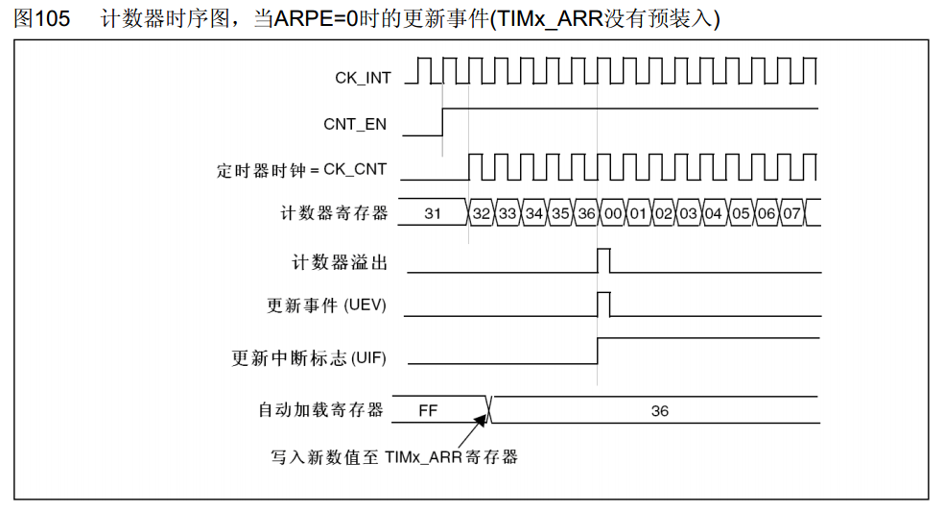


**计数器有预装时序**；

有了影子寄存器后，自动加载寄存器就会继续保持计数到修改前的原目标值F5，计数到F5后再变化目标值。

如果没有影子寄存器，像目标值F5修改被立即修改为36，而当时计数到F5附近，当时的计数值比目标值36大的话，就会造成计算到FF或者最后的值变回0后再计数到36，这样就会导致时序不同步。

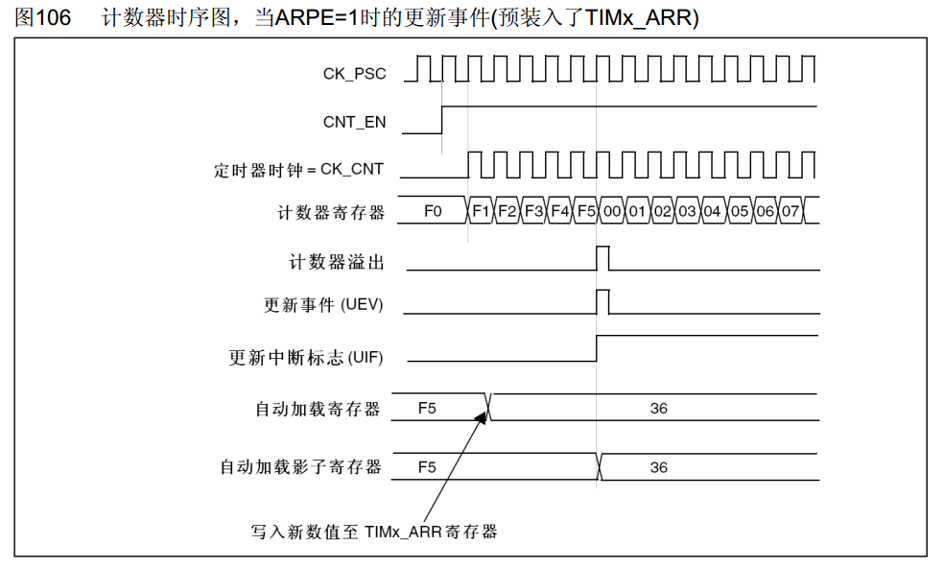


**RCC时钟树**：

SystemInit就是配置这个时钟树的函数，而ST公司帮我们写好了这个时钟树的配置文件，就是system_stm32f10x文件。

HSI，内部的8MHz RC高速晶振： 系统时钟

HSE，外部高速晶振：时钟4-16MHz HSE OSC，一般是8MHz。右边的AHB总线及后面的APB线，时钟频率之所以有72MHz，就是因为8MHz的外部高速时钟经过PLL锁相环乘以9倍频后得出的。

LSE，外部低速晶振：时钟32.768KHz给RTC提供时钟（当然给RTC提供时钟来源的还有外部高速时钟、和40kHz时钟）

LSI，内部的40KHz低速晶振：给看门狗提供时钟

MCO是时钟输出，就是时钟信号给别的芯片使用。

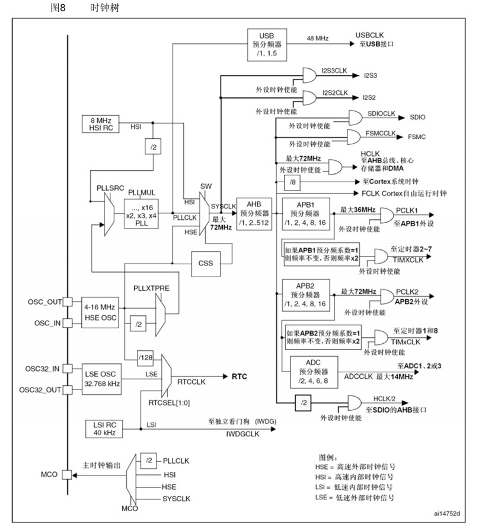


**输出比较简介**：

OC（Output Compare）输出比较

输出比较可以通过比较CNT与CCR寄存器值的关系，来对输出电平进行置1、置0或翻转的操作，用于输出一定频率和占空比的PWM波形

每个高级定时器和通用定时器都拥有4个输出比较通道

**高级定时器的前3个通道**额外拥有**死区生成**和**互补输出**的功能，普通定时器和通用定时器都没有。


**PWM简介**：

PWM（Pulse Width Modulation）脉冲宽度调制

在具有惯性的系统中，可以通过对一系列脉冲的宽度进行调制，来等效地获得所需要的模拟参量，常应用于电机控速等领域

PWM参数：

   频率 = 1 / T_S      占空比 = T_ON / T_S      分辨率 = 占空比变化步距

T_S是1个周期时间  

T_ON是周期内的高电平占比  

分辨率100%变化是以1%，2%，3%每次都是±1的话，那就是百分之1的分辨率。每次变化如果以1.1%、1.2%、1.3%等等这样以0.1%的步距跳变的话，那就是百分之0.1的分辨率。


一般来说PWM的频率都在几K到几十KHz，这个频率就已经足够快了，**人耳能听到的频率就是20Hz - 20KHz**。


**输出比较通道(高级)**：

.png)


**输出比较通道(通用)**：

.png)


**输出比较模式**：

CNT计数值，CCR比较值

| **模式**         | **描述**                                                     |
| ---------------- | ------------------------------------------------------------ |
| 冻结             | CNT=CCR时，REF保持为原状态                                   |
| 匹配时置有效电平 | CNT=CCR时，REF置有效电平                                     |
| 匹配时置无效电平 | CNT=CCR时，REF置无效电平                                     |
| 匹配时电平翻转   | CNT=CCR时，REF电平翻转                                       |
| 强制为无效电平   | CNT与CCR无效，REF强制为无效电平                              |
| 强制为有效电平   | CNT与CCR无效，REF强制为有效电平                              |
| PWM模式1         | 向上计数：CNT<CCR时，REF置有效电平，CNT≥CCR时，REF置无效电平 |
| PWM模式1         | 向下计数：CNT>CCR时，REF置无效电平，CNT≤CCR时，REF置有效电平 |
| PWM模式2         | 向上计数：CNT<CCR时，REF置无效电平，CNT≥CCR时，REF置有效电平 |
| PWM模式2         | 向下计数：CNT>CCR时，REF置有效电平，CNT≤CCR时，REF置无效电平 |


**PWM基本结构**：

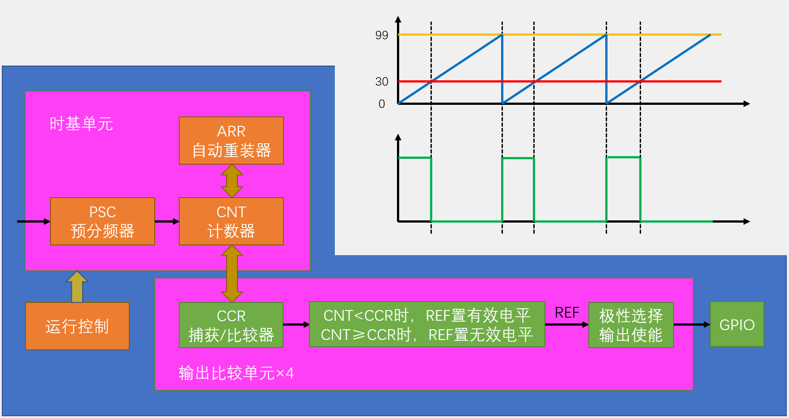


**PWM参数计算**：

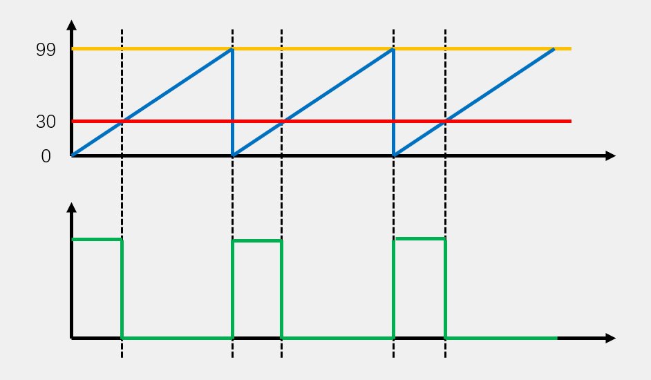

CK_PSC时钟频率，PSC分频，ARR重装载寄存器

- PWM频率： Freq = CK_PSC / (PSC + 1) / (ARR + 1)

- PWM占空比： Duty = CCR / (ARR + 1)

- PWM分辨率： Reso = 1 / (ARR + 1)


栗子：

目标：频率是1kHz，占空比是30%，分辨率是1%

PWM频率：Freq = 72MHz ÷ 720 ÷ 100 = 1000

PWM占空比： Duty = 30 / 100 = 30%

PWM分辨率： Reso = 1 / 100 = 1%

> 注：分辨率是看重装载寄存器值和变化幅度大小的比例，也就是说这个1和100不是固定的，也可以是0.1、5、50这些数。


**舵机简介**：

舵机是一种根据输入PWM信号占空比来控制输出角度的装置

输入PWM信号要求：周期为20ms，高电平宽度为0.5ms~2.5ms

目标：频率是50Hz，占空比是2.5 ~ 12.5%，分辨率是2.5%

PWM频率：Freq = 72MHz ÷ 72 ÷ 20000 = 50Hz

PWM占空比： （1）Duty = 500 / 20000 = 2.5%    （2） Duty = 2500 / 20000  = 12.5%

PWM分辨率： Reso = 500 / 20000 = 2.5%

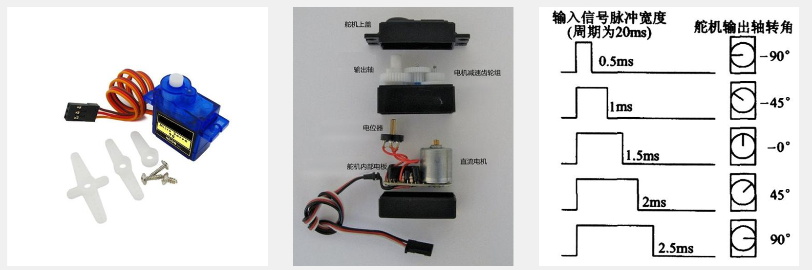


**硬件电路**：

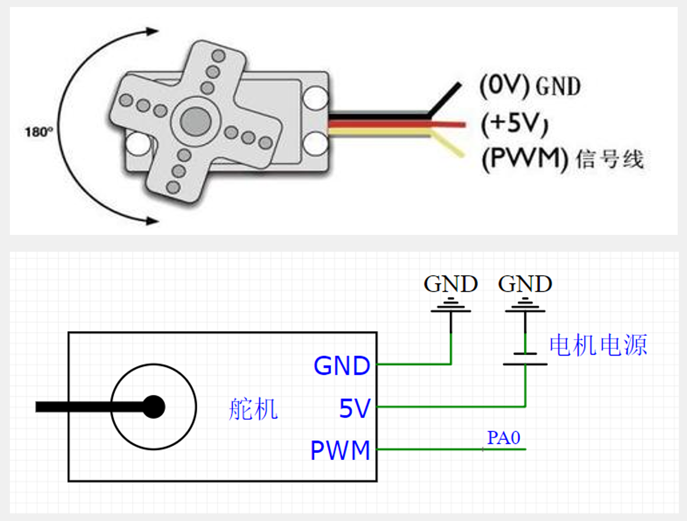


**直流电机及驱动简介**：

直流电机是一种将电能转换为机械能的装置，有两个电极，当电极正接时，电机正转，当电极反接时，电机反转（其实就是开始先通电的极在不同的位置和角度，先产生它那个方向的力（异极拉力和同极推力），后面如果不突然改变电极方向的话，就是惯性顺着该方向的拉力或推力一直转了）

直流电机属于大功率器件，GPIO口无法直接驱动，需要配合电机驱动电路来操作

TB6612是一款双路H桥型的直流电机驱动芯片，可以驱动两个直流电机并且控制其转速和方向

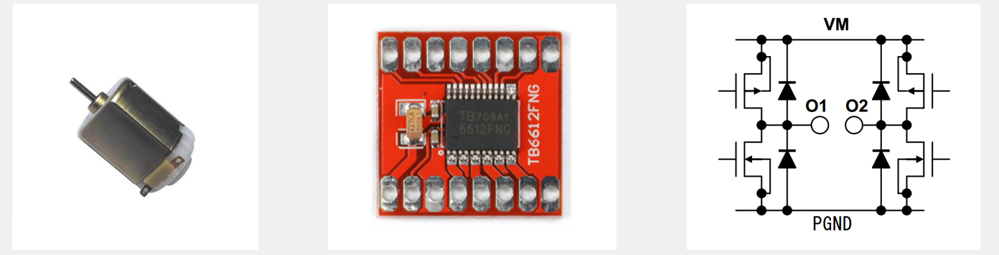


**硬件电路**：

VM和电机电源保持一致，电机5V就接5V

VCC和控制器电源保持一致，STM32是3.3V，那就接3.3V，51单片机是5V那就是接5V。

STBY是待机控制脚，接VCC正常工作，接上GND就是待机模式，一般直接接VCC就可以了，如果想控制是否工作，可以直接接个IO引脚输出高低电平控制。

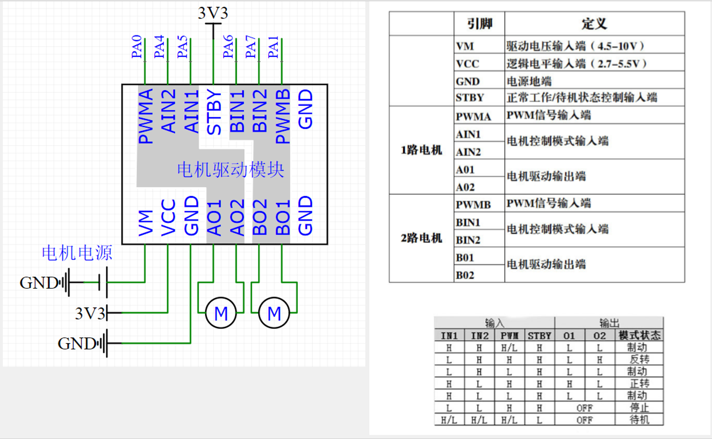


**输入捕获简介**：

IC（Input Capture）输入捕获

输入捕获模式下，当通道输入引脚出现指定电平跳变时，当前CNT的值将被锁存到CCR中，可用于测量PWM波形的频率、占空比、脉冲间隔、电平持续时间等参数

每个高级定时器和通用定时器都拥有4个输入捕获通道

可配置为PWMI模式，同时测量频率和占空比

可配合主从触发模式，实现硬件全自动测量


**频率测量**：

测频法适合测量高频信号，测周法适合测量低频信号。两个测法都是计次越多，精度越高。

**测频法（又称“计频法”）**：就是对一段时间内（用定时器计时）的上升沿信号进行计次，计到多少把这个数除以所用的时间，就得出了频率。用的时间越多但计次少的，频率就低。测频法需要配合其他定时器定时中断，在中断内取计数值和清零计算值。（比如1s，取计数值，计数是多少，频率就是多少）

- f_x =  N / T = 1000（计次）÷ 0.5（秒）= 2000Hz
- f_x =  N / T = 1000（计次）÷ 1（秒）= 1000Hz
- f_x =  N / T = 1000（计次）÷ 2（秒）= 500Hz

**测周法（又称“计时法”）**：假设标准频率是1000000Hz，以1us这个速度测试一个周期。如果这个周期内能够计次到1000，那计次1次用到的时候是1us，计次到1000需要的时间就是1000us = 1ms = 0.001s，取倒数1s ÷ 0.001s 就是1kHz。

- f_x = f_c / N = 1000000（频率） ÷ 1000（计次） = 1000Hz

**中界频率**：用72MHz和上面的频率1MHz以及500KHz，用时分别各自的例一都用时1秒、例二都用时2秒。（**待确定下列计算是否正确**）

- f_m = 根号f_c /  T = 根号72000000（频率） ÷ 1（秒） = 8,485.2813742385702928101323452582Hz
- f_m = 根号f_c /  T = 根号72000000（频率） ÷ 2（秒） = 6,000Hz
- f_m = 根号f_c /  T = 根号1000000（频率） ÷ 1（秒） = 1000Hz
- f_m = 根号f_c /  T = 根号1000000（频率） ÷ 2（秒） = 707.10678118654752440084436210485Hz
- f_m = 根号f_c /  T = 根号500000（频率） ÷ 1（秒） = 707.10678118654752440084436210485Hz
- f_m = 根号f_c /  T = 根号500000（频率） ÷ 2（秒） = 500Hz

**界限的确定**：测频法适用于高频信号，而测周法适用于低频信号。两者的界限取决于被测信号频率与标准信号频率的比值。例如，在STM32中，假设标准信号频率为72MHz：

- 对于1kHz的被测信号，测频法的误差约为1%，而测周法的误差仅为0.00139%。因此，低频信号（如1kHz）更适合测周法。

**总结** 高频信号（如10kHz以上）优先选择测频法，低频信号（如1kHz以下）优先选择测周法。实际应用中，可根据测量精度需求和实时性要求选择合适的方法。

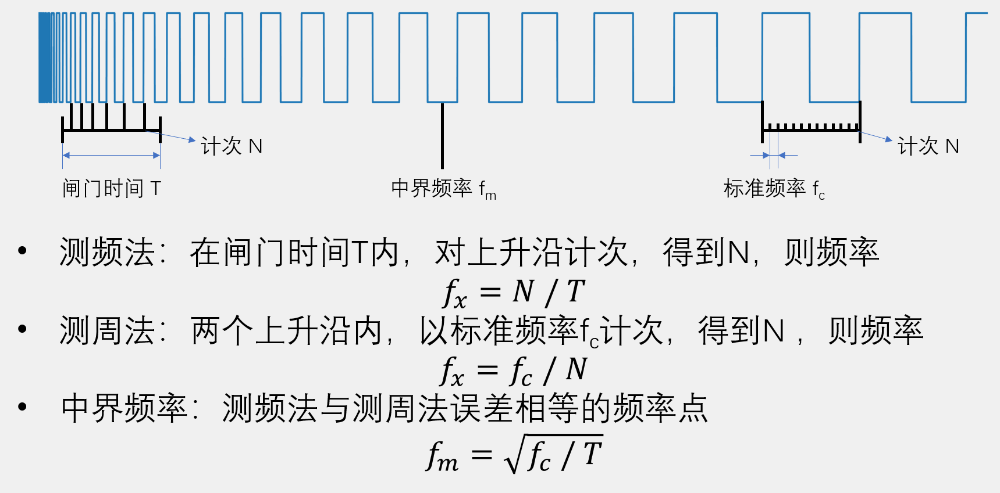


**输入捕获通道**：

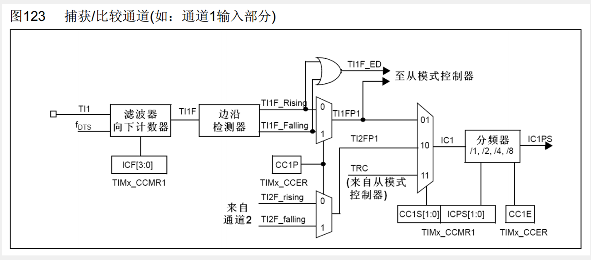


**主从触发模式**：

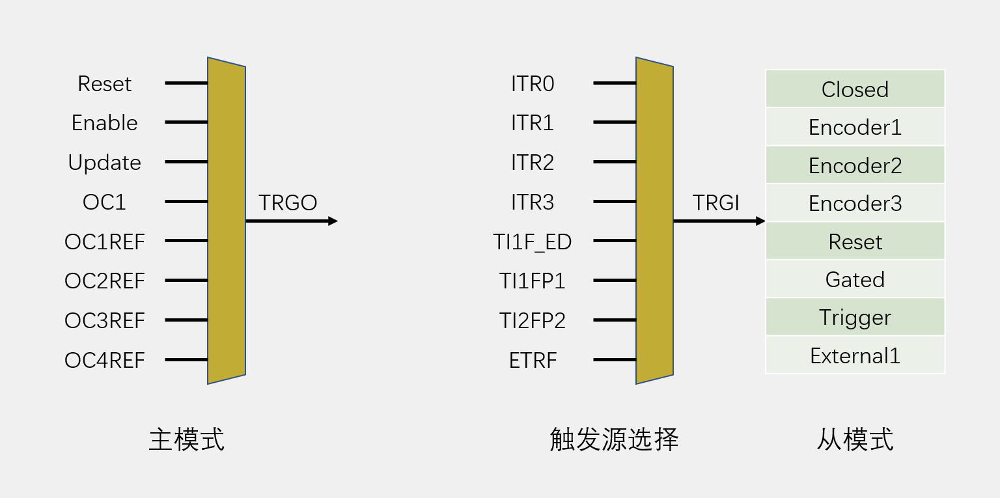


**输入捕获基本结构**：

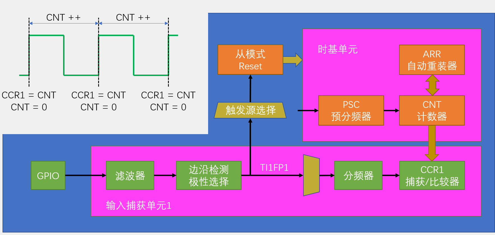


**PWMI基本结构**：

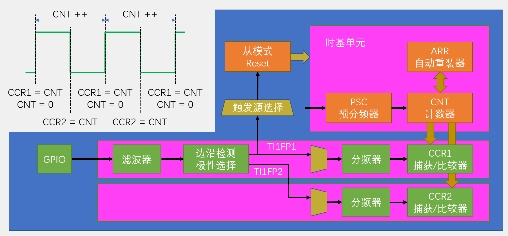


**编码器接口简介**：

Encoder Interface 编码器接口

编码器接口可接收增量（正交）编码器的信号，根据编码器旋转产生的正交信号脉冲，自动控制CNT自增或自减，从而指示编码器的位置、旋转方向和旋转速度

每个高级定时器和通用定时器都拥有1个编码器接口（使用编码器接口，这个定时器就不能执行其他功能了，所以接口比较紧张。使用中断可以缓解硬件资源的问题，所以软件和硬件是互补的，但就是频繁进入中断会打断主程序运行）

**两个输入引脚借用了输入捕获的通道1（TI1FP1）和通道2（TI2FP2）**


**正交编码器**：

A相和B相的相位差90度，通过边沿检测，然后判断另一相的状态，由此得出是正转还是反转。

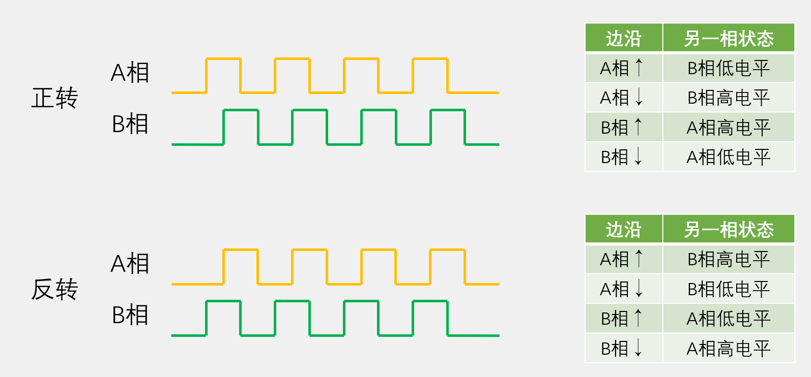


**编码器接口基本结构**：

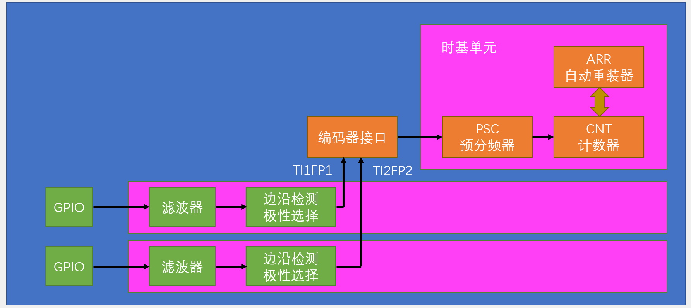


**工作模式**：

以某一端的边沿状态，和另一端的电压状态，来判断是向上计数还是向下计数。

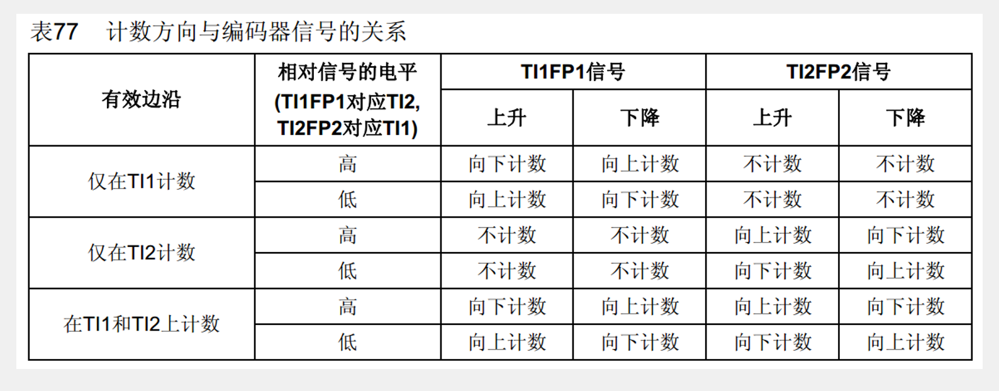


**实例（均不反相）**：

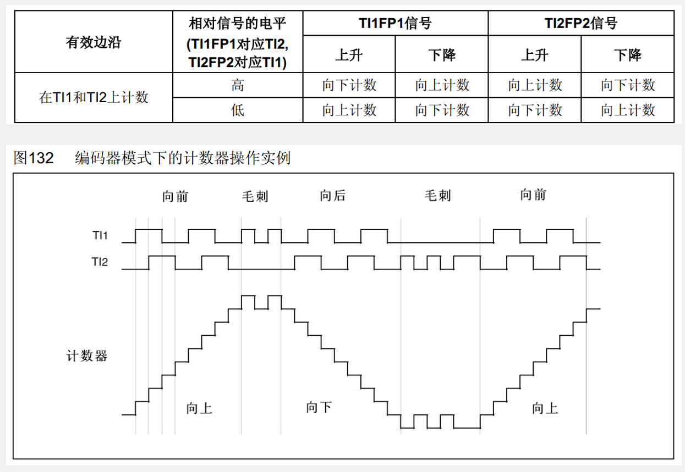


**实例（TI1反相）**：

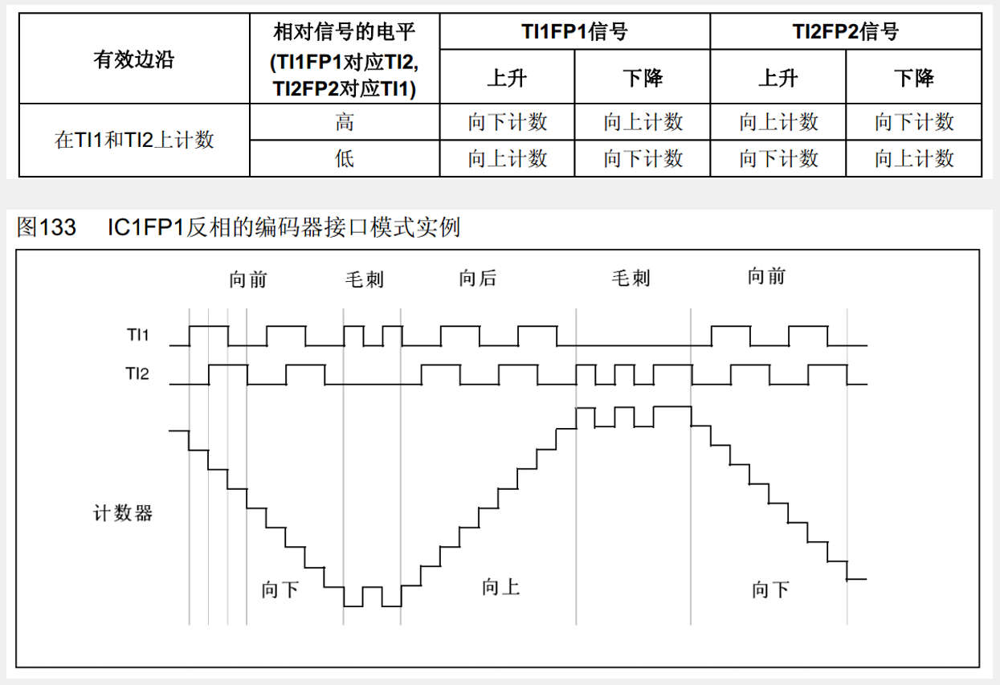


### 定时器寄存器：


#### 1.基本定时器TIMx寄存器：

参考通用定时器，删掉从模式、捕获比较相关功能和DMA控制连续等的寄存器就是了。


#### 2.通用定时器TIMx寄存器：


- **控制寄存器 1(TIMx_CR1)**  

  - **CKD[1:0] 时钟分频因子**：这2位定义在定时器时钟(CK_INT)频率、死区时间和由死区发生器与数字滤波器(ETR,TIx)所用的采样时钟之间的分频比例。

    | 分频比例选择               |
    | -------------------------- |
    | 00： tDTS = tCK_INT        |
    | 01： tDTS = 2 x tCK_INT    |
    | 10： tDTS = 4 x tCK_INT    |
    | 11：保留，不要使用这个配置 |

  - **ARPE自动重装载预装载允许位**：

    - 0： TIMx_ARR寄存器没有缓冲；
    - 1： TIMx_ARR寄存器被装入缓冲器。

  - **CMS[1:0]选择中央对齐模式**：

    | 模式              | 详细                                                         |
    | ----------------- | ------------------------------------------------------------ |
    | 00：边沿对齐模式  | 计数器依据方向位(DIR)向上或向下计数                          |
    | 01：中央对齐模式1 | 计数器交替地向上和向下计数。配置为输出的通道(TIMx_CCMRx寄存器中CCxS=00)的输出比较中断标志位，只在计数器向下计数时被设置。 |
    | 10：中央对齐模式2 | 计数器交替地向上和向下计数。配置为输出的通道(TIMx_CCMRx寄存器中CCxS=00)的输出比较中断标志位，只在计数器向上计数时被设置。 |
    | 11：中央对齐模式3 | 计数器交替地向上和向下计数。配置为输出的通道(TIMx_CCMRx寄存器中CCxS=00)的输出比较中断标志位，在计数器向上和向下计数时均被设置。 |

    > 注：在计数器开启时(CEN=1)，不允许从边沿对齐模式转换到中央对齐模式。

  - **DIR方向**：

    - 0：计数器向上计数；
    - 1：计数器向下计数。

    > 注：当计数器配置为中央对齐模式或编码器模式时，该位为只读。

  - **OPM单脉冲模式**： 

    - 0：在发生更新事件时，计数器不停止； 

    - 1：在发生下一次更新事件(清除CEN位)时，计数器停止。

  - **URS更新请求源**：软件通过该位选择UEV事件的源

    - 0：如果使能了更新中断或DMA请求，则下述任一事件产生更新中断或DMA请求

      - 计数器溢出/下溢

      - 设置UG位

      - 从模式控制器产生的更新
  
    - 1：如果使能了更新中断或DMA请求，则只有计数器溢出/下溢才产生更新中断或DMA请求。
  
  - **UDIS禁止更新**：软件通过该位允许/禁止UEV事件的产生
  
    - 0：允许UEV。更新(UEV)事件由下述任一事件产生
  
      - 计数器溢出/下溢
      - 设置UG位
      - 从模式控制器产生的更新
  
      具有缓存的寄存器被装入它们的预装载值。 (译注：更新影子寄存器)
  
    - 1：禁止UEV。不产生更新事件，影子寄存器(ARR、 PSC、 CCRx)保持它们的值。
  
      如果设置了UG位或从模式控制器发出了一个硬件复位，则计数器和预分频器被重新初始化。
  
  - **CEN使能计数器**：
  
    - 0：禁止计数器； 
  
    - 1：使能计数器。
  
    > 注：在软件设置了CEN位后，外部时钟、门控模式和编码器模式才能工作。触发模式可以自动地通过硬件设置CEN位
  


- **控制寄存器 2(TIMx_CR2)**  ：

  - **OIS4：输出空闲状态4(OC4输出)**。参见OIS1位。

  - **OIS3N：输出空闲状态3(OC3N输出)**。参见OIS1N位。

  - **OIS3：输出空闲状态3(OC3输出)**。参见OIS1位。

  - **OIS2N：输出空闲状态2(OC2N输出)**。参见OIS1N位。

  - **OIS2：输出空闲状态2(OC2输出)**。参见OIS1位。

  - **OIS1N：输出空闲状态1 (OC1N输出)** (Output Idle state 1) 

    - 0：当MOE=0时，死区后OC1N=0；

    - 1：当MOE=0时，死区后OC1N=1。

    > 注：已经设置了LOCK(TIMx_BKR寄存器)级别1、 2或3后，该位不能被修改

  - **OIS1：输出空闲状态1 (OC1输出)** (Output Idle state 1) 

    - 0：当MOE=0时，如果实现了OC1N，则死区后OC1=0； 

    - 1：当MOE=0时，如果实现了OC1N，则死区后OC1=1。

    > 注：已经设置了LOCK(TIMx_BKR寄存器)级别1、 2或3后，该位不能被修改。

  - **TI1S： TI1选择 (TI1 selection)**

    - 0： TIMx_CH1引脚连到TI1输入； 

    - 1： TIMx_CH1、 TIMx_CH2和TIMx_CH3引脚经异或后连到TI1输入。

  - **MMS[2:0]：主模式选择** (Master mode selection)

    这3位用于选择在主模式下送到从定时器的同步信息(TRGO)。

    | 可能的组合如下：                                             |
    | ------------------------------------------------------------ |
    | 000： 复位 – TIMx_EGR寄存器的UG位被用于作为触发输出(TRGO)。如果是触发输入产生的复位(从模式控制器处于复位模式)，则TRGO上的信号相对实际的复位会有一个延迟。 |
    | 001： 使能 – 计数器使能信号CNT_EN被用于作为触发输出(TRGO)。有时需要在同一时间启动多个定时器或控制在一段时间内使能从定时器。计数器使能信号是通过CEN控制位和门控模式下的触发输入信号的逻辑或产生。当计数器使能信号受控于触发输入时， TRGO上会有一个延迟，除非选择了主/从模式(见TIMx_SMCR寄存器中MSM位的描述)。 |
    | 010： 更新 – 更新事件被选为触发输入(TRGO)。例如，一个主定时器的时钟可以被用作一个从定时器的预分频器。 |
    | 011： 比较脉冲 – 在发生一次捕获或一次比较成功时，当要设置CC1IF标志时(即使它已经为高)，触发输出送出一个正脉冲(TRGO)。 |
    | 100： 比较 – OC1REF信号被用于作为触发输出(TRGO)。            |
    | 101： 比较 – OC2REF信号被用于作为触发输出(TRGO)。            |
    | 110： 比较 – OC3REF信号被用于作为触发输出(TRGO)。            |
    | 111： 比较 – OC4REF信号被用于作为触发输出(TRGO)。            |

  - **CCDS：捕获/比较的DMA选择** (Capture/compare DMA selection) 

    - 0：当发生CCx事件时，送出CCx的DMA请求； 

    - 1：当发生更新事件时，送出CCx的DMA请求。

  - **CCUS：捕获/比较控制更新选择** (Capture/compare control update selection)

    - 0：如果捕获/比较控制位是预装载的(CCPC=1)，只能通过设置COM位更新它们；

    - 1：如果捕获/比较控制位是预装载的(CCPC=1)，可以通过设置COM位或TRGI上的一个上升沿更新它们。

    > 注：该位只对具有互补输出的通道起作用。

  - **CCPC：捕获/比较预装载控制位** (Capture/compare preloaded control) 

    - 0： CCxE， CCxNE和OCxM位不是预装载的；

    - 1： CCxE， CCxNE和OCxM位是预装载的；设置该位后，它们只在设置了COM位后被更新。

    > 注：该位只对具有互补输出的通道起作用。


- **从模式控制寄存器**(TIMx_SMCR)  ：

  - **ETP外部触发极性** (External trigger polarity)：该位选择是用ETR还是ETR的反相来作为触发操作

    - 0： ETR不反相，高电平或上升沿有效； 

    - 1： ETR被反相，低电平或下降沿有效。

  - **ECE外部时钟使能位** (External clock enable)：该位启用外部时钟模式2

    - 0：禁止外部时钟模式2；

    - 1：使能外部时钟模式2。计数器由ETRF信号上的任意有效边沿驱动。  

    > 注1：设置ECE位与选择外部时钟模式1并将TRGI连到ETRF(SMS=111和TS=111)具有相同功效。  
    >
    > 注2：下述从模式可以与外部时钟模式2同时使用：复位模式，门控模式和触发模式；但是，这时TRGI不能连到ETRF(TS位不能是’111’)。  
    >
    > 注3：外部时钟模式1和外部时钟模式2同时被使能时，外部时钟的输入是ETRF。  

  - **ETPS[1:0]外部触发预分频** (External trigger prescaler)：

    外部触发信号ETRP的频率必须最多是TIMxCLK频率的1/4。当输入较快的外部时钟时，可以使用预分频降低ETRP的频率。

    | 外部触发信号预分配   |
    | -------------------- |
    | 00：关闭预分频；     |
    | 01： ETRP频率除以2； |
    | 10： ETRP频率除以4； |
    | 11： ETRP频率除以8。 |

  - **ETF[3:0]外部触发滤波** (External trigger filter)：

    这些位定义了对ETRP信号采样的频率和对ETRP数字滤波的带宽。实际上，数字滤波器是一个事件计数器，它记录到N个事件后会产生一个输出的跳变。

    |                                       |                                       |
    | ------------------------------------- | ------------------------------------- |
    | 0000：无滤波器，以fDTS采样            | 1000：采样频率fSAMPLING=fDTS/8， N=6  |
    | 0001：采样频率fSAMPLING=fCK_INT， N=2 | 1001：采样频率fSAMPLING=fDTS/8， N=8  |
    | 0010：采样频率fSAMPLING=fCK_INT， N=4 | 1010：采样频率fSAMPLING=fDTS/16， N=5 |
    | 0011：采样频率fSAMPLING=fCK_INT， N=8 | 1011：采样频率fSAMPLING=fDTS/16， N=6 |
    | 0100：采样频率fSAMPLING=fDTS/2， N=6  | 1100：采样频率fSAMPLING=fDTS/16， N=8 |
    | 0101：采样频率fSAMPLING=fDTS/2， N=8  | 1101：采样频率fSAMPLING=fDTS/32， N=5 |
    | 0110：采样频率fSAMPLING=fDTS/4， N=6  | 1110：采样频率fSAMPLING=fDTS/32， N=6 |
    | 0111：采样频率fSAMPLING=fDTS/4， N=8  | 1111：采样频率fSAMPLING=fDTS/32， N=8 |
  
  - **MSM：主/从模式** (Master/slave mode)

    - 0：无作用；

    - 1：触发输入(TRGI)上的事件被延迟了，以允许在当前定时器(通过TRGO)与它的从定时器间的完美同步。这对要求把几个定时器同步到一个单一的外部事件时是非常有用的。

  - **TS[2:0]：触发选择** (Trigger selection)

    这3位选择用于同步计数器的触发输入。

    |                      |                                  |
    | -------------------- | -------------------------------- |
    | 000：内部触发0(ITR0) | 100： TI1的边沿检测器            |
    | 001：内部触发1(ITR1) | 101：滤波后的定时器输入1(TI1FP1) |
    | 010：内部触发2(ITR2) | 110：滤波后的定时器输入2(TI2FP2) |
    | 011：内部触发3(ITR3) | 111：外部触发输入(ETRF)          |
  
    更多有关ITRx的细节，参见表74。

    > 注：这些位只能在未用到(如SMS=000)时被改变，以避免在改变时产生错误的边沿检测。

  - **SMS[2:0]：从模式选择** (Slave mode selection)

    当选择了外部信号，触发信号(TRGI)的有效边沿与选中的外部输入极性相关(见输入控制寄存器和控制寄存器的说明)

    | 模式               | 功能                                                         |
    | ------------------ | ------------------------------------------------------------ |
    | 000：关闭从模式    | 如果CEN=1，则预分频器直接由内部时钟驱动。                    |
    | 001：编码器模式1   | 根据TI1FP1的电平，计数器在TI2FP2的边沿向上/下计数。          |
    | 010：编码器模式2   | 根据TI2FP2的电平，计数器在TI1FP1的边沿向上/下计数。          |
    | 011：编码器模式3   | 根据另一个信号的输入电平，计数器在TI1FP1和TI2FP2的边沿向上/下计数。 |
    | 100：复位模式      | 选中的触发输入(TRGI)的上升沿重新初始化计数器，并且产生一个更新寄存器的信号。 |
    | 101：门控模式      | 当触发输入(TRGI)为高时，计数器的时钟开启。一旦触发输入变为低，则计数器停止(但不复位)。计数器的启动和停止都是受控的。 |
    | 110：触发模式      | 计数器在触发输入TRGI的上升沿启动(但不复位)，只有计数器的启动是受控的。 |
    | 111：外部时钟模式1 | 选中的触发输入(TRGI)的上升沿驱动计数器。        注：如果TI1F_EN被选为触发输入(TS=100)时，不要使用门控模式。这是因为， TI1F_ED在每次TI1F变化时输出一个脉冲，然而门控模式是要检查触发输入的电平。 |


- **DMA/中断使能寄存器**(TIMx_DIER)  

  - **TDE：允许触发DMA请求** (Trigger DMA request enable)

    - 0：禁止触发DMA请求；

    - 1：允许触发DMA请求。

  - **COMDE：允许COM的DMA请求** (COM DMA request enable) 

    - 0：禁止COM的DMA请求；

    - 1：允许COM的DMA请求。

  - **CC4DE：允许捕获/比较4的DMA请求** (Capture/Compare 4 DMA request enable)

    - 0：禁止捕获/比较4的DMA请求；

    - 1：允许捕获/比较4的DMA请求。

  - **CC3DE：允许捕获/比较3的DMA请求** (Capture/Compare 3 DMA request enable)

    - 0：禁止捕获/比较3的DMA请求；

    - 1：允许捕获/比较3的DMA请求

  - **CC2DE：允许捕获/比较2的DMA请求** (Capture/Compare 2 DMA request enable)

     - 0：禁止捕获/比较2的DMA请求；

    - 1：允许捕获/比较2的DMA请求。

  - **CC1DE：允许捕获/比较1的DMA请求** (Capture/Compare 1 DMA request enable) 

    - 0：禁止捕获/比较1的DMA请求；

    - 1：允许捕获/比较1的DMA请求

  - **UDE：允许更新的DMA请求** (Update DMA request enable)

     - 0：禁止更新的DMA请求；

    - 1：允许更新的DMA请求。

  - **BIE：允许刹车中断** (Break interrupt enable) 

    - 0：禁止刹车中断；

    - 1：允许刹车中断

  - **TIE：触发中断使能** (Trigger interrupt enable) 

    - 0：禁止触发中断；

    - 1：使能触发中断。

  - **COMIE：允许COM中断** (COM interrupt enable) 

    - 0：禁止COM中断；

    - 1：允许COM中断。

  - **CC4IE：允许捕获/比较4中断** (Capture/Compare 4 interrupt enable) 

    - 0：禁止捕获/比较4中断；

    - 1：允许捕获/比较4中断。

  - **CC3IE：允许捕获/比较3中断** (Capture/Compare 3 interrupt enable) 

    - 0：禁止捕获/比较3中断；

    - 1：允许捕获/比较3中断。

  - **CC2IE：允许捕获/比较2中断** (Capture/Compare 2 interrupt enable) 

    - 0：禁止捕获/比较2中断；

    - 1：允许捕获/比较2中断。

  - **CC1IE：允许捕获/比较1中断** (Capture/Compare 1 interrupt enable)

    - 0：禁止捕获/比较1中断；

    - 1：允许捕获/比较1中断。

  - **UIE：允许更新中断** (Update interrupt enable) 

    - 0：禁止更新中断；

    - 1：允许更新中断。


- **状态寄存器(TIMx_SR)  **

  - **CC4OF： 捕获/比较4重复捕获标记** (Capture/Compare 4 overcapture flag)

    参见CC1OF描述。

  - **CC3OF： 捕获/比较3重复捕获标记** (Capture/Compare 3 overcapture flag)

    参见CC1OF描述。

  - **CC2OF： 捕获/比较2重复捕获标记** (Capture/Compare 2 overcapture flag)

    参见CC1OF描述。

  - **CC1OF： 捕获/比较1重复捕获标记** (Capture/Compare 1 overcapture flag)

    仅当相应的通道被配置为输入捕获时，该标记可由硬件置1。写0可清除该位。

    - 0：无重复捕获产生； 

    - 1：计数器的值被捕获到TIMx_CCR1寄存器时， CC1IF的状态已经为’1’。

  - **BIF： 刹车中断标记** (Break interrupt flag)

    一旦刹车输入有效，由硬件对该位置’1’。如果刹车输入无效，则该位可由软件清’0’。

    - 0：无刹车事件产生；

    - 1：刹车输入上检测到有效电平。

  - **TIF： 触发器中断标记** (Trigger interrupt flag)

    当发生触发事件(当从模式控制器处于除门控模式外的其它模式时，在TRGI输入端检测到有效边沿，或门控模式下的任一边沿)时由硬件对该位置’1’。它由软件清’0’。

    - 0：无触发器事件产生；

    - 1：触发中断等待响应。

  - **COMIF： COM中断标记** (COM interrupt flag)

    一旦产生COM事件(当捕获/比较控制位： CCxE、 CCxNE、 OCxM已被更新)该位由硬件置’1’。它由软件清’0’。

    - 0：无COM事件产生；

    - 1： COM中断等待响应。

  - **CC4IF： 捕获/比较4中断标记** (Capture/Compare 4 interrupt flag)参考CC1IF描述。

  - **CC3IF： 捕获/比较3中断标记** (Capture/Compare 3 interrupt flag)参考CC1IF描述。

  - **CC2IF： 捕获/比较2中断标记** (Capture/Compare 2 interrupt flag)参考CC1IF描述。

  - **CC1IF： 捕获/比较1中断标记** (Capture/Compare 1 interrupt flag)：

    - **如果通道CC1配置为输出模式**：

      当计数器值与比较值匹配时该位由硬件置1，但在中心对称模式下除外(参考TIMx_CR1寄存器的CMS位)。它由软件清’0’。

      - 0：无匹配发生；

      - 1： TIMx_CNT的值与TIMx_CCR1的值匹配。

      当TIMx_CCR1的内容大于TIMx_APR的内容时，在向上或向上/下计数模式时计数器溢出，或向下计数模式时的计数器下溢条件下， CC1IF位变高
    
    - **如果通道CC1配置为输入模式**：
    
      当捕获事件发生时该位由硬件置’1’，它由软件清’0’或通过读TIMx_CCR1清’0’。  
    
      - 0：无输入捕获产生；
      - 1：计数器值已被捕获(拷贝)至TIMx_CCR1(在IC1上检测到与所选极性相同的边沿)。 

  - **UIF： 更新中断标记** (Update interrupt flag)

    当产生更新事件时该位由硬件置’1’。它由软件清’0’。

    - 0：无更新事件产生； 

    - 1：更新中断等待响应。当寄存器被更新时该位由硬件置’1’：

      若TIMx_CR1寄存器的UDIS=0，当重复计数器数值上溢或下溢时(重复计数器=0时产生更新事件)。
    
      若TIMx_CR1寄存器的URS=0、 UDIS=0，当设置TIMx_EGR寄存器的UG=1时产生更新事件，通过软件对计数器CNT重新初始化时。- 
    
      若TIMx_CR1寄存器的URS=0、 UDIS=0，当计数器CNT被触发事件重新初始化时。 (参考13.4.3: TIM1和TIM8从模式控制寄存器(TIMx_SMCR))。


- **事件产生寄存器**(TIMx_EGR)  

  - **BG：产生刹车事件** (Break generation)

    该位由软件置’1’，用于产生一个刹车事件，由硬件自动清’0’。

    - 0：无动作；

    - 1：产生一个刹车事件。此时MOE=0、 BIF=1，若开启对应的中断和DMA，则产生相应的中断和DMA

  - **TG： 产生触发事件** (Trigger generation)

    该位由软件置’1’，用于产生一个触发事件，由硬件自动清’0’。

    - 0：无动作；

    - 1： TIMx_SR寄存器的TIF=1，若开启对应的中断和DMA，则产生相应的中断和DMA。

  - **COMG： 捕获/比较事件，产生控制更新** (Capture/Compare control update generation)

    该位由软件置’1’，由硬件自动清’0’。

    - 0：无动作； 

    - 1：当CCPC=1，允许更新CCxE、 CCxNE、 OCxM位。

    > 注： 该位只对拥有互补输出的通道有效。

  - **CC4G： 产生捕获/比较4事件** (Capture/Compare 4 generation)参考CC1G描述。

  - **CC3G： 产生捕获/比较3事件** (Capture/Compare 3 generation)参考CC1G描述。

  - **CC2G： 产生捕获/比较2事件** (Capture/Compare 2 generation)参考CC1G描述。

  - **CC1G： 产生捕获/比较1事件** (Capture/Compare 1 generation)该位由软件置’1’，用于产生一个捕获/比较事件，由硬件自动清’0’。

    - 0：无动作；

    - 1：在通道CC1上产生一个捕获/比较事件：

    **若通道CC1配置为输出**：设置CC1IF=1，若开启对应的中断和DMA，则产生相应的中断和DMA。

    **若通道CC1配置为输入**：当前的计数器值被捕获至TIMx_CCR1寄存器；设置CC1IF=1，若开启对应的中断和DMA，则产生相应的中断和DMA。若CC1IF已经为1，则设置CC1OF=1。

  - **UG： 产生更新事件** (Update generation)

    该位由软件置’1’，由硬件自动清’0’。

    - 0：无动作；

    - 1：重新初始化计数器，并产生一个更新事件。

      注意预分频器的计数器也被清’0’(但是预分频系数不变)。

      若在中心对称模式下或DIR=0(向上计数)则计数器被清’0’；
    
      若DIR=1(向下计数)则计数器取TIMx_ARR的值。


- **捕获/比较模式寄存器 1**(TIMx_CCMR1)  ：

  - **输出比较模式**：  

    - **OC2CE：输出比较2清0使能** (Output Compare 2 clear enable)

      参考通道1

    - **OC2M[2:0]：输出比较2模式** (Output Compare 2 mode)

      参考通道1

    - **OC2PE：输出比较2预装载使能** (Output Compare 2 preload enable)

      参考通道1

    - **OC2FE：输出比较2快速使能** (Output Compare 2 fast enable)

      参考通道1

    - **CC2S[1:0]：捕获/比较2选择。** (Capture/Compare 2 selection)

      该位定义通道的方向(输入/输出)，及输入脚的选择： 

      | 通道功能、引脚映射选择                                       |
      | ------------------------------------------------------------ |
      | 00： CC2通道被配置为输出；                                   |
      | 01： CC2通道被配置为输入， IC2映射在TI2上；                  |
      | 10： CC2通道被配置为输入， IC2映射在TI1上；                  |
      | 11： CC2通道被配置为输入， IC2映射在TRC上。此模式仅工作在内部触发器输入被选中时(由TIMx_SMCR寄存器的TS位选择)。 |

      > 注： CC2S仅在通道关闭时(TIMx_CCER寄存器的CC2E=0)才是可写的。

    - **OC1CE：输出比较1清’0’使能** (Output Compare 1 clear enable)

      - 0： OC1REF 不受ETRF输入的影响； 

      - 1：一旦检测到ETRF输入高电平，清除OC1REF=0。

    - **OC1M[2:0]：输出比较1模式** (Output Compare 1 mode)

      该3位定义了输出参考信号OC1REF的动作，而OC1REF决定了OC1、 OC1N的值。 OC1REF是高电平有效，而OC1、 OC1N的有效电平取决于CC1P、 CC1NP位。

      |                                                 |                                                              |
      | ----------------------------------------------- | ------------------------------------------------------------ |
      | 000：冻结。                                     | 输出比较寄存器TIMx_CCR1与计数器TIMx_CNT间的比较对OC1REF不起作用； |
      | 001 ： 匹 配 时 设 置 通 道 1 为 有 效 电 平 。 | 当 计 数 器 TIMx_CNT 的 值 与 捕 获 / 比 较 寄 存 器 1 (TIMx_CCR1)相同时，强制OC1REF为高。 |
      | 010 ： 匹 配 时 设 置 通 道 1 为 无 效 电 平 。 | 当 计 数 器 TIMx_CNT 的 值 与 捕 获 / 比 较 寄 存 器 1 (TIMx_CCR1)相同时，强制OC1REF为低。 |
      | 011：翻转。                                     | 当TIMx_CCR1=TIMx_CNT时，翻转OC1REF的电平。                   |
      | 100：强制为无效电平。                           | 强制OC1REF为低。                                             |
      | 101：强制为有效电平。                           | 强制OC1REF为高。                                             |
      | 110： PWM模式1                                  | 在向上计数时，一旦TIMx_CNT<TIMx_CCR1时通道1为有效电平，否则为无效电平；                                                                        在向下计数时，一旦TIMx_CNT>TIMx_CCR1时通道1为无效电平(OC1REF=0)，否则为有效电平(OC1REF=1)。 |
      | 111： PWM模式2                                  | 在向上计数时，一旦TIMx_CNT<TIMx_CCR1时通道1为无效电平，否则为有效电平；                                                                           在向下计数时，一旦TIMx_CNT>TIMx_CCR1时通道1为有效电平，否则为无效电平。 |

      > 注1：一旦LOCK级别设为3(TIMx_BDTR寄存器中的LOCK位)并且CC1S=00(该通道配置成输出)则该位不能被修改。
      >
      > 注2：在PWM模式1或PWM模式2中，只有当比较结果改变了或在输出比较模式中从冻结模式切换到PWM模式时， OC1REF电平才改变。

    - **OC1PE： 输出比较1预装载使能** (Output Compare 1 preload enable)

      - 0：禁止TIMx_CCR1寄存器的预装载功能，可随时写入TIMx_CCR1寄存器，并且新写入的数值立即起作用。

      - 1：开启TIMx_CCR1寄存器的预装载功能，读写操作仅对预装载寄存器操作， TIMx_CCR1的预装载值在更新事件到来时被加载至当前寄存器中。

      > 注1：一旦LOCK级别设为3(TIMx_BDTR寄存器中的LOCK位)并且CC1S=00(该通道配置成输出)则该位不能被修改。
      >
      > 注2：仅在单脉冲模式下(TIMx_CR1寄存器的OPM=1)，可以在未确认预装载寄存器情况下使用PWM模式，否则其动作不确定。

    - **OC1FE： 输出比较1 快速使能** (Output Compare 1 fast enable)

      该位用于加快CC输出对触发输入事件的响应。

      - 0：根据计数器与CCR1的值， CC1正常操作，即使触发器是打开的。当触发器的输入有一个有效沿时，激活CC1输出的最小延时为5个时钟周期。

      - 1：输入到触发器的有效沿的作用就象发生了一次比较匹配。因此， OC被设置为比较电平而与比较结果无关。采样触发器的有效沿和CC1输出间的延时被缩短为3个时钟周期。

      OCFE只在通道被配置成PWM1或PWM2模式时起作用。

    - **CC1S[1:0]：捕获/比较1 选择**。 (Capture/Compare 1 selection)

      这2位定义通道的方向(输入/输出)，及输入脚的选择： 

      | 通道功能、引脚映射选择                                       |
      | ------------------------------------------------------------ |
      | 00： CC1通道被配置为输出；                                   |
      | 01： CC1通道被配置为输入， IC1映射在TI1上；                  |
      | 10： CC1通道被配置为输入， IC1映射在TI2上；                  |
      | 11： CC1通道被配置为输入， IC1映射在TRC上。此模式仅工作在内部触发器输入被选中时(由TIMx_SMCR寄存器的TS位选择)。 |
      
    > 注： CC1S仅在通道关闭时(TIMx_CCER寄存器的CC1E=0)才是可写的。

    

  - **输入捕获模式**：  

    - **IC2F[3:0]：输入捕获2滤波器** (Input capture 2 filter)

      参考通道1

    - **IC2PSC[1:0]：输入/捕获2预分频器** (Input capture 2 prescaler)

      参考通道1

    - **CC2S[1:0]：捕获/比较2选择** (Capture/Compare 2 selection)

      这2位定义通道的方向(输入/输出)，及输入脚的选择： 

      00： CC2通道被配置为输出；

      01： CC2通道被配置为输入， IC2映射在TI2上； 

      10： CC2通道被配置为输入， IC2映射在TI1上； 

      11： CC2通道被配置为输入， IC2映射在TRC上。此模式仅工作在内部触发器输入被选中时(由TIMx_SMCR寄存器的TS位选择)。

      > 注： CC2S仅在通道关闭时(TIMx_CCER寄存器的CC2E=0)才是可写的。
    
    - **IC1F[3:0]：输入捕获1滤波器** (Input capture 1 filter)这几位定义了TI1输入的采样频率及数字滤波器长度。数字滤波器由一个事件计数器组成，它记录到N个事件后会产生一个输出的跳变：
    
      |                                       |                                       |
      | ------------------------------------- | ------------------------------------- |
      | 0000：无滤波器，以fDTS采样            | 1000：采样频率fSAMPLING=fDTS/8， N=6  |
      | 0001：采样频率fSAMPLING=fCK_INT， N=2 | 1001：采样频率fSAMPLING=fDTS/8， N=8  |
      | 0010：采样频率fSAMPLING=fCK_INT， N=4 | 1010：采样频率fSAMPLING=fDTS/16， N=5 |
      | 0011：采样频率fSAMPLING=fCK_INT， N=8 | 1011：采样频率fSAMPLING=fDTS/16， N=6 |
      | 0100：采样频率fSAMPLING=fDTS/2， N=6  | 1100：采样频率fSAMPLING=fDTS/16， N=8 |
      | 0101：采样频率fSAMPLING=fDTS/2， N=8  | 1101：采样频率fSAMPLING=fDTS/32， N=5 |
      | 0110：采样频率fSAMPLING=fDTS/4， N=6  | 1110：采样频率fSAMPLING=fDTS/32， N=6 |
      | 0111：采样频率fSAMPLING=fDTS/4， N=8  | 1111：采样频率fSAMPLING=fDTS/32， N=8 |

    - **IC1PSC[1:0]：输入/捕获1预分频器** (Input capture 1 prescaler)

      这2位定义了CC1输入(IC1)的预分频系数。

      一旦CC1E=0(TIMx_CCER寄存器中)，则预分频器复位。

      00：无预分频器，捕获输入口上检测到的每一个边沿都触发一次捕获；

      01：每2个事件触发一次捕获；

      10：每4个事件触发一次捕获；

      11：每8个事件触发一次捕获。

    - **CC1S[1:0]： 捕获/比较1选择** (Capture/Compare 1 Selection)

      这2位定义通道的方向(输入/输出)，及输入脚的选择： 

      00： CC1通道被配置为输出；

      01： CC1通道被配置为输入， IC1映射在TI1上； 

      10： CC1通道被配置为输入， IC1映射在TI2上； 

      11： CC1通道被配置为输入， IC1映射在TRC上。此模式仅工作在内部触发器输入被选中时(由TIMx_SMCR寄存器的TS位选择)。
    
      > 注： CC1S仅在通道关闭时(TIMx_CCER寄存器的CC1E=0)才是可写的。
    


- **捕获/比较模式寄存器 2**(TIMx_CCMR2)  ：参考捕获/比较模式寄存器 1


- **捕获/比较使能寄存器**(TIMx_CCER)  ：

  **2到3通道的输入、输出和互补输出使能参考下面的1通道，**

  **通道4没有互补输出**，极性和使能其他的1~3通道一样。

  - **CC1NP：输入/捕获1互补输出极性** (Capture/Compare 1 complementary output polarity)

    - 0： OC1N高电平有效；

    - 1： OC1N低电平有效。

    > 注：一旦LOCK级别(TIMx_BDTR寄存器中的LOCK位)设为3或2且CC1S=00(通道配置为输出)则该位不能被修改。

  - **CC1NE：输入/捕获1互补输出使能** (Capture/Compare 1 complementary output enable) 

    - 0：关闭－ OC1N禁止输出，因此OC1N的电平依赖于MOE、 OSSI、 OSSR、 OIS1、 OIS1N和CC1E位的值。

    - 1：开启－ OC1N信号输出到对应的输出引脚，其输出电平依赖于MOE、 OSSI、 OSSR、OIS1、 OIS1N和CC1E位的值。

  - **CC1P：输入/捕获1输出极性** (Capture/Compare 1 output polarity) 

    - **CC1通道配置为输出**：

      - 0： OC1高电平有效；

      - 1： OC1低电平有效。

    - **CC1通道配置为输入**：该位选择是IC1还是IC1的反相信号作为触发或捕获信号。

      - 0：不反相：捕获发生在IC1的上升沿；当用作外部触发器时， IC1不反相。

      - 1：反相：捕获发生在IC1的下降沿；当用作外部触发器时， IC1反相。

      > 注：一旦LOCK级别(TIMx_BDTR寄存器中的LOCK位)设为3或2，则该位不能被修改。

  - **CC1E： 输入/捕获1输出使能** (Capture/Compare 1 output enable)

    - **CC1通道配置为输出**：

      - 0： 关闭－ OC1禁止输出，因此OC1的输出电平依赖于MOE、 OSSI、 OSSR、 OIS1、 OIS1N和CC1NE位的值。

      - 1： 开启－ OC1信号输出到对应的输出引脚，其输出电平依赖于MOE、 OSSI、 OSSR、OIS1、 OIS1N和CC1NE位的值。

    - **CC1通道配置为输入**：该位决定了计数器的值是否能捕获入TIMx_CCR1寄存器。

      - 0：捕获禁止；

      - 1：捕获使能。(这个翻译的中文手册错了，1才是对的，英文版也是1)


- **计数器(TIMx_CNT)**  ：

  - **CNT[15:0]计数器的值** (Counter value)


- **预分频器(TIMx_PSC)**  ：**PSC[15:0]预分频器的值** (Prescaler value)

  计数器的时钟频率(CK_CNT)等于fCK_PSC/( PSC[15:0]+1)。

  PSC包含了每次当更新事件产生时，装入当前预分频器寄存器的值；

  更新事件包括计数器被TIM_EGR的UG位清’0’或被工作在复位模式的从控制器清’0’。


- **自动重装载寄存器(TIMx_ARR)**  ：

  **ARR[15:0]自动重装载的值** (Prescaler value)

  ARR包含了将要装载入实际的自动重装载寄存器的值。

  详细参考13.3.1节：有关ARR的更新和动作。

  当自动重装载的值为空时，计数器不工作。


- **捕获/比较寄存器 1**(TIMx_CCR1)  ：

  - **CCR1[15:0]:捕获/比较通道1的值** (Capture/Compare 1 value)

    - **若CC1通道配置为输出**：CCR1包含了装入当前捕获/比较1寄存器的值(预装载值)。

      如果在TIMx_CCMR1寄存器(OC1PE位)中未选择预装载功能，写入的数值会立即传输至当前寄存器中。否则只有当更新事件发生时，此预装载值才传输至当前捕获/比较1寄存器中。

      当前捕获/比较寄存器参与同计数器TIMx_CNT的比较，并在OC1端口上产生输出信号。

    - **若CC1通道配置为输入**：CCR1包含了由上一次输入捕获1事件(IC1)传输的计数器值。
    

- **捕获/比较寄存器 2**(TIMx_CCR2)  ：参考捕获/比较寄存器 1

- **捕获/比较寄存器 3**(TIMx_CCR3)  ：参考捕获/比较寄存器 1

- **捕获/比较寄存器 4**(TIMx_CCR4)：参考捕获/比较寄存器 1


- **DMA控制寄存器(TIMx_DCR)**   ：

  - **DBL[4:0]: DMA连续传送长度** (DMA burst length)

    这些位定义了DMA在连续模式下的传送长度(当对TIMx_DMAR寄存器进行读或写时，定时器则进行一次连续传送)，即：定义传输的次数，传输可以是半字(双字节)或字节：

    00000： 1次传输 

    00001： 2次传输

    00010： 3次传输 

    ......

    10001： 18次传输

    例：我们考虑这样的传输： DBL=7， DBA=TIM2_CR1

    如果DBL=7， DBA=TIM2_CR1表示待传输数据的地址，那么传输的地址由下式给出：

    (TIMx_CR1的地址) + DBA + (DMA索引), 其中 DMA索引 = DBL

    其中(TIMx_CR1的地址) + DBA再加上7，给出了将要写入或者读出数据的地址，这样数据的传输将发生在从地址(TIMx_CR1的地址) + DBA开始的7个寄存器。

    根据DMA数据长度的设置，可能发生以下情况：

    - 如果设置数据为半字(16位)，那么数据就会传输给全部7个寄存器。
    - 如果设置数据为字节，数据仍然会传输给全部7个寄存器：第一个寄存器包含第一个MSB字节，第二个寄存器包含第一个LSB字节，以此类推。因此对于定时器，用户必须指定由DMA传输的数据宽度。

  - **DBA[4:0]: DMA基地址** (DMA base address)

    这些位定义了DMA在连续模式下的基地址(当对TIMx_DMAR寄存器进行读或写时)， DBA定义为**从TIMx_CR1寄存器所在地址开始的偏移量**：  

    00000： TIMx_CR1，

    00001： TIMx_CR2， 

    00010： TIMx_SMCR，

    ......


- **连续模式的DMA地址寄存器**(TIMx_DMAR)  ：

  **DMAB[15:0]DMA连续传送寄存器** (DMA register for burst accesses)

  对TIMx_DMAR寄存器的读或写会导致对以下地址所在寄存器的存取操作： 

  TIMx_CR1地址 + DBA + DMA索引，其中：

  “TIMx_CR1地址”是控制寄存器1(TIMx_CR1)所在的地址；

  “DBA”是TIMx_DCR寄存器中定义的基地址；
  
  “DMA索引”是由DMA自动控制的偏移量，它取决于TIMx_DCR寄存器中定义的DBL。


#### 3.高级定时器TIMx寄存器：比通用定时器多下面两个寄存器


- **TIM1 和TIM8 重复计数寄存器**(TIMx_RCR)  ：

  - **REP[7:0]: 重复计数器的值** (Repetition counter value)

    开启了预装载功能后，这些位允许用户设置比较寄存器的更新速率(即周期性地从预装载寄存器传输到当前寄存器)；如果允许产生更新中断，则会同时影响产生更新中断的速率。

    每次向下计数器REP_CNT达到0，会产生一个更新事件并且计数器REP_CNT重新从REP值开始计数。由于REP_CNT只有在周期更新事件U_RC发生时才重载REP值，因此对TIMx_RCR寄存器写入的新值只在下次周期更新事件发生时才起作用。

    这意味着在PWM模式中， (REP+1)对应着：

    - 在边沿对齐模式下， PWM周期的数目；

    - 在中心对称模式下， PWM半周期的数目；


- **TIM1 和TIM8 刹车和死区寄存器**(TIMx_BDTR)  ：

  注释： 根据锁定设置， AOE、 BKP、 BKE、 OSSI、 OSSR和DTG[7:0]位均可被写保护，有必要在第一次写入TIMx_BDTR寄存器时对它们进行配置。

  - **MOE: 主输出使能** (Main output enable)

    一旦刹车输入有效，该位被硬件异步清’0’。根据AOE位的设置值，该位可以由软件清’0’或被自动置1。它仅对配置为输出的通道有效。

    - 0：禁止OC和OCN输出或强制为空闲状态；

    - 1：如果设置了相应的使能位(TIMx_CCER寄存器的CCxE、 CCxNE位)，则开启OC和OCN输出。

    > 有关OC/OCN使能的细节，参见13.4.9节， TIM1和TIM8捕获/比较使能寄存器(TIMx_CCER)。

  - **AOE: 自动输出使能** (Automatic output enable)

    - 0： MOE只能被软件置’1’；

    - 1： MOE能被软件置’1’或在下一个更新事件被自动置’1’(如果刹车输入无效)。

    > 注：一旦LOCK级别(TIMx_BDTR寄存器中的LOCK位)设为’1’，则该位不能被修改。

  - **BKP: 刹车输入极性** (Break polarity)

    - 0：刹车输入低电平有效；

    - 1：刹车输入高电平有效。

    > 注：一旦LOCK级别(TIMx_BDTR寄存器中的LOCK位)设为’1’，则该位不能被修改。注：任何对该位的写操作都需要一个APB时钟的延迟以后才能起作用。

  - **BKE: 刹车功能使能** (Break enable) 

    - 0：禁止刹车输入(BRK及CCS时钟失效事件)； 

    - 1：开启刹车输入(BRK及CCS时钟失效事件)。

    > 注：当设置了LOCK级别1时(TIMx_BDTR寄存器中的LOCK位)，该位不能被修改。
    >
    > 注：任何对该位的写操作都需要一个APB时钟的延迟以后才能起作用。

  - **OSSR: 运行模式下“关闭状态”选择** (Off-state selection for Run mode)

    该位用于当MOE=1且通道为互补输出时。没有互补输出的定时器中不存在OSSR位。

    参考OC/OCN使能的详细说明(13.4.9节， TIM1和TIM8捕获/比较使能寄存器(TIMx_CCER))。

    - 0：当定时器不工作时，禁止OC/OCN输出(OC/OCN使能输出信号=0)；

    - 1：当定时器不工作时，一旦CCxE=1或CCxNE=1，首先开启OC/OCN并输出无效电平，然后置OC/OCN使能输出信号=1。

    > 注：一旦LOCK级别(TIMx_BDTR寄存器中的LOCK位)设为2，则该位不能被修改。

  - **OSSI: 空闲模式下“关闭状态”选择** (Off-state selection for Idle mode)

    该位用于当MOE=0且通道设为输出时。

    参考OC/OCN使能的详细说明(13.4.9节， TIM1和TIM8捕获/比较使能寄存器(TIMx_CCER))。

    - 0：当定时器不工作时，禁止OC/OCN输出(OC/OCN使能输出信号=0)；
    - 1：当定时器不工作时，一旦CCxE=1或CCxNE=1， OC/OCN首先输出其空闲电平，然后OC/OCN使能输出信号=1。

    > 注：一旦LOCK级别(TIMx_BDTR寄存器中的LOCK位)设为2，则该位不能被修改。

  - **LOCK[1:0]: 锁定设置** (Lock configuration)

    该位为防止软件错误而提供写保护。

    | 锁定级别                                                     |
    | ------------------------------------------------------------ |
    | 00：锁定关闭，寄存器无写保护；                               |
    | 01：锁定级别1，不能写入TIMx_BDTR寄存器的DTG、 BKE、 BKP、 AOE位和TIMx_CR2寄存器的OISx/OISxN位； |
    | 10：锁定级别2，不能写入锁定级别1中的各位，也不能写入CC极性位(一旦相关通道通过CCxS位设为输出， CC极性位是TIMx_CCER寄存器的CCxP/CCNxP位)以及OSSR/OSSI位； |
    | 11：锁定级别3，不能写入锁定级别2中的各位，也不能写入CC控制位(一旦相关通道通过CCxS位设为输出， CC控制位是TIMx_CCMRx寄存器的OCxM/OCxPE位)； |

    > 注：在系统复位后，只能写一次LOCK位，一旦写入TIMx_BDTR寄存器，则其内容冻结直至复位

  - **UTG[7:0]: 死区发生器设置** (Dead-time generator setup)

    这些位定义了插入互补输出之间的死区持续时间。假设DT表示其持续时间：

    | 持续时间计算                                                 |
    | ------------------------------------------------------------ |
    | DTG[7:5]=0xx => DT=DTG[7:0] × T_dtg， T_dtg = T_DTS；        |
    | DTG[7:5]=10x => DT=(64+DTG[5:0]) × T_dtg， T_dtg = 2 × T_DTS； |
    | DTG[7:5]=110 => DT=(32+DTG[4:0]) × T_dtg， T_dtg = 8 × T_DTS； |
    | DTG[7:5]=111 => DT=(32+DTG[4:0])× T_dtg， T_dtg = 16 × T_DTS； |

    例：

    若T_DTS = 125ns(8MHZ)，可能的死区时间为： 

    0到15875ns，以125ns为步长时间； 

    16us到31750ns，以250ns为步长时间； 

    32us到63us，以1us为步长时间； 

    64us到126us，以2us为步长时间；

    > 注：一旦LOCK级别(TIMx_BDTR寄存器中的LOCK位)设为1、 2或3，则不能修改这些位。


## 07-ADC模数转换器


**ADC简介**：

ADC（Analog-Digital Converter）模拟-数字转换器  

ADC可以将引脚上连续变化的模拟电压转换为内存中存储的数字变量，建立模拟电路到数字电路的桥梁  

**12位逐次逼近型ADC**，1us左右的转换时间（时钟频率不同时间不一样，具体看下面时序图模块的分析）  

输入电压范围：0~3.3V，转换结果范围：0~4095  

18个输入通道，可测量16个外部（最多的情况）和2个内部信号源  

**规则组**和**注入组**两个转换单元  

模拟看门狗自动监测输入电压范围  

STM32F103C8T6 ADC资源：ADC1、ADC2，10个外部输入通道（因为这个芯片没有PC1-5的引脚，具体查看数据手册）  


**逐次逼近型ADC**：

用外挂芯片ADC0809类比STM32内部的ADC结构。  

这个只有8路通道，地址锁存类似138译码器，选择通道后ALE锁存。  

逐次逼近寄存器是用二分法进行比较的，8位就是255 ~ 0，从高到低比大小后，持续二分比较，确定最终值和输入的近似值。  

V_REF+和V_REF-即是DAC的参考电压，也是ADC的参考电压。   

EOC是End OfConvert，转换结束信号。   

START是开始转换，给一个输入脉冲，开始转换。  

CLOCK是ADC时钟，因为ADC内部是一步一步进行判断的，所以需要时钟推动这个过程。  

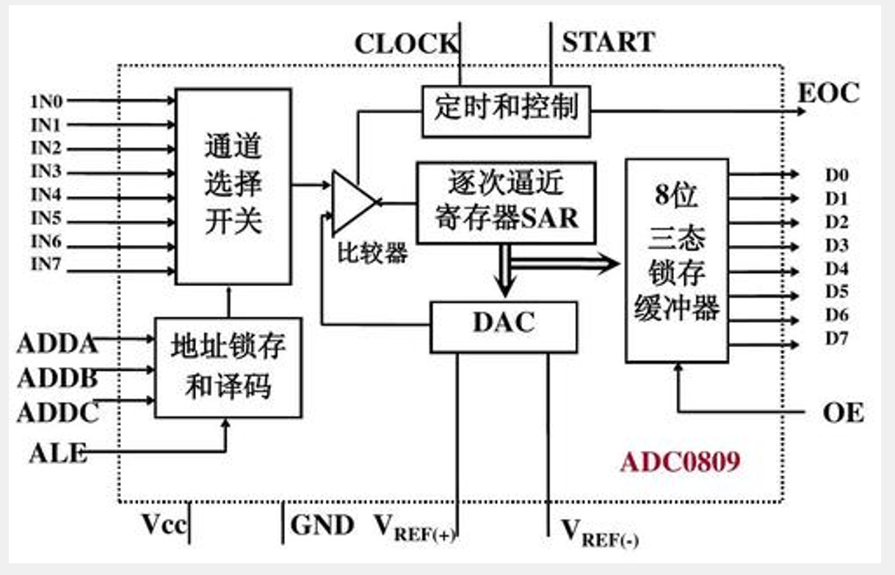

 

**ADC框图**：

注入组最多4个通道（菜单），对应的通道数据寄存器也有4个（桌子多），所以可以同时传输4个数据（菜），不用太担心数据覆盖的问题。

规则组有最多可以有16个输入通道（菜单），但是通道对应的数据寄存器（桌子少）只有一个，如果数据（菜）不及时拿走就会被覆盖，所以最好配合DMA把数据转运走。

ADCCLK是时钟频率，因为限制了最大只能14MHz，而频率是72MHz，分频系数却只有/2，/4，/6，/8，其中选择2和4都不能选因为超过14MHz了，所以只能选择6分频的72 ÷ 6 = 12MHz 或者 8分频的72 ÷ 8 = 9MHz。时钟分频可查看定时器篇的RCC时钟树。  

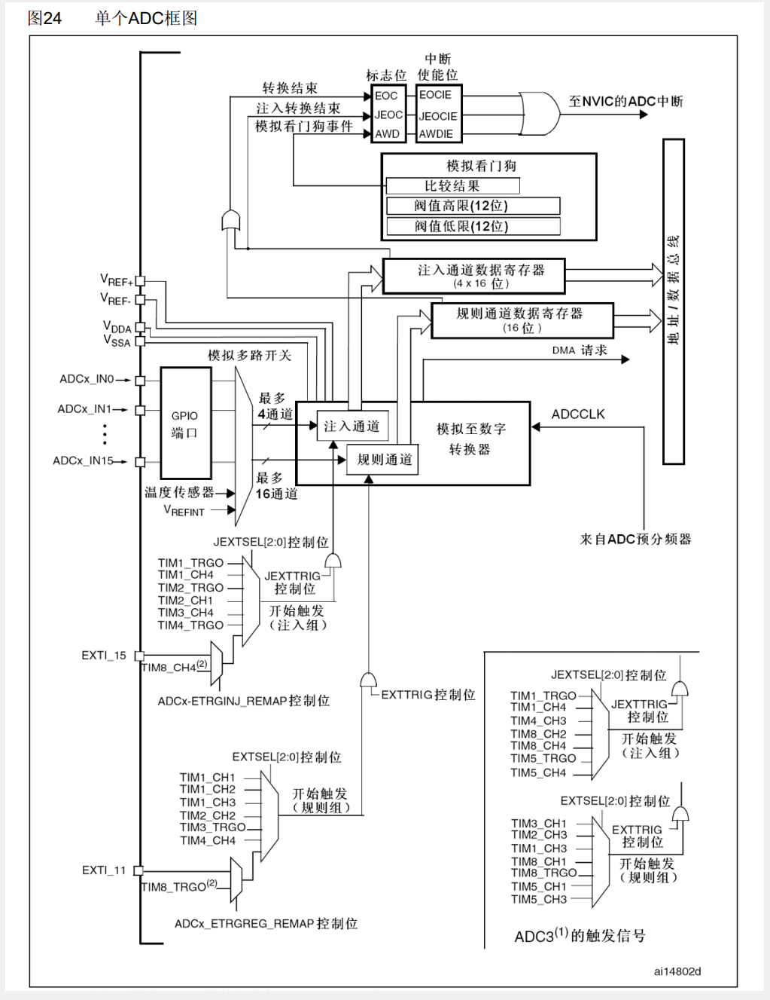


**ADC时序图**：

这里的14个时钟周期指的是采样周期为1.5，也就是转换时间最短、最快的情况下

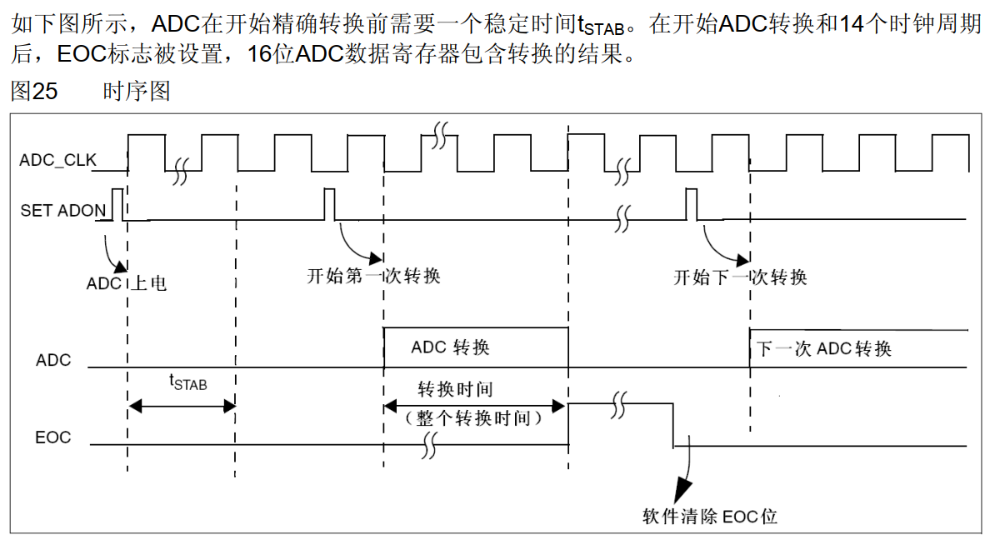


**ADC转换时间**：

- **STM32F103xx增强型**产品：时钟为**56MHz时为1μs** (时钟为**72MHz为1.17μs**) 
- **STM32F101xx基本型**产品：时钟为**28MHz时为1μs** (时钟为**36MHz为1.55μs**) 
- **STM32F102xxUSB型**产品：时钟为**48MHz时为1.2μs**
- **STM32F105xx和STM32F107xx**产品：时钟为**56MHz时为1μs**(时钟为**72MHz为1.17μs**)

有人可能会问了，为什么会有的时钟频率明明更快，但是转换用的时间却比更久呢？正常不是时钟频率越快需要的时间越少吗？这里怎么反过来了？

其实问题的答案就在**RCC时钟树的 ”ADCCLK时钟频率的分频系数限制“ 和 这里的 ”ADC转换 14个时钟周期后，EOC标志才被设置“**，这两句话里。因为限制了**ADC最大时钟频率**只能是**14MHz**，不能超过但是可以小于。而**分频系数**只有**/2，/4，/6，/8** 这四个可以选。最后时钟频率经过分频后的时钟周期 跟 ADC转换需要的14个时钟周期一对比就会发现转换的时间就是1us左右。

**就是因为ADC频率限制不能超14MHz，导致更快的时钟却只能选择更大的分频系数，频率减速了，所以速度反而慢了下来**（可查看上面ADC框图的分析和TIM篇的RCC时钟树配合印证）

栗子：

（1）56MHz经过下面的分频系数选择，可以得出能选择的最小分频系数是4，最快的时钟频率是14MHz，即1s可以有14000000个时钟周期，1个周期的时间约等于是71.42ns（后面的小数计算时不忽略），属于是卡极限了，而14个时钟周期用的时间正好就是1us。

```
//计算出能有14MHz及以内的分频系数
56MHz ÷ 2 = 28MHz （超过14MHz，不能使用）
56MHz ÷ 4 = 14MHz （能使用）
56MHz ÷ 6 = 9.3333333333333333333333333333333MHz （能使用）
56MHz ÷ 8 = 7MHz （能使用）

//计算1个时钟周期
1 ÷ 14MHz = 1 ÷ 14000000 
		  = 7.1428571428571428571428571428571e-8 
		  约等于 71.42ns（1个时钟周期）

//计算14个时钟周期
7.1428571428571428571428571428571e-8 × 14 = 0.000001秒
										  = 1us
```


（2）72MHz经过下面的分频系数选择，可以得出能选择的最小分频系数是6，最快的时钟频率是12MHz，即1s可以有12000000个时钟周期，1个周期的时间约等于是83.33ns（后面的小数计算时不忽略），而14个时钟周期用的时间就是约等于1.17us。

```
//计算出能有14MHz及以内的分频系数
72MHz ÷ 2 = 36MHz （超过14MHz，不能使用）
72MHz ÷ 4 = 18MHz （超过14MHz，不能使用）
72MHz ÷ 6 = 12MHz （能使用）
72MHz ÷ 8 = 9MHz （能使用）

//计算1个时钟周期所需时间
1 ÷ 12MHz = 1 ÷ 12000000 
		  = 8.3333333333333333333333333333333e-8 
		  ≈ 83.33ns（1个时钟周期）

//计算14个时钟周期所需时间
8.3333333333333333333333333333333e-8 × 14 = 1.1666666666666666666666666666667e-6秒
							    		  ≈  1.17us
```


**ADC基本结构**：

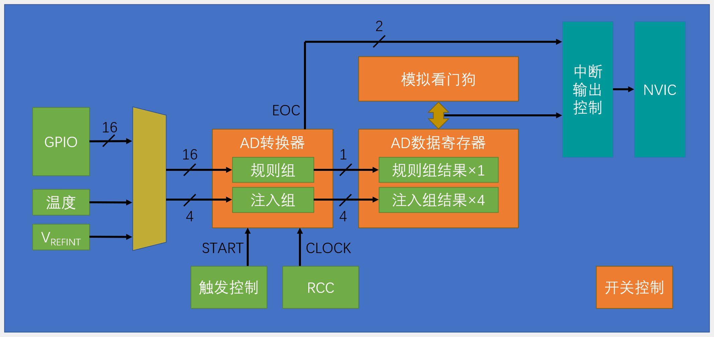


**输入通道**：

STM32F103C8T6没有PC0到PC5的引脚，所以这几个引脚代表的通道不能用。

只有ADC1有温度传感器的通道16和内部参考电压通道17，ADC2和ADC3没有，因为ADC2的模拟输入通道16和通道17在芯片内部连到了Vss。ADC3模拟输入通道14、 15、 16、 17与Vss相连。

ADC1和ADC2通道0~通道15引脚是一样的，这是因为ADC有双ADC模式，可以交替采样提高采样率。

ADC3的通道就特别点了，相比其他两个显得缺东缺西的，还有远房亲戚。通道0~3、通道10~13和ADC1、ADC2相同，而通道4~通道8都跑到GPIOF引脚去了。

| **通道** | **ADC1**     | **ADC2** | **ADC3** |
| :------- | ------------ | -------- | -------- |
| 通道0    | PA0          | PA0      | PA0      |
| 通道1    | PA1          | PA1      | PA1      |
| 通道2    | PA2          | PA2      | PA2      |
| 通道3    | PA3          | PA3      | PA3      |
| 通道4    | PA4          | PA4      | PF6      |
| 通道5    | PA5          | PA5      | PF7      |
| 通道6    | PA6          | PA6      | PF8      |
| 通道7    | PA7          | PA7      | PF9      |
| 通道8    | PB0          | PB0      | PF10     |
| 通道9    | PB1          | PB1      |          |
| 通道10   | PC0          | PC0      | PC0      |
| 通道11   | PC1          | PC1      | PC1      |
| 通道12   | PC2          | PC2      | PC2      |
| 通道13   | PC3          | PC3      | PC3      |
| 通道14   | PC4          | PC4      |          |
| 通道15   | PC5          | PC5      |          |
| 通道16   | 温度传感器   |          |          |
| 通道17   | 内部参考电压 |          |          |


**模式（规则组）**：

以下模式都是规则组的，注入组的只有4个序列，规则组有16个序列。


**单次转换，非扫描模式**：

序列是按序列号顺序转换通道的数据，通道可以选序列，可以重复转换。（序列就相当于按顺序固定好位置的椅子，通道就相当于人的屁股，顺序不会变，但人可以选位置坐，而且可以选多次）

这个单次转换就是说只用到了序列1和通道2，触发转换一次就报EOC完成，想再次转换只能满足条件再触发。

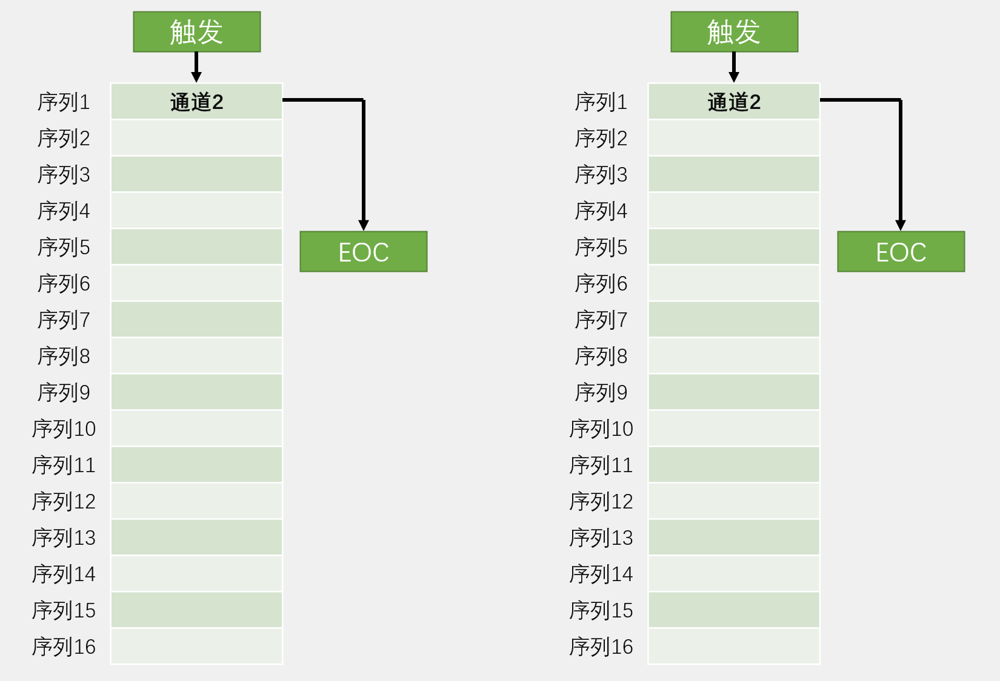


**连续转换，非扫描模式**：

这个连续转换就是说只用到了序列1和通道2，只触发一次就开始转换，报EOC完成不停止，跳转回序列1继续转换。

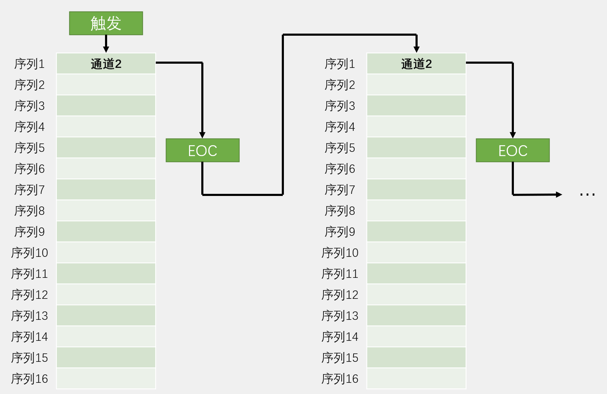


**单次转换，扫描模式**：

这个单次转换，扫描模式就是说用的了多个序列和通道，触发转换序列和通道都转换一次就报EOC完成，想再次转换只能满足条件再触发。  

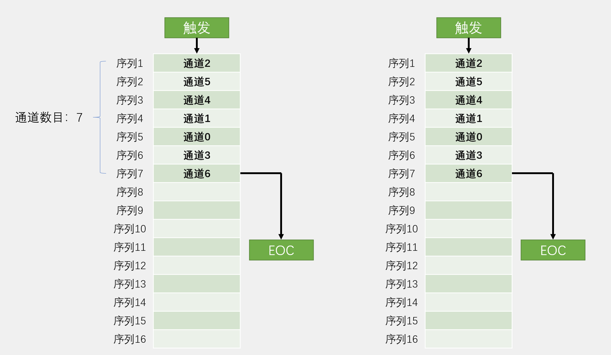


**连续转换，扫描模式**：

这个连续转换，扫描模式就是说用的了多个序列和通道，只触发一次就开始转换，报EOC完成不停止，跳转回序列1继续按顺序转换。  

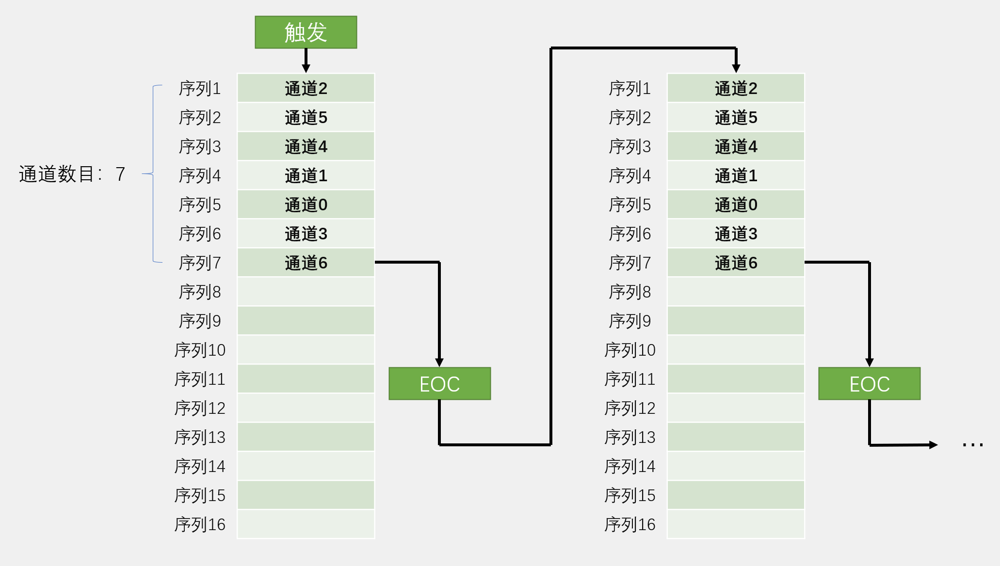


**触发控制（规则组）**：

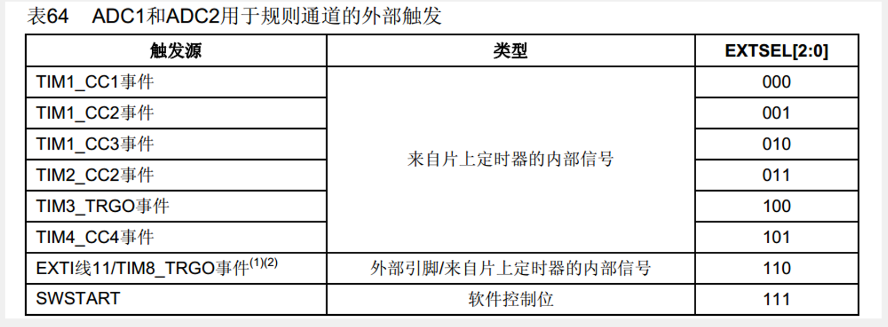


**数据对齐**：

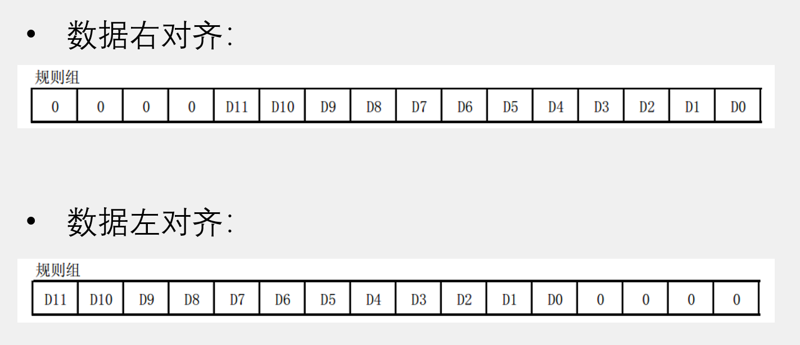


**转换时间**：

AD转换的步骤：采样，保持，量化，编码（采样和保持一组，量化和编码一组）

STM32 的ADC总转换时间为：

```
T_CONV = 采样时间 + 12.5个ADC周期

例(1)：当ADCCLK=14MHz，1个周期约为71.42ns。采样时间为1.5个ADC周期
T_CONV = 1.5 + 12.5 = 14个ADC周期
14个ADC周期 x 71.42ns = 1μs

例(2)：当ADCCLK=14MHz，1个周期约为71.42ns。采样时间为55.5个ADC周期
T_CONV = 55.5 + 12.5 = 68个ADC周期
68个ADC周期 x 71.42ns = 4.85μs
```

注：好像可以进行超频14MHz，这样转换时间就比1us还快，不过稳定性就差了。


**校准**：

ADC有一个内置自校准模式。校准可大幅减小因内部电容器组的变化而造成的准精度误差。校准期间，在每个电容器上都会计算出一个误差修正码(数字值)，这个码用于消除在随后的转换中每个电容器上产生的误差

建议在每次上电后执行一次校准

启动校准前， ADC必须处于关电状态超过至少两个ADC时钟周期


**硬件电路**：

第一个是电位器，第二个是光敏电阻，第三个是串联分压。

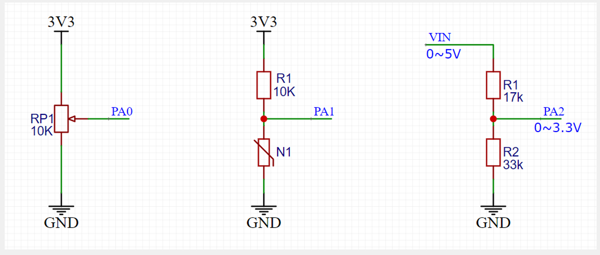


**ADC寄存器**：  

- **ADC状态寄存器(ADC_SR)**  ：
  - **STRT规则通道开始位**：该位由硬件在规则通道转换开始时设置，由软件清除。
    - 0：规则通道转换未开始；
    
    - 1：规则通道转换已开始
    
  - **JSTRT注入通道开始位**：该位由硬件在注入通道组转换开始时设置，由软件清除。
    - 0：注入通道组转换未开始；
    - 1：注入通道组转换已开始。
    
  - **JEOC注入通道转换结束位**：该位由硬件在所有注入通道组转换结束时设置，由软件清除。
    - 0：转换未完成；
    - 1：转换完成。
    
  - **EOC转换结束位**：该位由硬件在(规则或注入)通道组转换结束时设置，由软件清除或由读取ADC_DR时清除。
    - 0：转换未完成；
    - 1：转换完成。
    
  - **AWD模拟看门狗标志位**：该位由硬件在转换的电压值超出了ADC_LTR和ADC_HTR寄存器定义的范围时设置，由软件清除。
     - 0：没有发生模拟看门狗事件；
     - 1：发生模拟看门狗事件


- **ADC控制寄存器(ADC_CR1)  **：

  - ADC**控制寄存器 1**(ADC_CR1)  ：

    - **AWDEN：在规则通道上开启模拟看门狗** (Analog watchdog enable on regular channels)

      该位由软件设置和清除。

      - 0：在规则通道上禁用模拟看门狗；

      - 1：在规则通道上使用模拟看门狗。

    - **JAWDEN：在注入通道上开启模拟看门狗** (Analog watchdog enable on injected channels)

      该位由软件设置和清除。

      - 0：在注入通道上禁用模拟看门狗；

      - 1：在注入通道上使用模拟看门狗。

    - **DUALMOD[3:0]：双模式选择** (Dual mode selection)

      软件使用这些位选择操作模式。

      | 选择操作模式                      |
      | --------------------------------- |
      | 0000：独立模式                    |
      | 0001：混合的同步规则+注入同步模式 |
      | 0010：混合的同步规则+交替触发模式 |
      | 0011：混合同步注入+快速交叉模式   |
      | 0100：混合同步注入+慢速交叉模式   |
      | 0101：注入同步模式                |
      | 0110：规则同步模式                |
      | 0111：快速交叉模式                |
      | 1000：慢速交叉模式                |
      | 1001：交替触发模式                |

      > 注： 在ADC2和ADC3中这些位为保留位在双模式中，改变通道的配置会产生一个重新开始的条件，这将导致同步丢失。建议在进行任何配置改变前关闭双模式。

    - **DISCNUM[2:0]：间断模式通道计数** (Discontinuous mode channel count)

      软件通过这些位定义在间断模式下，收到外部触发后转换规则通道的数目

      000： 1个通道

      001： 2个通道

      …… 

      111： 8个通道

    - **JDISCEN：在注入通道上的间断模式** (Discontinuous mode on injected channels)

      该位由软件设置和清除，用于开启或关闭注入通道组上的间断模式

      - 0：注入通道组上禁用间断模式；

      - 1：注入通道组上使用间断模式。

    - **DISCEN：在规则通道上的间断模式** (Discontinuous mode on regular channels)

      该位由软件设置和清除，用于开启或关闭规则通道组上的间断模式

      - 0：规则通道组上禁用间断模式；
      - 1：规则通道组上使用间断模式。

    - **JAUTO：自动的注入通道组转换** (Automatic Injected Group conversion)

      该位由软件设置和清除，用于开启或关闭规则通道组转换结束后自动的注入通道组转换

      - 0：关闭自动的注入通道组转换；
      - 1：开启自动的注入通道组转换。

    - **AWDSGL：扫描模式中在一个单一的通道上使用看门狗** (Enable the watchdog on a single channel in scan mode)

      该位由软件设置和清除，用于开启或关闭由AWDCH[4:0]位指定的通道上的模拟看门狗功能

      - 0：在所有的通道上使用模拟看门狗；

      - 1：在单一通道上使用模拟看门狗。

    - **SCAN：扫描模式** (Scan mode)

      该位由软件设置和清除，用于开启或关闭扫描模式。

      在扫描模式中，转换由ADC_SQRx或ADC_JSQRx寄存器选中的通道。

      - 0：关闭扫描模式；

      - 1：使用扫描模式。

      > 注：如果分别设置了EOCIE或JEOCIE位，只在最后一个通道转换完毕后才会产生EOC或JEOC中断。

    - **JEOCIE：允许产生注入通道转换结束中断** (Interrupt enable for injected channels)

      该位由软件设置和清除，用于禁止或允许所有注入通道转换结束后产生中断。

      - 0：禁止JEOC中断；

      - 1：允许JEOC中断。当硬件设置JEOC位时产生中断。

    - **AWDIE：允许产生模拟看门狗中断** (Analog watchdog interrupt enable)

      该位由软件设置和清除，用于禁止或允许模拟看门狗产生中断。

      在扫描模式下，如果看门狗检测到超范围的数值时，只有在设置了该位时扫描才会中止。

      - 0：禁止模拟看门狗中断；

      - 1：允许模拟看门狗中断。

    - **EOCIE：允许产生EOC中断** (Interrupt enable for EOC)

      该位由软件设置和清除，用于禁止或允许转换结束后产生中断。
  
      - 0：禁止EOC中断；
      - 1：允许EOC中断。当硬件设置EOC位时产生中断。

    - **AWDCH[4:0]：模拟看门狗通道选择位** (Analog watchdog channel select bits)

      这些位由软件设置和清除，用于选择模拟看门狗保护的输入通道。

      00000： ADC模拟输入通道0 

      00001： ADC模拟输入通道1 

      …… 

      01111： ADC模拟输入通道15 

      10000： ADC模拟输入通道16 

      10001： ADC模拟输入通道17

      保留所有其他数值。
  
      > 注：
      >
      > ADC1的模拟输入通道16和通道17在芯片内部分别连到了温度传感器和VREFINT。
      >
      > ADC2的模拟输入通道16和通道17在芯片内部连到了VSS。
      >
      > ADC3模拟输入通道9、 14、 15、 16、 17与Vss相连。

    

  - **ADC控制寄存器 2(ADC_CR2)  **：

    - **TSVREFE：温度传感器和VREFINT使能** (Temperature sensor and VREFINT enable)

      该位由软件设置和清除，用于开启或禁止温度传感器和VREFINT通道。在多于1个ADC的器件中，该位仅出现在ADC1中。
  
      - 0：禁止温度传感器和VREFINT；
      - 1：启用温度传感器和VREFINT。

    - **SWSTART：开始转换规则通道** (Start conversion of regular channels)

      由软件设置该位以启动转换，转换开始后硬件马上清除此位。如果在EXTSEL[2:0]位中选择了SWSTART为触发事件，该位用于启动一组规则通道的转换.
  
      - 0：复位状态；
      - 1：开始转换规则通道。

    - **JSWSTART：开始转换注入通道** (Start conversion of injected channels)

      由软件设置该位以启动转换，软件可清除此位或在转换开始后硬件马上清除此位。如果在JEXTSEL[2:0]位中选择了JSWSTART为触发事件，该位用于启动一组注入通道的转换，
  
      - 0：复位状态；
      - 1：开始转换注入通道。

    - **EXTTRIG：规则通道的外部触发转换模式** (External trigger conversion mode for regular channels)

      该位由软件设置和清除，用于开启或禁止可以启动规则通道组转换的外部触发事件。
  
      - 0：不用外部事件启动转换；
      - 1：使用外部事件启动转换

    - **EXTSEL[2:0]：选择启动规则通道组转换的外部事件** (External event select for regular group)

      这些位选择用于启动规则通道组转换的外部事件
  
      | ADC1和ADC2的触发配置如下 |                                                              |
      | ------------------------ | ------------------------------------------------------------ |
      | 000：定时器1的CC1事件    | 100：定时器3的TRGO事件                                       |
      | 001：定时器1的CC2事件    | 101：定时器4的CC4事件                                        |
      | 010：定时器1的CC3事件    | 110： EXTI线11/ TIM8_TRGO事件，仅大容量产品具有TIM8_TRGO功能 |
      | 011：定时器2的CC2事件    | 111： SWSTART                                                |
  
      | ADC3的触发配置如下    |                        |
      | --------------------- | ---------------------- |
      | 000：定时器3的CC1事件 | 100：定时器8的TRGO事件 |
      | 001：定时器2的CC3事件 | 101：定时器5的CC1事件  |
      | 010：定时器1的CC3事件 | 110：定时器5的CC3事件  |
      | 011：定时器8的CC1事件 | 111： SWSTART          |

    - **JEXTTRIG：注入通道的外部触发转换模式** (External trigger conversion mode for injected channels)

      该位由软件设置和清除，用于开启或禁止可以启动注入通道组转换的外部触发事件。

      - 0：不用外部事件启动转换；

      - 1：使用外部事件启动转换。

    - **JEXTSEL[2:0]：选择启动注入通道组转换的外部事件** (External event select for injected group)

      这些位选择用于启动注入通道组转换的外部事件。
  
      | ADC1和ADC2的触发配置如下 |                                                       |
      | ------------------------ | ----------------------------------------------------- |
      | 000：定时器1的TRGO事件   | 100：定时器3的CC4事件                                 |
      | 001：定时器1的CC4事件    | 101：定时器4的TRGO事件                                |
      | 010：定时器2的TRGO事件   | 110： EXTI线15/TIM8_CC4事件(仅大容量产品具有TIM8_CC4) |
      | 011：定时器2的CC1事件    | 111： JSWSTART                                        |
  
      | ADC3的触发配置如下     |                        |
      | ---------------------- | ---------------------- |
      | 000：定时器1的TRGO事件 | 100：定时器8的CC4事件  |
      | 001：定时器1的CC4事件  | 101：定时器5的TRGO事件 |
      | 010：定时器4的CC3事件  | 110：定时器5的CC4事件  |
      | 011：定时器8的CC2事件  | 111： JSWSTART         |

    - **ALIGN：数据对齐** (Data alignment)
  
      该位由软件设置和清除。参考图29和图30。
    
      - 0：右对齐；
      - 1：左对齐。

    - **DMA：直接存储器访问模式** (Direct memory access mode)
  
      该位由软件设置和清除。详见DMA控制器章节。
    
      - 0：不使用DMA模式；
      - 1：使用DMA模式。

      > 注：只有ADC1和ADC3能产生DMA请求。

    - **RSTCAL：复位校准** (Reset calibration)
  
      该位由软件设置并由硬件清除。在校准寄存器被初始化后该位将被清除。
    
      - 0：校准寄存器已初始化；
      - 1：初始化校准寄存器。

      > 注：如果正在进行转换时设置RSTCAL，清除校准寄存器需要额外的周期。

    - **CAL： A/D校准** (A/D Calibration)
  
      该位由软件设置以开始校准，并在校准结束时由硬件清除。
    
      - 0：校准完成；
      - 1：开始校准。

    - **CONT：连续转换** (Continuous conversion)
  
      该位由软件设置和清除。如果设置了此位，则转换将连续进行直到该位被清除。
    
      - 0：单次转换模式；
      - 1：连续转换模式。

    - **ADON：开/关A/D转换器** (A/D converter ON / OFF)

      该位由软件设置和清除。当该位为’0’时，写入’1’将把ADC从断电模式下唤醒。

      当该位为’1’时，写入’1’将启动转换。应用程序需注意，在转换器上电至转换开始有一个延迟t_STAB，参见图25。

      - 0：关闭ADC转换/校准，并进入断电模式；
  
      - 1：开启ADC并启动转换。
    
      > 注：如果在这个寄存器中与ADON一起还有其他位被改变，则转换不被触发。这是为了防止触发错误的转换。


- **ADC采样时间寄存器** 

  - ADC采样时间**寄存器 1** (ADC_SMPR1)  ：**通道配置是SMP10~SMP17**

    SMPx[2:0]选择通道x的采样时间 

    这些位用于独立地选择每个通道的采样时间。在采样周期中通道选择位必须保持不变。

    | 000： 1.5周期      | 100： 41.5周期      |
    | ------------------ | ------------------- |
    | **001： 7.5周期**  | **101： 55.5周期**  |
    | **010： 13.5周期** | **110： 71.5周期**  |
    | **011： 28.5周期** | **111： 239.5周期** |

    > 注：
    >
    > ADC1的模拟输入通道16和通道17在芯片内部分别连到了温度传感器和VREFINT。
    >
    > ADC2的模拟输入通道16和通道17在芯片内部连到了Vss。
    >
    > ADC3模拟输入通道14、 15、 16、 17与Vss相连

  - ADC采样时间**寄存器 2** (ADC_SMPR2)  ：**通道配置是SMP0~SMP9**

    位描述同上面的采样时间寄存器 1。

    > 注： ADC3模拟输入通道9与Vss相连

  

- **ADC注入通道数据偏移寄存器x (ADC_JOFRx)(x=1..4)**  ：

  - **JOFFSETx[11:0]注入通道x的数据偏移**：当转换注入通道时，这些位定义了用于**从原始转换数据中减去的数值**。

    转换的结果可以在ADC_JDRx寄存器中读出。（也就是说把**AD转换出来的数据减去这个寄存器的值**，之后的数据才是注入通道数据寄存器的值，而不是什么地址偏移）

  

- **ADC看门狗寄存器**

  - ADC**看门狗高阀值**寄存器(ADC_HTR)  ：**HT[11:0]模拟看门狗高阀值**，这些位定义了模拟看门狗的阀值高限。

  

  - ADC**看门狗低阀值**寄存器(ADC_LRT)  ： **LT[11:0]模拟看门狗低阀值**， 这些位定义了模拟看门狗的阀值低限。

  

- **ADC规则序列寄存器**：转换序列共1~16，共16个。

  - ADC规则序列**寄存器 1** (ADC_SQR1)  ：

    - **L[3:0]规则通道序列长度**：这些位由软件定义在规则通道转换序列中的通道数目。

      例：0000：1个转换，0001：2个转换，1111：16个转换

    - **SQx[4:0]规则序列中的第x个转换**：由软件定义转换序列中的转换通道的编号，每个都占用5个bit位。**SQ13~SQ16 转换通道**。

  

  - ADC规则序列**寄存器 2** (ADC_SQR2)  ：只有由软件定义转换序列**SQ7~SQ12 转换通道**的编号，无其他配置。

  

  - ADC规则序列**寄存器 3** (ADC_SQR3)  ：只有由软件定义转换序列**SQ1~SQ6 转换通道**的编号，无其他配置。

  

- **ADC注入序列寄存器(ADC_JSQR)**  ：

  - **JL[1:0]注入通道序列长度**：

    这些位由软件定义在规则通道转换序列中的通道数目。共4个。

    - 00： 1个转换
    - 01： 2个转换
    - 10： 3个转换
    - 11： 4个转换

    When JL=3 ( 4 injected conversions in the sequencer), the ADC converts the channels in this order:

    JSQ1[4:0] >> JSQ2[4:0] >> JSQ3[4:0] >> JSQ4[4:0]

    When JL=2 ( 3 injected conversions in the sequencer), the ADC converts the channels in this order: 

    JSQ2[4:0] >> JSQ3[4:0] >> JSQ4[4:0]

    When JL=1 ( 2 injected conversions in the sequencer), the ADC converts the channels in this order: 

    JSQ3[4:0] >> JSQ4[4:0]

    When JL=0 (1 injected conversion in the sequencer), the ADC converts only JSQ4[4:0] channel

    > 上面那几句英文的意思是转换通道不满4个的时候，减少的通道从低位开始减，即从系列JSQ1[4:0]开始递减。
    >
    > 4个满系列的话就是从序列1开始到序列4结尾，只有两个序列的话就是从序列3开始到系列4结尾，只有两个通道序列。  

  - **JSQ4[4:0]注入序列中的第4个转换**：

    这些位由软件定义转换序列中的第4个转换通道的编号(0~17)。

    > 注：不同于规则转换序列，如果JL[1:0]的长度小于4，则转换的序列顺序是从(4 - JL)开始。  
    >
    > 例如： ADC_JSQR[21:0] = 10 00011 00011 00111 00010，就是这个寄存器的所有值，最左边的10设置序列长度3，其他都是序列。  
    >
    > 意味着扫描转换将按下列通道顺序转换： 7、 3、 3，而不是2、 7、 3。（系列1中的通道2不要了，直接被踢出局，跳过）  

  - JSQ3[4:0]：注入序列中的**第3个转换，参考上面的第4个转换**

  - JSQ2[4:0]：注入序列中的**第2个转换，参考上面的第4个转换**

  - JSQ1[4:0]：注入序列中的**第1个转换，参考上面的第4个转换**

  

- **ADC 注入数据寄存器x (ADC_JDRx) (x= 1..4)**  ：

  - **JDATA[15:0]注入转换的数据，注入组有4个数据寄存器**。

    这些位为只读，包含了注入通道的转换结果。
    
    数据是左对齐或右对齐，如图参考手册29和图30所示。

  

- **ADC规则数据寄存器(ADC_DR)**  ：

  - **ADC2转换的数据ADC2DATA[15:0]**： 

    - 在ADC1中：双模式下，这些位包含了ADC2转换的规则通道数据。见11.9： 双ADC模式
    - 在ADC2和ADC3中：不使用这些位。

  - **规则转换的数据 DATA[15:0]**：

    这些位为只读，包含了规则通道的转换结果。
    
    数据是左对齐或右对齐，如参考手册图29和图30所示。


## 08-DMA直接存储器存取

**DMA简介**：

**DMA（Direct Memory Access）直接存储器存取**

DMA可以提供**外设和存储器**或者**存储器和存储器**之间的高速**数据传输**，无须CPU干预，**节省了CPU的资源**

12个独立可配置的通道： **DMA1（7个通道）**， **DMA2（5个通道）**

每个通道都支持**软件触发**和**特定的硬件触发**

**STM32F103C8T6 DMA资源：DMA1（7个通道）**

当CPU和DMA同时访问相同的目标(RAM或外设)时， DMA请求会暂停CPU访问系统总线达若干个周期，总线仲裁器执行循环调度，以保证CPU至少可以得到一半的系统总线(存储器或外设)带宽，意思就是DMA和CPU同时访问同一个存储器或者外设的时候，DMA的优先级比CPU高，而且只留一半的速度和时间给CPU。  


**存储器映像**：  

|  类型  | **起始地址**      | **存储器**         | **用途**                                          |
| :----: | ----------------- | ------------------ | ------------------------------------------------- |
|        | 0x0800 0000       | 程序存储器Flash    | 存储C语言编译后的程序代码                         |
|  ROM   | 0x1FFF F000       | 系统存储器         | 存储BootLoader，用于串口下载                      |
|        | 0x1FFF F800       | 选项字节           | 存储一些独立于程序代码的配置参数                  |
| ------ | ----------------- | ------------------ | ------------------------------------------------- |
|        | 0x2000 0000       | 运行内存SRAM       | 存储运行过程中的临时变量                          |
|  RAM   | 0x4000 0000       | 外设寄存器         | 存储各个外设的配置参数                            |
|        | 0xE000 0000       | 内核外设寄存器     | 存储内核各个外设的配置参数                        |


**DMA框图**：

这里APB1和APB2总线写错了，应该反过来

DMA访问Flash是只读的，但是如果非得修改可能要先配置Flash接口控制器进行页擦除，才能写入。

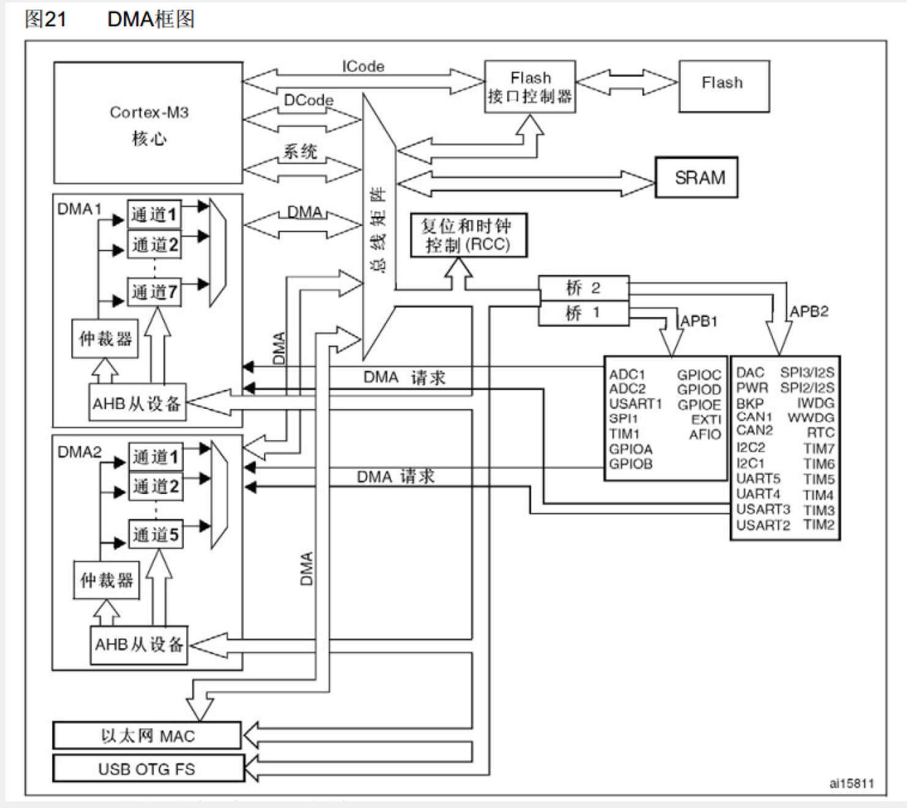


**DMA基本结构**：

DMA启动必须满足三个条件：

- 开关控制，DMA_Cmd必须使能。
- 传输计数器必须大于0。
- 必须有触发源，即触发信号。

**自动重装和软件触发不能同时使用**，否则会连续不间断的触发，所以M2M的配置要特别注意。

- 给1就是软件触发，软件触发是以最快速度把数据转运，一般用于**存储器到存储器**的数据转运。
- 给0就是硬件触发，由外设提供DMA触发信号，再进行数据转运。


DMA开启时无法写入计数器，写之前，必须先调用DMA_Cmd函数，DISABLE进行失能，把值写入到计数器后，再重新ENABLE使能开启。

Flash是只读的，所以不能无法进行数据SRAM到Flash，Flash到Flash的操作。

**外设和存储器**其实就是ST公司给起的一个名字而已，**存储器转运到存储器**也这样填，一样一个是**起始坐标**，另一个是**目的地坐标**，重点**看方向**确定起点和终点。

如果是ADC扫描模式，用DMA进行数据转运，外设地址是ADC_DR寄存器，那么寄存器这边，地址就不用自增了。如果自增下次转运就跑到别的寄存器去了，因为ADC的**规则组的数据寄存器 ADC_DR** 是自身的数据是来一个触发一次DMA搬运数据的，换成**注入组的数据寄存器x (ADC_JDRx)**可能要地址自增了。  

传输计数器是自减的， 如果给他写入5，那就可以进行5次转运，转运完成后，自增的地址也会跟着回到初始地址，方便下一次转运。自动重装器是决定是否给计数器写入重装值的，如果不使用，转运5次减到0后DMA就停止，如果使用计数器减到0后，立即重装初始值5到计数器。

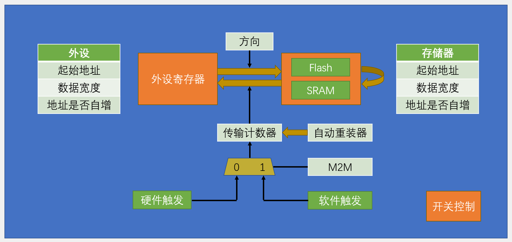


**DMA请求**：

这个只是DMA1的请求表，而DMA2外设对应的通道和DMA1是不一样的，不过STM32F103C8T6没有，所以不用太注意，其他的型号说不定有，就要注意了。

EN不是数据选择器的选择位，而是确定数据选择器是否工作。EN=0，数据选择器不工作。EN=1，数据选择器工作。M2M才是选择位，0是硬件触发，1是软件触发。

外设的触发源和通道是固定的，只能选择对应的通道进行数据传输。软件触发就7个通道都可以。

优先级是默认通道数的值越小，优先级越高，不过也可以在程序里配置调整（硬件优先级是否固定的还需验证）

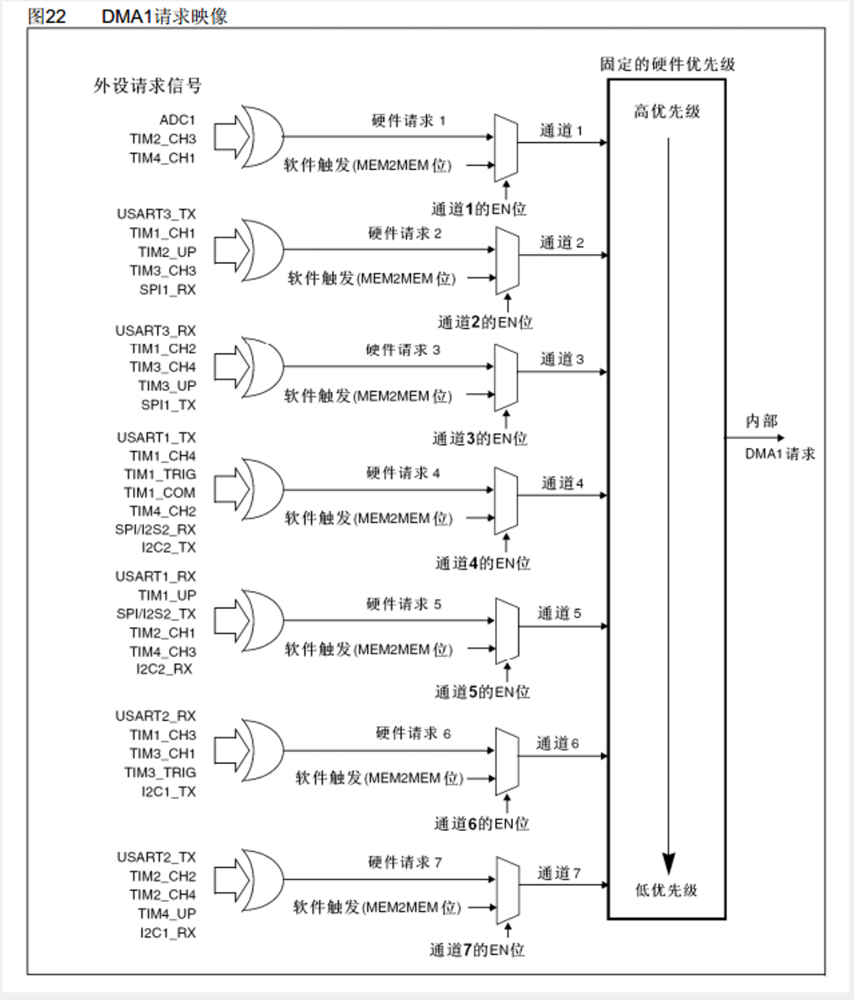


**数据宽度与对齐**：

根据**源端宽度**和**目标宽度**的容值，进行位的**多补少舍**的数据调整。其实就是看容器够不够大，不够大就加大，太大就减小。

- 容器太大有多余的地方就**高位补0**，就像往水桶倒水但水只倒了半桶就没有了，所以高位还有多余的空间。
- 容器太小装不下，放弃多出来的部分就**高位舍弃**，就像往水桶里到水都已经倒满了，还有多的水但还在继续倒但已经装不下，就只能不要了。

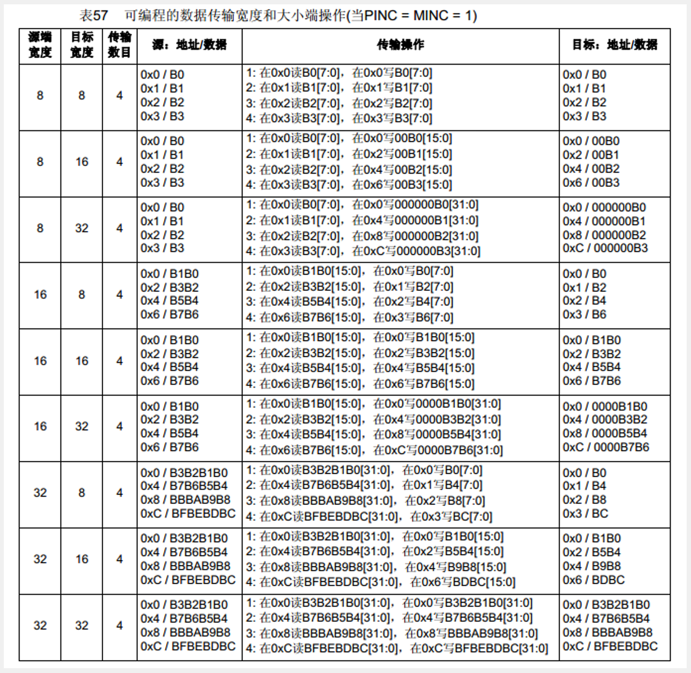


**数据转运+DMA**：

转运是复制一份在转运。

因为是外设（不涉及硬件的外设，其实也是存储器的只不过是另起一个名字做区分而已）和存储器直接的信号互相传输相当于RAM和RAM传输，所以可以直接软件触发，以最快速度的进行数据传输。涉及硬件的话就要软件触发进行开始第一次触发之后，触发的信号由硬件外设，如ADC提供DMA请求进行触发。

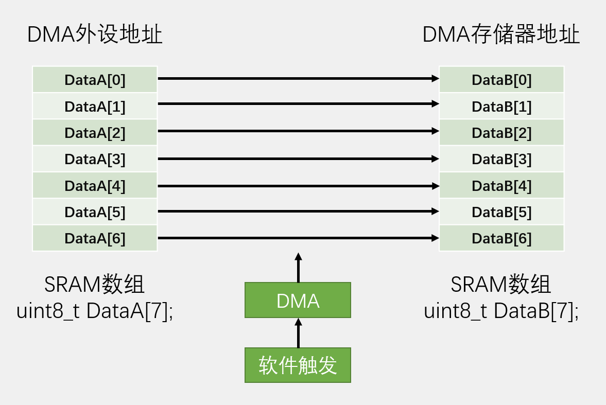


**ADC扫描模式+DMA**：

序列是决定那个通道的数据先传输，通道可以不按顺序和可以重复出现。

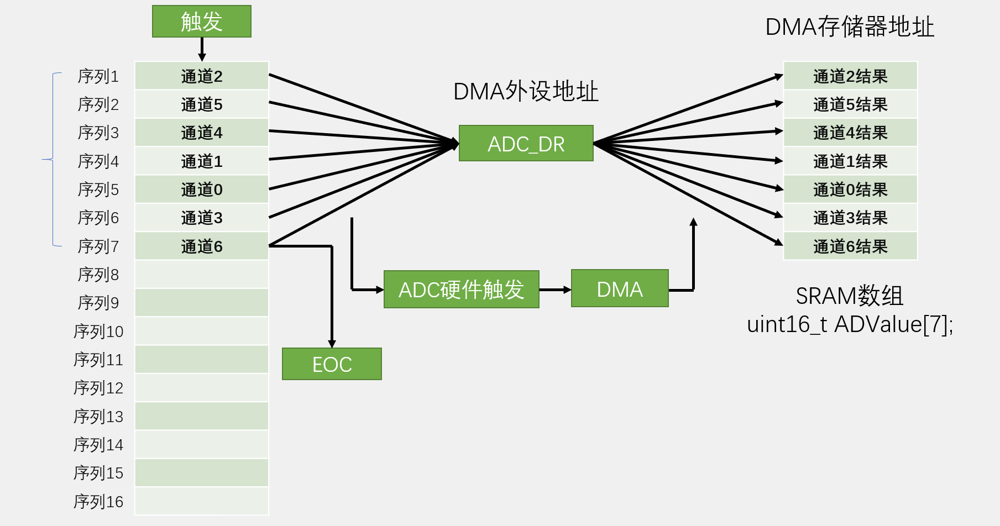


**DMA寄存器**：

- **DMA中断状态寄存器(DMA_ISR)**  ：

  - **TEIFx：通道x的传输错误标志**(x = 1 … 7) (Channel x transfer error flag)

    硬件设置这些位。在DMA_IFCR寄存器的相应位写入’1’可以清除这里对应的标志位。

    - 0：在通道x没有传输错误(TE)；
    - 1：在通道x发生了传输错误(TE)。

  - **HTIFx：通道x的半传输标志**(x = 1 … 7) (Channel x half transfer flag)

    硬件设置这些位。在DMA_IFCR寄存器的相应位写入’1’可以清除这里对应的标志位。

    - 0：在通道x没有半传输事件(HT)；

    - 1：在通道x产生了半传输事件(HT)。

  - **TCIFx：通道x的传输完成标志**(x = 1 … 7) (Channel x transfer complete flag)

    硬件设置这些位。在DMA_IFCR寄存器的相应位写入’1’可以清除这里对应的标志位。

    - 0：在通道x没有传输完成事件(TC)；

    - 1：在通道x产生了传输完成事件(TC)。

  - **GIFx：通道x的全局中断标志**(x = 1 … 7) (Channel x global interrupt flag)

    硬件设置这些位。在DMA_IFCR寄存器的相应位写入’1’可以清除这里对应的标志位。

    - 0：在通道x没有TE、 HT或TC事件；
    - 1：在通道x产生了TE、 HT或TC事件。


- **DMA中断标志清除寄存器(DMA_IFCR)**  ：

  - **CTEIFx：清除通道x的传输错误标志**(x = 1 … 7) (Channel x transfer error clear)

    这些位由软件设置和清除。

    - 0：不起作用
    - 1：清除DMA_ISR寄存器中的对应TEIF标志。

  - **CHTIFx：清除通道x的半传输标志**(x = 1 … 7) (Channel x half transfer clear)

    这些位由软件设置和清除。

    - 0：不起作用
    - 1：清除DMA_ISR寄存器中的对应HTIF标志。（翻译的手册是错的，1才对）

  - **CTCIFx：清除通道x的传输完成标志**(x = 1 … 7) (Channel x transfer complete clear)

    这些位由软件设置和清除。

    - 0：不起作用
    - 1：清除DMA_ISR寄存器中的对应TCIF标志。

  - **CGIFx：清除通道x的全局中断标志(**x = 1 … 7) (Channel x global interrupt clear)

    这些位由软件设置和清除。

    - 0：不起作用
    - 1：清除DMA_ISR寄存器中的对应的GIF、 TEIF、 HTIF和TCIF标志。


- **DMA通道x配置寄存器(DMA_CCRx)(x = 1…7)**  ：

  - **MEM2MEM：存储器到存储器模式** (Memory to memory mode)

    该位由软件设置和清除。

    - 0：非存储器到存储器模式；
    - 1：启动存储器到存储器模式。

  - **PL[1:0]：通道优先级** (Channel priority level)

    这些位由软件设置和清除。

    - 00：低

    - 01：中

    - 10：高

    - 11：最高

  - **MSIZE[1:0]：存储器数据宽度** (Memory size)

    这些位由软件设置和清除。

    - 00： 8位
    - 01： 16位
    - 10： 32位
    - 11：保留

  - **PSIZE[1:0]：外设数据宽度** (Peripheral size)

    这些位由软件设置和清除。

    - 00： 8位
    - 01： 16位
    - 10： 32位
    - 11：保留

  - **MINC：存储器地址增量模式** (Memory increment mode)

    该位由软件设置和清除。

    - 0：不执行存储器地址增量操作
    - 1：执行存储器地址增量操作

  - **PINC：外设地址增量模式** (Peripheral increment mode)

    该位由软件设置和清除。

    - 0：不执行外设地址增量操作
    - 1：执行外设地址增量操作

  - **CIRC：循环模式** (Circular mode)

    该位由软件设置和清除。

    - 0：不执行循环操作
    - 1：执行循环操作

  - **DIR：数据传输方向** (Data transfer direction)

    该位由软件设置和清除。

    - 0：从外设读
    - 1：从存储器读

  - **TEIE：允许传输错误中断** (Transfer error interrupt enable)该位由软件设置和清除。

    - 0：禁止TE中断

    - 1：允许TE中断（翻译的手册是错的，1才对）

  - **HTIE：允许半传输中断** (Half transfer interrupt enable)

    该位由软件设置和清除。

    - 0：禁止HT中断
    - 1：允许HT中断（翻译的手册是错的，1才对）

  - **TCIE：允许传输完成中断** (Transfer complete interrupt enable)

    该位由软件设置和清除。

    - 0：禁止TC中断
    - 1：允许TC中断（翻译的手册是错的，1才对）

  - **EN：通道开启** (Channel enable)

    该位由软件设置和清除。

    - 0：通道不工作
    - 1：通道开启


- **DMA通道x传输数量寄存器(DMA_CNDTRx)(x = 1…7)**  ：

  - **NDT[15:0]：数据传输数量** (Number of data to transfer)

    数据传输数量为0至65535。

    这个寄存器只能在通道不工作(DMA_CCRx的EN=0)时写入。通道开启后该寄存器变为只读，指示剩余的待传输字节数目。寄存器内容在每次DMA传输后**递减**。

    数据传输结束后，寄存器的内容或者变为0；或者当该通道配置为自动重加载模式时，寄存器的内容将被自动重新加载为之前配置时的数值。

    当寄存器的内容为0时，无论通道是否开启，都不会发生任何数据传输。


- **DMA通道x外设地址寄存器(DMA_CPARx)(x = 1…7)**  ：

  - **PA[31:0]：外设地址** (Peripheral address)

    外设数据寄存器的基地址，作为数据传输的源或目标。

    - 当PSIZE=’01’(16位)，不使用PA[0]位。操作自动地与半字地址对齐。

    - 当PSIZE=’10’(32位)，不使用PA[1:0]位。操作自动地与字地址对齐。


- **DMA通道x存储器地址寄存器(DMA_CMARx)(x = 1…7)**  ：

  - **MA[31:0]：存储器地址**

    存储器地址作为数据传输的源或目标。

    - 当MSIZE=’01’(16位)，不使用MA[0]位。操作自动地与半字地址对齐。
    - 当MSIZE=’10’(32位)，不使用MA[1:0]位。操作自动地与字地址对齐。


## 09-USART串口

### 通信：

#### **通信接口**：

通信的目的：将一个设备的数据传送到另一个设备，扩展硬件系统

通信协议：制定通信的规则，通信双方按照协议规则进行数据收发

单工：只收或者只发数据

双工：可收和发数据

- 全双工：发送和接收可以同时，由不同硬件完成。
- 半双工：发送和接收需错开时间，不能同时，硬件共用

异步和同步时钟，区别就在于同步有一条专门的时钟线，设备参考时钟线的高低电平进行数据位的接收，而异步没有，这样为了数据交换能够对得上位置，就需要约定一个统一的时钟。

| **名称** | **引脚**             | **双工** | **时钟** | **电平** | **设备** | **应用场景**                 |
| -------- | -------------------- | -------- | -------- | -------- | -------- | ---------------------------- |
| USART    | TX、RX               | 全双工   | 异步     | 单端     | 点对点   | 两个设备互相通信             |
| I2C      | SCL、SDA             | 半双工   | 同步     | 单端     | 多设备   | 一个主控外挂多个模块         |
| SPI      | SCLK、MOSI、MISO、CS | 全双工   | 同步     | 单端     | 多设备   | 一个主控外挂多个模块（高速） |
| CAN      | CAN_H、CAN_L         | 半双工   | 异步     | 差分     | 多设备   | 多个主控互相通信             |
| USB      | DP、DM               | 半双工   | 异步     | 差分     | 点对点   | 两个设备互相通信             |


#### **串口通信**：

串口是一种应用十分广泛的通讯接口，串口成本低、容易使用、通信线路简单，可实现**两个设备的互相通信**

单片机的串口可以使单片机与单片机、单片机与电脑、单片机与各式各样的模块互相通信，极大地扩展了单片机的应用范围，增强了单片机系统的硬件实力

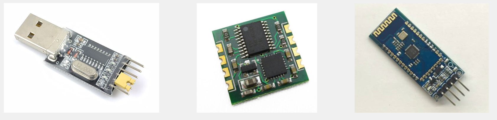


#### **硬件电路**：

简单双向串口通信有两根通信线（发送端TX和接收端RX）

TX与RX要交叉连接

当只需单向的数据传输时，可以只接一根通信线

当电平标准不一致时，需要加电平转换芯片，如果两端都有一样电压的独立供电，那VCC线可以不接到一起。

使用TTL电平，让线路对地进行电压比较，STM32是3.3V，即检测到端口对地是3.3V左右代表发送逻辑1，检测到0V是对地就代表发送逻辑0，TX发送，RX接收。

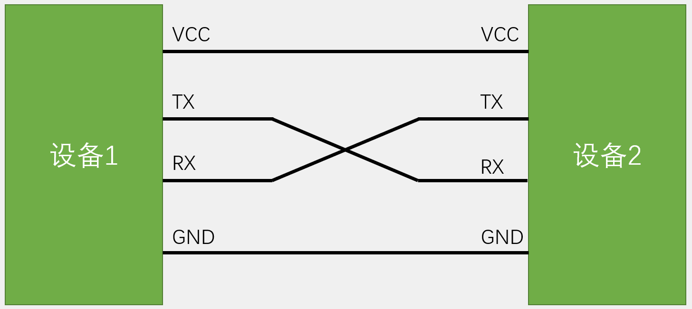


#### **电平标准**：

电平标准是数据1和数据0的表达方式，是传输线缆中人为规定的电压与数据的对应关系，串口常用的电平标准有如下三种：

- TTL电平：对地电压+3.3V或+5V表示1，0V表示0

- RS232电平：两线压差-3 ~ -15V表示1，+3 ~ +15V表示0（差分信号）

- RS485电平：两线压差+2 ~ +6V表示1，-2 ~ -6V表示0（差分信号，RS232的优化）


### 时序：

#### **串口参数及时序**：

波特率：串口通信的**速率**

起始位：标志一个数据帧的开始，固定为**低电平**，默认一帧10位。

数据位：数据帧的有效载荷，1为高电平，0为低电平，**低位先行**。（有奇偶校验的话最好选一帧是11位的，因为1帧10位的再加上校验位的话，校验位的数据校验码会顶替最高位的数据，这样的话数据发送就相当于7位的有效数据，不是一个字节的数据了，这样如果要发送的是1个字节的数据就是错误的了）

校验位：用于数据验证，根据数据位计算得来

停止位：用于数据帧间隔，固定为**高电平**

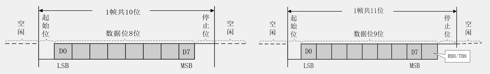

**空闲状态**即**开始前**要保证是**高电平**，因为**起始位是由高电平拉低**。

奇偶检验，其实就是检测收到或者发送的数据1的个数是奇数还是偶数，但这种检验方式效果有效，如果两个数据同时出错，或者换位了是检测不出来的。

栗子如下：

- 奇校验：	
  - 要发送的数据是0x0F，二进制0000 1111。低位先行放到数据帧上就是1111 0000  那么有校验码并且是奇校验的情况下，会判断数据1的个数是奇数还是偶数，满足奇数最右边的校验位就给0，不满足就给1。
  - 1111 0000 就是不满足的情况，这时候数据帧最后发送的数据就是1111 0000 1，满足1的个数是奇数在发送出去，接收端接收到之后，就会通过校验位去确认1的个数，有问题就会要求重发之类的
  - 假如变下数据1110 0000，那就是满足的校验位就是0，数据帧数值就是1110 0000 0 

- 偶校验：其实就是奇校验的条件反过来了，数据帧1的个数满足偶数，校验位给0，不满足给1。


#### **串口时序**：

波特率：每秒钟传输位的数量

波特率4800Hz，每秒传输4800个位，1s ÷ 4800Hz ≈ 0.000208s = 208us，即208us传输一个位的数据，因为频率比9600Hz慢了2倍，所以要用的时间也多了2倍。

波特率9600Hz，每秒传输9600个位，1s ÷ 9600Hz ≈ 0.000104s  = 104us，所以如果约定了波特率9600Hz，那么就是每大约104us传输一个位数据。

波特率115200，每秒115200个位，1s ÷ 115200Hz ≈ 0.0000086805s  = 8.7us左右，所以如果约定了波特率115200Hz，那么就是每大约8.7us传输一个位数据。

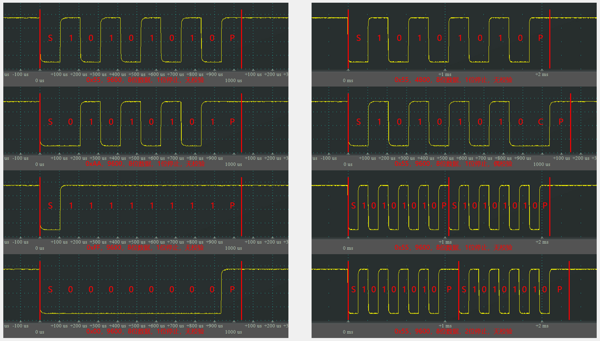


### **USART简介**：

USART（Universal Synchronous/Asynchronous Receiver/Transmitter）通用同步/异步收发器

USART是STM32内部集成的硬件外设，可根据数据寄存器的一个字节数据自动生成数据帧时序，从TX引脚发送出去，也可自动接收RX引脚的数据帧时序，拼接为一个字节数据，存放在数据寄存器里

自带波特率发生器，最高达4.5Mbits/s

可配置数据位长度（8/9）、停止位长度（0.5/1/1.5/2）

可选校验位（无校验/奇校验/偶校验）

支持同步模式、硬件流控制、DMA、智能卡、IrDA、LIN

STM32F103C8T6 USART资源： **USART1、 USART2、 USART3**


#### **USART框图**：

- 发送数据：一个数据如0x55，我们赋值给发送数据寄存器(TDR) 后，它直接把数据直接推送到了发送移位寄存器里，然后由图中间的**发送器控制**根据波特率的时间，按照**数据低位先行**的原则，一位位的把发送移位寄存器的值推到Tx端口发送出去。
- 接收数据：按照数据低位先行的原则，数据的从Rx端口进来，直接到接收移位寄存器的最高位，图中间的**接收器控制**根据波特率的时间开始接收，一位位的把数据接收进来，把数据从最高位推到了最低位，接收完一帧数据后，一起推送到接收数据寄存器(RDR)，所以我们接收最后得到的是一个正常顺序的数据。

- 硬件流控制：n是低电平有效的意思，其实流控制就是避免数据发送或接收，没完成又有数据进入导致数据丢弃或者覆盖的情况，告诉对方什么时候要暂停和什么时候继续传输。
  - nRTS请求发送，输出端：连接对方的nCTS，当数据接收器还有数据的时候就发送高电平1，对方的Rx停止发送，一帧数据接收完成后发送低电平0，对方继续发送数据，这样一直循环，直至数据发送全部完成。
  - nCTS清除(暂停) 发送，输入端：连接对方的nRTS，当对方数据还没接收完成时会给我们发高电平1，我们的Tx端停止发送数据，对方接收完成后就会发送给我们低电平0，这时我们继续发送数据给对方，这样一直循环，直至数据发送全部完成。

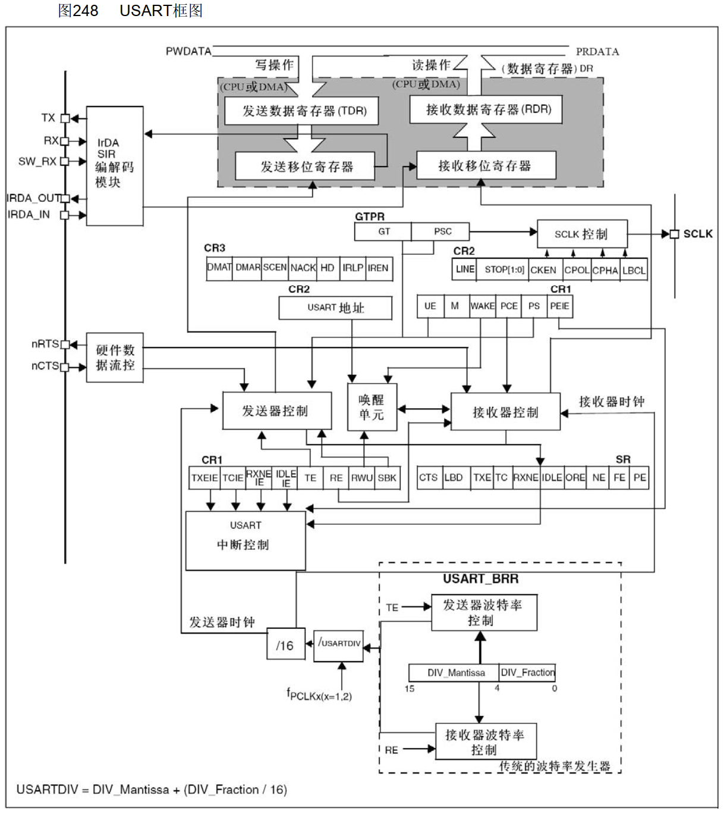


#### **USART基本结构**：

因为USART输入默认是高电平，低电平是起始信号，所以设置为上拉输入也可以，不一定非要浮空输入。

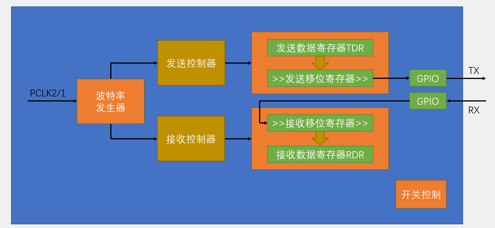


### **数据帧**：


#### 字长设置：

可配置数据位长度**8位**或者**9位**

如果选择数据位**长度是8位**，而要传输的数据也是8位的话，那就**不能选择使用校验**，因为选择了的话最高位就变成了校验位，如果想传输的是8位的数据，校验码的数据**覆盖了原先的数据最高位**，那么如果是发送的8位数据的话最高位就不对了。

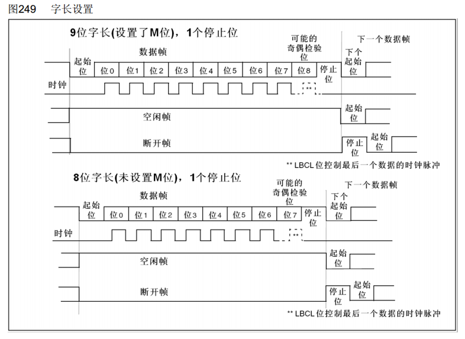


#### 配置停止位：

停止位长度（0.5/1/1.5/2）

如果波特率是9600，发送一个位的数据的时间大概是104us，停止位长度指的是想停止多久是以数据位所用的时间为基准。1位就是停104us，0.5位就是停52us，下一个字节才能起始和发送。

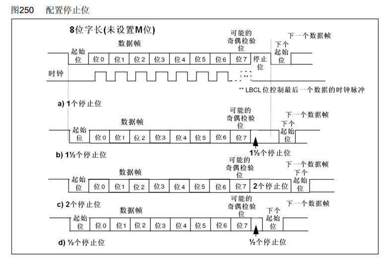


#### **起始位侦测**：

因为要防止干扰，而且最好在数据位的中间段进行数据采样才最准确。

当检测到下降沿后，对起始位进行16次分段检测。

- 3，5，7位是试抽样必须要有两个0以上，三个都是0那最好，如果三个里有一个1那么会置一个噪声标志位，意思是告诉你有噪声悠着点用；有两个1，这段数据会被判断为干扰信号不接收。
- 如果前面的 3, 5, 7 试抽样通过了，这样就到了一个数据位的中间的时间，即8, 9, 10进行数据采样；同样的三个都是0那最好，如果有1那么会置一个噪声标志位，意思是告诉你有噪声悠着点用；有两个1，这段数据会被判断为干扰信号不接收。所以必须两个0以上。

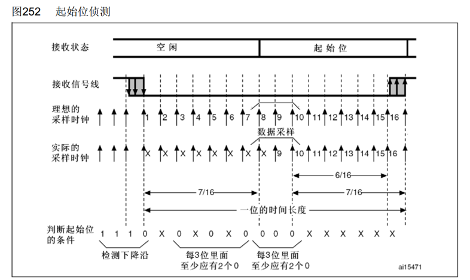


#### **数据采样**：

8，9，10是数据采样的时间。只有000和111有效，其他都是无效。

内部还有一个16倍的波特率分频采样时钟

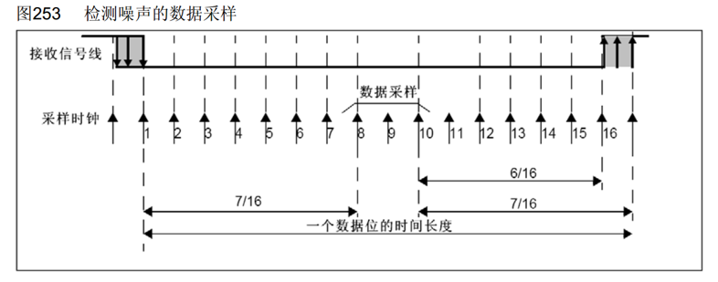


#### **波特率发生器**：

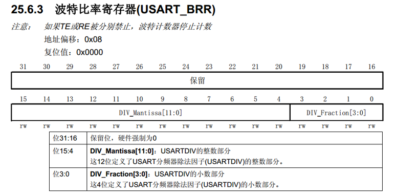

发送器和接收器的波特率由波特率寄存器BRR里的DIV确定

f_PCLK2/1：这个是时钟频率，只有USART1连接PCLK2总线(最高72MHz)。其它USART使用PCLK1总线(最高36MHz)。  

最常用的波特率是：115200Hz

计算公式：波特率 = f_PCLK2或1  /  (16 * DIV)

假如用USART1，波特率9600 计算：

- 9600 = 72Mhz / ( 16\*DIV ) ，那么把已知的目标波特率9600拉进公式，未知的DIV拉出去。
  - DIV = 72MHz ÷ 16 ÷ 9600 = 468.75  
  - 还有另一种计算方法：72Mhz ÷ 9600 = 7500 ，7500 ÷ 16 = 468.75  

- 115200 = 72Mhz / ( 16\*DIV )，把已知的目标波特率115200拉进公式，未知的DIV拉出去。
  - DIV = 72MHz ÷ 16 ÷ 115200 = 39.0625 
  - 72Mhz ÷ 115200 = 625 ，625 ÷ 16 = 39.0625  


**所以对于这个寄存器来说，它把低4位变为了小数，相当于值小了4位（16），高5位往后开始才是整数。**

想要波特率是115200的话，**对于我们来说需填入的其实就是 时钟频率 ÷ 波特率 = 值（即上面写的72Mhz ÷ 115200 = 625）**，十六进制的0x271或者十进制的625、二进制的0010 0111 0001，对于寄存器自身来说里面的值是39.0625。

还有一种获得由我们的填写进寄存器值的方法：**直接根据波特率的误差计算表格把它表格里的值直接乘上16**，如39.0625 * 16 = 625，因为寄存器里的低4位就是16，这个相当于取小数了。

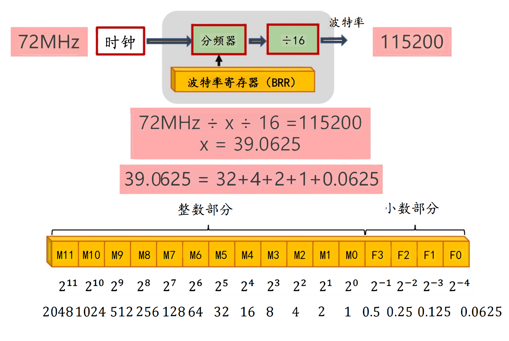


### **数据模式**：

ASCII码表

HEX模式/十六进制模式/二进制模式：以原始数据的形式显示

文本模式/字符模式：以原始数据编码后的形式显示

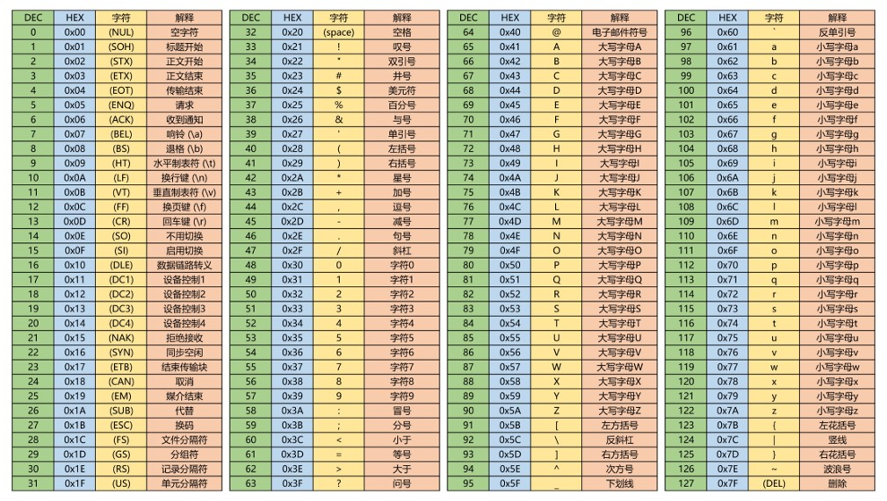

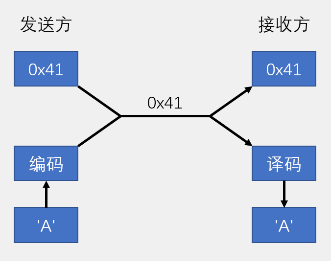


#### **HEX数据包**：

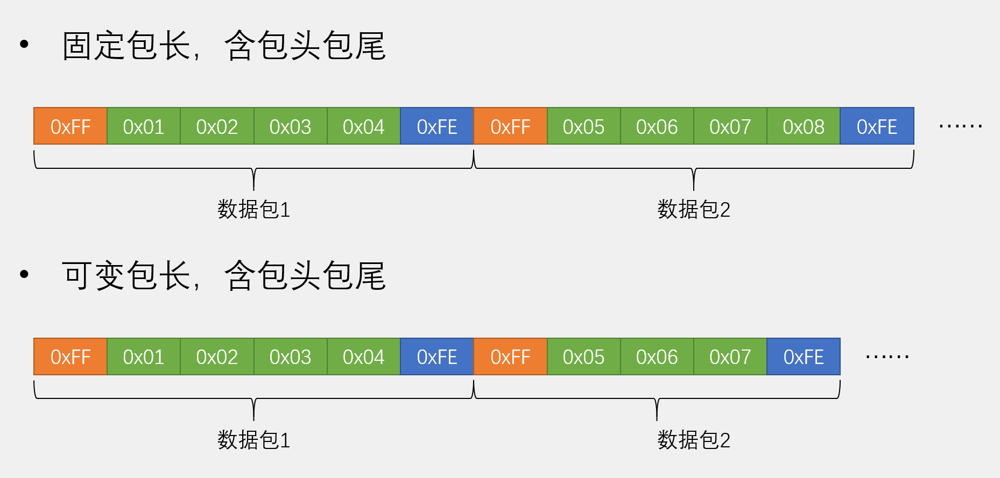


#### **文本数据包**：

\r是回车，\n是换行

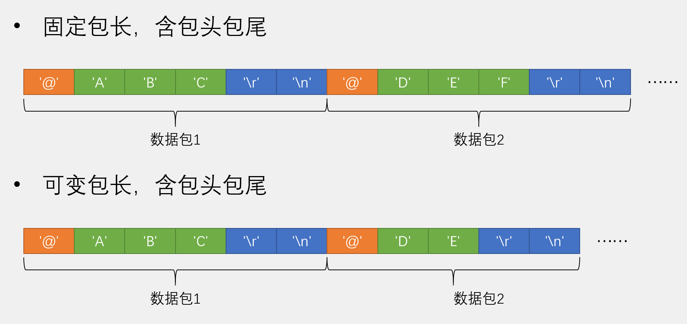


#### **HEX数据包接收**：

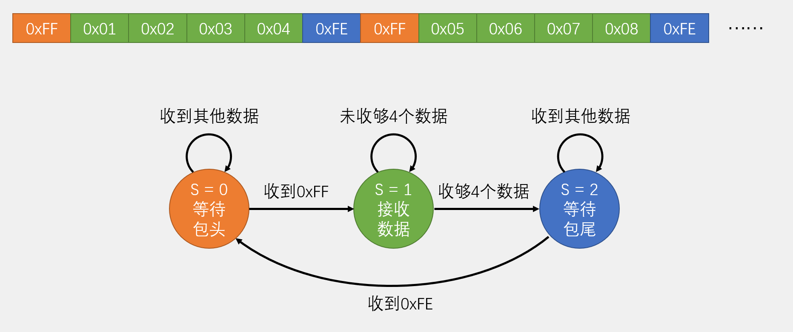


#### **文本数据包接收**：

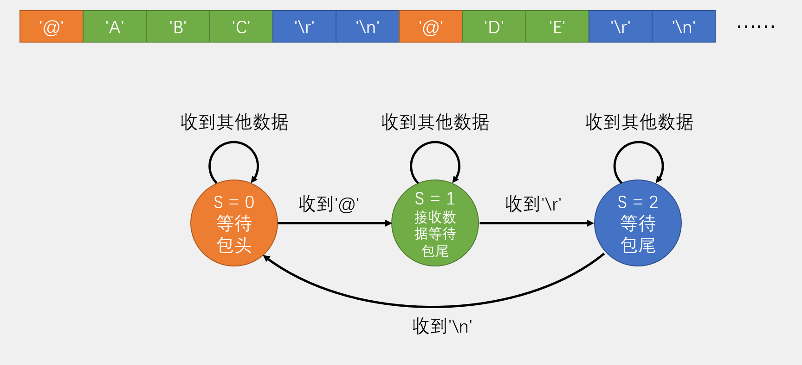


### **USART寄存器**：

- **状态寄存器(USART_SR)**  ：

  - **CTS: CTS 硬件流控制标志** (CTS flag)

    如果设置了CTSE位，当nCTS输入变化状态时，该位被硬件置高。由软件将其清零。如果USART_CR3中的CTSIE为’1’，则产生中断。

    - 0： nCTS状态线上没有变化；
    - 1： nCTS状态线上发生变化。

    > 注： UART4和UART5上不存在这一位。

  - **LBD: LIN断开检测标志** (LIN break detection flag)

    当探测到LIN断开时，该位由硬件置’1’，由软件清’0’(向该位写0)。

    如果USART_CR3中的LBDIE = 1，则产生中断。

    - 0：没有检测到LIN断开；
    - 1：检测到LIN断开。

    > 注意：若LBDIE=1，当LBD为’1’时要产生中断。

  - **TXE:发送数据寄存器空** (Transmit data register empty)

    当TDR寄存器中的数据被硬件转移到移位寄存器的时候，该位被硬件置位。

    如果USART_CR1寄存器中的TXEIE为1，则产生中断。

    对USART_DR的写操作，将该位清零。

    - 0：数据还没有被转移到移位寄存器；
    - 1：数据已经被转移到移位寄存器。

    > 注意：单缓冲器传输中使用该位。

  - **TC：发送完成** (Transmission complete)

    当包含有数据的一帧发送完成后，并且TXE=1时，由硬件将该位置’1’。

    如果USART_CR1中的TCIE为’1’，则产生中断。

    由软件序列清除该位(先读USART_SR，然后写入USART_DR)。

    TC位也可以通过写入’0’来清除，只有在多缓存通讯中才推荐这种清除程序。

    - 0：发送还未完成；
    - 1：发送完成。

  - **RXNE：读数据寄存器非空** (Read data register not empty)

    当RDR移位寄存器中的数据被转移到USART_DR寄存器中，该位被硬件置位。

    如果USART_CR1寄存器中的RXNEIE为1，则产生中断。

    对USART_DR的读操作可以将该位清零。 

    RXNE位也可以通过写入0来清除，只有在多缓存通讯中才推荐这种清除程序。

    - 0：数据没有收到；
    - 1：收到数据，可以读出。

  - **IDLE：监测到总线空闲** (IDLE line detected)

    当检测到总线空闲时，该位被硬件置位。

    如果USART_CR1中的IDLEIE为’1’，则产生中断。

    由软件序列清除该位(先读USART_SR，然后读USART_DR)。

    - 0：没有检测到空闲总线；
    - 1：检测到空闲总线。

    > 注意： IDLE位不会再次被置高直到RXNE位被置起(即又检测到一次空闲总线)

  - **ORE：过载错误** (Overrun error)

    当RXNE仍然是’1’的时候，当前被接收在移位寄存器中的数据，需要传送至RDR寄存器时，硬件将该位置位。

    如果USART_CR1中的RXNEIE为’1’的话，则产生中断。

    由软件序列将其清零(先读USART_SR，然后读USART_CR)。

    - 0：没有过载错误；

    - 1：检测到过载错误。

    > 注意：
    >
    > 该位被置位时， RDR寄存器中的值不会丢失，但是移位寄存器中的数据会被覆盖。
    >
    > 如果设置了EIE位，在多缓冲器通信模式下， ORE标志置位会产生中断的。

  - **NE: 噪声错误标志** (Noise error flag)

    在接收到的帧检测到噪音时，由硬件对该位置位。

    由软件序列对其清玲(先读USART_SR，再读USART_DR)。

    - 0：没有检测到噪声；

    - 1：检测到噪声。

    > 注意：
    >
    > 该位不会产生中断，因为它和RXNE一起出现，硬件会在设置RXNE标志时产生中断。
    >
    > 在多缓冲区通信模式下，如果设置了EIE位，则设置NE标志时会产生中断。

  - **FE: 帧错误** (Framing error)

    当检测到同步错位，过多的噪声或者检测到断开符，该位被硬件置位。

    由软件序列将其清零(先读USART_SR，再读USART_DR)。

    - 0：没有检测到帧错误；

    - 1：检测到帧错误或者break符。

    > 注意：
    >
    > 该位不会产生中断，因为它和RXNE一起出现，硬件会在设置RXNE标志时产生中断。
    >
    > 如果当前传输的数据既产生了帧错误，又产生了过载错误，硬件还是会继续该数据的传输，并且只设置ORE标志位。
    >
    > 在多缓冲区通信模式下，如果设置了EIE位，则设置FE标志时会产生中断。

  - **PE: 校验错误** (Parity error)

    在接收模式下，如果出现奇偶校验错误，硬件对该位置位。

    由软件序列对其清零(依次读USART_SR和USART_DR)。

    在清除PE位前，软件必须等待RXNE标志位被置’1’。如果USART_CR1中的PEIE为’1’，则产生中断。

    - 0：没有奇偶校验错误；
    - 1：奇偶校验错误。


- **数据寄存器(USART_DR)**    ：

  - DR[8:0]：数据值 (Data value)

    包含了发送或接收的数据。

    **由于它是由两个寄存器组成的，一个给发送用(TDR)，一个给接收用(RDR)，该寄存器兼具读和写的功能。** 

    TDR寄存器提供了内部总线和输出移位寄存器之间的并行接口(参见图248)。 

    RDR寄存器提供了输入移位寄存器和内部总线之间的并行接口。

    当**使能校验位**(USART_CR1中PCE位被置位)进行发送时，写到MSB的值(根据数据的长度不同， **MSB是第7位或者第8位**)会**被后来的校验位该取代。当使能校验位进行接收时，读到的MSB位是接收到的校验位。**


- **波特比率寄存器(USART_BRR)**    ：

  - **DIV_Mantissa[11:0]：USARTDIV的整数部分**

    这12位定义了USART**分频器除法因子**(USARTDIV)的**整数部分**。

  - **DIV_Fraction[3:0]： USARTDIV的小数部分**

    这4位定义了USART**分频器除法因子**(USARTDIV)的**小数部分**。


- **控制寄存器 1(USART_CR1)**    ：

  - **UE： USART使能** (USART enable)

    当该位被清零，在当前字节传输完成后USART的分频器和输出停止工作，以减少功耗。

    该位由软件设置和清零。

    - 0： USART分频器和输出被禁止；
    - 1： USART模块使能。

  - **M：字长** (Word length)

    该位定义了约定发送和接收数据字的长度，由软件对其设置和清零

    - 0：一个起始位， 8个数据位， n个停止位；
    - 1：一个起始位， 9个数据位， n个停止位。

    > 注意：在数据传输过程中(发送或者接收时)，不能修改这个位。

  - **WAKE：唤醒的方法** (Wakeup method)

    这位决定了把USART唤醒的方法，由软件对该位设置和清零。

    - 0：被空闲总线唤醒；
    - 1：被地址标记唤醒。

  - **PCE：检验控制使能** (Parity control enable)

    用该位选择是否进行硬件校验控制 (对于发送来说就是校验位的产生；对于接收来说就是校验位的检测) 。

    当使能了该位，在发送数据的最高位 (如果M=1，最高位就是第9位；如果M=0，最高位就是第8位) 插入校验位；对接收到的数据检查其校验位。

    软件对它置’1’或清’0’。一旦设置了该位，当前字节传输完成后，校验控制才生效。

    - 0：禁止校验控制；
    - 1：使能校验控制。

  - **PS：校验选择** (Parity selection)

    当校验控制使能后，该位用来选择是采用偶校验还是奇校验。

    软件对它置’1’或清’0’。当前字节传输完成后，该选择生效。

    - 0：偶校验；
    - 1：奇校验。

  - **PEIE： PE奇偶校验错误中断使能** (PE interrupt enable)

    该位由软件设置或清除。

    - 0：禁止产生中断；
    - 1：当USART_SR中的PE奇偶校验错误为’1’时，产生USART中断。

  - **TXEIE：发送缓冲区空中断使能** (TXE interrupt enable)

    该位由软件设置或清除。

    - 0：禁止产生中断；
    - 1：当USART_SR中的TXE为’1’时，产生USART中断。

  - **TCIE：发送完成中断使能** (Transmission complete interrupt enable)

    该位由软件设置或清除。

    - 0：禁止产生中断；
    - 1：当USART_SR中的TC为’1’时，产生USART中断。

  - **RXNEIE：接收缓冲区非空中断使能** (RXNE interrupt enable)

    该位由软件设置或清除。

    - 0：禁止产生中断；
    - 1：当USART_SR中的ORE或者RXNE为’1’时，产生USART中断。

  - **IDLEIE： IDLE监测到总线空闲中断使能** (IDLE interrupt enable)

    该位由软件设置或清除。

    - 0：禁止产生中断；
    - 1：当USART_SR中的IDLE监测到总线空闲为’1’时，产生USART中断。

  - **TE：发送使能** (Transmitter enable)

    该位使能发送器。该位由软件设置或清除。

    - 0：禁止发送；
    - 1：使能发送。

    > 注意： 
    >
    > 1．在数据传输过程中，除了在智能卡模式下，如果TE位上有个0脉冲(即设置为’0’之后再设置为’1’)，会在当前数据字传输完成后，发送一个“前导符”(空闲总线)。
    >
    > 2．当TE被设置后，在真正发送开始之前，有一个比特时间的延迟。

  - **RE：接收使能** (Receiver enable)

    该位由软件设置或清除。

    - 0：禁止接收；
    - 1：使能接收，并开始搜寻RX引脚上的起始位。

  - **RWU：接收唤醒** (Receiver wakeup)

    该位用来决定是否把USART置于静默模式。该位由软件设置或清除。当唤醒序列到来时，硬件也会将其清零。

    - 0：接收器处于正常工作模式；
    - 1：接收器处于静默模式。

    > 注意： 
    >
    > 1．在把USART置于静默模式(设置RWU位)之前， USART要已经先接收了一个数据字节。否则在静默模式下，不能被空闲总线检测唤醒。
    >
    > 2．当配置成地址标记检测唤醒(WAKE位=1)，在RXNE位被置位时，不能用软件修改RWU位。

  - **SBK：发送断开帧** (Send break)

    使用该位来发送断开字符。

    该位可以由软件设置或清除。操作过程应该是软件设置位它，然后在断开帧的停止位时，由硬件将该位复位。

    - 0：没有发送断开字符；
    - 1：将要发送断开字符。


- **控制寄存器 2(USART_CR2)**    ：

  - **LINEN： LIN模式使能** (LIN mode enable)

    该位由软件设置或清除。

    - 0：禁止LIN模式；
    - 1：使能LIN模式。在LIN模式下，可以用USART_CR1寄存器中的SBK位发送LIN同步断开符(低13位)，以及检测LIN同步断开符。

  - **STOP：停止位** (STOP bits)

    这2位用来设置停止位的位数

    | 停止位选择         |
    | ------------------ |
    | 00： 1个停止位；   |
    | 01： 0.5个停止位； |
    | 10： 2个停止位；   |
    | 11： 1.5个停止位； |

    > 注： UART4和UART5不能用0.5停止位和1.5停止位。

  - **CLKEN：时钟使能** (Clock enable)

    该位用来使能CK引脚

    - 0：禁止CK引脚；

    - 1：使能CK引脚。

    > 注： UART4和UART5上不存在这一位。

  - **CPOL：时钟极性** (Clock polarity)

    在同步模式下，可以用该位选择SLCK引脚上时钟输出的极性。

    和CPHA位一起配合来产生需要的时钟/数据的采样关系

    - 0：总线空闲时CK引脚上保持低电平；
    - 1：总线空闲时CK引脚上保持高电平。

    > 注： UART4和UART5上不存在这一位。

  - **CPHA： 时钟相位** (Clock phase)

    在同步模式下，可以用该位选择SLCK引脚上时钟输出的相位。

    和CPOL位一起配合来产生需要的时钟/数据的采样关系(参见图259和图260)。

    - 0：在时钟的第一个边沿进行数据捕获；
    - 1：在时钟的第二个边沿进行数据捕获。

    > 注： UART4和UART5上不存在这一位。

  - **LBCL：最后一位时钟脉冲** (Last bit clock pulse)

    在同步模式下，使用该位来控制是否在CK引脚上输出最后发送的那个数据字节(MSB)对应的时钟脉冲

    - 0：最后一位数据的时钟脉冲不从CK输出；
    - 1：最后一位数据的时钟脉冲会从CK输出。

    > 注意： 
    >
    > 1．最后一个数据位就是第8或者第9个发送的位(根据USART_CR1寄存器中的M位所定义的8或者9位数据帧格式)。
    >
    > 2． UART4和UART5上不存在这一位。

  - **LBDIE： LIN断开符检测中断使能** (LIN break detection interrupt enable)

    断开符中断屏蔽(使用断开分隔符来检测断开符)

    - 0：禁止中断；

    - 1：只要USART_SR寄存器中的LBD为’1’就产生中断。

  - **LBDL： LIN断开符检测长度** (LIN break detection length)

    该位用来选择是11位还是10位的断开符检测

    - 0： 10位的断开符检测；
    - 1： 11位的断开符检测。

  - **ADD**[3:0]：

    本设备的USART节点地址该位域给出本设备USART节点的地址。

    这是在多处理器通信下的静默模式中使用的，使用地址标记来唤醒某个USART设备。


- **控制寄存器 3(USART_CR3)**    ：

  - **CTSIE： CTS中断使能** (CTS interrupt enable) 

    - 0：禁止中断； 
    - 1： USART_SR寄存器中的CTS为’1’时产生中断。

    > 注： UART4和UART5上不存在这一位。

  - **CTSE： CTS发送硬件流控制使能** (CTS enable)

    - 0：禁止CTS硬件流控制；

    - 1： CTS模式使能，只有nCTS输入信号有效(拉成低电平)时才能发送数据。

      如果在数据传输的过程中， nCTS信号变成无效，那么发完这个数据后，传输就停止下来。

      如果当nCTS为无效时，往数据寄存器里写数据，则要等到nCTS有效时才会发送这个数据。

    > 注： UART4和UART5上不存在这一位。

  - **RTSE： RTS接收硬件流控制使能** (RTS enable)

    - 0：禁止RTS硬件流控制； 

    - 1： RTS中断使能，只有接收缓冲区内有空余的空间时才请求下一个数据。

      当前数据发送完成后，发送操作就需要暂停下来。

      如果可以接收数据了，将nRTS输出置为有效(拉至低电平)。

    注： UART4和UART5上不存在这一位。

  - **DMAT： DMA使能发送** (DMA enable transmitter)

    该位由软件设置或清除。

    - 0：禁止发送时的DMA模式。
    - 1：使能发送时的DMA模式；

    > 注： UART4和UART5上不存在这一位

  - **DMAR: DMA使能接收** (DMA enable receiver)

    该位由软件设置或清除。

    - 0：禁止接收时的DMA模式。
    - 1：使能接收时的DMA模式；

    > 注： UART4和UART5上不存在这一位。

  - **SCEN: 智能卡模式使能** (Smartcard mode enable)

    该位用来使能智能卡模式

    - 0：禁止智能卡模式；

    - 1：使能智能卡模式。

    > 注： UART4和UART5上不存在这一位。

  - **NACK：智能卡NACK使能** (Smartcard NACK enable)

    - 0：校验错误出现时，不发送NACK； 

    - 1：校验错误出现时，发送NACK。

    > 注： UART4和UART5上不存在这一位。

  - **HDSEL：半双工选择** (Half-duplex selection)

    选择单线半双工模式（TX和RX引脚在芯片内部互连，RX不再被使用具体可查看手册的单线半双工通信篇）

    - 0：不选择半双工模式；

    - 1：选择半双工模式。

  - **IRLP：红外低功耗** (IrDA low-power)

    该位用来选择普通模式还是低功耗红外模式

    - 0：通常模式；

    - 1：低功耗模式。

  - **IREN：红外模式使能** (IrDA mode enable)

    该位由软件设置或清除。

    - 0：不使能红外模式；

    - 1：使能红外模式。

  - **EIE：错误中断使能** (Error interrupt enable)

    在多缓冲区通信模式下，当有帧错误、过载或者噪声错误时(USART_SR中的FE=1，或者ORE=1，或者NE=1)产生中断。

    - 0：禁止中断；

    - 1：只要USART_CR3中的DMAR=1，并且USART_SR中的FE=1，

      或者ORE=1，或者NE=1，则产生中断


- **保护时间和预分频寄存器(USART_GTPR)**    ：

  - **GT[7:0]：保护时间值** (Guard time value)

    该位域规定了以波特时钟为单位的保护时间。

    在智能卡模式下，需要这个功能。

    当保护时间过去后，才会设置发送完成标志。

    > 注： UART4和UART5上不存在这一位。

  - **PSC[7:0]：预分频器值** (Prescaler value)

    - 在红外(IrDA)低功耗模式下： 

      PSC[7:0]=红外低功耗波特率对系统时钟分频以获得低功耗模式下的频率：

      源时钟被寄存器中的值(仅有8位有效)分频

      00000000：保留 – 不要写入该值；

      00000001：对源时钟1分频；

      00000010：对源时钟2分频； 

      ……

    - 在红外(IrDA)的正常模式下： PSC只能设置为00000001

      在智能卡模式下：

      PSC[4:0]：预分频值

      对系统时钟进行分频，给智能卡提供时钟。

      寄存器中给出的值(低5位有效)乘以2后，作为对源时钟的分频因子

      00000：保留 – 不要写入该值； 

      00001：对源时钟进行2分频； 

      00010：对源时钟进行4分频； 

      00011：对源时钟进行6分频； 

      ……

      > 注意： 
      >
      > 1．位[7:5]在智能卡模式下没有意义。
      >
      > 2． UART4和UART5上不存在这一位。


## 10-I2C通信

- 时钟控制寄存器(I2C_CCR)  的

  CCR[11:0]： 快 速/标 准 模 式 下 的 时 钟 控 制 分 频 系 数(主 模 式) (Clock control register in Fast/Standard mode (Master mode))

  例如：在标准模式下，产生100kHz的SCL的频率：如果FREQR = 08， TPCLK1 = 125ns，则CCR必须写入**0x28**(40×125ns = 5000 ns)。

  FREQR是设置时钟频率，08是8Mhz，就是125ns，乘上40。40*125才5000ns，而上面假设的100kHz一个周期却是10000ns。

  这个要填的值只是高电平所用的时间系数值？**这个填的系数是同时作用于高低电平的，而且如果是高速模式的情况下还是注意按比例分值，2 : 1和9 ：16**

  36MHz低速100kHz的例子，ccr = Thigh/Tpclk1 = 5us / (1/36)us = 180

- TRISE寄存器(I2C_TRISE)  

  在 快 速 / 标 准 模 式 下 的 最 大 上 升 时 间 ( 主 模 式 ) (Maximum rise time in Fast/Standard mode (Master mode))

  时钟信号的上升沿100KHz的时候要求最大上升沿不超过1us(手册)。
  时钟频率是36MHz则 写入：1 /（1/36） + 1 = 37，其实就是计算的 

  最大上升沿时间/时钟周期 + 1

  参考手册的栗子：标准模式中最大允许SCL上升时间为1000ns。如果在I2C_CR2寄存器中FREQ[5:0]中的值等于0x08且TPCLK1=125ns，故TRISE[5:0]中必须写入09h(1000ns/125 ns = 8+1)。


### **I2C介绍**：

I2C（Inter IC Bus）是由Philips公司开发的一种**通用数据总线**

**两**根通信线：**时钟线 SCL**（Serial Clock）、**数据线 SDA**（Serial Data）

**同步，半双工，高位先行**

**带数据应答**

支持总线挂载多设备（**一主多从、多主多从**），主机模式的时候有主动控制权，所以接收信息不需要中断，而如果换成了从机模式，接收信号可能会突然到来，那样的话就要配置专门的接收中断函数。

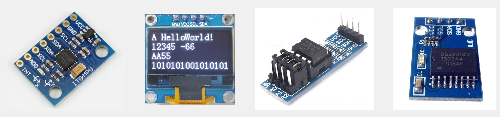


#### **硬件电路**：

**一主多从**模式下

所有I2C设备的SCL连在一起，SDA连在一起

设备的SCL和SDA均要配置成**开漏输出模式**（一主多从模式下SCL完全由主机控制可以配置为推挽输出，但是SDA的就主机和从机都有控制的，如果出现主机是高电平1，从机是低电平0这种，总线没协调好的就会出现短路，所以为了避免这种情况发生，就要配置成开漏输出，通过弱上拉进行拉高电平）

**SCL和SDA各添加一个上拉电阻**，阻值一般为4.7KΩ左右（看从机模块是否自带上拉电阻，没有的话电路设计要加上）

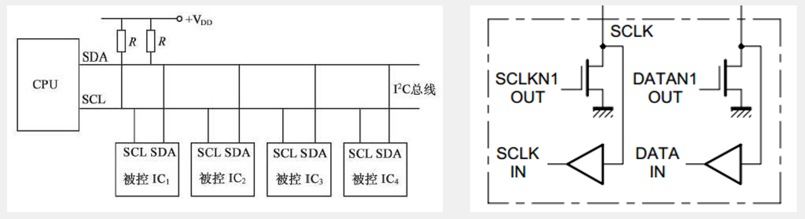


### 时序：

#### **I2C时序起始和停止单元**：

起始条件：SCL高电平期间，SDA从高电平切换到低电平

终止条件：SCL高电平期间，SDA从低电平切换到高电平

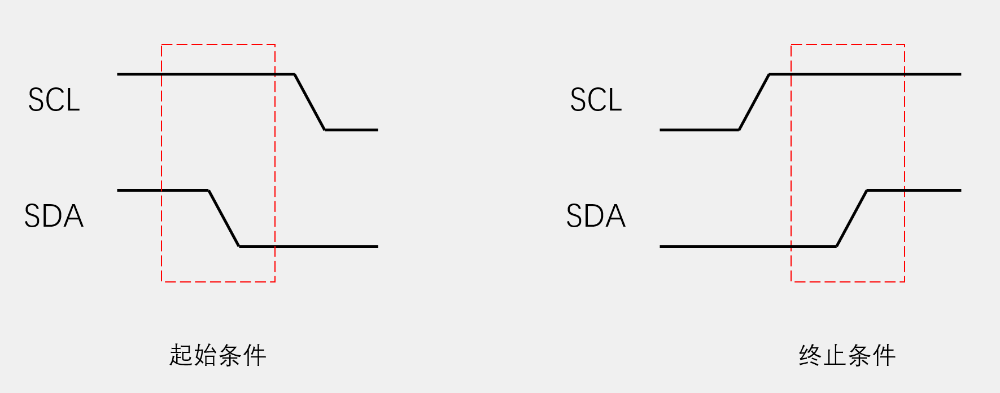


#### **I2C时序发送单元**：

发送一个字节：SCL低电平期间，主机将数据位依次放到SDA线上（高位先行），然后主机释放SCL，从机将在SCL高电平期间读取数据位，所以**SCL高电平期间SDA不允许有数据变化（专门留给起始和终止条件的）**，从机读取完后主机把SCL拉低，依次循环上述过程8次，即可发送一个字节。

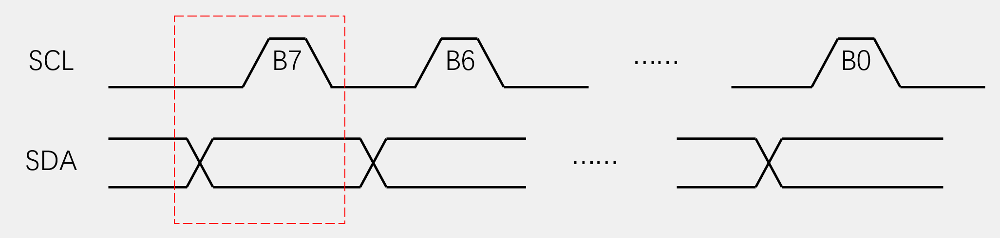


#### **I2C时序接收单元**：

接收一个字节：SCL低电平期间（主机在接收之前，需要释放SDA），从机将数据位依次放到SDA线上（高位先行），然后主机释放SCL，主机将在SCL高电平期间读取数据位，所以**SCL高电平期间SDA不允许有数据变化（专门留给起始和终止条件的）**，主机读取完后主机自己再把SCL拉低，依次循环上述过程8次，即可接收一个字节。

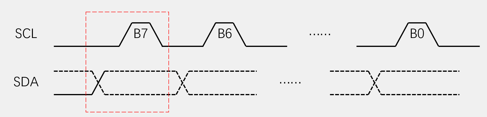


#### **I2C时序应答单元**：

- 发送应答：主机在接收完一个字节之后，主机在下一个时钟时序给从机发1位数据（我说收到了，它默念"嗯"），数据0表示应答，数据1表示非应答

- 接收应答：主机在发送完一个字节之后，从机在下一个时钟时序给我们发1位数据（它说收到了，我默念"嗯"），判断从机是否应答，数据0表示应答，数据1表示非应答（主机在接收应答之前，需要释放SDA）

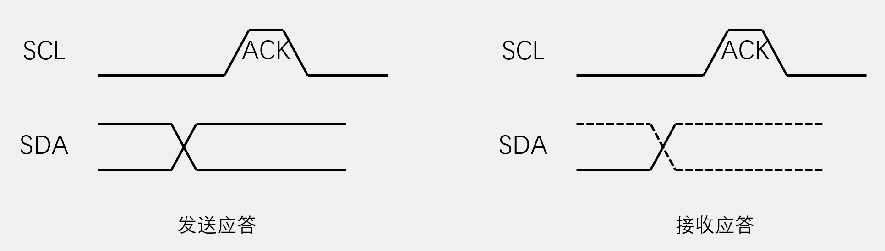


#### **I2C指定地址写时序**：

指定地址写

对于指定设备（Slave Address），在指定地址（Reg Address）下，写入指定数据（Data）

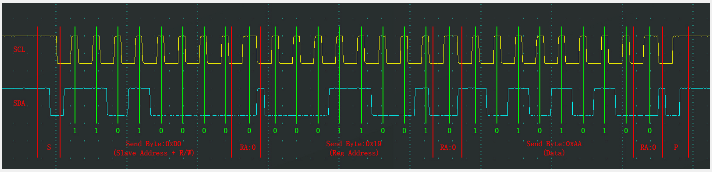


#### **I2C当前地址读时序**：

当前地址读（因为读取地址不确定所以很少用）

对于指定设备（Slave Address），在当前地址指针指示的地址下，读取从机数据（Data）

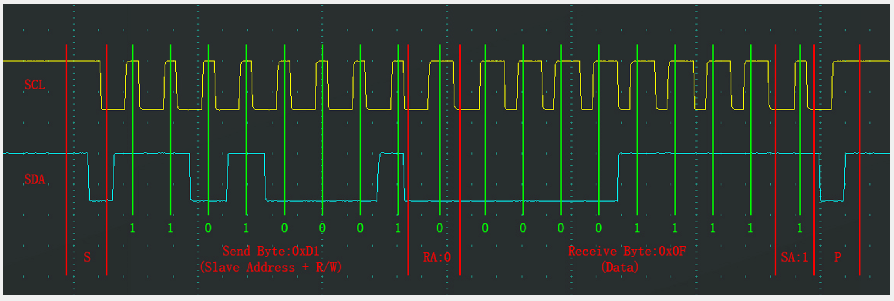


#### **I2C指定地址读时序**：

指定地址读

对于指定设备（Slave Address），在指定地址（Reg Address）下，读取从机数据（Data）

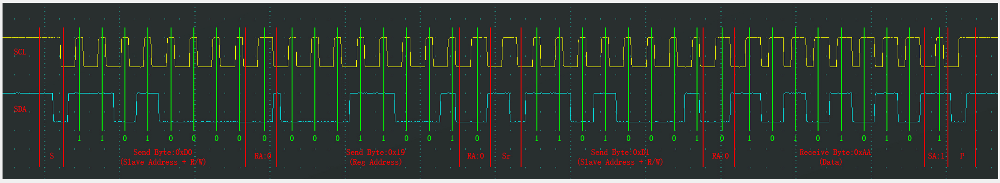


### **MPU6050简介**：

MPU6050是一个6轴姿态传感器，可以测量芯片自身X、Y、Z轴的加速度、角速度参数，通过数据融合，可进一步得到姿态角，常应用于平衡车、飞行器等需要检测自身姿态的场景

3轴加速度计（Accelerometer）：测量X、Y、Z轴的加速度

3轴陀螺仪传感器（Gyroscope）：测量X、Y、Z轴的角速度

以下面的中间图为例，中间是一个具有一定质量，左右有弹簧的小滑块，小滑块移动时，滑块上的电位器也跟着移动，通过电位器的电压，就能够知道滑块的加速度值。这个加速度计实际上是一个弹簧测力计，根据牛顿第二定律F=ma，想要测量加速度a，只需要找一个单位质量的物体，测量它所受的力F就行了。  

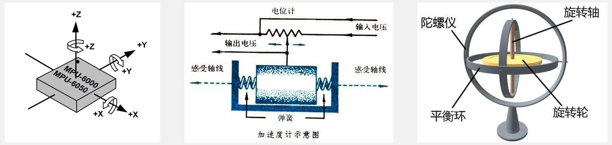

陀螺仪：一个旋转物体的旋转轴所指的方向在不受外力影响时，是不会改变的，

如上面的右图所示，中间是一个有一定质量的旋转轮，外面是3个轴的平衡环，当中间的旋转轮高速旋转时，根据角动量守恒原理，这个旋转轮具有保持它原有角动量的趋势。这个趋势可以保持**旋转轴方向不变**，当外部物体转动时，内部的旋转轴方向不会转动。这会在平衡环连接处产生角度偏差，如果在连接处放一个电位器，测量电位器的电压，就能得到角度了。但是MPU6050陀螺仪，并不能直接测量角度。芯片内部的陀螺仪测量的是角速度，分别表示了此时芯片绕X、Y、Z轴旋转的角速度。**对角速度进行积分，就可以得到角度**。通过角速度积分得到的角度也有局限性，**当物体静止时，角速度会因为噪声无法完全归零**，经过积分的累积，噪声会导致计算出来的角速度产生缓慢的偏移。**但是这个角度不会受物体运动的影响**。**加速度计具有静态稳定性，陀螺仪具有动态稳定性，这两种传感器的特性正好互补。**所以取长补短，进行互补滤波，就能获得稳定的姿态角了。


在MPU6050中，X、Y、Z轴都具有一个加速度计，以下面的图为例，假设芯片里有6个测力的秤组成一个正方体，正方体内部放一个大小正好的单位质量小球，小球压在一个面上，就会产生对应轴的数据输出。如果压在下面为正值，压在上面为负值，6个面测的力就是3个轴的加速度值。

加速度计具有静态稳定性，不具有动态稳定性。假设芯片向左倾斜放置，底面和左面都受力，求一个三角函数，就能得到向左的倾角。但是这个倾角只有在静态时生效。因为加速度分重力加速度和运动加速度，如果此时芯片运动起来，这个三角函数的倾角就会受运动加速度的影响。(向前加速运动时，芯片的底面和左面也受力，无法判断芯片的状态是向左倾斜放置还是向前加速。)

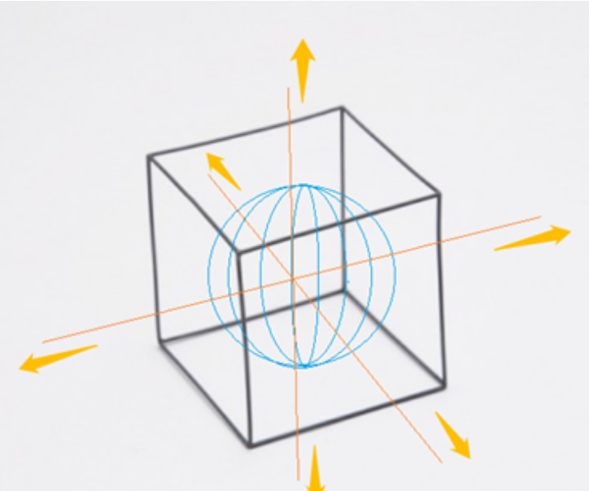


#### **MPU6050参数**：

16位ADC采集传感器的模拟信号，量化范围：-32768~32767

加速度计满量程选择：±2、±4、±8、±16（g），g：重力加速度，1g = 9.8m/s²

陀螺仪满量程选择： ±250、±500、±1000、±2000（°/sec），单位：度每秒，每秒钟旋转了多少度。(如果测量的物体运动非常剧烈，可以把满量程选择大一些，如果运动比较平缓，可以选择更小的量程，这样分辨率会更大。)

**最大总线速率为 400kHz（即2.5us，1bit位数据）**。  

可配置的数字低通滤波器（在这个芯片可以配置寄存器来选择对输出的数据进行低通滤波）

可配置的时钟源 和 可配置的采样分频（为AD转换和芯片内部其他电路提供时钟，控制分频系数，可以控制AD转化的快慢。）

**MPU6050的I2C从机地址（根据芯片规格书信息确定地址（AD0端口改地址），发送的时序是地址7位 + 第8位R/W（最低位，R=1，W=0））**：

- 1101000（AD0 = 0）
  - 发送：1101000 + 0 = 11010000 = 0xD0

  - 接收：1101000 + 1 = 11010000 = 0xD1

- 1101001（AD0 = 1）
  - 发送：1101001 + 0 = 11010010 = 0xD2，
  - 接收：1101000 + 1 = 11010011 = 0xD3


WHO_AM_I寄存器内的设备地址（AD0 的值不会影响这个地址）： 

- 0x68  = 0110 1000


#### **硬件电路**：

硬件电路包含3个部分，MPU-6050芯片，8针的排针，LDO低压差线性稳压器。

MPU6050除了以下寄存器，其他所有的寄存器上电默认值都是0x00

- 除了107号(电源管理寄存器1)，上电默认0x40，电源管理寄存器1默认0x40，表示睡眠模式，所以在操作MPU6050之前，要先解除睡眠，否则操作其他寄存器是无效的。
- 117号寄存器(ID号)，上电默认0x68.

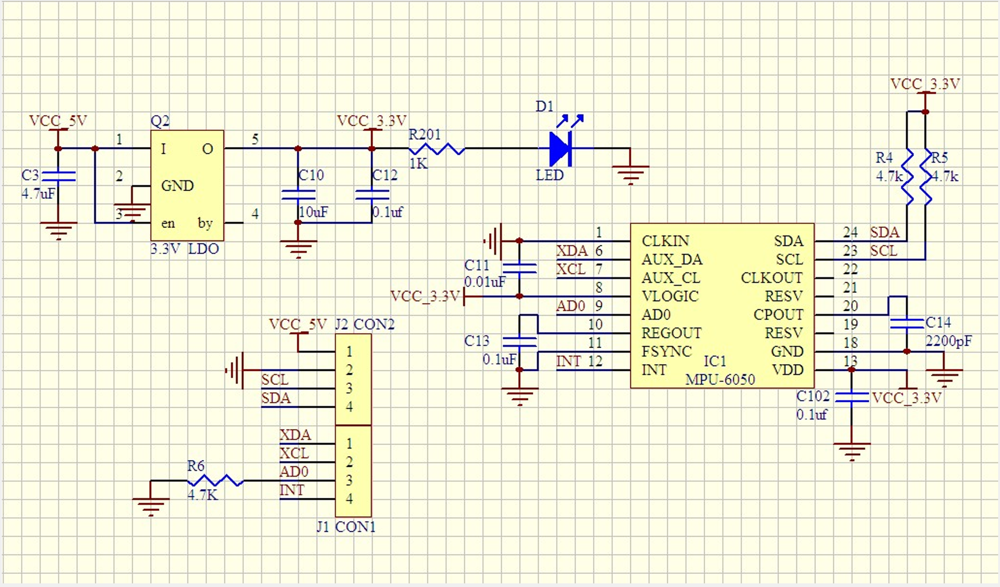

| **引脚** | **功能**                     |
| :------- | ---------------------------- |
| VCC、GND | 电源                         |
| SCL、SDA | I2C通信引脚                  |
| XCL、XDA | 主机I2C通信引脚              |
| AD0      | 从机地址最低位（可微调地址） |
| INT      | 中断信号输出                 |

- SDA、SCL已经内置了两个上拉电阻，在接线的时候，直接把SCL和SDA接在GPIO口就行了SDA、SCL、XDA、XCL通讯引脚分别为两组I2C信号线。当模块与外部主机通讯时，使用SDA、SCL，如与STM32芯片通讯。

  XDA、XCL则用于MPU6050芯片与其它I2C传感器通讯时使用，例如使用它与磁场传感器连接，MPU6050模块可以把从主机SDA、SCL接收的数据或命令通过XDA、XCL引脚转发到磁场传感器中。但实际上这种功能比较鸡肋，控制麻烦且效率低，一般会直接把磁场传感器之类的I2C传感器直接与MPU6050挂载在同一条总线上(即都连接到SDA、SCL)，使用主机直接控制。

- AD0引脚是从机地址的最低位，接低电平的话，7位的从机地址是1101000，接高电平的话，7位从机地址是1101001，有一个电阻默认下拉到低电平了，所以引脚悬空是接低电平，想接高电平，可以把AD0直接引到VCC，拉到高电平。

- INT是中断信号输出引脚：可以配置芯片内部的一些事件，来触发中断输出，比如数据准备好了，12C主机错误等。另外芯片内部还内置了一些小功能，比如自由落体检测、零运动检测、运动检测等，这些信号都可以触发INT引脚产生电平跳变，

- LDO这部分是供电的逻辑，VDD供电是2.375-3.46V，不能直接接5V，为了扩大供电范围，加了3.3V的稳压器，输入端VCC-5V可以在3.3V到5V之间。


#### **MPU6050框图**：

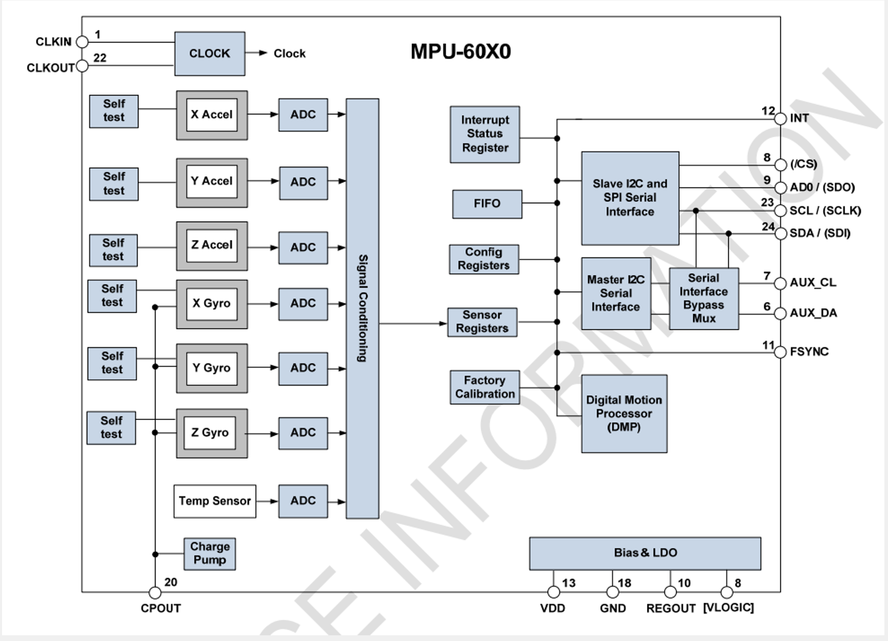

- Clock：时钟，在硬件电路上，我们可以看到有时钟的接口。不过我们一般使用内部时钟。2.加速度计、陀螺仪、温度传感器，相当于可变电阻，通过分压后输出模拟电压，通过ADC进行模数转换，转换完成后，数据放到传?器寄存器中。每个ADC输出对应16位的数据寄存器，，不存在数据覆盖的问题，配置好转换频率之后，每个数据会自动以我们设置的刷新频率刷新到数据寄存器。

- Selftest：自检，每个传感器有一个自测单元，当启动自测后，芯片内部会模拟一个外力施加在传感器上。可以先使能自测，读取数据，再失旨自测，读取数据，两个数据一相减，得到的数据叫自测响应。芯片手册有自测响应的范围，在范围内表示芯片无问题。

- Accelx、y、z，加速度计。Gyrox、y、z，陀螺仪。

- Temp Sensor：温度传感器。

- Charge Pump：充电泵，CPOUT引脚需要外接一个电容，电荷泵是一个升压电路。假设并联电路5V的电源给一个电容充电，充完后，接成串联电路，电路电压变成10V了。并联充电，串联放电，后续再加一个电源滤波，就能进行平稳升压了。由于陀螺仪内部需要高电压支持所以设置了一个电荷泵升压。

- FIFO先入先出寄存器：可以对数据流进行缓存。

- Interrupt Status Register：中断状态寄存器:控制内部的哪些事件到中断引脚的输出

- Config Register配置寄存器：可以对内部的各个电路进行配置。

- Sensor Register传感器寄存器：也是数据寄存器，存储了传感器的数据。

- Factory Calibration：工厂校验，内部的寄存器都进行了工厂校准。

- 主要I2C和SPI串行通信接口，辅助I2C串行接口：通讯接口部分:上面的8、9、23、24就是从机的12C和SPI通信接口，用于和STM32通讯，下面一部分7、6是主机的I2C通信接口，用干和MPU6050扩展设备进行通讯。接口旁路选择器，如果拔到上面，辅助的12C通讯引脚就和正常的!2C接到一起，STM32就可V控制所有设备。如果拨到下面，辅助的I2C引脚就由MPU6050控制，两条I2C总线独立分开。

- DMP：数字运动处理器，芯片内部自带的姿态解算的硬件算法，配合官方的DMP库可以进行姿态解算。

- 偏压和LDO


#### MPU6050量程计算

##### 加速度

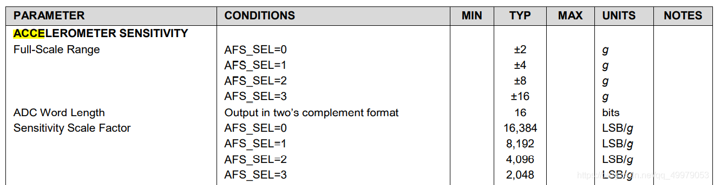

AFS_SEL[1:0]这两个位，用于设置加速度传感器的满量程范围：0，±2g；1，±4g；2，±8g；3，±16g；

我们一般设置为0，即±2g，因为加速度传感器的ADC是16位，所以得到灵敏度为：65536 / 4=16384 LSB/g。

> 总之，加速度传感器配置寄存器就是配置加速度传感器满量程范围，不宜过大


即ADC读取的值位±32768，对应±2g  

- **但从实际读取出来的值来看，量程是±2g的时候，最大值是+16384 ，最小值是-16384 ，似乎就只有1g，换其他量程也类似，奇怪了。** 

- **而江协科技的计算方法是（等比计算）：实际测试值 ÷ 32768  = x ÷ 量程值（g）**，**下面的角速度也可以类似这样计算**。  
  - 16000 ÷ 32768 = x ÷ 2，因为是相等关系所以可以把等于号右边的2移到等于号左边，变成被乘后就得到x了，16000 ÷ 32768 × 2 = 0.9765625（g）  
  - 0.9765625 × 16384 = 16000 


同样量程±4g可得，数据分辨率为+32768 / 4 = 8192 LSB/g  

通过上面的说明我们可以把mpu读取到的原始数据解算为加速度   

公式为：加速度 = 加速度原始值 ÷ 数据分辨率 ， 单位：米/每平方秒（**待确定是否正确**）

即：Gx = aacx / 8192 ，单位为m/s²  


##### 角速度

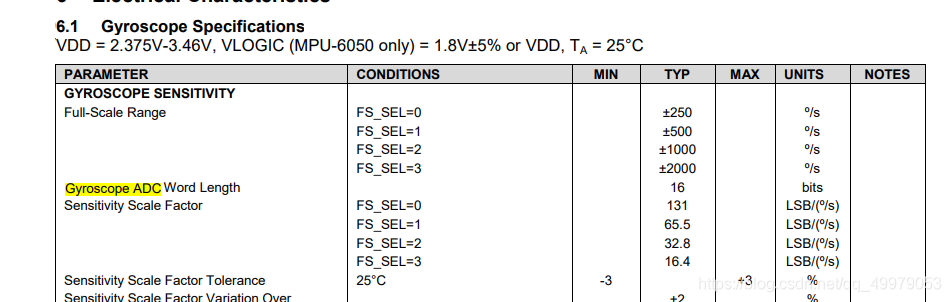

FS_SEL[1:0]这两个位，用于设置陀螺仪的满量程范围：0，±250°/s；1，±500°/s；2，±1000°/s；3，±2000°/s；我们一般设置为3，即±2000°/S，因为陀螺仪的ADC为16位分辨率，所以得到灵敏度为：65536/4000=16.4LSB/(°/S)

> 总之，加速度传感器配置寄存器就是配置加速度传感器满量程范围，不宜过大


比如我们选中测量范围为±2000 °/s

ADC读取的原始值为300

数据分辨率

- 用一半去算：32768 / 2000 = 16.384 LSB(°/s)

- 用整个去算：65536 / 4000=16.4LSB / (°/S)。

那么转换为角速度就是300 ÷ 16.384 = 18.3105 (°/s)

公式为：角速度 = 角速度原始值 ÷ 数据分辨率 ， 单位：度/每秒(°/s)

角速度已经推算出来了。


### **I2C外设简介**：

STM32内部集成了硬件I2C收发电路，可以由硬件自动执行时钟生成、起始终止条件生成、应答位收发、数据收发等功能，减轻CPU的负担

支持**多主机模型**，主机模式的时候有主动控制权，所以接收信息不需要中断，而如果换成了从机模式，接收信号可能会突然到来，那样的话就要配置专门的接收中断函数。

支持**7位/10位地址模式**

支持不同的通讯速度，**标准速度高达100 kHz（即10us，1bit位数据，1kHz~100kHz）**，**快速高达400 kHz（即2.5us，1bit位数据，101kHz~400kHz）**。

- 100KHz该频率及以下是标准速度，占空比是1比1（1:1）
- 100KHz以上是快速模式，占空比是2比1（2:1）或者16比9（16:9），101KHz也是快速模式，因为**I2C规定了时序SCL低电平的时候SDA数据时序电平才变化，而且端口是采用外接了弱上拉电阻，从低电平回弹为高电平的力小比较慢，所以要给高电平上升的时间留余量**。像400kHz的速度SDA高电平上升直接就变成了有弧形的三角形了。而且软件执行有延时就更要留上升余量了。

支持DMA

兼容SMBus协议

STM32F103C8T6 硬件I2C资源：**I2C1、I2C2**


#### **I2C框图**：

**数据移位寄存器，高位先行，即0x55 = 0101 0101，二进制从最左边的0开始 到最右边的1，依次按位发送**

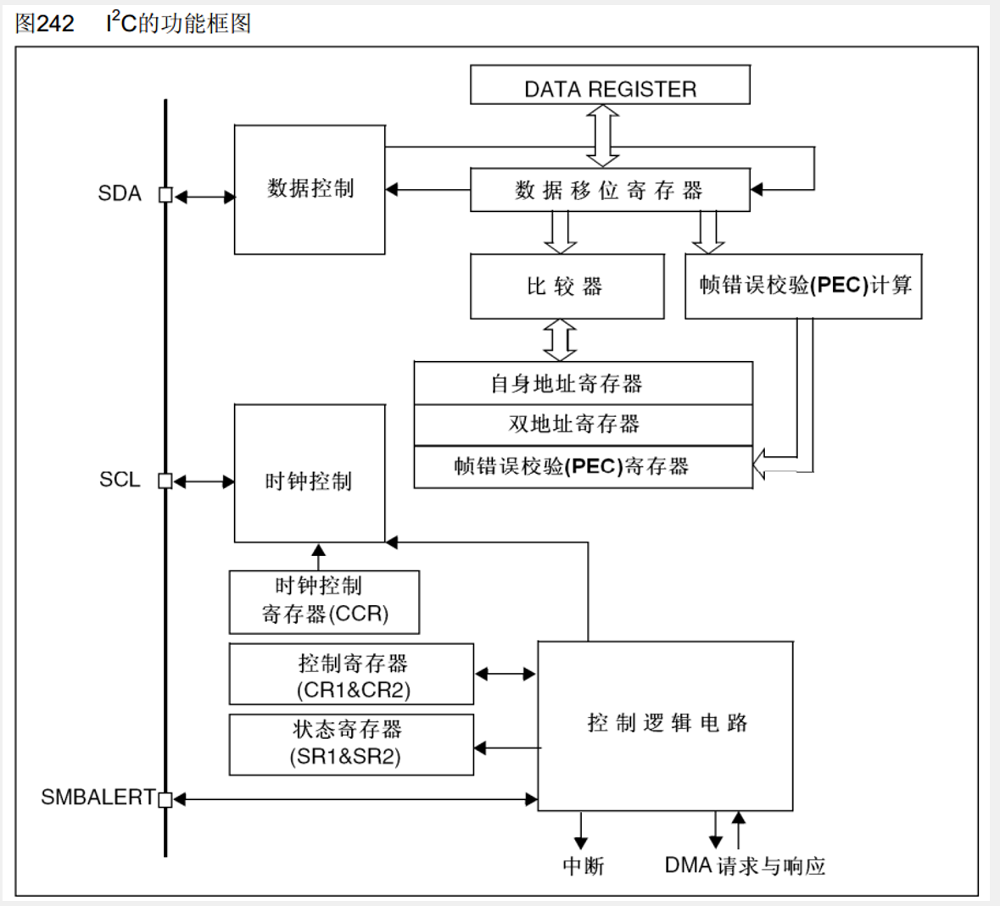


#### **I2C基本结构**：

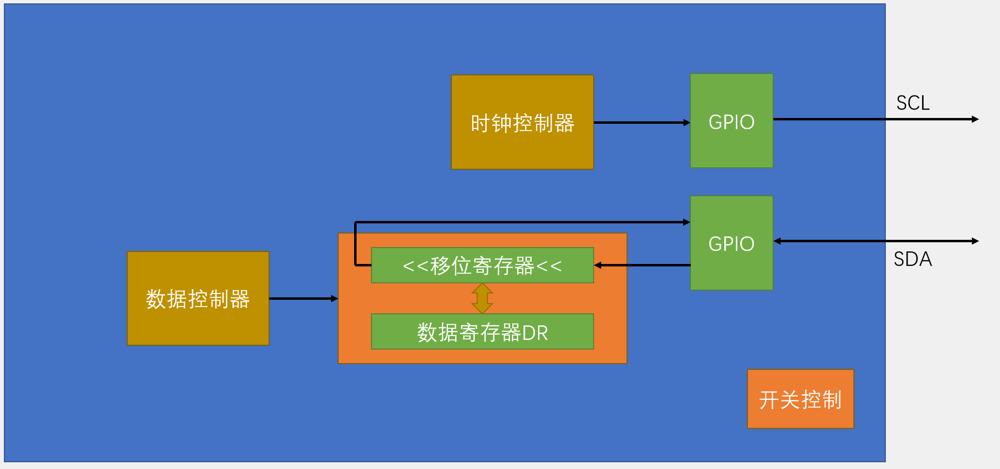


#### **主机发送**：

有三种发送和检测模式

- 基本状态监测（推荐）：

  使用I2C_CheckEvent（）函数，将状态寄存器（SR1和SR2）的内容与给定的事件进行比较（可以是一个或多个标志的组合）。如果当前状态包含给定标志，则返回SUCCESS，如果当前状态中缺少一个或多个标志，则返回ERROR。即图里的EV5，EV6等。

- 高级的状态监测（并不高级，不推荐）：

  使用I2C_GetLastEvent（）函数返回两个状态的标签信息，寄存器是字（uint32_t），状态寄存器2值向左移位16位，并连接到状态寄存器1。再返回给你。

- 基于标志的状态监控（不推荐）：

  使用I2C_GetFlagStatus（）函数返回的状态，单一标志，如：I2C_FLAG_RXNE…… 不过这样程序会较为臃肿。

因为一个数据的发送或者接收会产生多个标志位，EV5或者其他EV开头的其实是多个标志位组合的意思，相当于一个整合的大标志位。

**主机发送数据后的从机应答接收由硬件自动完成，没收到会置应答失败标志位。**

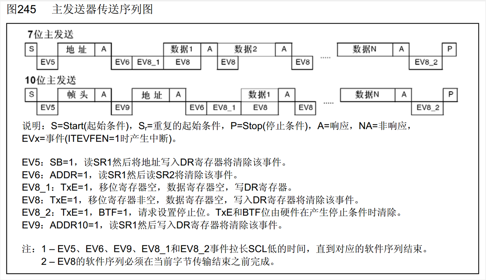


#### **主机接收**：

上面的发送和检测模式，接收也同样适用。

这个是当前地址读的时序，指定地址读的时候没有给出，我们要自己组合一下。

只接受一个数据EV6_1或者最后一个数据之前也就是EV7_1，都要提前进行把响应设置为非应答、停止条件请求EV7_1，因为提前设置了之后是硬件进行操控，会等待数据接收完成，所以接收最后一个数据之前提前给了非应答和停止条数据不会立刻停止接收。**接收的停止发送即非应答要提前发送**。

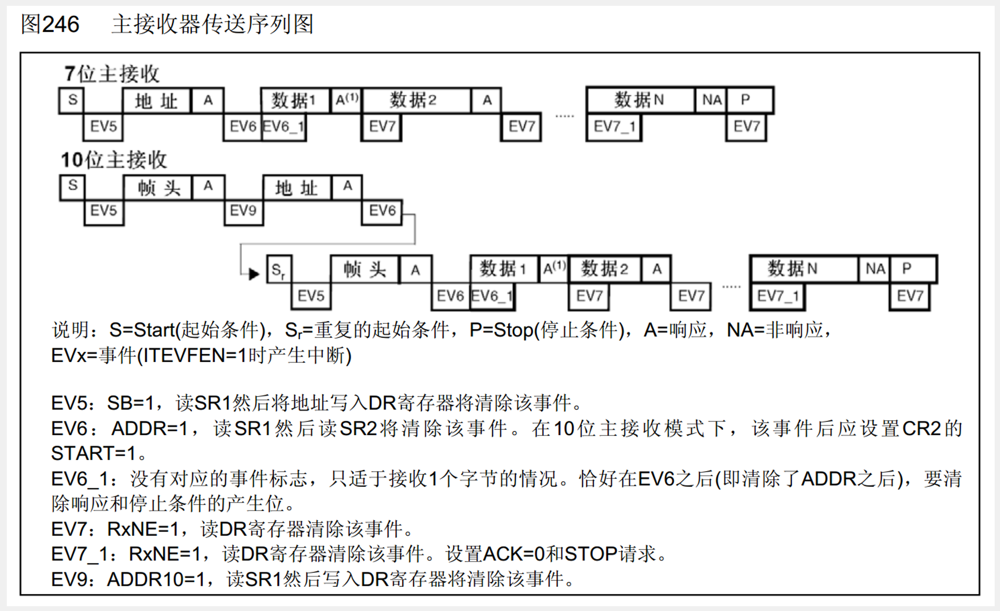


#### **软件/硬件波形对比**：

上面的图是软件（SDA数据有一点点延后，但同步时序问题不大），下面的图是硬件（数据时序SCL变低电平，SDA立刻跟着变化，跟牛皮膏药似的贴着）。

SCL高电平期间SDA不允许有数据变化（专门留给起始和终止条件的）

而**从机应答**因为完会在时钟线SCL下降沿的时候会主动放开SDA，所以指定地址读时序的第二次启动时序不用担心从机一直拉低SDA数据线，当然软件模拟时序先放开SDA总线就更保险了。

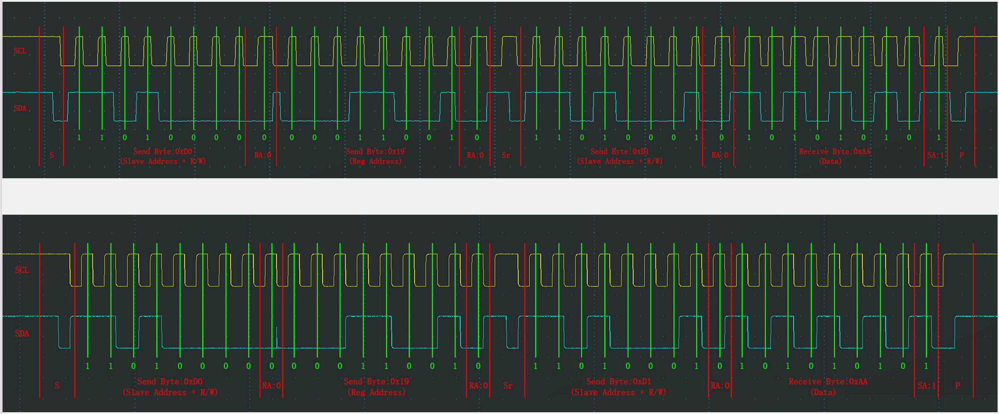


### **I2C寄存器**：

- **控制寄存器 1(I2C_CR1)**  ：

  - **SWRST：软件复位** (Software reset)

    当被置位时， I2C处于复位状态。在复位该位前确信I2C的引脚被释放，总线是空的。

    - 0：I2C模块不处于复位状态；
    - 1：I2C模块处于复位状态。

    > 注： 该位可以用于BUSY位为’1’，在总线上又没有检测到停止条件时。

  - **ALERT： SMBus提醒** (SMBus alert)

    软件可以设置或清除该位；当PE=0时，由硬件清除。

    0：释放SMBAlert引脚使其变高。提醒响应地址头紧跟在NACK信号后面；

    1：驱动SMBAlert引脚使其变低。提醒响应地址头紧跟在ACK信号后面。

  - PEC：数据包出错检测 (Packet error checking)

    软件可以设置或清除该位；当传送PEC后，或起始或停止条件时，或当PE=0时硬件将其清除。

    - 0：无PEC传输；

    - 1： PEC传输(在发送或接收模式)。

    > 注： 仲裁丢失时， PEC的计算失效。

  - **POS: 应答/PEC位置(用于数据接收)** (Acknowledge/PEC Position (for data reception))

    软件可以设置或清除该位，或当PE=0时，由硬件清除。

    - 0： ACK位控制当前移位寄存器内正在接收的字节的(N)ACK。 PEC位表明当前移位寄存器内的字节是PEC；
    - 1：ACK位控制在移位寄存器里接收的下一个字节的(N)ACK。 PEC位表明在移位寄存器里接收的下一个字节是PEC。

    > 注： 
    >
    > POS位只能用在2字节的接收配置中，必须在接收数据之前配置。为了NACK第2个字节，必须在清除ADDR为之后清除ACK位。
    >
    > 为了检测第2个字节的PEC，必须在配置了POS位之后，拉伸ADDR事件时设置PEC位。

  - **ACK： 应答使能** (Acknowledge enable)

    软件可以设置或清除该位，或当PE=0时，由硬件清除。

    - 0：无应答返回； 
    - 1：在接收到一个字节后返回一个应答(匹配的地址或数据)。

  - **STOP： 停止条件产生** (Stop generation)

    软件可以设置或清除该位；或当检测到停止条件时，由硬件清除；

    当检测到超时错误时，硬件将其置位。

    - **在主模式下**：

      - 0：无停止条件产生；

      - 1：在当前字节传输或在当前起始条件发出后产生停止条件。

    - **在从模式下**：

      - 0：无停止条件产生；

      - 1：在当前字节传输或释放SCL和SDA线。

    > 注：当设置了STOP、 START或PEC位，在硬件清除这个位之前，软件不要执行任何对I2C_CR1的写操作；否则有可能会第2次设置STOP、 START或PEC位。

  - **START：起始条件产生** (Start generation)

    软件可以设置或清除该位，或当起始条件发出后或PE=0时，由硬件清除。

    - **在主模式下**：
      - 0: 无起始条件产生；
      - 1：重复产生起始条件。
    - 在从模式下：
      - 0：无起始条件产生；
      - 1：当总线空闲时，产生起始条件。

  - **NOSTRETCH：禁止时钟延长(从模式)** (Clock stretching disable (Slave mode))

    该位用于当ADDR或BTF标志被置位，在从模式下禁止时钟延长，直到它被软件复位。

    - 0：允许时钟延长；
    - 1：禁止时钟延长。

  - **ENGC：广播呼叫使能** (General call enable) 

    - 0：禁止广播呼叫。以非应答响应地址00h； 
    - 1：允许广播呼叫. 以应答响应地址00h。

  - **ENPEC： PEC使能** (PEC enable) 

    - 0：禁止PEC计算； 
    - 1：开启PEC计算。

  - **ENARP： ARP使能** (ARP enable)

    - 0：禁止ARP；

    - 1：使能ARP。

      如果SMBTYPE=0，使用SMBus设备的默认地址。

      如果SMBTYPE=1，使用SMBus的主地址。

  - **SMBTYPE： SMBus类型** (SMBus type) 

    - 0： SMBus设备；
    - 1： SMBus主机。

  - **SMBUS： SMBus模式** (SMBus mode) 

    - 0： I2C模式；
    - 1： SMBus模式。

  - **PE： I2C模块使能** (Peripheral enable)

    - 0：禁用I2C模块；
    - 1：启用I2C模块：根据SMBus位的设置，相应的I/O口需配置为复用功能。

    > 注： 
    >
    > 如果清除该位时通讯正在进行，在当前通讯结束后， I2C模块被禁用并返回空闲状态。
    >
    > 由于在通讯结束后发生PE＝0，所有的位被清除。在主模式下，通讯结束之前，绝不能清除该位。


- **控制寄存器 2(I2C_CR2)**  ：

  - **LAST: DMA最后一次传输** (DMA last transfer) 

    - 0：下一次DMA的EOT不是最后的传输； 
    - 1：下一次DMA的EOT是最后的传输。

    > 注： 该位在主接收模式使用， 使得在最后一次接收数据时可以产生一个NACK。

  - **DMAEN： DMA请求使能** (DMA requests enable) 

    - 0：禁止DMA请求；
    - 1：当TxE=1或RxNE =1时，允许DMA请求。

  - **ITBUFEN：缓冲器中断使能** (Buffer interrupt enable)

    - 0：当TxE=1或RxNE=1时，不产生任何中断； 
    - 1：当TxE=1或RxNE=1时，产生事件中断(不管DMAEN是何种状态)。

  - **ITEVTEN：事件中断使能** (Event interrupt enable)

    - 0：禁止事件中断；

    - 1：允许事件中断。

      | 在下列条件下，将产生该中断：     |
      | -------------------------------- |
      | SB = 1 (主模式)；                |
      | ADDR = 1 (主/从模式)；           |
      | ADD10= 1 (主模式)；              |
      | STOPF = 1 (从模式)；             |
      | BTF = 1，但是没有TxE或RxNE事件； |
      | 如果ITBUFEN = 1， TxE事件为1；   |
      | 如果ITBUFEN = 1， RxNE事件为1。  |

  - **ITERREN：出错中断使能** (Error interrupt enable)

    - 0：禁止出错中断；

    - 1：允许出错中断。

      | 在下列条件下，将产生该中断： |
      | ---------------------------- |
      | BERR = 1；                   |
      | ARLO = 1；                   |
      | AF = 1；                     |
      | OVR = 1；                    |
      | PECERR = 1；                 |
      | TIMEOUT = 1；                |
      | SMBAlert = 1。               |

  - **FREQ[5:0]： I2C模块时钟频率** (Peripheral clock frequency)

    必须设置正确的输入时钟频率以产生正确的时序，允许的范围在2～36MHz之间：

    |                    |
    | ------------------ |
    | 000000：禁用       |
    | 000001：禁用       |
    | 000010： 2MHz      |
    | ......             |
    | 100100： 36MHz     |
    | 大于100100：禁用。 |
    
    > 注：库函数的I2C_Init这个初始化它帮我们填了FREQ[5:0]： I2C模块时钟频率，直接使用了时钟值36MHz进行计算，得出了36，为最高的36MHz。


- **自身地址寄存器 1(I2C_OAR1)**  ：

  - **ADDMODE：寻址模式(从模式)** (Addressing mode (slave mode))

    就是7位地址和10位地址不能都设置为响应，只能二选一。

    - 0： 7位从地址(不响应10位地址)； 
    - 1： 10位从地址(不响应7位地址)。

  - **ADD[9:8]：接口地址** (Interface address) 

    7位地址模式时不用关心。

    10位地址模式时为地址的9~8位。

  - **ADD[7:1]：接口地址** (Interface address)

    地址的7~1位。

  - **ADD0：接口地址** (Interface address) 

    7位地址模式时不用关心。

    10位地址模式时为地址第0位。


- **自身地址寄存器 2(I2C_OAR2)**  ：

  - **ADD2[7:1]：接口地址** (Interface address)

    在双地址模式下地址的7~1位。

  - **ENDUAL： 双地址模式使能位** (Dual addressing mode enable)

    - 0：在7位地址模式下，只有OAR1被识别； 

    - 1：在7位地址模式下， OAR1和OAR2都被识别。


- **数据寄存器(I2C_DR)**  ：

  - **DR[7:0]： 8位数据寄存器** (8-bit data register)

    用于存放接收到的数据或放置用于发送到总线的数据

    发送器模式：当写一个字节至DR寄存器时，自动启动数据传输。一旦传输开始(TxE=1)，如果能及时把下一个需传输的数据写入DR寄存器， I2C模块将保持连续的数据流。

    接收器模式：接收到的字节被拷贝到DR寄存器(RxNE=1)。在接收到下一个字节(RxNE=1)之前读出数据寄存器，即可实现连续的数据传送。

    > 注：在从模式下，地址不会被拷贝进数据寄存器DR；
    >
    > 注：硬件不管理写冲突 (如果TxE=0，仍能写入数据寄存器)；
    >
    > 注：如果在处理ACK脉冲时发生ARLO事件，接收到的字节不会被拷贝到数据寄存器里，因此不能读到它。


- **状态寄存器 1(I2C_SR1)**  ：

  - **SMBALERT： SMBus提醒** (SMBus alert)

    该位由软件写’0’清除，或在PE=0时由硬件清除。

    - **在SMBus主机模式下**：

      - 0：无SMBus提醒；

      - 1：在引脚上产生SMBAlert提醒事件。

    - **在SMBus从机模式下**：

      - 0：没有SMBAlert响应地址头序列；
      - 1：收到SMBAlert响应地址头序列至SMBAlert变低。

  - **TIMEOUT：超时或Tlow错误** (Timeout or Tlow error)

    当在从模式下设置该位：从设备复位通讯，硬件释放总线。

    当在主模式下设置该位：硬件发出停止条件。

    该位由软件写’0’清除，或在PE=0时由硬件清除。

    - 0：无超时错误；

    - 1 ： SCL 处 于 低 已 达 到 25ms( 超 时 ) ； 

      或 者 主 机 低 电 平 累 积 时 钟 扩 展 时 间 超 过10ms(Tlow:mext)；

      或从设备低电平累积时钟扩展时间超过25ms(Tlow:sext)。

  - **PECERR：在接收时发生PEC错误** (PEC Error in reception)

    该位由软件写’0’清除，或在PE=0时由硬件清除。

    - 0: 无PEC错误：接收到PEC后接收器返回ACK(如果ACK=1)；
    - 1: 有PEC错误：接收到PEC后接收器返回NACK(不管ACK是什么值)。

  - **OVR：过载/欠载** (Overrun/Underrun)

    当NOSTRETCH=1时，在从模式下该位被硬件置位，同时： 

    在接收模式中当收到一个新的字节时(包括ACK应答脉冲)，数据寄存器里的内容还未被读出，则新接收的字节将丢失。

    在发送模式中当要发送一个新的字节时，却没有新的数据写入数据寄存器，同样的字节将被发送两次。

    该位由软件写’0’清除，或在PE=0时由硬件清除。

    - 0: 无过载/欠载；

    - 1: 出现过载/欠载。

    > 注：如果数据寄存器的写操作发生时间非常接近SCL的上升沿，发送的数据是不确定的，并发生保持时间错误。

  - **AF：应答失败** (Acknowledge failure)

    当没有返回应答时，硬件将置该位为’1’。

    该位由软件写’0’清除，或在PE=0时由硬件清除。

    - 0：没有应答失败；

    - 1：应答失败。

  - **ARLO：仲裁丢失(主模式)** (Arbitration lost (master mode))

    该位由软件写’0’清除，或在PE=0时由硬件清除。在ARLO事件之后， I2C接口自动切换回从模式(M/SL=0)。

    - 0：没有检测到仲裁丢失；
    - 1：检测到仲裁丢失。当接口失去对总线的控制给另一个主机时，硬件将将置该位为’1’。

    > 注： 在SMBUS模式下，在从模式下对数据的仲裁仅仅发生在数据阶段，或应答传输区间(不包括地址的应答)。

  - **BERR：总线出错** (Bus error)

    当接口检测到错误的起始或停止条件，硬件将该位置’1’。

    该位由软件写’0’清除，或在PE=0时由硬件清除。

    - 0：无起始或停止条件出错；
    - 1：起始或停止条件出错。

  - **TxE：数据寄存器为空(发送时)** (Data register empty (transmitters))

    在发送数据时，数据寄存器为空时该位被置’1’，在发送地址阶段不设置该位。

    软件写数据到DR寄存器可清除该位；或在发生一个起始或停止条件后，或当PE=0时由硬件自动清除。

    如果收到一个NACK，或下一个要发送的字节是PEC(PEC=1)，该位不被置位。

    - 0：数据寄存器非空；

    - 1：数据寄存器空。

    > 注：在写入第1个要发送的数据后，或设置了BTF时写入数据，都不能清除TxE位，这是因为数据寄存器仍然为空。

  - **RxNE：数据寄存器非空(接收时)** (Data register not empty (receivers))

    在接收时，当数据寄存器不为空，该位被置’1’。在接收地址阶段，该位不被置位。

    软件对数据寄存器的读写操作清除该位，或当PE=0时由硬件清除。在发生ARLO事件时， RxNE不被置位。

    - 0：数据寄存器为空；
    - 1：数据寄存器非空。

    > 注：当设置了BTF时，读取数据不能清除RxNE位，因为数据寄存器仍然为满。

  - **STOPF：停止条件检测位(从模式)** (Stop detection (slave mode))

    在一个应答之后(如果ACK=1)，当从设备在总线上检测到停止条件时，硬件将该位置’1’。

    软件读取SR1寄存器后，对CR1寄存器的写操作将清除该位，或当PE=0时，硬件清除该位。

    - 0：没有检测到停止条件；

    - 1：检测到停止条件。

    > 注： 在收到NACK后， STOPF位不被置位。

  - **ADD10： 10位头序列已发送(主模式)** (10-bit header sent (Master mode))

    在**10位地址模式下，当主设备已经将第一个字节发送出去时，硬件将该位置’1’**。

    软件读取SR1寄存器后，对CR1寄存器的写操作将清除该位，或当PE=0时，硬件清除该位。

    - 0：没有ADD10事件发生；
    - 1：主设备已经将第一个地址字节发送出去。

    > 注： 收到一个NACK后， ADD10位不被置位。

  - **BTF：字节发送结束** (Byte transfer finished)

    当NOSTRETCH=0时，在下列情况下硬件将该位置’1’：

    在接收时，当收到一个新字节(包括ACK脉冲)且数据寄存器还未被读取(RxNE=1)。

    在发送时，当一个新数据将被发送且数据寄存器还未被写入新的数据(TxE=1)。

    在软件读取SR1寄存器后，对数据寄存器的读或写操作将清除该位；或在传输中发送一个起始或停止条件后，或当PE=0时，由硬件清除该位。

    - 0：字节发送未完成；

    - 1：字节发送结束

    > 注： 
    >
    > 在收到一个NACK后， BTF位不会被置位。
    >
    > 如果下一个要传输的字节是PEC(I2C_SR2寄存器中TRA为’1’，同时I2C_CR1寄存器中PEC为’1’)， BTF位不会被置位。

  - **ADDR：地址已被发送(主模式)/地址匹配(从模式)** (Address sent (master mode)/matched (slave mode))

    在软件读取SR1寄存器后，对SR2寄存器的读操作将清除该位，或当PE=0时，由硬件清除该位。

    - **地址匹配(从模式)**

      - 0：地址不匹配或没有收到地址；

      - 1：收到的地址匹配。

        当收到的从地址与OAR寄存器中的内容相匹配、

        或发生广播呼叫、

        或SMBus设备默认地址

        或SMBus主机识别出SMBus提醒时，硬件就将该位置’1’(当对应的设置被使能时)。

    - **地址已被发送(主模式)**

      - 0：地址发送没有结束；

      - 1：地址发送结束。

        10位地址模式时，当收到地址的第二个字节的ACK后该位被置’1’。

        7位地址模式时，当收到地址的ACK后该位被置’1’

    > 注： 在收到NACK后， ADDR位不会被置位。

  - **SB：起始位(主模式)** (Start bit (Master mode))

    - 0：未发送起始条件；

    - 1：起始条件已发送。

      当发送出起始条件时该位被置’1’。

      软件读取SR1寄存器后，写数据寄存器的操作将清除该位，

      或当PE=0时，硬件清除该位。


- **状态寄存器 2 (I2C_SR2)**  ：

  - **PEC[7:0]：数据包出错检测** (Packet error checking register)

    当ENPEC=1时， PEC[7:0]存放内部的PEC的值。

  - **DUALF：双标志(从模式)** (Dual flag (Slave mode)) 

    在产生一个停止条件或一个重复的起始条件时，或PE=0时，硬件将该位清除。

    - 0：接收到的地址与OAR1内的内容相匹配； 
    - 1：接收到的地址与OAR2内的内容相匹配。

  - **SMBHOST: SMBus主机头系列(从模式)** (SMBus host header (Slave mode)) 

    在产生一个停止条件或一个重复的起始条件时，或PE=0时，硬件将该位清除。

    - 0：未收到SMBus主机的地址； 
    - 1：当SMBTYPE=1且ENARP=1时，收到SMBus主机地址。– 

  - **SMBDEFAULT： SMBus设备 默 认 地 址(从 模 式)** (SMBus device default address (Slave mode))

    - 0：未收到SMBus设备的默认地址；
    - 1：当ENARP=1时，收到SMBus设备的默认地址。

    在产生一个停止条件或一个重复的起始条件时，或PE=0时，硬件将该位清除。

  - **GENCALL：广播呼叫地址(从模式)** (General call address (Slave mode))

    - 0：未收到广播呼叫地址；
    - 1：当ENGC=1时，收到广播呼叫的地址。– 

    在产生一个停止条件或一个重复的起始条件时，或PE=0时，硬件将该位清除。

  - **TRA：发送/接收** (Transmitter/receiver)

    - 0：接收到数据；
    - 1：数据已发送；

    在整个地址传输阶段的结尾，该位根据地址字节的R/W位来设定。

    在检测到停止条件(STOPF=1)、重复的起始条件或总线仲裁丢失(ARLO=1)后，或当PE=0时，硬件将其清除。

  - **BUSY：总线忙 (Bus busy)**

    - 0：在总线上无数据通讯；
    - 1：在总线上正在进行数据通讯。

    在检测到SDA或SCl为低电平时，硬件将该位置’1’；当检测到一个停止条件时，硬件将该位清除。

    该位指示当前正在进行的总线通讯，当接口被禁用(PE=0)时该信息仍然被更新。

  - **MSL：主从模式** (Master/slave)

    - 0：从模式；
    - 1：主模式。

    当接口处于主模式(SB=1)时，硬件将该位置位； 

    当总线上检测到一个停止条件、仲裁丢失(ARLO=1时)、或当PE=0时，硬件清除该位。


- **时钟控制寄存器(I2C_CCR)**：

  - **F/S： I2C主模式选项** (I2C master mode selection) 

    - 0：标准模式的I2C；
    - 1：快速模式的I2C。

  - **DUTY： 快速模式时的占空比** (Fast mode duty cycle)

    - 0：快速模式下： T_low/T_high = 2； 低电平2÷高电平1=2
    - 1：快速模式下： T_low/T_high = 16/9 (见CCR)。

  - **CCR[11:0]： 快 速/标 准 模 式 下 的 时 钟 控 制 分 频 系 数(主 模 式)** (Clock control register in Fast/Standard mode (Master mode))

    该分频系数用于设置主模式下的SCL时钟。

    - **在I2C标准模式或SMBus模式下**： 

      - T_high = CCR ×T_PCLK1

      - T_low = CCR ×T_PCLK1

    - **在I2C快速模式下**：
    - 如果DUTY = 0：
      
      - T_high = CCR ×T_PCLK1 
      
      - T_low = 2 × CCR × T_PCLK1
      
    - 如果DUTY = 1： (速度达到400kHz) 
      
      - T_high = 9 × CCR ×T_PCLK1
      
      - T_low = 16 × CCR ×T_PCLK1
    
    例如：在标准模式下，产生100kHz的SCL的频率：
    
    如果FREQR = 08， T_PCLK1 = 125ns，则CCR必须写入0x28(40×125ns = 5000 ns)。
    
    > 注： 
    >
    > 1、允许设定的最小值为0x04，在快速DUTY模式下允许的最小值为0x01；
    >
    > 2、T_high=t_r(SCL)+t_w(SCLH)，详见数据手册中对这些参数的定义；
    >
    > 3、T_low=t_f(SCL)+t_w(SCLL)，详见数据手册中对这些参数的定义；
    >
    > 4、这些延时没有过滤器；
    >
    > 5、只有在关闭I2C时(PE = 0)才能设置CCR寄存器；
    >
    > 6、f_CK应当是10MHz的整数倍，这样可以正确产生400kHz的快速时钟。


- **TRISE寄存器(I2C_TRISE)**  ：

  - **TRISE[5:0] ： 在 快 速 / 标 准 模 式 下 的 最 大 上 升 时 间 ( 主 模 式 )** (Maximum rise time in Fast/Standard mode (Master mode))

    这些位必须设置为I2C总线规范里给出的最大的SCL上升时间，增长步幅为1。

    例如：标准模式中最大允许SCL上升时间为1000ns。如果在I2C_CR2寄存器中FREQ[5:0]中的值等于0x08且TPCLK1=125ns，故TRISE[5:0]中必须写入09h(1000ns/125 ns = 8+1)。

    滤波器的值也可以加到TRISE[5:0]内。

    如果结果不是一个整数，则将整数部分写入TRISE[5:0]以确保tHIGH参数。

    > 注：只有当I2C被禁用(PE=0)时，才能设置TRISE[5:0]。


## 11-SPI通信


### **SPI介绍**：

SPI（Serial Peripheral Interface）是由Motorola公司开发的一种通用数据总线

四根通信线：SCK（Serial Clock）、MOSI（Master Output Slave Input）、MISO（Master Input Slave Output）、SS（Slave Select）

**同步，全双工**

**没有**数据应答

支持总线挂载多设备（**一主多从**），主机模式的时候有主动控制权，所以接收信息不需要中断，而如果换成了从机模式，接收信号可能会突然到来，那样的话就要配置专门的接收中断函数。

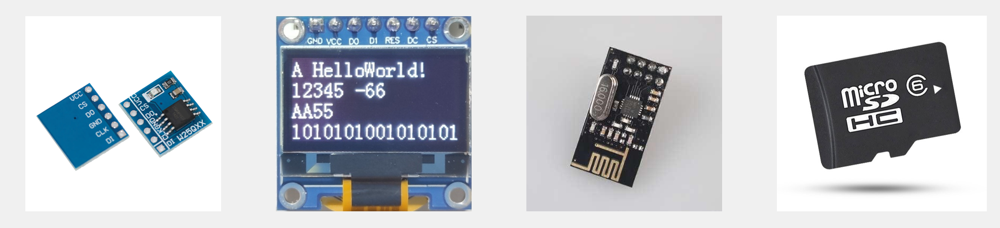


#### **硬件电路**：

所有**SPI设备的SCK、MOSI、MISO分别连在一起**，**主机另外引出**一条或者多条**SS控制线**，分别**接到各从机的SS引脚**

输出引脚配置为推挽输出（推挽输出高低电平都有驱动力），输入引脚配置为浮空或上拉输入

因为MISO是多条从机线接到了同一个主机的输入上，为了避免冲突SPI设置了规定，SS引脚未被置零选中的默认保持高阻态就是不输出电平。被置零选中的从机才能进行推挽输出，即从机被选中才能给主机发送数据。

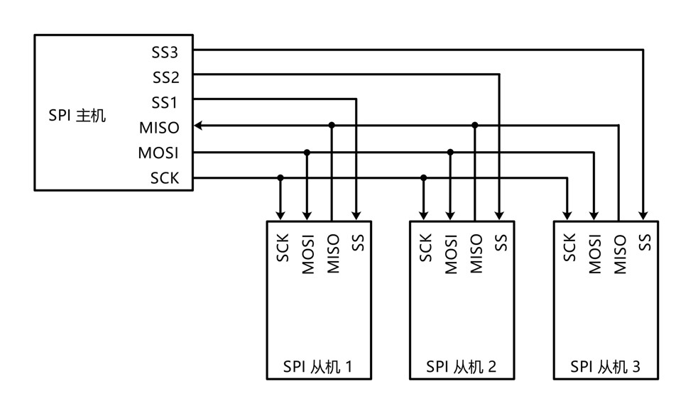


#### **移位示意图**：

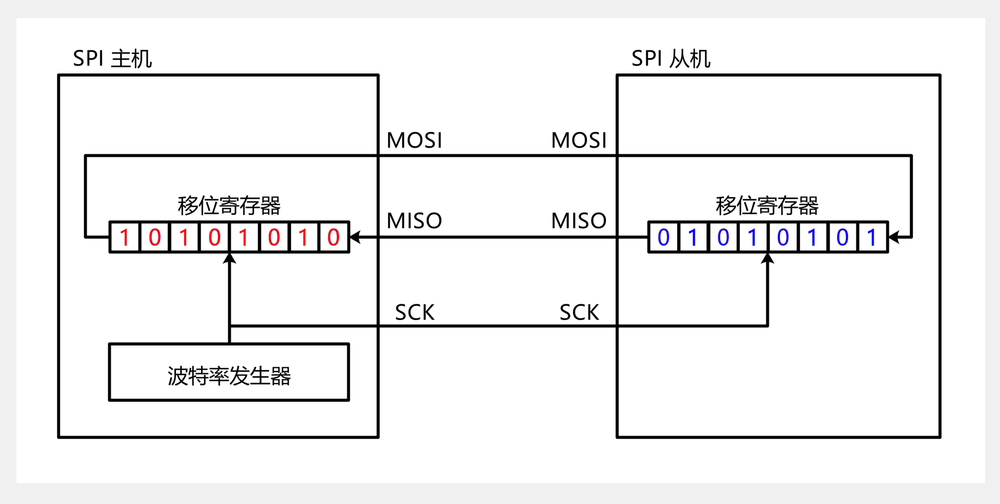


### 时序：


#### **SPI时序起始和终止单元**：

**起始条件**：SS从高电平切换到低电平，左边的

**终止条件**：SS从低电平切换到高电平，右边的

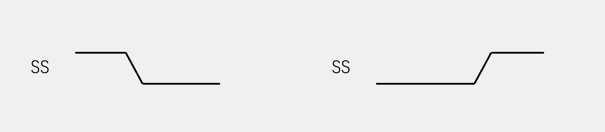


#### **SPI时序交换单元，模式0**：

交换一个字节（**模式0**），**SPI时序交换模式要看芯片支持那种个**，如果使用了**不兼容**的，数据传输就是**错**的了。

CPOL=0：空闲状态时，SCK为低电平

CPHA=0：SCK第一个边沿移入数据（接收），第二个边沿移出数据（放置）

**模式判断看SS拉低后SCK一开始的高低电平，和数据放置是否提前，数据提前就是把拉低SS也当做一个边沿信号了，只有模式0和模式2是数据提前的。**

**只有边沿能触发数据输入和输出。**  

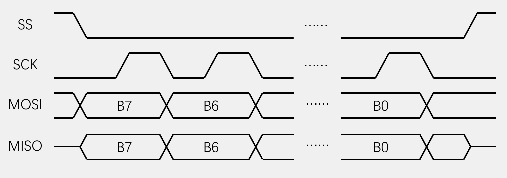


#### **SPI时序交换单元，模式1**：

交换一个字节（**模式1**），**SPI时序交换模式要看芯片支持那种个**，如果使用了**不兼容**的，数据传输就是**错**的了。

CPOL=0：空闲状态时，SCK为低电平

CPHA=1：SCK第一个边沿移出数据（放置），第二个边沿移入数据（接收）

**模式判断看SS拉低后SCK一开始的高低电平，和数据放置是否提前，数据提前就是把拉低SS也当做一个边沿信号了，只有模式0和模式2是数据提前的。**

**只有边沿能触发数据输入和输出。**  

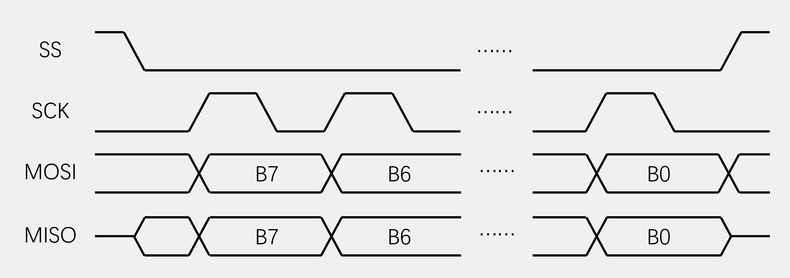


#### **SPI时序交换单元，模式2**：

交换一个字节（**模式2**），**SPI时序交换模式要看芯片支持那种个**，如果使用了**不兼容**的，数据传输就是**错**的了。

CPOL=1：空闲状态时，SCK为高电平

CPHA=0：SCK第一个边沿移入数据（接收），第二个边沿移出数据（放置）

**模式判断看SS拉低后SCK一开始的高低电平，和数据放置是否提前，数据提前就是把拉低SS也当做一个边沿信号了，只有模式0和模式2是数据提前的。**

**只有边沿能触发数据输入和输出。**  

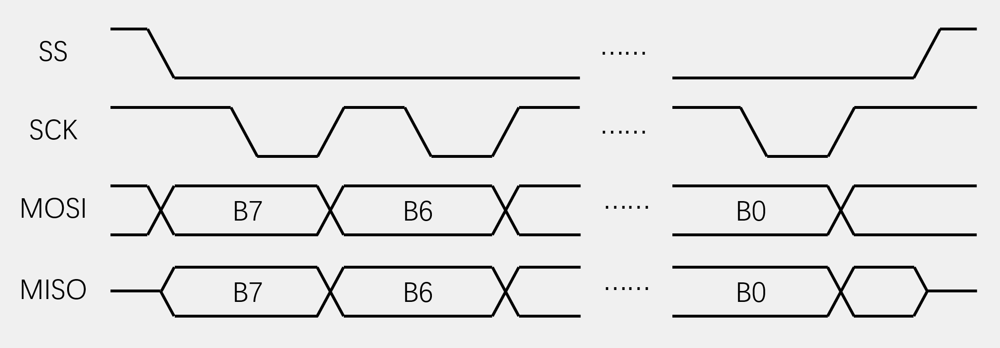


#### **SPI时序交换单元，模式3**：

交换一个字节（**模式3**），**SPI时序交换模式要看芯片支持那种个**，如果使用了**不兼容**的，数据传输就是**错**的了。

CPOL=1：空闲状态时，SCK为高电平

CPHA=1：SCK第一个边沿移出数据（放置），第二个边沿移入数据（接收）

**模式判断看SS拉低后SCK一开始的高低电平，和数据放置是否提前，数据提前就是把拉低SS也当做一个边沿信号了，只有模式0和模式2是数据提前的。**

**只有边沿能触发数据输入和输出。**  

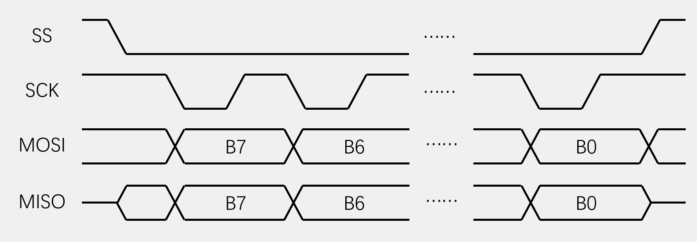


#### **SPI时序发送指令**：

向SS指定的设备，发送指令（0x06）

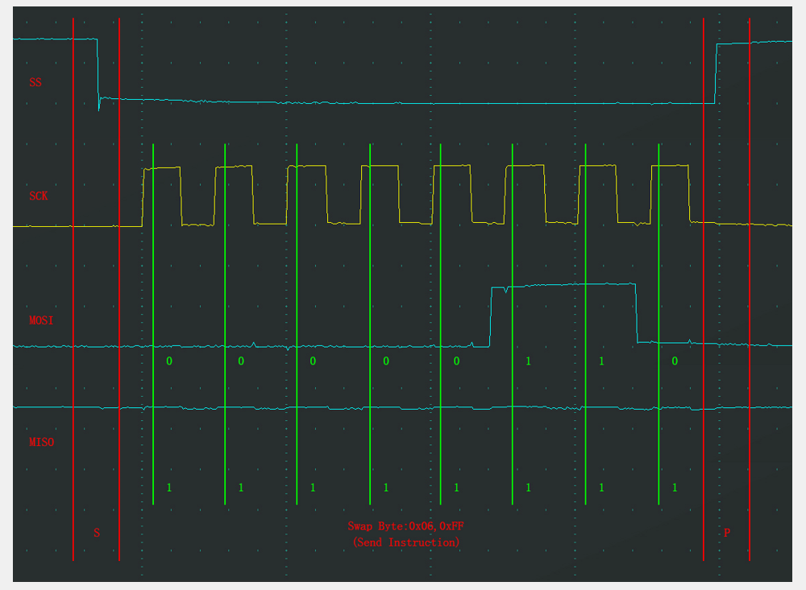


#### **SPI时序指定地址写**：

向SS指定的设备，发送写指令（0x02），随后在指定地址（Address[23:0]）下，写入指定数据（Data）

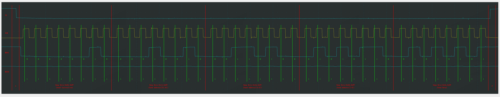


#### **SPI时序指定地址读**：

向SS指定的设备，发送读指令（0x03），随后在指定地址（Address[23:0]）下，读取从机数据（Data）

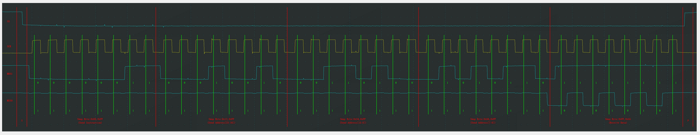


### **W25Q64简介**：

W25Qxx系列是一种低成本、小型化、使用简单的非易失性存储器，常应用于数据存储、字库存储、固件程序存储等场景

存储介质：Nor Flash（闪存）

时钟频率：80MHz / 160MHz (Dual SPI) / 320MHz (Quad SPI)

SPI通讯支持模式：**只支持模式0和模式3，高位先行MSB**

存储容量（24位地址，最多只能到16MByte，32MByte的还要再加地址位）：

-  W25Q40：  4Mbit / 512KByte
-  W25Q80：  8Mbit / 1MByte
-  W25Q16：  16Mbit / 2MByte
-  W25Q32：  32Mbit / 4MByte
-  W25Q64：  64Mbit / 8MByte
-  W25Q128： 128Mbit / 16MByte
-  W25Q256： 256Mbit / 32MByte

W25Q40和W25Q80型号的命名比较特殊，W25Q40结尾的40不是40Mbit，而是4Mbit，W25Q80类似。

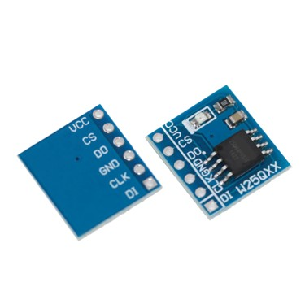


#### **硬件电路**：

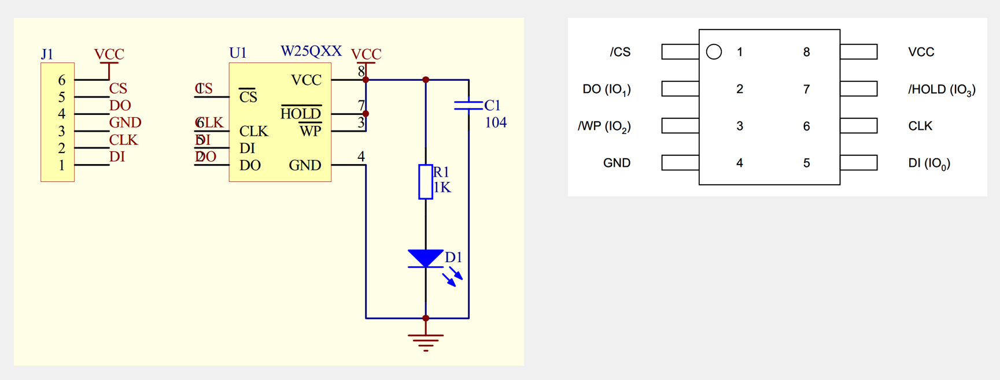

| **引脚**   | **功能**            |
| ---------- | ------------------- |
| VCC、GND   | 电源（2.7~3.6V）    |
| CS（SS）   | SPI片选             |
| CLK（SCK） | SPI时钟             |
| DI（MOSI） | SPI主机输出从机输入 |
| DO（MISO） | SPI主机输入从机输出 |
| WP         | 写保护              |
| HOLD       | 数据保持            |


#### **W25Q64框图**：

这款芯片最小可擦除单位是扇区（4KB），写入的最小单元是一页（256Byte）

右上角一大块是块区，64KB为1块，0~127共128块。

左上角是再细分的扇区，4KB为1扇区，0~15共16块。

实际还有更细分的Page页分区就是右下角，这部分的数据是RAM区的掉电会丢失但是速度快，最高可临时存储256Byte。4096 ÷ 256 = 16，就是1扇面可以有16页。

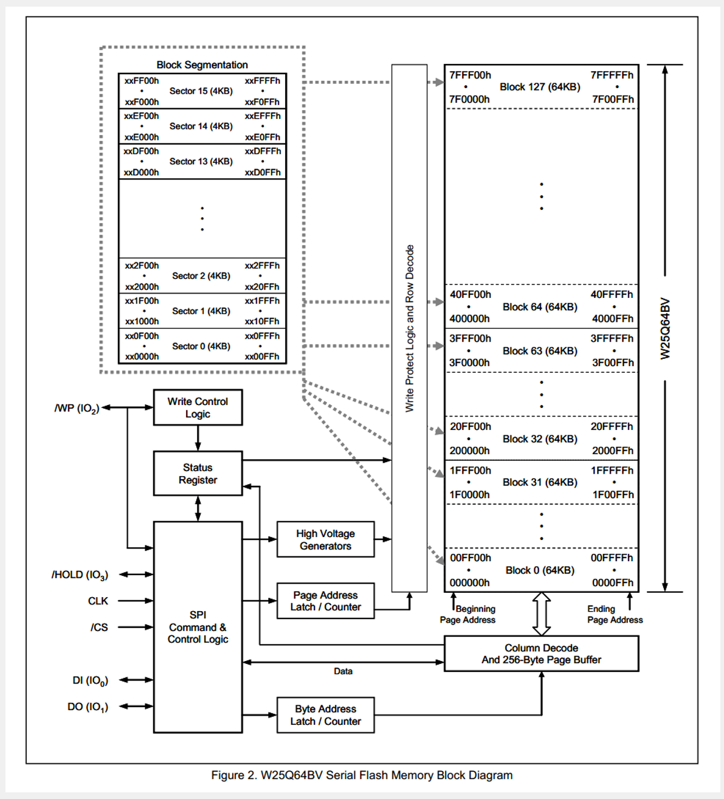


#### **Flash操作注意事项**：

- 写入操作时：

  - 写入操作前，必须先进行写使能

  - 每个数据位只能由1改写为0，不能由0改写为1

  - 写入数据前必须先擦除，擦除后，所有数据位变为1

  - 擦除必须按最小擦除单元进行

  - 连续写入多字节时，最多写入一页的数据，超过页尾位置的数据，会回到页首覆盖写入（超过第256个字节，不能跨页写入，如果写入就又回到第一个字节的地址位置覆盖上次写入的数据了）

  - 写入操作结束后，芯片进入忙状态，不响应新的读写操作

- 读取操作时：
  - 直接调用读取时序，无需使能，无需额外操作，没有页的限制，读取操作结束后不会进入忙状态，但不能在忙状态时读取


### **SPI外设简介**：

STM32内部集成了硬件SPI收发电路，可以由**硬件自动执行时钟生成、数据收发等功能**，减轻CPU的负担

可配置**8位/16位数据帧、高位先行/低位先行**

时钟频率： f_PCLK / (2, 4, 8, 16, 32, 64, 128, 256分频)  ，f_PCLK是主频72MHz或36MHz，主频是多少要看挂载在那个总线。

支持**多主机模型、主或从操作**，主机模式的时候有主动控制权，所以接收信息不需要中断，而如果换成了从机模式，接收信号可能会突然到来，那样的话就要配置专门的接收中断函数。

可精简为**半双工/单工通信**

支持**DMA**

兼容**I2S协议（音频协议）**，但在**小容量和中容量**产品上，**不支持**I2S音频协议。  STM32F103C8T6就是中容量的。


STM32F103C8T6 硬件SPI资源：**SPI1、SPI2**

- **只有SPI1**是挂载在APB2总线上的是**72MHz**。
- **SPI2和其他SPI**都是挂载在APB1总线上的是**32MHz**。


#### **SPI框图**：

高位先行的话，MOSI的线画错了。

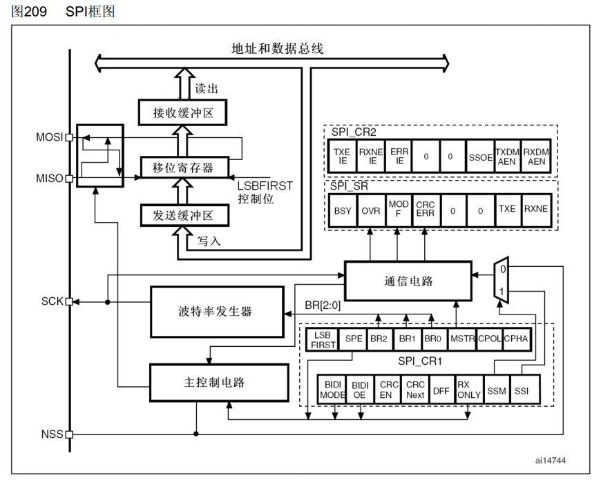


#### **SPI基本结构**：

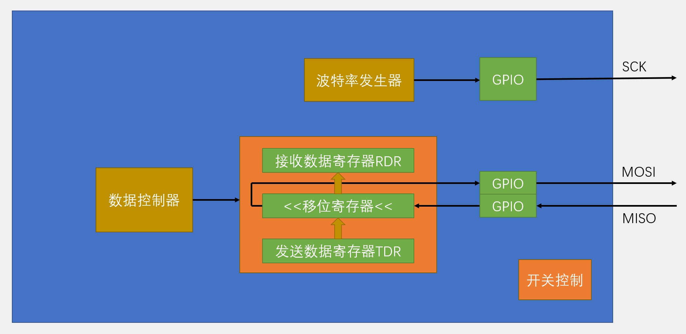


#### **主模式全双工连续传输**：

因为是**模式3**的栗子，所以要等待第一个SCK时钟下降沿才能触发数据位移，把数据从数据缓冲器放置到数据寄存器，最后到输入和输出线，上升沿是读取交换。

发送缓冲器空闲标志(TXE)此标志为 ’ 1 ’ 时表明发送缓冲器为空，可以写下一个待发送的数据进入缓冲器中。当写入SPI_DR时， TXE标志被清除。**也就是说写入就会清除标志**。

接收缓冲器非空(RXNE)此标志为 ’ 1 ’ 时表明在接收缓冲器中包含有效的接收数据。读SPI数据寄存器可以清除此标志。**也就是说读取就会清除标志**。

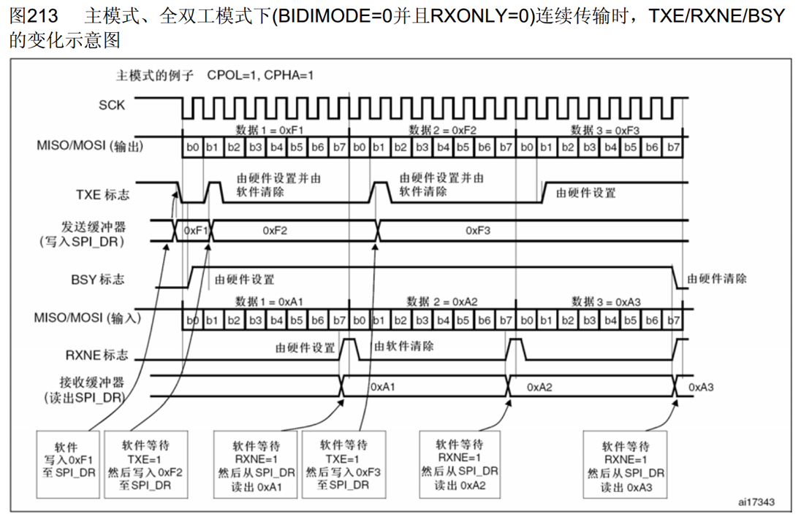


#### **非连续传输**：

因为是**模式3**的栗子，所以要等待第一个SCK时钟下降沿才能触发数据位移，把数据从数据缓冲器放置到数据寄存器，最后到输入和输出线，上升沿是读取交换。

这个**非连续传输发送模式**，软件等待` TXE=1` 较晚写入数据到发送缓冲器，如果频率不快的话问题不大。传输频率快的话这个较晚的这段时间所用的周期占比很大，波形甚至严重失真。**所以这个模式的传输速度不能设置太快**。如果想要传输速率快的话就要使用上面的连续传输模式还要配合DMA自动转运数据。

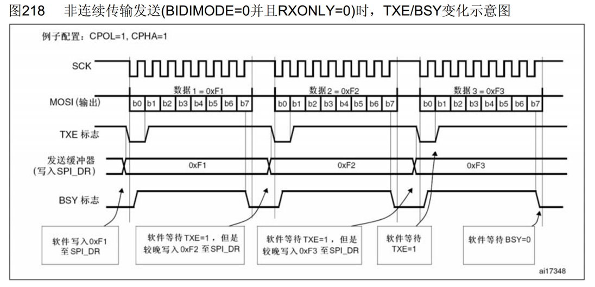


#### **软件/硬件波形对比**：

模式0

上面的是软件模拟SPI产生的波形，因为程序是一行行运行过去的，略微滞后一些，但是时序是同步的由我们控制，所以不用太担心。

下面的是硬件外设SPI产生的波形，电平转换的波形是紧贴着下降沿的。

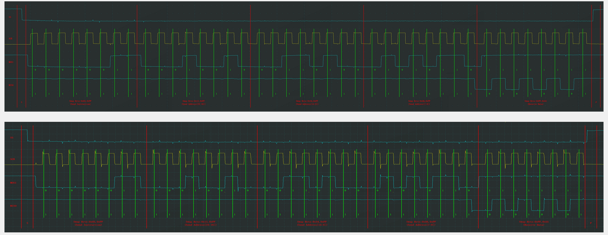


### SPI和I2S寄存器：

- **SPI控制寄存器 1(SPI_CR1)(I2S模式下不使用)**  ：

  - **BIDIMODE：双向数据模式使能** (Bidirectional data mode enable) 

    - 0：选择“双线**单**向”模式；（翻译的手册写着双向错的，单向才对）
    - 1：选择“单线双向”模式。

    > 注： I2S模式下不使用。

  - **BIDIOE：双向模式下的输出使能** (Output enable in bidirectional mode)

    和BIDIMODE位一起决定在“单线双向”模式下数据的输出方向

    - 0：输出禁止(只收模式)；

    - 1：输出使能(只发模式)。

      这个“单线”数据线在主设备端为MOSI引脚，在从设备端为MISO引脚。

    > 注： I2S模式下不使用。

  - **CRCEN：硬件CRC校验使能** (Hardware CRC calculation enable)

    - 0：禁止CRC计算；
    - 1：启动CRC计算。

    > 注：
    >
    > 只有在禁止SPI时(SPE=0)，才能写该位，否则出错。
    >
    > 该位只能在全双工模式下使用。
    >
    > 注： I2S模式下不使用。

  - **CRCNEXT：下一个发送CRC**(Transmit CRC next) 

    - 0：下一个发送的值来自发送缓冲区。

    - 1：下一个发送的值来自发送CRC寄存器。

    > 注：在SPI_DR寄存器写入最后一个数据后应马上设置该位。
    >
    > 注： I2S模式下不使用。

  - **DFF：数据帧格式** (Data frame format) 

    - 0：使用8位数据帧格式进行发送/接收； 
    - 1：使用16位数据帧格式进行发送/接收。

    > 注：只有当SPI禁止(SPE=0)时，才能写该位，否则出错。
    >
    > 注： I2S模式下不使用。

  - **RXONLY：只接收** (Receive only)

    该位和BIDIMODE位一起决定在“双线双向”模式下的传输方向。

    在多个从设备的配置中，在未被访问的从设备上该位被置1，使得只有被访问的从设备有输出，从而不会造成数据线上数据冲突。

    - 0：全双工(发送和接收)；
    - 1：禁止输出(只接收模式)。

    > 注： I2S模式下不使用。

  - **SSM：软件从设备管理** (Software slave management)

    当SSM被置位时， NSS引脚上的电平由SSI位的值决定。

    - 0：禁止软件从设备管理；
    - 1：启用软件从设备管理。

    > 注： I2S模式下不使用。

  - **SSI：内部从设备选择** (Internal slave select)

    该位**只在SSM位为’1’时有意义**。它决定了NSS上的电平，在NSS引脚上的I/O操作无效。

    > 注： I2S模式下不使用。

  - **LSBFIRST：帧格式** (Frame format)

    - 0：先发送MSB；
    - 1：先发送LSB。

    > 注：当通信在进行时不能改变该位的值。
    >
    > 注： I2S模式下不使用。

  - **SPE： SPI使能** (SPI enable)

    - 0：禁止SPI设备；
    - 1：开启SPI设备。

    >注：当关闭SPI设备时，请按照第23.3.8节的过程操作。
    >
    >注： I2S模式下不使用。

  - **BR[2:0]：波特率控制** (Baud rate control)

    | 波特率控制     |                 |                  |                  |
    | -------------- | --------------- | ---------------- | ---------------- |
    | 000： f_PCLK/2 | 001： f_PCLK/4  | 010： f_PCLK/8   | 011： f_PCLK/16  |
    | 100：f_PCLK/32 | 101： f_PCLK/64 | 110： f_PCLK/128 | 111： f_PCLK/256 |

    当通信正在进行的时候，不能修改这些位。

    > 注意： I2S模式下不使用。

  - **MSTR：主设备选择** (Master selection)

    - 0：配置为从设备；
    - 1：配置为主设备。

    > 注：当通信正在进行的时候，不能修改该位。
    >
    > 注： I2S模式下不使用。

  - **CPOL：时钟极性** (Clock polarity)

    - 0： 空闲状态时， SCK保持低电平；
    - 1： 空闲状态时， SCK保持高电平。

    > 注：当通信正在进行的时候，不能修改该位。注： I2S模式下不使用。

  - **CPHA：时钟相位** (Clock phase)

    - 0： 数据采样从第一个时钟边沿开始；
    - 1： 数据采样从第二个时钟边沿开始。

    > 注：当通信正在进行的时候，不能修改该位。
    >
    > 注： I2S模式下不使用。


- **SPI控制寄存器 2(SPI_CR2)**  ：

  - **TXEIE：发送缓冲区空中断使能** (Tx buffer empty interrupt enable) 

    - 0：禁止TXE中断；
    - 1：允许TXE中断，当TXE标志置位为’1’时产生中断请求。

  - **RXNEIE：接收缓冲区非空中断使能** (RX buffer not empty interrupt enable) 

    - 0：禁止RXNE中断； 

    - 1：允许RXNE中断，当RXNE标志置位时产生中断请求。

  - **ERRIR：错误中断使能** (Error interrupt enable)

    当错误(CRCERR、 OVR、 MODF)产生时，该位控制是否产生中断

    - 0：禁止错误中断；
    - 1：允许错误中断。

  - **SSOE： SS输出使能** (SS output enable) 

    - 0：禁止在主模式下SS输出，该设备可以工作在多主设备模式； 
    - 1：设备开启时，开启主模式下SS输出，该设备不能工作在多主设备模式。

    > 注： I2S模式下不使用。

  - **TXDMAEN：发送缓冲区DMA使能** (Tx buffer DMA enable)

    当该位被设置时， TXE标志一旦被置位就发出DMA请求

    - 0：禁止发送缓冲区DMA；
    - 1：启动发送缓冲区DMA。

  - **RXDMAEN：接收缓冲区DMA使能** (Rx buffer DMA enable)

    当该位被设置时， RXNE标志一旦被置位就发出DMA请求

    - 0：禁止接收缓冲区DMA；

    - 1：启动接收缓冲区DMA。


- **SPI 状态寄存器(SPI_SR)**  ：

  - **BSY：忙标志** (Busy flag)

    - 0： SPI不忙；
    - 1： SPI正忙于通信，或者发送缓冲非空。该位由硬件置位或者复位。

    > 注：使用这个标志时需要特别注意，详见第23.3.7节和第23.3.8节。

  - **OVR：溢出标志** (Overrun flag)

    - 0：没有出现溢出错误；
    - 1：出现溢出错误。

    该位由硬件置位，由软件序列复位。关于软件序列的详细信息，参考23.4.7节。

  - **MODF：模式错误** (Mode fault) 

    - 0：没有出现模式错误； 
    - 1：出现模式错误。该位由硬件置位，由软件序列复位。关于软件序列的详细信息，参考23.3.10节。

    > 注： I2S模式下不使用。

  - **CRCERR： CRC错误标志** (CRC error flag)

    -  0：收到的CRC值和SPI_RXCRCR寄存器中的值匹配； 
    - 1：收到的CRC值和SPI_RXCRCR寄存器中的值不匹配。

    该位由硬件置位，由软件写’0’而复位。

    > 注： I2S模式下不使用。

  - **UDR：下溢标志位** (Underrun flag)

    - 0：未发生下溢；
    - 1：发生下溢。

    该标志位由硬件置’1’，由一个软件序列清’0’，详见23.4.7节。

    > 注：在SPI模式下不使用。

  - **CHSIDE：声道** (Channel side) 

    - 0：需要传输或者接收左声道； 
    - 1：需要传输或者接收右声道。

    > 注：在SPI模式下不使用。在PCM模式下无意义。

  - **TXE：发送缓冲为空** (Transmit buffer empty)

    - 0：发送缓冲非空；
    - 1：发送缓冲为空。

  - **RXNE：接收缓冲非空** (Receive buffer not empty) 

    - 0：接收缓冲为空；
    - 1：接收缓冲非空。


- **SPI 数据寄存器(SPI_DR)**  ：

  - **DR[15:0]：数据寄存器** (Data register)

    待发送或者已经收到的数据

    数据寄存器对应两个缓冲区：一个用于写(发送缓冲)；另外一个用于读(接收缓冲)。

    写操作将数据写到发送缓冲区；

    读操作将返回接收缓冲区里的数据。

    对SPI模式的注释： 根据SPI_CR1的DFF位对数据帧格式的选择，数据的发送和接收可以是8位或者16位的。为保证正确的操作，需要在启用SPI之前就确定好数据帧格式。

    - 对于**8位的数据**，缓冲器是8位的，发送和接收时只会用到SPI_DR[7:0]。**在接收时， SPI_DR[15:8]被强制为0**。

    - 对于**16位的数据**，缓冲器是16位的，**发送和接收时会用到整个数据寄存器**，即SPI_DR[15:0]数据是完整的16位。


- **SPI CRC多项式寄存器(SPI_CRCPR)(I2S模式下不使用)**  ：

  - **CRCPOLY[15:0]： CRC多项式寄存器** (CRC polynomial register)

    该寄存器包含了CRC计算时用到的多项式。其复位值为0x0007，根据应用可以设置其他数值。

    > 注：在I2S模式下不使用。


- **SPI Rx CRC寄存器(SPI_RXCRCR)(I2S模式下不使用)**  ：

  - **RXCRC[15:0]：接收CRC寄存器**

    在启用CRC计算时， RXCRC[15:0]中包含了依据收到的字节计算的CRC数值。

    当在SPI_CR1的CRCEN位写入’1’时，该寄存器被复位。 CRC计算使用SPI_CRCPR中的多项式。

    当数据帧格式被设置为8位时，仅低8位参与计算，并且按照CRC8的方法进行；

    当数据帧格式为16位时，寄存器中的所有16位都参与计算，并且按照CRC16的标准。

    > 注：当BSY标志为’1’时读该寄存器，将可能读到不正确的数值。
    >
    > 注：在I2S模式下不使用。


- **SPI Tx CRC寄存器(SPI_TXCRCR)**  ：

  - **TxCRC[15:0]：发送CRC寄存器**

    在启用CRC计算时， TXCRC[15:0]中包含了依据将要发送的字节计算的CRC数值。

    当在SPI_CR1中的CRCEN位写入’1’时，该寄存器被复位。 CRC计算使用SPI_CRCPR中的多项式。

    当数据帧格式被设置为8位时，仅低8位参与计算，并且按照CRC8的方法进行；

    当数据帧格式为16位时，寄存器中的所有16个位都参与计算，并且按照CRC16的标准。

    > 注：当BSY标志为’1’时读该寄存器，将可能读到不正确的数值。
    >
    > 注：在I2S模式下不使用。


- **SPI_I2S配置寄存器(SPI_I2S_CFGR)**  ：

  - **I2SMOD： I2S模式选择** (I2S mode selection)

    -  0: 选择SPI模式；
    - 1: 选择I2S模式。

    > 注：该位只有在关闭了SPI或者I2S时才能设置。

  - **I2SE: I2S使能** (I2S enable) 

    - 0: 关闭I2S；
    - 1: I2S使能。

    > 注：在SPI模式下不使用。

  - **I2SCFG： I2S模式设置** (I2S configuration mode)

    - 00: 从设备发送；
    - 01: 从设备接收；
    - 10: 主设备发送；
    - 11: 主设备接受。

    > 注：该位只有在关闭了I2S时才能设置。在SPI模式下不使用。

  - **PCMSYNC： PCM帧同步** (PCM frame synchronization) 

    - 0: 短帧同步；
    - 1: 长帧同步。

    > 注: 该位只在I2SSTD = 11 (使用PCM标准)时有意义。在SPI模式下不使用。

  - **I2SSTD： I2S标准选择** (I2S standard selection)

    - 00: I2S飞利浦标准；
    - 01: 高字节对齐标准 (左对齐)；
    - 10: 低字节对齐标准(右对齐)；
    - 11: PCM 标准。

    关于I2S标准的细节，详见23.4.2节。

    > 注：为了正确操作，只有在关闭了I2S时才能设置该位。在SPI模式下不使用。

  - **CKPOL：静止态时钟极性** (Steady state clock polarity) 

    - 0: I2S时钟静止态为低电平；
    - 1: I2S时钟静止态为高电平。

    > 注：为了正确操作，该位只有在关闭了I2S时才能设置。在SPI模式下不使用。

  - **DATLEN：待传输数据长度** (Data length to be transferred) 

    - 00: 16位数据长度；
    - 01: 24位数据长度；
    - 10: 32位数据长度；
    - 11: 不允许。

    > 注：为了正确操作，该位只有在关闭了I2S时才能设置。在SPI模式下不使用。

  - **CHLEN：声道长度** (每个音频声道的数据位数) (Channel length (number of bits per audio channel))

    - 0: 16位宽；
    - 1: 32位宽。

    只有在 DATLEN = 00 时该位的写操作才有意义，否则声道长度都由硬件固定为32位。

    > 注：为了正确操作，该位只有在关闭了I2S时才能设置。在SPI模式下不使用。


- **SPI_I2S预分频寄存器(SPI_I2SPR)**  ：

  - **MCKOE：主设备时钟输出使能** (Master clock output enable)

    - 0: 关闭主设备时钟输出；
    - 1: 主设备时钟输出使能。

    > 注：
    >
    > 为了正确操作，该位只有在关闭了I2S时才能设置。
    >
    > 仅在I2S主设备模式下使用该位。在SPI模式下不使用。

  - **ODD：奇系数预分频** (Odd factor for the prescaler)

    - 0：实际分频系数 = I2SDIV *2；
    - 1：实际分频系数 = (I2SDIV * 2)+1。

    参见23.4.3节。

    > 注：
    >
    > 为了正确操作，该位只有在关闭了I2S时才能设置。
    >
    > 仅在I2S主设备模式下使用该位。在SPI模式下不使用。

  - **I2SDIV： I2S线性预分频** (I2S linear prescaler)

    禁止设置I2SDIV [7:0] = 0

    或者I2SDIV [7:0] = 1

    参见23.4.3节。

    > 注：
    >
    > 为了正确操作，该位只有在关闭了I2S时才能设置。
    >
    > 仅在I2S主设备模式下使用该位。在SPI模式下不使用。


## 12-RTC实时时钟


**Unix时间戳**：

Unix 时间戳（Unix Timestamp）定义为从UTC/GMT的1970年1月1日0时0分0秒开始所经过的秒数，不考虑闰秒

时间戳存储在一个秒计数器中，秒计数器为32位/64位的整型变量

世界上所有时区的秒计数器相同，不同时区通过添加偏移来得到当地时间

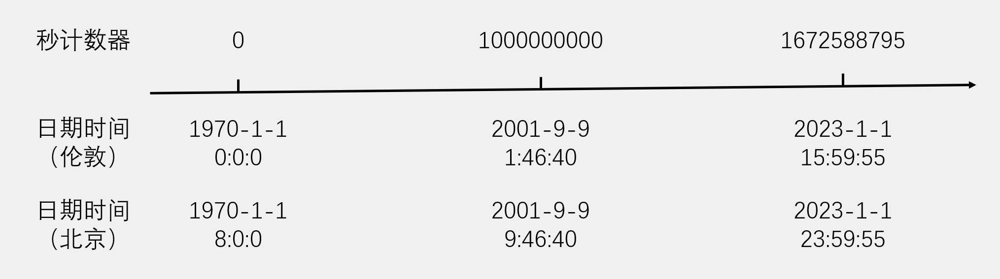


**UTC/GMT**：

- GMT（Greenwich Mean Time）格林尼治标准时间是一种以地球自转为基础的时间计量系统。它将地球自转一周的时间间隔等分为24小时，以此确定计时标准

- UTC（Universal Time Coordinated）协调世界时是一种以原子钟为基础的时间计量系统。它规定铯133原子基态的两个超精细能级间在零磁场下跃迁辐射9,192,631,770周所持续的时间为1秒。当原子钟计时一天的时间与地球自转一周的时间相差超过0.9秒时，UTC会执行闰秒来保证其计时与地球自转的协调一致


**时间戳转换**：

C语言的time.h模块提供了时间获取和时间戳转换的相关函数，可以方便地进行秒计数器、日期时间和字符串之间的转换

还有两个冷门函数没有介绍具体可查看：[C 标准库 –time.h  | 菜鸟教程](https://www.runoob.com/cprogramming/c-standard-library-time-h.html)

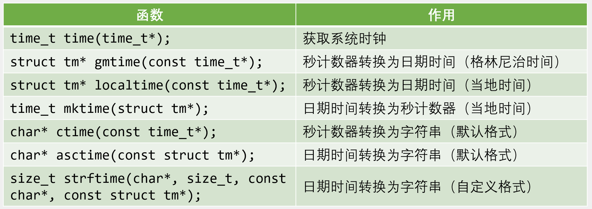


**时间戳转换框图**：

程序调用的time.h文件里的mktime()和localtime()函数，默认是伦敦时间，所以设置时间要加偏移量。gmtime函数因为在STM32里无法调区当地区域时间，所以作废了。

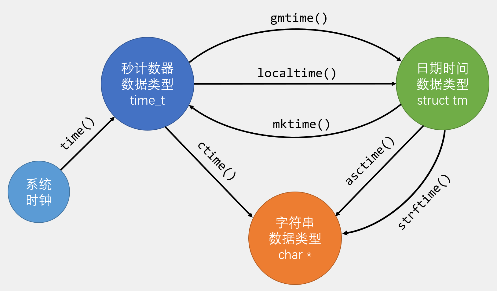


**RTC简介**：

RTC（Real Time Clock）实时时钟

RTC是一个独立的定时器，可为系统提供时钟和日历的功能

RTC和时钟配置系统处于后备区域，系统复位时数据不清零，VDD（2.0~3.6V）断电后可借助VBAT（1.8~3.6V）供电继续走时

32位的可编程计数器，可对应Unix时间戳的秒计数器

20位的可编程预分频器，可适配不同频率的输入时钟

可选择三种RTC时钟源（只有LSE是连接备用供电VBAT的时钟，如果想主电源掉电不丢失，只能选LSE的32.768kHz）：

- HSE时钟除以128（通常为8MHz/128）

-  **LSE振荡器时钟**（通常为32.768KHz）

-  LSI振荡器时钟（40KHz）


**RTC框图**：

阴影填充部分就是备用电源模块，主电源掉电后可以使用备用电池进行供电，未填充部分就是待机时不供电。

RTC_DIV就相当于是一个自减计数器，**计数到0后溢出，从重装载RTC_PRL获取重装值继续自减**。

RTC_CNT相当于Unix时间戳的秒计数器，配合time.h函数就可以很方便的得到年、月、日、时、分、秒信息了。

闹钟寄存器RTC_ALR，也是32位的寄存器，如果计数值和RTC_CNT相等就产生闹钟信号RTC_Alarm去到中断系统，而且这个闹钟信号还可以往下走退出待机模式。这个闹钟寄存器是个定值，只能触发一次，如果想再触发其他功能就要重新定值。

RTC_Second是秒中断，就是每秒进入一次中断，中断信号来源是RTC_CNT的左边，因为RTC一般是使用32.768kHz时钟频率的晶振，经过32768分频就变成了1秒1Hz了，所以才有了一秒一次的信号。

RTC_Overflow是溢出中断，一般不会溢出，因为定义的是无符合的32位数，所以结合时间戳信息，1秒计数一次的话，从1970年开始算，要计时到2106年才会触发中断，当真是人走机还在。

RTC_CR是控制寄存器，F（Flag）结尾的是中断标志位，IE（Interrupt Enable）结尾的是中断使能。中间的OWF和OWIE有条线漏画了。

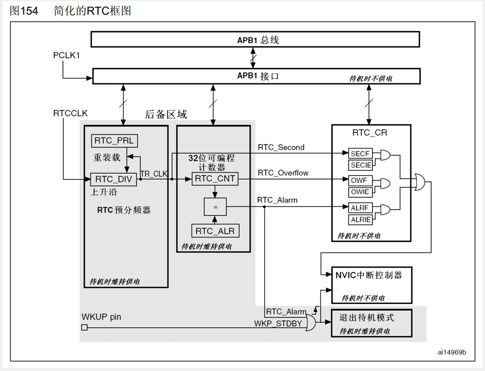


**RTC基本结构**：

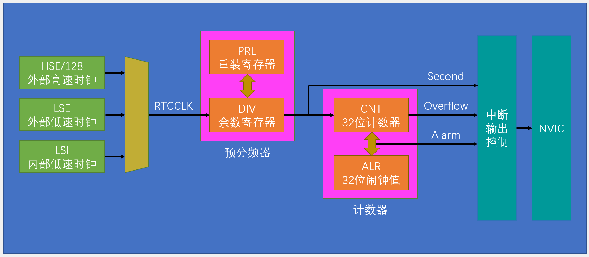


**硬件电路**：

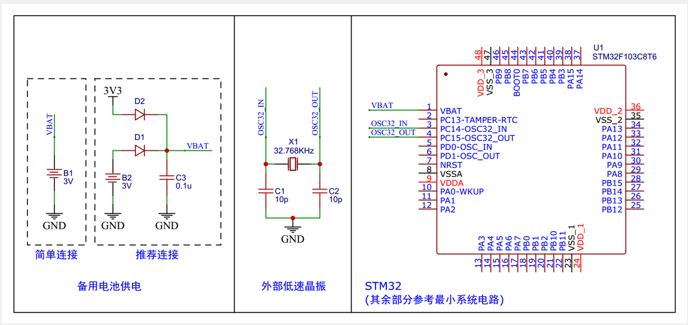

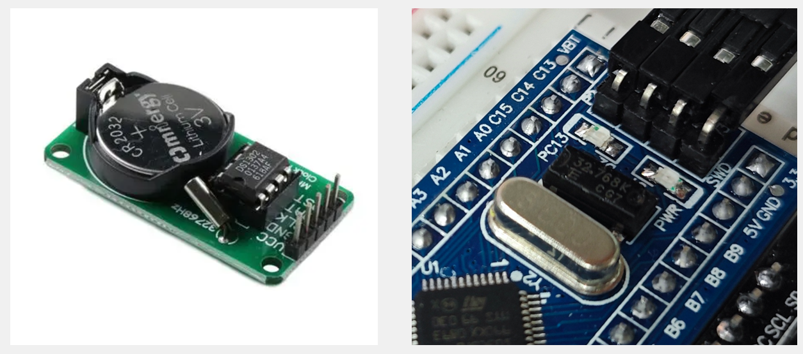


**RTC操作注意事项**：

执行以下操作将使能对BKP和RTC的访问：

- 设置RCC_APB1ENR的PWREN和BKPEN，使能PWR电源控制和BKP备份寄存器时钟

- 设置PWR_CR寄存器的DBP位，使能对BKP和RTC的访问

若在读取RTC寄存器时，RTC的APB1接口曾经处于禁止状态，则软件首先必须等待RTC_CRL寄存器中的RSF位（寄存器同步标志）被硬件置1。

必须设置RTC_CRL寄存器中的CNF位，使RTC进入配置模式后，才能写入RTC_PRL、RTC_CNT、RTC_ALR寄存器（库函数写入配置寄存器的函数，都有帮忙在写入前进入和退出配置模式）

对RTC任何寄存器的写操作，都必须在前一次写操作结束后进行。可以通过查询RTC_CR寄存器中的RTOFF状态位，判断RTC寄存器是否处于更新中。仅当RTOFF状态位是1时，才可以写入RTC寄存器


**RTC寄存器**：

- **RTC控制寄存器高位(RTC_CRH)**  ：
  - **OWIE：允许溢出中断位** (Overflow interrupt enable)
    - 0：屏蔽(不允许)溢出中断
    - 1：允许溢出中断

  - **ALRIE：允许闹钟中断** (Alarm interrupt enable)
    - 0：屏蔽(不允许)闹钟中断
    - 1：允许闹钟中断

  - **SECIE：允许秒中断** (Second interrupt enable)
    - 0：屏蔽(不允许)秒中断
    - 1：允许秒中断


- **RTC控制寄存器低位(RTC_CRL)**  ：

  - **RTOFF： RTC操作关闭** (RTC operation OFF) 

    RTC模块利用这位来指示对其寄存器进行的最后一次操作的状态，指示操作是否完成。

    若此位为’0’，则表示无法对任何的RTC寄存器进行写操作。此位为只读位。

    - 0：上一次对RTC寄存器的写操作仍在进行;
    - 1：上一次对RTC寄存器的写操作已经完成。

  - **CNF：配置标志** (Configuration flag)

    此位必须由软件置’1’以进入配置模式，从而允许向RTC_CNT、 RTC_ALR或RTC_PRL寄存器写入数据。

    只有当此位在被置’1’并重新由软件清’0’后，才会执行写操作。

    - 0：退出配置模式(开始更新RTC寄存器)；
    - 1：进入配置模式

  - **RSF：寄存器同步标志** (Registers synchronized flag)

    每当RTC_CNT寄存器和RTC_DIV寄存器由软件更新或清’0’时，此位由硬件置’1’。

    在APB1复位后，或APB1时钟停止后，此位必须由软件清’0’。

    要进行任何的读操作之前，用户程序必须等待这位被硬件置’1’，以确保RTC_CNT、 RTC_ALR或RTC_PRL已经被同步。

    - 0：寄存器尚未被同步；
    - 1：寄存器已经被同步

  - **OWF：溢出标志** (Overflow flag)

    当32位可编程计数器溢出时，此位由硬件置’1’。

    如果RTC_CRH寄存器中OWIE=1，则产生中断。此位只能由软件清’0’。对此位写’1’是无效的。

    - 0：无溢出；
    - 1： 32位可编程计数器溢出。

  - **ALRF：闹钟标志** (Alarm flag)

    当32位可编程计数器达到RTC_ALR寄存器所设置的预定值，此位由硬件置’1’。

    如果RTC_CRH寄存器中ALRIE=1，则产生中断。

    此位只能由软件清’0’。对此位写’1’是无效的。

    - 0：无闹钟；
    - 1：有闹钟。

  - **SECF：秒标志** (Second flag)

    当32位可编程预分频器溢出时，此位由硬件置’1’同时RTC计数器加1。因此，此标志为分辨率可编程的RTC计数器提供一个周期性的信号(通常为1秒)。

    如果RTC_CRH寄存器中SECIE=1，则产生中断。

    此位只能由软件清除。对此位写’1’是无效的。

    - 0：秒标志条件不成立；
    - 1：秒标志条件成立。


- **RTC预分频装载寄存器(RTC_PRLH/RTC_PRLL)**  

  - **RTC预分频装载寄存器高位**(RTC_PRLH)  ：

    - PRL[19:16]： RTC预分频装载值高位 (RTC prescaler reload value high)

      根据以下公式，这些位用来定义计数器的时钟频率：

      f_TR_CLK = f_RTCCLK/(PRL[19:0]+1)

      > 注：不推荐使用0值，否则无法正确的产生RTC中断和标志位。

  

  - **RTC预分频装载寄存器低位(**RTC_PRLL)  ：

    - **PRL[15:0]： RTC预分频装载值低位**

      根据以下公式，这些位用来定义计数器的时钟频率： 

      f_TR_CLK = f_RTCCLK/(PRL[19:0]+1)

      > 注： 如果输入时钟频率是32.768kHz(f_RTCCLK)，这个寄存器中写入7FFFh可获得周期为1秒钟的信号。  


- **RTC预分频器余数寄存器(RTC_DIVH / RTC_DIVL)**  ：

  - **RTC预分频器余数寄存器高位**(RTC_DIVH)  ：
    - RTC_DIV[19:16]： RTC时钟分频器余数高位 (RTC clock divider high)

  

  - **RTC预分频器余数寄存器低位**(RTC_DIVL)  ：
    - RTC_DIV[15:0]： RTC时钟器余数低位 (RTC clock divider low)


- **RTC计数器寄存器 (RTC_CNTH / RTC_CNTL)**  ：

  - **RTC计数器寄存器高位**(RTC_CNTH) ：

    - **RTC_CNT[31:16]： RTC计数器高位** (RTC counter high)

      可通过读RTC_CNTH寄存器来获得RTC计数器当前值的高位部分。

      要对此寄存器进行写操作前，必须先进入配置模式(参见16.3.4节)。

    

  - **RTC计数器寄存器低位**(RTC_CNTL)  ：

    - **RTC_CNT[15:0]： RTC计数器低位**。

      可通过读RTC_CNTL寄存器来获得RTC计数器当前值的低位部分。

      要对此寄存器进行写操作，必须先进入配置模式(参见16.3.4节)。


- **RTC闹钟寄存器(RTC_ALRH/RTC_ALRL)**  ：

  - **RTC闹钟寄存器高位**(RTC_ALRH)  ：

    - **RTC_ALR[31:16]： RTC闹钟值高位** (RTC alarm high)

      此寄存器用来保存由软件写入的闹钟时间的高位部分。

      要对此寄存器进行写操作，必须先进入配置模式(参见16.3.4节)。

  

  - **RTC闹钟寄存器低位**(RTC_ALRL)  ：

    - **RTC_ALR[15:0]： RTC闹钟值低位** (RTC alarm low)

      此寄存器用来保存由软件写入的闹钟时间的低位部分。

      要对此寄存器进行写操作，必须先进入配置模式(参见16.3.4节)。


## 13-BKP备份寄存器

BKP（Backup Registers）备份寄存器

BKP可用于存储用户应用程序数据。当VDD（2.0~3.6V）电源被切断，他们仍然由VBAT（1.8~3.6V）维持供电。当系统在待机模式下被唤醒，或系统复位或电源复位时，他们也不会被复位。

TAMPER引脚产生的侵入事件将所有备份寄存器内容清除

RTC引脚(当该引脚不用于侵入检测时)  可以输出RTC校准时钟、RTC闹钟脉冲或者秒脉冲

存储RTC时钟校准寄存器

用户数据存储容量：20字节（中容量和小容量）/ 84字节（大容量和互联型）


如果完全断电复位后，对备份寄存器和RTC的访问被禁止，并且备份域被保护以防止可能存在的意外的写操作。执行以下操作可以使能对备份寄存器和RTC的访问。

- 通过设置寄存器RCC_APB1ENR的PWREN和BKPEN位来打开电源和后备接口的时钟

- 电源控制寄存器(PWR_CR)的DBP位来使能对后备寄存器和RTC的访问。


**BKP基本结构**：

20字节数据后备寄存器(中容量和小容量产品)，或84字节数据后备寄存器(大容量和互联型产品)

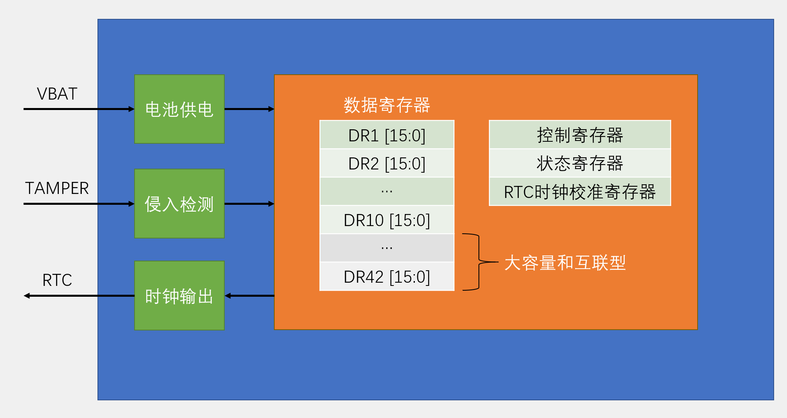


**BKP寄存器**：

- **备份数据寄存器**x(BKP_DRx) (x = 1 … 10)  ：16位的数据寄存器，中小型号的只有10个，每个寄存器可以写入2个字节，所以可以备份20个字节的数据。

- **RTC时钟校准寄存器(BKP_RTCCR)**  ：

  - **闹钟或秒输出选择ASOS**：**选择**在TAMPER引脚上输出的是RTC秒脉冲还是闹钟脉冲信号。

    > 注：该位只能被后备区的复位所清除。

  - **允许输出闹钟或秒脉冲ASOE**：根据ASOS位的设置，该位**允许**RTC闹钟或秒脉冲输出到TAMPER引脚上。输出脉冲的宽度为一个RTC时钟的周期。设置了ASOE位时不能开启侵入检测TAMPER的功能。

    > 注：该位只能被后备区的复位所清除。

  - **CCO：校准时钟输出**：此位置1可以在侵入检测引脚输出经64分频后的RTC时钟。当CCO位置1时，必须关闭侵入检测功能以避免检测到无用的侵入信号。

    > 注：当VDD供电断开时，该位被清除。

  - **校准值CAL[6:0]**：校准值表示在每220个时钟脉冲内将有多少个时钟脉冲被跳过。这可以用来对RTC进行校准，以1000000/220ppm的比例减慢时钟。**RTC时钟可以被减慢0~121ppm**。

- **备份控制寄存器(BKP_CR)**  ：BKP控制寄存器用来管理侵入检测和RTC校准功能。 

  - **TPAL侵入检测TAMPER引脚有效电平**：如果TPE位为1。**置0是侵入引脚检测到高电平清除**数据备份寄存器，**置1是侵入引脚检测到低电平清除**数据备份寄存器。

    >注：
    >
    >**当TPAL=0时**，启动侵入检测TAMPER引脚前(通过设置TPE位)**该引脚已经为高电平，一旦启动侵入检测功能，则会产生一个额外的侵入事件(尽管在TPE位置’1’后并没有出现上升沿)**。
    >
    >**当TPAL=1时**： 如果在启动侵入检测引脚TAMPER前(通过设置TPE位)**该引脚已经为低电平，一旦启动侵入检测功能，则会产生一个额外的侵入事件(尽管在TPE位置’1’后并没有出现下降沿)**。
    >
    >**所以最好设置完TPAL位后再使能TPE侵入检测启动。**

  - **TPE侵入检测TAMPER引脚配置**：置0是作为普通IO口使用，置1是作为侵入检测使用。

  > 注：同时设置TPAL和TPE位总是安全的。然而，同时清除两者会产生一个假的侵入事件。 因此，推荐只在TPE为0时才改变TPAL位的状态。  

- **备份控制/状态寄存器(BKP_CSR)**  ：

  - **标志位**：侵入事件标志、侵入中断标志  
  - **TPIE**：允许侵入检测TAMPER引脚产生中断  
  - **清除标志**：**清除**侵入检测**事件或中断标志**  


## 14-PWR电源控制

**PWR介绍**：

PWR（Power Control）**电源控制**

PWR负责管理STM32内部的电源供电部分，可以实现**可编程电压监测器和低功耗模式**的功能

- 可编程电压监测器（PVD）可以监控VDD电源电压，当VDD下降到PVD阀值以下或上升到PVD阀值之上时，PVD会触发中断，用于执行紧急关闭任务

- 低功耗模式包括睡眠模式（Sleep）、停机模式（Stop）和待机模式（Standby），可在系统空闲时，降低STM32的功耗，延长设备使用时间


**电源框图**：

STM32的工作电压(VDD)为2.0～3.6V。通过内置的电压调节器给外设和CPU核心提供所需的1.8V电源。

当主电源VDD掉电后，通过备用电源VBAT脚为外部低速晶振、备份寄存器、备份域控制寄存器 (RCC_BDCR)  、实时时钟(RTC)提供电源。  

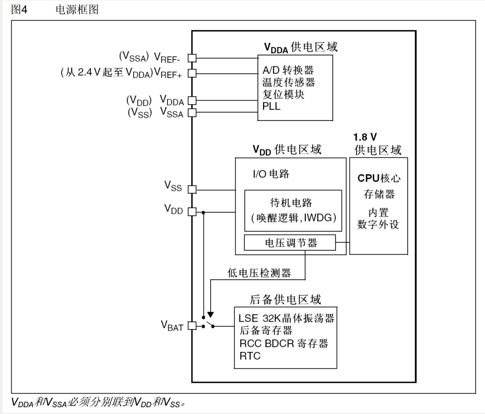


**上电复位和掉电复位**：

STM32内部有一个完整的上电复位(POR)和掉电复位(PDR)电路，当供电电压达到2V时系统既能正常工作。  

当VDD/VDDA低于指定的限位电压VPOR/VPDR时，系统保持为复位状态，而无需外部复位电路。关于上电复位和掉电复位的细节请参考数据手册的电气特性部分。

参考下表可以得出

- 上升沿期间，大于1.84V，滞后时间过后即可触发上电复位。
- 下降沿期间，小于1.8V，即触发掉电复位。

| 参数                | 条件   | 最小值 | 典型值 | 最大值 |      |
| ------------------- | ------ | ------ | ------ | ------ | ---- |
| V_POR，上电复位阀值 | 上升沿 | 1.84   | 1.92   | 2.0    | V    |
| V_PDR，掉电复位阀值 | 下降沿 | 1.8    | 1.88   | 1.96   | V    |


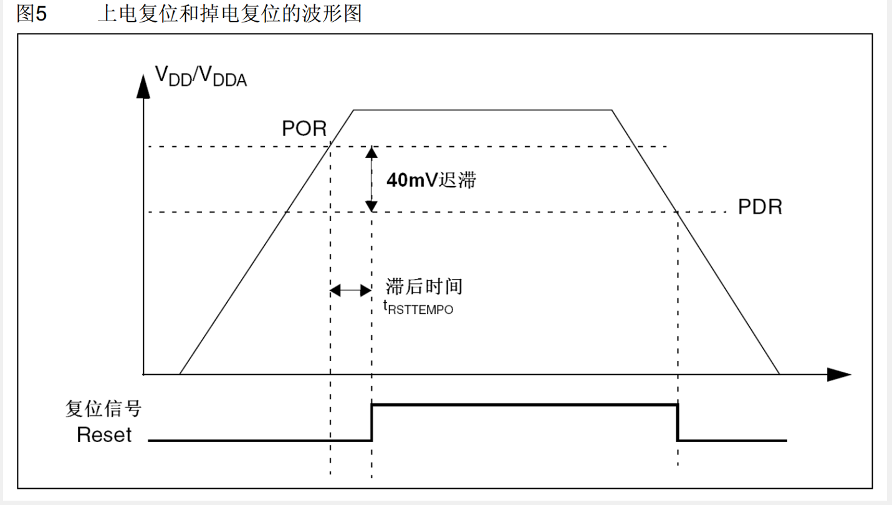

> Reset复位信号，低电平有效


**可编程电压监测器(PVD)  **：

用户可以利用PVD对VDD电压与电源控制寄存器(PWR_CR)中的PLS[2:0]位进行**比较来监控电源**，这几位选择监控电压的阀值。  

通过设置**PVDE位来使能PVD**。  

电源控制/状态寄存器(PWR_CSR)中的PVDO标志用来表明VDD是高于还是低于PVD的电压阀值。**该事件在内部连接到外部中断的第16线**，如果该中断在外部中断寄存器中是使能的，该事件就会产生中断。当**VDD下降到PVD阀值以下和(或)当VDD上升到PVD阀值之上时，根据外部中断第16线的上升/下降边沿触发设置，就会产生PVD中断**。例如，这一特性可用于用于执行紧急关闭任务  

电压监测器的电压阀值：2.2V ~ 2.9V 之间

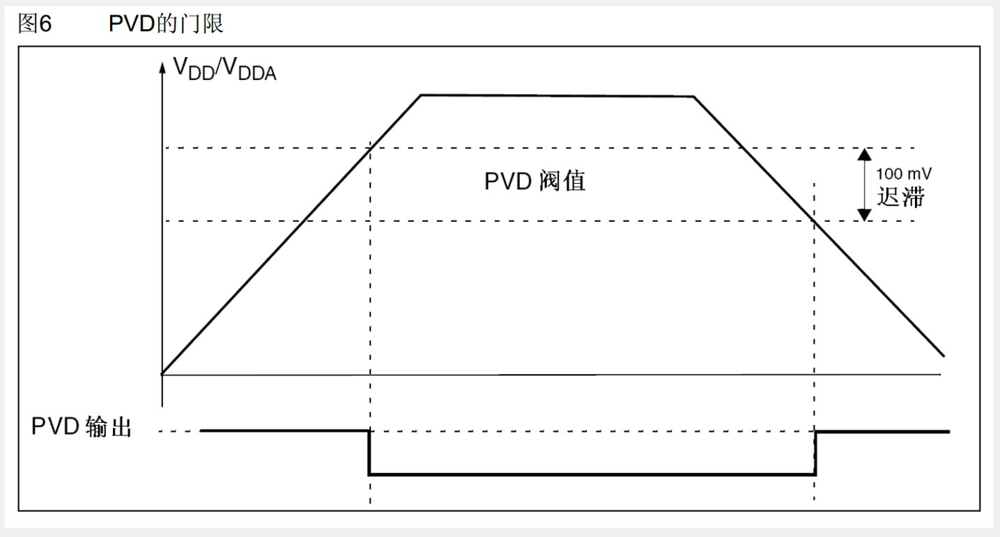

> PVD中断输出，高电平有效


**低功耗模式**：

三种低功耗模式：

- 睡眠模式：(Cortex™-M3内核停止，所有外设包括Cortex-M3核心的外设，如NVIC、系统时钟(SysTick)等仍在运行)

- 停止模式：(所有的**时钟**都已停止，只是时钟停了不是电压调节器关了，外设数据还保存着)

- 待机模式：(1.8V电源关闭，电压调节器关了，外设数据全部复位丢失)


此外，在运行模式下，还可以通过以下方式中的一种降低功耗：

- 降低系统时钟

- 关闭APB和AHB总线上未被使用的外设时钟

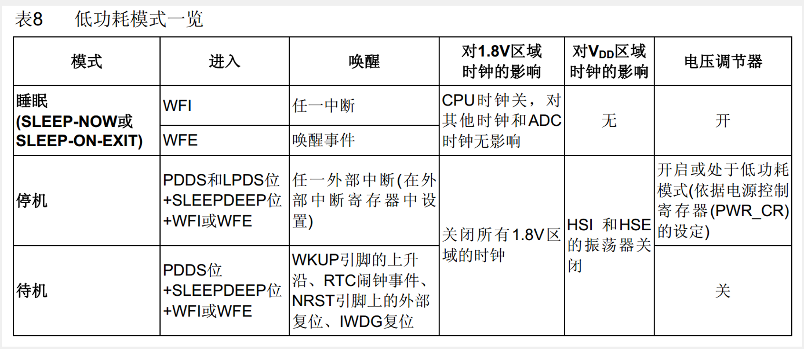

> 这些模式都不会关闭低速时钟LSI和LSE，因为还要给RTC时钟和IWDG独立看门狗提供时钟信号，维持它们的唤醒功能  


**模式选择**：

执行WFI（Wait For Interrupt）或者WFE（Wait For Event）指令后，STM32进入低功耗模式

**SLEEPDEEP、SLEEPONEXIT等位在内核寄存器SCB里的System control register (SCB_SCR)  系统控制寄存器设置**

**PDDS、LPDS等位在外设寄存器PWR的电源控制寄存器(PWR_CR)设置**    

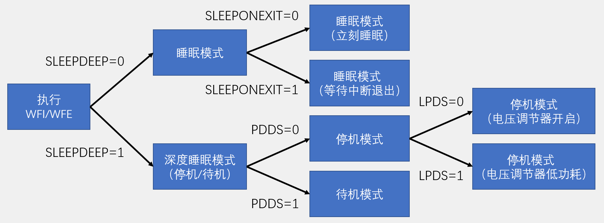


**睡眠模式**：

执行完WFI/WFE指令后，STM32进入睡眠模式，程序暂停运行，唤醒后程序从暂停的地方继续运行

SLEEPONEXIT位决定STM32执行完WFI或WFE后，是立刻进入睡眠，还是等STM32从最低优先级的中断处理程序中退出时进入睡眠

在睡眠模式下，所有的I/O引脚都保持它们在运行模式时的状态

唤醒条件：

- **WFI**指令进入睡眠模式，可被**任意一个NVIC响应的中断唤醒**

- **WFE**指令进入睡眠模式，可被**唤醒事件唤醒**


**停止模式**：

执行完WFI/WFE指令后，STM32进入停止模式，程序暂停运行，唤醒后程序从暂停的地方继续运行

1.8V供电区域的所有时钟都被停止，PLL、HSI和HSE被禁止，SRAM和寄存器内容被保留下来

在停止模式下，所有的I/O引脚都保持它们在运行模式时的状态

当一个**中断或唤醒事件导致退出停止模式**时，**HSI被选为系统时钟**

当电压调节器处于低功耗模式下，系统从停止模式退出时，会有一段额外的启动延时

唤醒条件：

- WFI指令进入停止模式，可被任意一个**EXTI外部中断唤醒**
- WFE指令进入停止模式，可被任意一个**EXTI事件唤醒**


**待机模式**：

执行完WFI/WFE指令后，STM32进入**待机模式**，唤醒后**程序从头开始运行**

整个1.8V供电区域被断电，PLL、HSI和HSE也被断电，SRAM和寄存器内容丢失，只有**备份的寄存器**和**待机电路**维持供电

在待机模式下，所有的I/O引脚变为高阻态（浮空输入）

唤醒条件：

- **WKUP引脚的上升沿**
- **RTC闹钟事件的上升沿**
- **NRST引脚上外部复位**
- **IWDG复位退出待机模式**


**PWR电源控制寄存器**： 

- **电源控制寄存器(PWR_CR)**  ：
  - **DBP**：取消后备区域的写保护，允许写入RTC和后备寄存器（如果RTC的时钟是HSE/128，该位必须保持为’1’ ）。
  - **PVD配置（PVDE和PLS）**：PVD电源电压监测器使能，PVD电平选择（PLS）阀值2.2V~2.9V之间。
  - **清除标志位**：CSBF清除待机位，CWUF清除唤醒位  
  - **PDDS掉电深睡眠：与LPDS位配合操作**
    - 0：CPU进入停机模式，LPDS控制电压调节器
    - 1：CPU进入深睡眠时进入待机模式。  
  - **LPDS深睡眠下的低功耗：与PDDS位配合操作**，
    - PDDS=0 时设置**电压调压器**是开启**正常模式**还是**低功耗模式**。
    - 如果PDDS=1就是进入待机模式，全都要关，就没这个位什么事了。


- **电源控制/状态寄存器(PWR_CSR)**  ：

  - **使能WKUP引脚EWUP**：

    **不使能**就是当普通IO口用。

    **使能**WKUP引脚，WKUP引脚用于将CPU从待机模式唤醒， WKUP引脚被强置为输入下拉的配置(WKUP引脚上的上升沿将系统从待机模式唤醒)  

    > 注：在系统复位时清除这一位。

  - **PVD输出PVDO**： 选择是**高于选定的阈值触发中断**还是**低于选定的阈值触发中断**，PVDE位使能后该位才有效

  - **待机标志SBF**：读出是1就是系统进入待机模式，只能由POR/PDR(上电/掉电复位)或设置电源控制寄存器(PWR_CR)的CSBF位清除  

  - **唤醒标志WUF**：读出是1就是在WKUP引脚上发生唤醒事件或出现RTC闹钟事件（只能由POR/PDR(上电/掉电复位)或设置电源控制寄存器(PWR_CR)的CWUF位清除）。


## 15-WDG看门狗

**WDG简介**：

WDG（Watchdog）看门狗

看门狗可以监控程序的运行状态，当程序因为设计漏洞、硬件故障、电磁干扰等原因，出现卡死或跑飞现象时，看门狗能及时复位程序，避免程序陷入长时间的罢工状态，保证系统的可靠性和安全性

看门狗本质上是一个定时器，当指定时间范围内，程序没有执行喂狗（重置计数器）操作时，看门狗硬件电路就自动产生复位信号

STM32内置两个看门狗

- 独立看门狗（IWDG）：独立工作，对时间精度要求较低，在超出定义的最终时间前喂狗，就不会复位。
- 窗口看门狗（WWDG）：要求看门狗在精确计时窗口起作用，设定一个时间范围，过早和过迟喂狗都会复位。


**IWDG和WWDG对比**：

|            | **IWDG独立看门狗**           | **WWDG窗口看门狗**                  |
| ---------- | ---------------------------- | ----------------------------------- |
| 复位       | 计数器减到0后                | 计数器T[5:0]减到0后、过早重装计数器 |
| 中断       | 无                           | 早期唤醒中断                        |
| 时钟源     | LSI（40KHz）                 | PCLK1（36MHz）                      |
| 预分频系数 | 4、8、32、64、128、256       | 1、2、4、8                          |
| 计数器     | 12位                         | 6位（有效计数）                     |
| 超时时间   | 0.1ms~26214.4ms              | 113us~58.25ms                       |
| 喂狗方式   | 写入键寄存器，重装固定值RLR  | 直接写入计数器，写多少重装多少      |
| 防误操作   | 键寄存器和写保护             | 无                                  |
| 用途       | 独立工作，对时间精度要求较低 | 要求看门狗在精确计时窗口起作用      |


### 独立看门狗（IWDG）


**IWDG主要性能**：

- 自由运行的递减计数器

- 时钟由独立的RC振荡器提供(可在停止和待机模式下工作) 

- 看门狗被激活后，则在计数器计数至0x000时产生复位


**硬件看门狗**：

如果**用户在选择字节中启用了“硬件看门狗”**功能，在系统**上电复位**后，**看门狗会自动开始运行**；如果在**计数器计数结束前**，若软件**没有向键寄存器写入相应的值**，则系统会产生**复位**。  （硬件看门狗是不是单指独立看门狗？是的）


**IWDG框图**：

**独立看门狗**只有**预分配寄存器、状态寄存器、重装载寄存器、键寄存器**，这**4个**寄存器。

上面的寄存器位于1.8V供电区，下面的工作电路位于VDD供电区。

**LSI**意思是使用**40kHz的低速内部时钟**（因为是内部时钟，所以是默认开启的，不用RCC开启）。

8位的预分配器，分频范围0~256

12位重转载寄存器，数值范围0~4096

12位**递减**计数器，数值范围0~4096

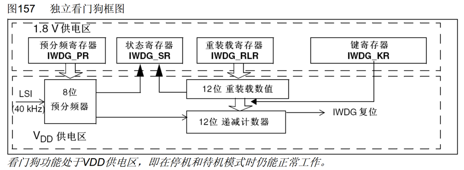

> 1、在键寄存器(IWDG_KR)中写入0xCCCC，开始启用独立看门狗；此时计数器开始从其复位值0xFFF递减计数。当计数器计数到末尾0x000时，会产生一个复位信号(IWDG_RESET)。  
>
> 2、无论何时，只要在键寄存器IWDG_KR中写入0xAAAA， IWDG_RLR中的值就会被重新加载到计数器，从而避免产生看门狗复位 。
>
> 3、预分配寄存器IWDG_PR和重装载寄存器IWDG_RLR寄 存 器 具 有 写 保 护 功 能 。 要 修 改 这 两 个 寄 存 器 的 值 ， 必 须 先 向IWDG_KR键寄存器中写入0x5555。把不同的值写入这个寄存器将会打乱操作顺序，寄存器将重新被保护。重装载操作(即写入0xAAAA)也会启动写保护功能。


**IWDG超时时间**：

超时时间：`T_IWDG = T_LSI × PR位对应预分频系数 × (RL + 1)`

其中周期：`T_LSI = 1 / F_LSI`

栗子：

```
周期：T_LSI = 1 / 40kHz = 0.025ms，分频系数：4

最短时间：T_IWDG_MIN = 0.025ms × 4 × 1 = 0.1ms
超时时间：T_IWDG_MAX = 0.025ms × 4 × 4096 = 409.6ms
```

PR每加1位，预分频系数就是上一位的2倍，定时时间也是2倍。0.025ms × 4就是该周期的时间加4倍，相当于分频减速。


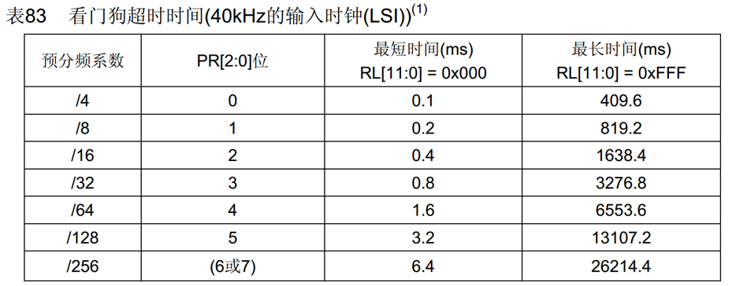

> 注：这些时间是按照40kHz时钟给出。实际上， MCU内部的RC频率会在30kHz到60kHz之间变化。此外，即使RC振荡器的频率是精确的，确切的时序仍然依赖于APB接口时钟与RC振荡器时钟之间的相位差，因此总会有一个完整的RC周期是不确定的。
>
> 通过对LSI进行校准可获得相对精确的看门狗超时时间。有关LSI校准的问题，详见6.2.5节


**IWDG寄存器**：


- **键寄存器(IWDG_KR)  **：

  - 键寄存器本质上是控制寄存器，用于控制硬件电路的工作

  - 在可能存在干扰的情况下，一般通过在整个键寄存器**写入特定值**来代替控制寄存器写入一位的功能，以**降低硬件电路受到干扰的概率**  

  - | **写入键寄存器的值** | **作用**                                                    |
    | -------------------- | ----------------------------------------------------------- |
    | 0xCCCC               | 启用独立看门狗 (**若选择了硬件看门狗则不受此命令字限制**)。 |
    | 0xAAAA               | IWDG_RLR中的值重新加载到计数器（喂狗）                      |
    | 0x5555               | 解除IWDG_PR和IWDG_RLR的写保护                               |
    | 0x5555之外的其他值   | 启用IWDG_PR和IWDG_RLR的写保护                               |

  

- **预分频寄存器(IWDG_PR)**  ：这些位具有写保护设置，参见手册的17.3.2节。

  - 通过设置这些位来选择计数器时钟的预分频因子。要改变预分频因子， IWDG_SR寄存器的PVU位必须为0。

  - | 000: 预分频因子=4      | 100: 预分频因子=64      |
    | ---------------------- | ----------------------- |
    | **001: 预分频因子=8**  | **101: 预分频因子=128** |
    | **010: 预分频因子=16** | **110: 预分频因子=256** |
    | **011: 预分频因子=32** | **111: 预分频因子=256** |

  - > 注：对此寄存器进行读操作，将从VDD电压域返回预分频值。如果写操作正在进行，则读回的值可能是无效的。因此，只有当IWDG_SR寄存器的PVU位为0时，读出的值才有效。


- **重装载寄存器(IWDG_RLR)**  ：RL[11:0]: 看门狗计数器重装载值，这些位具有写保护功能，参看17.3.2节。

  - 用于定义看门狗计数器的重装载值，每当向IWDG_KR寄存器写入0xAAAA时，重装载值会被传送到计数器中。随后计数器从这个值开始递减计数。看门狗超时周期可通过此重装载值和时钟预分频值来计算，参照表83。只有当IWDG_SR寄存器中的RVU位为0时，才能对此寄存器进行修改。

    > 注：对此寄存器进行读操作，将从VDD电压域返回预分频值。如果写操作正在进行，则读回的值可能是无效的。因此，只有当IWDG_SR状态寄存器的RVU位为0时，读出的值才有效。

  

- **状态寄存器(IWDG_SR)**  ：硬件置’1’用来指更新正在进行中。当在VDD域中的值更新结束后，此位由硬件清’0’(最多需5个40kHz的RC周期)。只有两个值都是对应状态位被清’0’后才可更新。

  - RVU: 看门狗计数器重装载值更新 
  - PVU: 看门狗预分频值更新

  > 注：如果在应用程序中使用了多个重装载值或预分频值，则必须在RVU位被清除后才能重新改变预装载值，在**PVU位被清除后才能重新改变预分频值**。然而，**在预分频和/或重装值更新后，不必等待RVU或PVU复位，可继续执行下面的代码。 (即是在低功耗模式下，此写操作仍会被继续执行完成。 )**


### 窗口看门狗（WWDG）


**WWDG主要特性**：

- 可编程的自由运行递减计数器

- 条件复位

  - 当递减计数器的值小于0x40， (若看门狗被启动)则产生复位。

  - 当递减计数器在窗口外被重新装载， (若看门狗被启动)则产生复位。

- 如果启动了看门狗并且允许**提前唤醒中断**，当递减计数器等于0x40时产生早期唤醒中断(EWI)，它可以被用于重装载计数器以避免WWDG复位（相当于卡极限最后时刻操作喂狗，可以阻止复位）。


**WWDG框图**：

PCLK1时钟频率是36MHz，频率太快了，所以进来之后马上进行了**隐性的4096分频**，这个图里没有展示出来（参考手册的配置寄存器 (WWDG_CFR) 有写）。

看门狗控制寄存器WWDG_CR是**使能位WDGA**和**递减计数器**的组合，看门狗配置寄存器WWDG_CFR是**设置窗口值**（最早时间）的。

- 最晚时间：当T6变为0时逻辑非取反转为1后，即小于0x40，0x3F也算就是二进制的`0011 1111`，通过或门触发复位（相当于一个标志位使用），T5-T0才是计数的实际值，所以才写6位递减计数器。
- 最早时间：因为是自减的计数器，所以 T6 : 0要减到小于窗口值 W6 : 0（固定），比较器的比较结果才会为0，这时候写入WWDG_CR（喂狗）才不会触发复位。**看门狗第一次把值设置到T6 : 0然后启动时，这个比较器后的与门 写入WWDG_CR端，默认是 0 ，内部应该是有一个判断启动后是否第一次写入值的逻辑判断程序**

写入T6 : 0和W6 : 0，WDGA置1启动看门狗

- T6位减到为0时，经过或门前的取反为1，触发复位
- T6 : 0 > W6 : 0时，比较结果是1，就是还没有经过最短时间，在这个时候写入 WWDG_CR，与门的写入WWDG_CR端从0变1，与门输出1，触发复位。


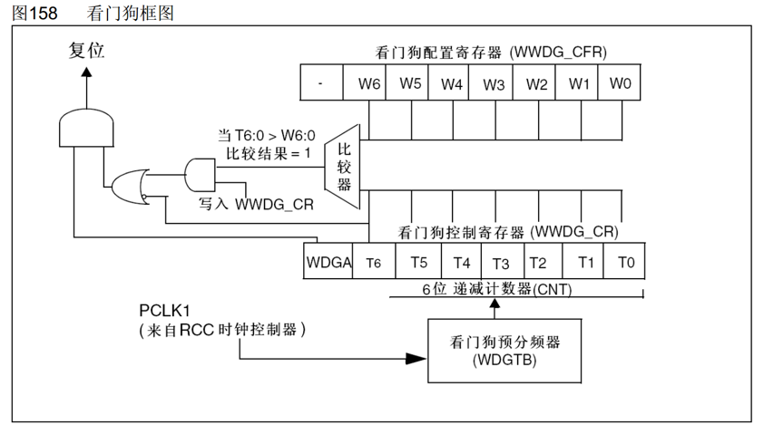


**WWDG工作特性**：

递减计数器T[6:0]的值小于0x40时，WWDG产生复位

递减计数器T[6:0]在窗口W[6:0]外被重新装载时，WWDG产生复位（这个就是过早喂狗了）

递减计数器T[6:0]等于0x40时可以产生**早期唤醒中断**（EWI）进行一些紧急操作（甚至可以在这个中断直接喂狗停止复位，然后要显示些信息让自己知道），用于重装载计数器以避免WWDG复位  

> 注：当写入 WWDG_CR 寄存器时，始终置 T6 位为’1’以避免立即产生一个复位。  然后定期写入WWDG_CR寄存器（喂狗）就可以避免WWDG复位拉

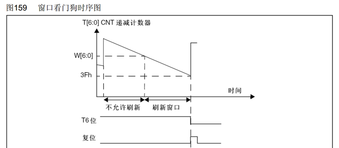


**WWDG非窗口时间、窗口时间、超时时间**：

时间从左到右的增加（耗时），只能在下面过了30ms后的窗口时间20ms内写入CNT计数器才不会触发看门狗复位，其他都提前和晚了都会触发复位。

<--------非窗口时间30ms--------><------窗口时间20ms------>  <超时时间50ms>


- 超时时间：

 	T_WWDG = T_PCLK1 × 4096 × 2^WDGTB(预分频系数) × (T[5:0] + 1)

- 非窗口时间：

 	T_WIN = T_PCLK1 × 4096 × 2^WDGTB(预分频系数) × (T[5:0] - W[5:0])

- 其中：

  - T_PCLK1 = 1 / PCLK1  ，即APB1总线时钟频率36MHz分之1。

  - 2^WDGTB(预分频系数)，如果WDGTB选3，那就是2^3次方，等于8分频。（这样的话四级的预分频系数就是1,2,4,8）

**栗子：**

36000，单位是ms，1 ÷ 36000 = 2.7777777777777777777777777777778e-5

- 目标：超时时间（最晚喂狗）50ms，需要8分频

```
50ms = 50 ÷ 2.7777777777777777777777777777778e-5 ÷ 4096 ÷ 8 
	 = 1,800,000 ÷ 4096 ÷ 8
	 = 439.453125 ÷ 8
	 = 54.931640625
```

最后的值54.931640625如果取整误差就比较大了，因为时钟从0开始算，默认多1(T[5:0] + 1)等于55，所以避免T[5:0]也就是T就需要写入54。

- 目标：非窗口时间（最早喂狗）30ms，需要8分频

```
30ms = 30 ÷ 2.7777777777777777777777777777778e-5 ÷ 4096 ÷ 8 
	 = 1,080,000 ÷ 4096 ÷ 8
	 = 263.671875 ÷ 8
	 = 32.958984375
```

最后的非窗口时间值32.958984375取整等于33，代入上面的超时时间，窗口时间值：W = T - 33  = 54 - 33 = 21


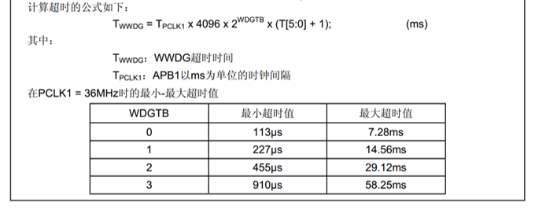


**WWDG寄存器**：

- **控制寄存器(WWDG_CR)**  ：
  - **WDGA激活位**：置1启动看门狗，但只能由硬件复位清零。
  - 7位计数器T[6:0] (MSB至LSB)：这些位用来存储**看门狗的计数器值**。每(4096 x 2^WDGTB)个PCLK1周期减1。当计数器值从**40h变为3Fh时(T6变成0)，产生看门狗复位**。


- **配置寄存器(WWDG_CFR)**  ：

  - **提前唤醒中断EWI**：此位若置’1’，则当计数器值达到40h，即产生中断（这个就是配置是否要卡极限的位）

  - **预分频器的时基WDGTB[1:0]**：

    | 分频系数                             |
    | ------------------------------------ |
    | 00: CK计时器时钟(PCLK1除以4096)除以1 |
    | 01: CK计时器时钟(PCLK1除以4096)除以2 |
    | 10: CK计时器时钟(PCLK1除以4096)除以4 |
    | 11: CK计时器时钟(PCLK1除以4096)除以8 |
  
  - **7位窗口值W[6:0]**: 这些位包含了用来与递减计数器进行比较用的窗口值


- **状态寄存器(WWDG_SR)** ：**只有一个提前唤醒中断标志EWIF**，当计数器值达到40h时，此位由硬件置’1’。它必须通过软件写’0’来清除。对此位写’1’无效。若中断未被使能，此位也会被置’1’。


## 16-FLASH闪存

**FLASH简介**：

STM32F1系列的FLASH包含**程序存储器、系统存储器**和**选项字节**三个部分，通过闪存存储器接口（外设）可以对**程序存储器**和**选项字节**进行**擦除和编程**，闪存存储器可以用ICP或IAP方式编程。  

读写FLASH的用途：

- 利用程序存储器的剩余空间来保存掉电不丢失的用户数据

- 通过在程序中编程（IAP），实现程序的自我更新

**在线编程（In-Circuit Programming – ICP）**用于**更新程序存储器的全部内容**，它通过JTAG、SWD协议或系统加载程序（Bootloader）下载程序，就是通过**调试端口用协议读写程序，J-LINK就是 JTAG，ST-LINK就是 SWD**。

**在程序中编程（In-Application Programming – IAP）**可以使用微控制器支持的**任一种通信接口**(如I/O端口、 USB、 CAN、 UART、 I2C、 SPI等)下载程序或数据到存储器中，另一种是在闪存里**自己选择定义的一段空闲内存空间（内存地址）存储用户程序，用户程序运行时对闪存微控制器中存储器重新编程修改。**但 IAP要求至少有一部分程序已经使用ICP烧到闪存存储器中。  

在执行闪存**写操作**时，任何对闪存的**读**操作都会**锁住总线**，在写操作完成后读操作才能正确地进行；**既在进行写或擦除操作时，不能进行代码或数据的读取操作**。  

进行闪存编程操作时 (写或擦除)，必须打开内部的RC振荡器(HSI，即内部高速晶振一般是8MHz)。  

> 在低功耗模式下，所有闪存存储器的操作都被中止。 
>
> 只要CPU不访问闪存，闪存操作不会延缓CPU的执行。   


**闪存模块组织**：

三块：主存储器、信息块、闪存存储器接口寄存器

- 主存储器闪存Flash：**1k字节 = 1024字节，1K字节 = 1页（大容量的芯片1页的字节数不同，是2k字节1页）**，以页为单位进行擦除和编程，中容量产品最多0-127页总量128k字节，而**STM32F103C8T6只有一半，也就是64k字节**。

- 信息块：就是**启动程序BootLoader和选项字节**，用户选择字节、选项字节，这些只是名字有些不一样，但其实是一个东西，虽然也是Flash但是却和主存储器区分开的，不计入64k字节里。

  系统存储器是用于存放在系统存储器自举模式下的启动程序，这个区域只保留给ST使用，**启动程序使用USART1串行接口实现对闪存存储器的编程**； ST在生产线上对这个区域编程并锁定以防止用户擦写。

- 闪存存储器接口寄存器：其实就是一些普通的外设，而且是RAM类型的存储，不算Flash，只是用来**控制上面的主存储器和信息块**的。每个寄存器4个字节，也就是32位。

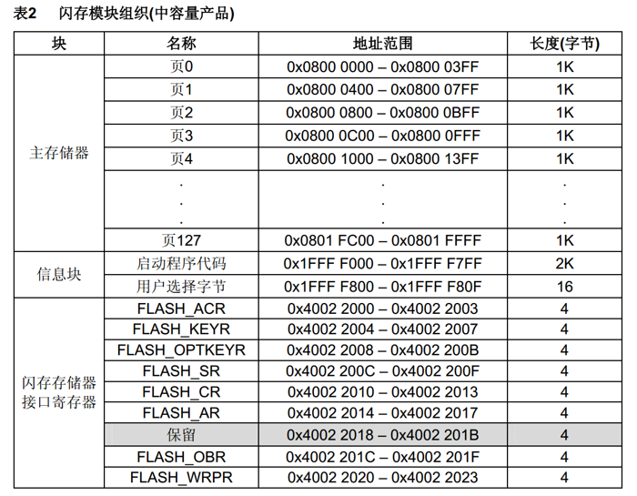


**FLASH基本结构**：

系统存储器不能擦除和编程，但是后期开发可以看需求自己写启动程序BootLoader  

选项字节主要用于设置程序存储区的读写保护功能  

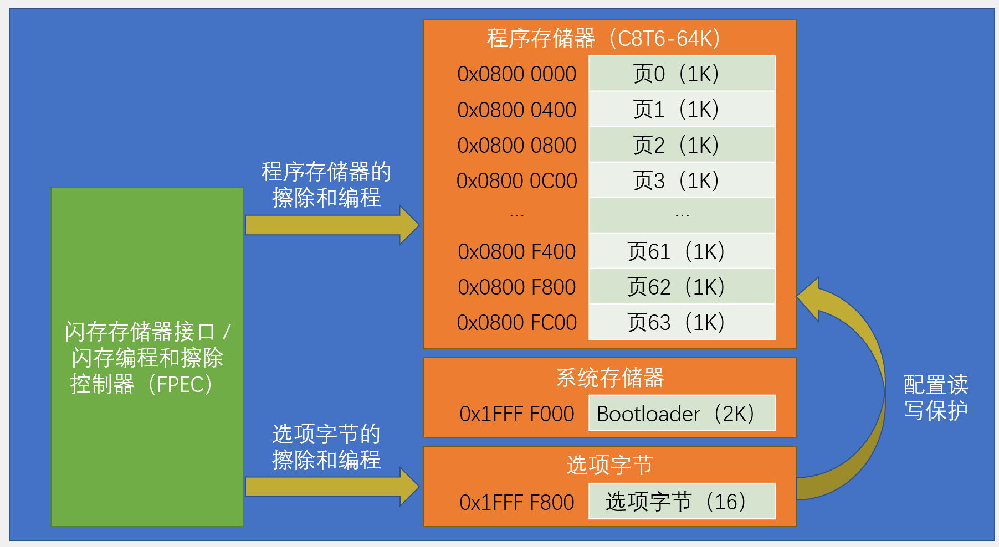


**FLASH解锁**：

- FPEC共有**三个键值**：

​	RDPRT键 = 0x000000A5（选择字节的RDP解除读保护专用）

​	KEY1 = 0x45670123

​	KEY2 = 0xCDEF89AB

- **解锁**：

​	复位后，FPEC模块的寄存器被保护，不能写入FLASH_CR  

​	在FLASH_KEYR**先写入KEY1，再写入KEY2**，解锁  	 

​	**错误的操作**序列会在下次复位前**锁死FPEC和FLASH_CR**  

- **加锁**：

​	设置FLASH_CR中的LOCK位锁住FPEC模块和FLASH_CR寄存器


**使用指针访问存储器**：

使用指针读指定地址下的存储器：

```c
 uint16_t Data = *((__IO uint16_t *)(0x08000000));
```

使用指针写指定地址下的存储器：

 ```c
 *((__IO uint16_t *)(0x08000000)) = 0x1234;
 ```

其中：

``` c
#define  __IO  volatile
```

这是一个宏定义，加volatile可以**防止编译器优化代码**，并且告诉他这个变量是易变的，直接找内存里的最新值，不要用缓存值了。

如果编译器判断这个地方的延时或者其他代码好像没什么用，替你优化消除掉了这段程序，这样就会产生想不到的bug。

无意义的加减变量，多线程更改变量，读写与硬件相关的寄存器时，都要加volatile，防止被编译器优化，当然这个编译器优化是可以控制开启和取消的，如果默认不开启编译器优化，那就加不加都行（keil魔术棒的C/C++页，Optimization设置优化等级）。


**程序存储器编程**：

对主闪存编程每次可以写入**16位（即半字，两个字节）**。当FLASH_CR控制寄存器的编程PG位为’1’时，在一个闪存地址**写入一个半字将启动一次编程（启动期间可以多次写入）**；**写入任何非半字的数据**， FPEC都会产生**总线错误**。在编程过程中**(BSY位为’1’)**，任何**读写闪存的操作都会使CPU暂停** ，直到此次**闪存编程结束**。   

烧写闪存数据**没有擦除复位**的话，不执行编程并在FLASH_SR状态寄存器的**编程错误标志位PGERR提出警告**（只有写0x0000特殊不会报警告，因为写入的数据可以1改0，不能0改1，相当于二极管烧断了就只能是0了）。

如果指定的地址在FLASH_WRPR中设定为**写保护**，则不执行编程并在FLASH_SR状态寄存器的**写保护错误标志位WRPRTERR位置’1’提出警告**。 

FLASH_SR状态寄存器的操作结束EOP位为’1’时表示编程结束。

0、检查FLASH_SR寄存器的BSY位，以确认没有其他正在进行的闪存操作   

1、LOCK解锁。

2、PG编程：选择编程操作。

3、指定的地址，只能写入半字的数据。（在库函数有写入字的函数是因为，它分成了两个半字。地址加2（16位两个字节），高位的右移16位后，然后再写入高位的半字）

4、BSY：忙，该位指示闪存操作正在进行。

5、失能PG编程（这些图片和手册没有步骤，其实是需要Disable失能的，库函数有写）

6、读出所有数据验证太复杂，非必要的话可以先不管。  

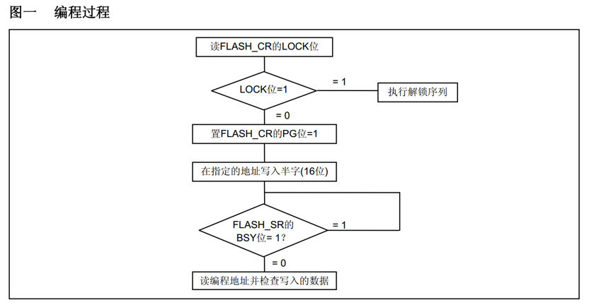

> 注：当FLASH_SR寄存器的BSY位为’1’时，不能对任何寄存器执行写操作  


**程序存储器，页擦除**：

闪存的任何一页都可以通过FPEC的页擦除功能擦除，擦除一页应遵守下述过程：  

0、检查FLASH_SR寄存器的BSY位，以确认没有其他正在进行的闪存操作  

1、LOCK解锁。

2、选择功能

- PER页擦除：选择擦除页PER置1。
- FLASH_AR地址寄存器：写入擦除页的32位闪存地址。（库函数只有这个页擦除用到了地址寄存器，其他都是自行定义地址并转换，然后解引用出来直接赋值）
- STRT开始：当该位为’1’时将触发一次擦除操作。该位只可由软件置为’1’并在BSY变为’1’时清为’0’。

3、BSY：忙，该位指示闪存操作正在进行。

4、失能PER页擦除（这些图片和手册没有步骤，其实是需要Disable失能的，库函数有写）

5、读出所有数据验证太复杂，非必要的话可以先不管。  

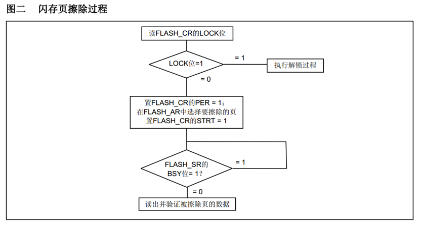


**程序存储器，全擦除**：

可以用整片擦除功能擦除所有用户区的闪存，信息块不受此操作影响。过程如下：

0、检查FLASH_SR寄存器的BSY位，以确认没有其他正在进行的闪存操作 

1、LOCK解锁。

2、选择功能

- MER全擦除：选择擦除所有用户页。
- STRT开始：当该位为’1’时将触发一次擦除操作。该位只可由软件置为’1’并在BSY变为’1’时清为’0’。

3、BSY：忙，该位指示闪存操作正在进行。

4、失能MER全擦除（这些图片和手册没有步骤，其实是需要Disable失能的，库函数有写）

5、读出所有数据验证太复杂，非必要的话可以先不管。   

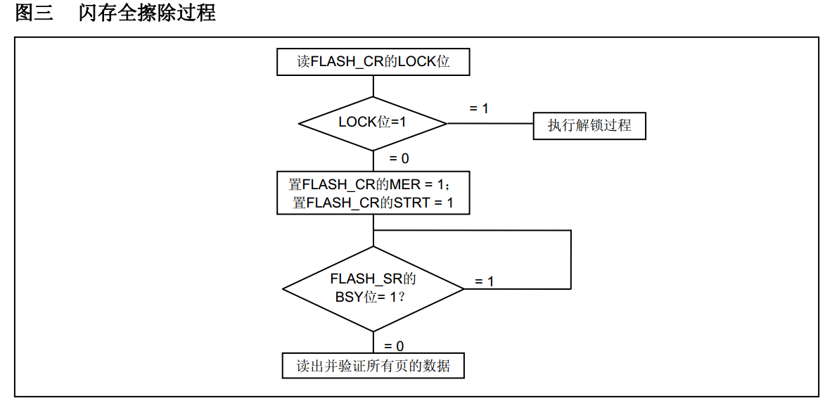


**选项字节**：

对选择字节的编程与普通的用户地址不同。选择字节的数目只有**8个字节**(4个字节作为写保护， 1个字节作为读保护， 1个字节为配置选项， 2个字节存储用户数据，**容量长度表格写16个字节是因为算上了反码部分，正数的反码就是正数值本身**)。

**默认状态下，选择字节块始终是可以读且被写保护**。要想对选择字节块进行写操作(编程/擦除)首先要在OPTKEYR中写入正确的键序列(与上锁时一样)，随后允许对选择字节块的写操作， FLASH_CR控制寄存器的OPTWRE位标允许写，清除这位将禁止写操作。  

下图前面**带n**的是**存储器的低位对应的高位写入反码**的意思，如RDP写入数据时要同时在nRDP写入反码，芯片检测到这两个存储器不是反码的关系的话就是数据有错误，就判断无效不执行功能，其他的以此类推。当然这个写入反码的过程是由硬件自动帮我们执行，我们不用担心。

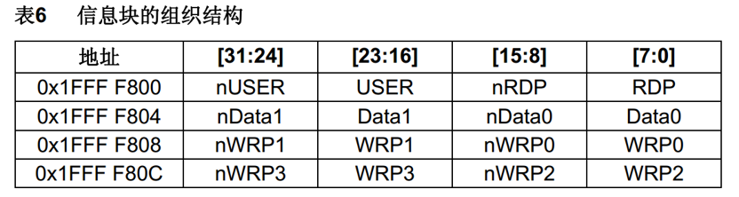

这样一看的话，就只有4种结构类型了：

- **RDP**：写入RDPRT键0x000000A5（但只有八位即0xA5，不过因为**只能写入半字，所以最后输入的值是0x00A5**）后**解除读保护**

- **USER**：这个字节实际就用了3个位，**位1**配置**选择看门狗事件**（软件 或者 硬件），**位2进入停机 和 位3待机模式是否产生复位。**默认是1，即看门狗选软件，进入停机和进入待机都**不产生复位**。**如果要修改要看位，置0，看门狗是1bit，停机是2bit，待机是3bit。**

- **Data0/1**：**地址用户自定义使用**，使用选择字节的编程方式编程。

- **WRP0/1/2/3**：配置**写保护**，共4个字节，每个字节8位，4 * 8 = 32位，**一个bit位对应保护4个存储页（中容量，可按位设置是否保护）**，4 * 32 = 128页。（小中大容量都不同具体，详细查看闪存手册选项字节说明篇）

  - 0：实施写保护

  - 1：**不实施**写保护（**因为复位擦除后为0xFF**）
  
  四个用户选择字节用于保护总共128K字节的主存储器（STM32F103C8T6只有WRP0和WRP1，即0-63共计64页）
  
  - WRP0：第0~31页的写保护
  - WRP1：第32~63页的写保护
  - WRP2：第64~95页的写保护
  - WRP3：第96~127页的写保护
  


**选项字节，编程**：

对FPEC解锁后，必须分别写入**KEY1和KEY2（和解锁FPEC的键值的一样）**到**选项字节专用的键寄存器FLASH_OPTKEYR**，硬件自动设置FLASH_CR寄存器的OPTWRE位为’1’，此时可以对选择字节进行编程：设置FLASH_CR寄存器的OPTPG位为’1’后写入半字到指定的地址。 

**FPEC先读出**指定地址的**选择字节内容并检查它是否已经被擦除**，如**未被擦除**则不执行编程并在**FLASH_SR寄存器的PGERR （这里中文手册翻译成WRPRTERR了，是错的）位提出警告**。 FLASH_SR寄存器的**EOP状态为’1’时表示编程结束**。  

FPEC使用半字中的低字节并自动地计算出高字节(高字节为低字节的反码)，并开始编程操作，这将保证选择字节和它的反码始终是正确的。  

- 检查FLASH_SR的BSY忙位，以确认没有其他正在进行的编程操作（事前检查）
- 解锁FLASH_CR的OPTWRE位（键值正确写入OPTKEYR选择字节键寄存器，硬件就自动解锁该位了）
- 设置FLASH_CR的OPTPG位为1，使能编程
- 写入要编程的**半字**到指定的地址
- 等待BSY位变为0
- 设置FLASH_CR的OPTPG位为0，失能编程（这些图片和手册没有步骤，其实是需要Disable失能的，库函数有写）
- 读出写入的地址并验证数据

> 当读闪存保护选项从**“保护”变为“未保护”**时，在重新设置读保护选项前会自动执行一个**整片擦除用户闪存**的操作。如果用户要改变**读保护之外**的选项，则**不会出现整片擦除操作**。  即想读出被保护的部分程序，将程序设置为不保护的时候，就会触发闪存用户程序整个自删，所以还是**被保护的程序是读不出来的**，没有保护的可以随便读写。


**选项字节，擦除**：

STRT是开始擦除，所以只有擦除才需要。

- 检查FLASH_SR的BSY忙位，以确认没有其他正在进行的闪存操作（事前检查）
- 解锁FLASH_CR的OPTWRE位（键值正确写入OPTKEYR选择字节键寄存器，硬件就自动解锁该位了）
- 设置FLASH_CR的OPTER位为1，使能擦除
- 设置FLASH_CR的STRT位为1，开始擦除
- 等待BSY位变为0
- 设置FLASH_CR的OPTER位为0，失能擦除（这些图片和手册没有步骤，其实是需要Disable失能的，库函数有写）
- 读出被擦除的选择字节并做验证  

> 擦除选择字节块将不会导致自动的整片擦除操作，因为擦除的结果0xFF相当于保护状态。  


**保护**：

闪存中的用户代码区可以防止非法的读出；同样可以对闪存区的页加以保护，防止在**程序跑飞的情况下不被意外地改变**，写保护的基本单位是：

- 对于小容量和中容量的产品为4页；

- 对于大容量的产品为2页。


**写保护**：

如果试图在一个受保护的页面进行编程或擦除操作，在闪存状态寄存器(FLASH_SR)中会返回一个保护错误标志。

**解除写保护**：

- 使用闪存控制寄存器(FLASH_CR)的OPTER位擦除整个选择字节区域（也就是说写保护只能设置保护，一旦其中有一页或者多页需解除保护，都只能全部一起解除）；

- 写入正确的RDP代码0x00A5，允许读访问；

- 进行系统复位（程序和用户选项字节内容清除，全部置1，0xFFFFFFFF），重装载选择字节(包含新的WRP[3:0]字节)；写保护被解除。


**读保护**：

**这项保护是通过设置RDP选择字节启动的，一旦启动全部页都被读保护（不像写保护可以分页设置）。**

当保护字节被写入相应的值以后，实施下述保护：

- 只允许从用户代码中对主闪存存储器的读操作（以非调试方式从主闪存存储器启动）。

- 第0~3页(小容量和中容量产品)，或第0~1页(大容量产品)被自动加上了写保护，其它部分的存储器可以通过在主闪存存储器中执行的代码进行编程(实现IAP或数据存储等功能)，但不允许在调试模式下或在从内部SRAM启动后执行写或擦除操作(整片擦除除外)

- 所有通过JTAG/SWD向内置SRAM装载代码并执行代码的功能依然有效，亦可以通过JTAG/SWD从内置SRAM启动，这个功能可以用来解除读保护。 当读保护的选择字节转变为存储器未保护的数值时，将会执行整片擦除过程。


当RDP选择字节和它的反码包含下列数值对时，闪存被置于保护状态:

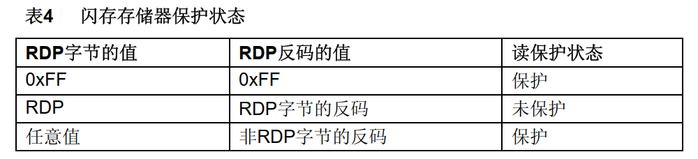

> 只有**RDP的值是0x00A5和它的反码正确**的时候是**解除读保护（未保护）**的，其他都是保护状态。    
>
> 正数的反码就是本数本身  

**解除读保护  **：

- 擦除整个选择字节区域，读保护码(RDP)将变为0xFF，此时读保护仍然有效

- 写入正确的RDP代码0x00A5，以解除存储器的保护，该操作将首先导致对所有用户闪存的整片擦除操作；

- 进行复位(上电复位)以重新加载选择字节(和新的RDP代码)，此时读保护被解除。


**器件电子签名**：

电子签名存放在闪存存储器模块的系统存储区域，包含的芯片识别信息在出厂时编写，不可更改，使用指针读指定地址下的存储器可获取电子签名

- 闪存容量寄存器：

​	 基地址：0x1FFF F7E0

​	 大小：16位

- 产品唯一身份标识寄存器：

​	 基地址： 0x1FFF F7E8

​	 大小：96位


**FLASH寄存器**：

1个I-Code和D-Code请求的仲裁器

FPEC模块处理闪存的编程和擦除操作，它包括7个32位的寄存器：  2个键寄存器，控制、状态、地址、选择字节、写保护寄存器，各1个。

- **闪存访问控制寄存器(FLASH_ACR)**
  - 预取缓冲区的**使能**和**状态**（两位）  
  - **闪存半周期访问闪存使能**（时钟慢，8MHz以下可以开。但时钟快、使用了预分频器的AHB（分频系数不为1）、开了预期缓冲区的话不能开启）  
  
  - **时延** ：SYSCLK(系统时钟)周期与闪存访问时间的比例，时钟快这个就要延时高，因为访问速度没那么快  


- **FPEC键寄存器(FLASH_KEYR)**  ：顺序输入键值KEY1 = 0x45670123 ，KEY2 = 0xCDEF89AB  解锁下面的6个32位寄存器


- **选择字节键寄存器(FLASH_OPTKEYR)**  ：FPEC键寄存器解锁后，再把同样的键值输入到这个寄存器就可以解锁选项字节，控制寄存器(FLASH_CR)的OPTWRE允许写选择字节 位自动置1。


- **闪存状态寄存器(FLASH_SR)**
  - **EOP操作结束**：闪存的烧写或擦除操作完成。
  - **WRPRTERR写保护错误**：对写保护的闪存地址编程报错。
  - **PGERR编程错误**：没擦除就烧写内容报错（0x0000例外）
  - **BSY忙**：闪存的烧写或擦除操作正在进行。


- **闪存控制寄存器(FLASH_CR)**

  - **中断**：配置是否进行**错误状态中断、操作完成中断**

  - **允许写选择字节**：当该位为’1’时，允许对选择字节进行编程操作。当在FLASH_OPTKEYR寄存器写入正确的键序列后，该位被置为’1’。

    软件可清除此位。  

  - **锁**：写1给FPEC和FLASH_CR上锁，在一次不成功的解锁操作后，下次系统复位前，该位不能再被改变。

  - **擦除**：页擦除、全擦除、选项字节擦除、开始擦除

  - **编程**：闪存编程、选项字节编程


- **闪存地址寄存器(FLASH_AR)**：32位的地址寄存器，**在页擦除操作中，软件必须修改这个寄存器以指定要擦除的页**，库函数只在页擦除的时候用了一次，因为如果写入内容的时候用这个寄存器指定地址，还得再写一条的地址赋值数据的代码，直接使能PG编程就写地址赋值数据的代码也可以做到同样的效果，那么相当于调用地址寄存器的那段代码是多余的，还不如直接赋值给地址。


- **选择字节寄存器(FLASH_OBR)**：这些位**都是只读**的，实际修改还得是改选项字节那片地址
  - **USER用户选择字节**：这里包含OBL加载的用户选择字节位[9:5]未用，其余的位是查看**看门狗是软件还是硬件，停止、待机状态模式是否复位**的。  
  - **RDPRT读保护**：当设置为1，表示闪存存储器的读保护有效。 
  - **OPTERR选择字节错误**：当该位为’1’时表示选择字节和它的反码不匹配。（这个状态库函数放到FLASH_GetFlagStatus函数查看了）  


- **写保护寄存器(FLASH_WRPR)**：**只读**，查看对应位的写保护是否生效的，实际修改写保护还得是改选项字节那片地址的值。


## 17-CRC校验


**CRC简介** :

**循环冗余校验(CRC)计算单元**是根据固定的生成多项式得到任一32位全字的CRC计算结果。在其他的应用中， CRC技术主要应用于核实数据传输或者数据存储的正确性和完整性。标准EN/IEC 60335-1即提供了一种核实闪存存储器完整性的方法。 CRC计算单元可以在程序运行时计算出软件的标识，之后与在连接时生成的参考标识比较，然后存放在指定的存储器空间。  


**CRC主要特性:**

使用CRC-32（以太网）多项式： 0x4C11DB7 (`0100 1100 0001 0001 1101 1011 0111`)

- 一个32位数据寄存器用于输入 / 输出  
- CRC计算时间： 4个AHB时钟周期(HCLK)  
- 通用8位寄存器(可用于存放临时数据)  

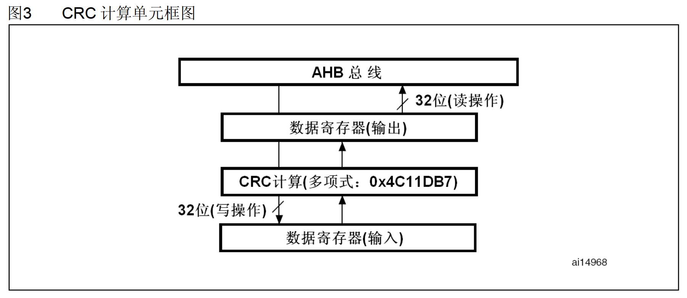


**CRC功能描述**:

CRC计算单元含有1个32位数据寄存器：  

- 对该寄存器进行写操作时，作为输入寄存器，可以输入要进行CRC计算的新数据。  

- 对该寄存器进行读操作时，返回上一次CRC计算的结果。  

**每一次写入数据寄存器，其计算结果是前一次CRC计算结果和新计算结果的组合(对整个32位字进行CRC计算，而不是逐字节地计算)。**


**CRC寄存器**:

CRC计算单元包括2个数据寄存器和1个控制寄存器 

- **数据寄存器(CRC_DR)**  
  - 32位的数据寄存器，写入CRC计算器的新数据时，作为输入寄存器。读取时返回CRC计算的结果（相当于输出寄存器）。


- **独立数据寄存器(CRC_IDR)**  
  - 通用8位数据寄存器位，可用于临时存放1字节的数据。（寄存器CRC_CR的**RESET位产生的CRC复位对本寄存器没有影响，此寄存器不参与CRC计算，可以存放任何数据**）


- **控制寄存器(CRC_CR)**  
  - **只有一个RESET位**，复位CRC计算单元，设置数据寄存器为0xFFFF FFFF。只能对该位写’1’，它由硬件自动清’0’。
