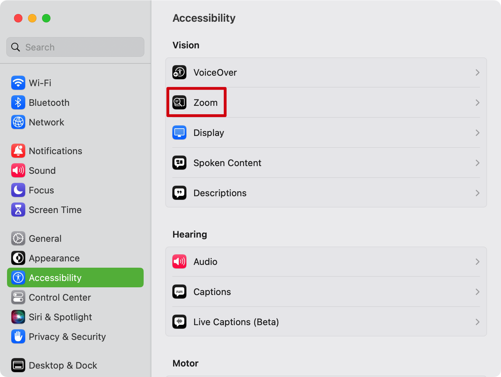
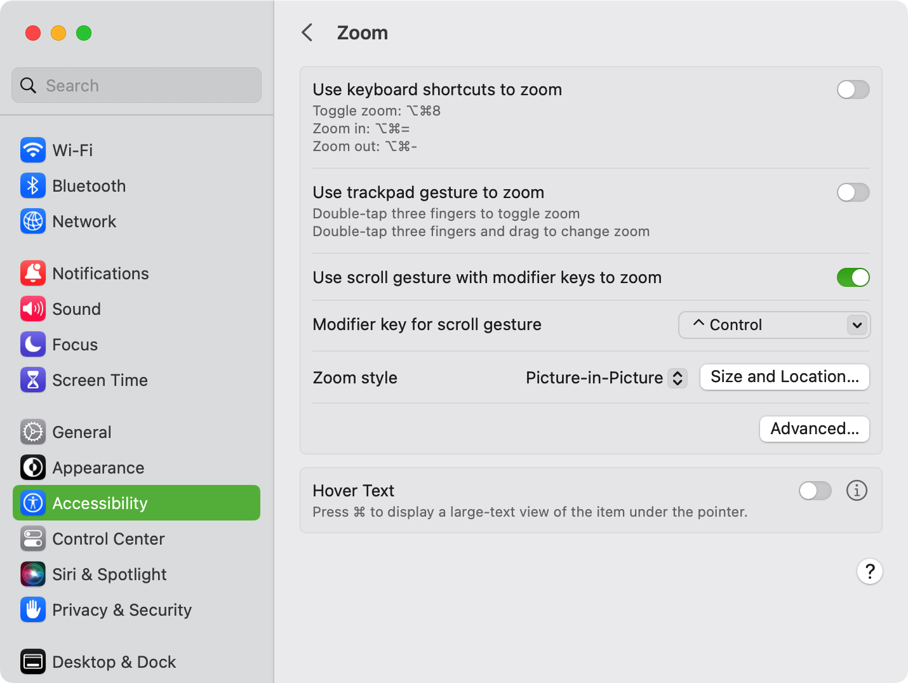
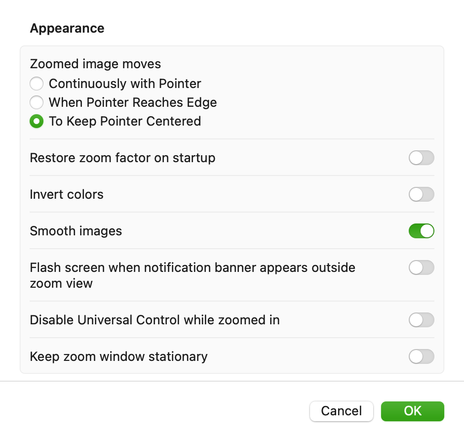

# macOS | 辅助功能 放大镜 Accessibility Zoom

## 背景

我会将 Mac 的分辨率调到很高，这样能在屏幕中显示更多的内容。得益于 macOS 优秀的分辨率管理和开发者的用心设计，一般界面中不会出现很小的元素；但有时确实会存在看不清的情况。此外，在录制视频时，可能也需要临时放大某个区域的画面来进行强调。

这里我推荐使用**辅助功能**中的**缩放**功能，这是一个类似放大镜的效果，用的时候可以通过按键快速打开，不用的时候也可以很快关闭。

## 放大镜

系统版本：macOS 13.4 Ventura

打开**系统偏好设置**，在侧边栏找到**辅助功能**，找到**缩放**，点击打开。

选择**按住快捷键使用滚动手势进行缩放**，并在下方的快捷键中选择 ⌘ ⌥ 或 ⌃。

在放大镜模式中，选择**画中画**模式（个人感觉最合适），并点击右侧按钮设置大小和位置。

设置好之后，按住设置好的快捷键，向上滑动触控板即可开启放大镜，向下滑动触控板就可以关闭放大镜。

在**高级设置**中：

- 选择放大镜的框移动时保持鼠标在中心
- 平滑图像

以获得更好的体验。

